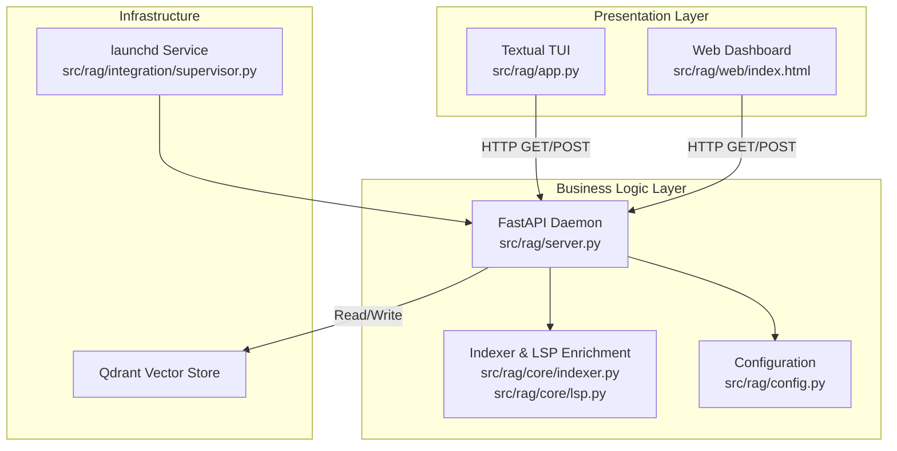
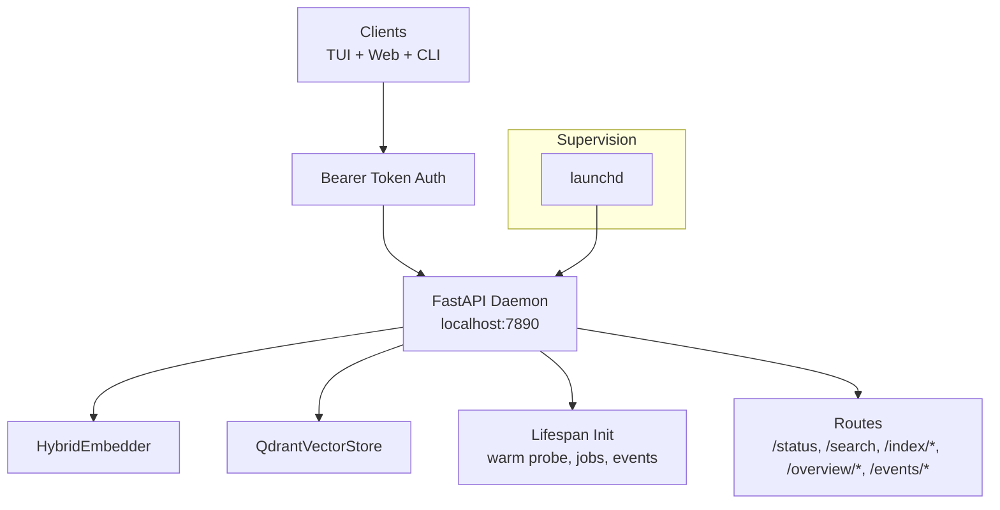
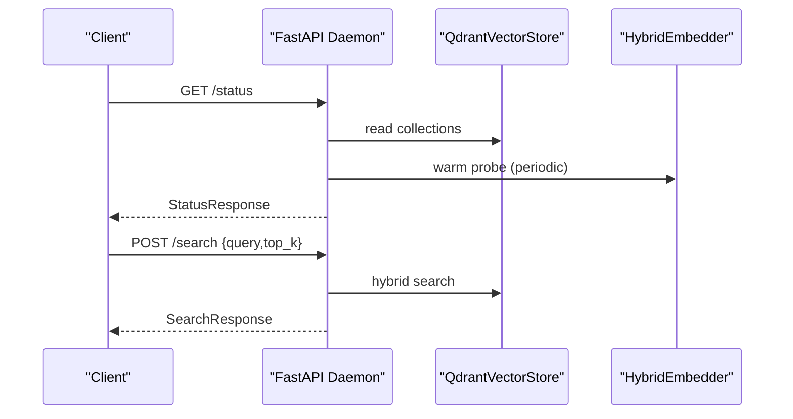
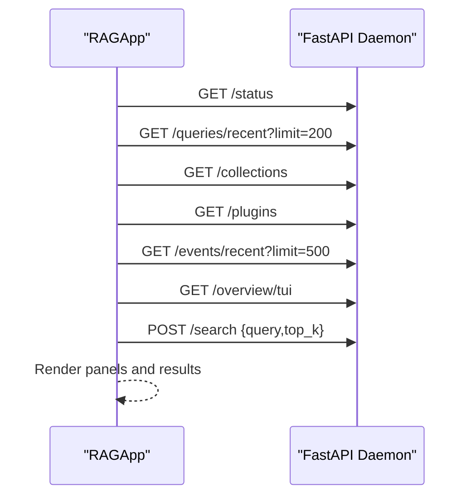
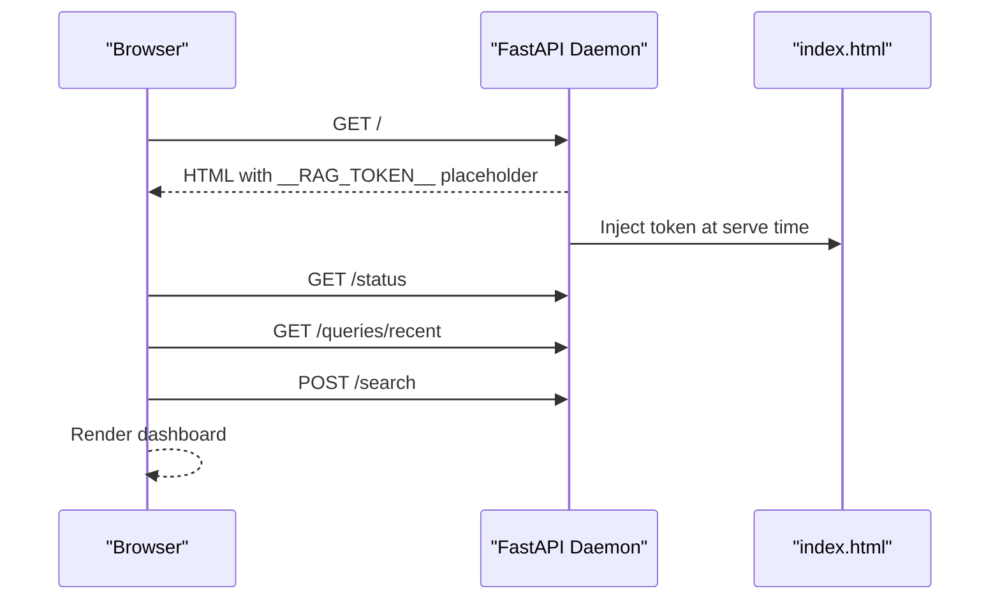
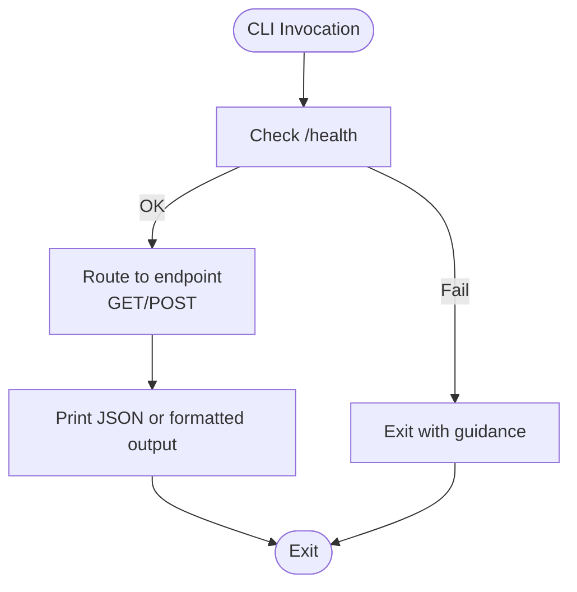
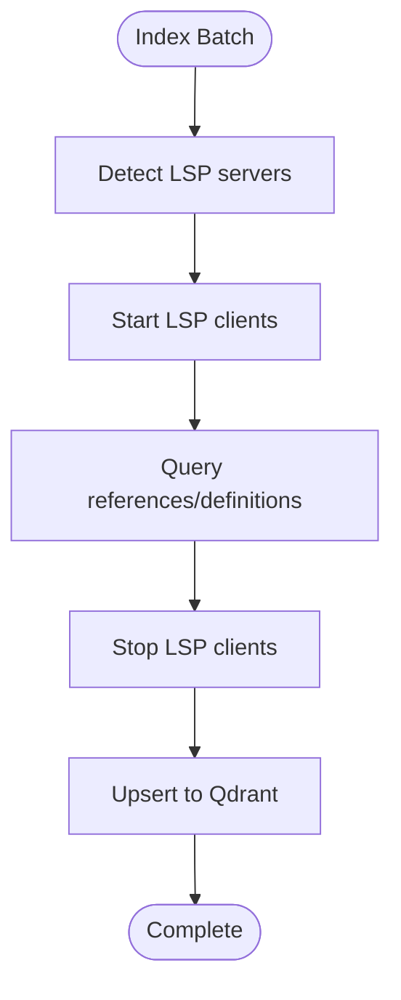
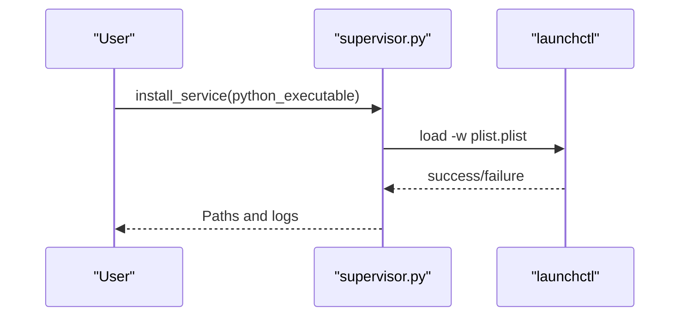
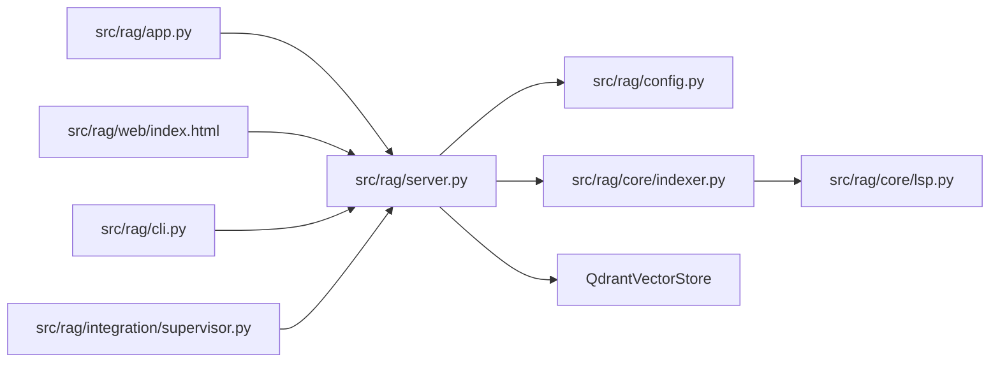

# System Architecture

<cite>
**Referenced Files in This Document**
- [app.py](file://src/rag/app.py)
- [server.py](file://src/rag/server.py)
- [cli.py](file://src/rag/cli.py)
- [supervisor.py](file://src/rag/integration/supervisor.py)
- [config.py](file://src/rag/config.py)
- [lsp.py](file://src/rag/core/lsp.py)
- [indexer.py](file://src/rag/core/indexer.py)
- [index.html](file://src/rag/web/index.html)
- [__main__.py](file://src/rag/__main__.py)
- [CLAUDE.md](file://CLAUDE.md)
</cite>

## Table of Contents
1. [Introduction](#introduction)
2. [Project Structure](#project-structure)
3. [Core Components](#core-components)
4. [Architecture Overview](#architecture-overview)
5. [Detailed Component Analysis](#detailed-component-analysis)
6. [Dependency Analysis](#dependency-analysis)
7. [Performance Considerations](#performance-considerations)
8. [Troubleshooting Guide](#troubleshooting-guide)
9. [Conclusion](#conclusion)
10. [Appendices](#appendices)

## Introduction
This document describes the RAG system’s daemon-client architecture and component interactions. The system consists of:
- A headless FastAPI daemon (supervised process) running on localhost:7890
- Read-only clients: a Textual TUI dashboard and a web dashboard
- Zero-query-path overhead LSP enrichment performed at index time

It explains system boundaries, data flows, integration patterns, and the rationale for the supervised daemon model, including launchd integration for auto-start and crash recovery. It also covers separation of concerns between presentation and business logic layers, infrastructure requirements, deployment topology, and lifecycle management.

## Project Structure
The repository is organized around a modular Python package with clear separation of concerns:
- src/rag/app.py: Textual TUI client that polls the daemon and renders dashboards
- src/rag/server.py: FastAPI daemon exposing HTTP endpoints for search, index, status, and analytics
- src/rag/cli.py: Thin HTTP client commands that talk to the daemon
- src/rag/integration/supervisor.py: macOS launchd integration for supervised daemon operation
- src/rag/config.py: TOML-based configuration with Pydantic validation
- src/rag/core/lsp.py: LSP integration for index-time enrichment
- src/rag/core/indexer.py: Ingestion pipeline with incremental git-based indexing and LSP enrichment
- src/rag/web/index.html: Web dashboard served by the daemon
- src/rag/__main__.py: Entry point for the module-based launcher
- CLAUDE.md: Architectural guidance and invariants

**Diagram sources**
- [app.py:156-358](file://src/rag/app.py#L156-L358)
- [server.py:841-1120](file://src/rag/server.py#L841-L1120)
- [indexer.py:242-550](file://src/rag/core/indexer.py#L242-L550)
- [lsp.py:313-404](file://src/rag/core/lsp.py#L313-L404)
- [supervisor.py:46-111](file://src/rag/integration/supervisor.py#L46-L111)
- [config.py:35-131](file://src/rag/config.py#L35-L131)

**Section sources**
- [CLAUDE.md:53-65](file://CLAUDE.md#L53-L65)
- [config.py:35-51](file://src/rag/config.py#L35-L51)

## Core Components
- Headless FastAPI Daemon
  - Exposes read endpoints for status, queries, collections, plugins, events, overview, and search
  - Provides index orchestration and job tracking
  - Implements rate limiting, CSRF guard, and robust error handling
  - Initializes embedder, vector store, and periodic warm probe
- Textual TUI Client
  - Read-only HTTP client polling the daemon for live state
  - Renders status bars, KPIs, recent queries, collections, plugins, logs, and overview
  - Handles connectivity warnings and reconnects
- Web Dashboard
  - Served by the daemon at GET / with same-origin auth injection
  - Polls the same read endpoints as the TUI and supports search
- CLI Thin Client
  - Validates daemon presence and forwards commands via HTTP
- LSP Enrichment
  - Detects installed LSP servers and enriches chunks with type resolution and call graphs at index time
- Supervisor Integration
  - Generates and loads a launchd plist for macOS to supervise the daemon process

**Section sources**
- [server.py:841-1120](file://src/rag/server.py#L841-L1120)
- [app.py:156-358](file://src/rag/app.py#L156-L358)
- [index.html:423-800](file://src/rag/web/index.html#L423-L800)
- [cli.py:33-70](file://src/rag/cli.py#L33-L70)
- [lsp.py:313-404](file://src/rag/core/lsp.py#L313-L404)
- [supervisor.py:46-111](file://src/rag/integration/supervisor.py#L46-L111)

## Architecture Overview
The system follows a supervised daemon model:
- The daemon is the single supervised process, managed by launchd on macOS
- Presentation clients (TUI, web, CLI) are read-only HTTP clients that poll and submit read-only requests
- LSP enrichment occurs during indexing, not at query time, eliminating query-time overhead
- The web dashboard is served same-origin by the daemon, inheriting authentication and passing CSRF guard implicitly

**Diagram sources**
- [server.py:603-716](file://src/rag/server.py#L603-L716)
- [server.py:841-1120](file://src/rag/server.py#L841-L1120)
- [supervisor.py:46-111](file://src/rag/integration/supervisor.py#L46-L111)
- [CLAUDE.md:57-63](file://CLAUDE.md#L57-L63)

**Section sources**
- [CLAUDE.md:57-63](file://CLAUDE.md#L57-L63)
- [server.py:603-716](file://src/rag/server.py#L603-L716)

## Detailed Component Analysis

### Headless FastAPI Daemon
- Responsibilities
  - Initialize embedder and vector store in lifespan
  - Serve read endpoints for status, queries, collections, plugins, events, overview, and search
  - Manage index jobs, progress, and persistence
  - Enforce bearer token auth and CSRF guard
  - Apply rate limiting and request logging
- Authentication and Security
  - Bearer token stored in ~/.rag/token and validated on protected routes
  - CSRF guard requires either a valid bearer token or localhost-origin for non-safe methods
- Lifecycle Management
  - Warm probe loop measures steady-state embedder latency
  - Restart counter persisted to track daemon restarts
  - Watcher integration for auto re-index on file changes
- Routes
  - Health and status: /health, /status
  - Queries: /queries/recent, /queries/stats
  - Collections and plugins: /collections, /plugins
  - Events: /events/recent, /health/detail
  - Overview: /overview/tui
  - Index orchestration: /index/start, /index/progress/{job_id}, /index/jobs
  - Search and graph endpoints: /search, /docs-search, /resolve, /call-tree, /graph/*

**Diagram sources**
- [server.py:841-1120](file://src/rag/server.py#L841-L1120)
- [server.py:1363-1400](file://src/rag/server.py#L1363-L1400)

**Section sources**
- [server.py:582-598](file://src/rag/server.py#L582-L598)
- [server.py:770-789](file://src/rag/server.py#L770-L789)
- [server.py:841-1120](file://src/rag/server.py#L841-L1120)

### Textual TUI Dashboard
- Responsibilities
  - Polls /status, /queries/recent, /queries/stats, /collections, /plugins, /events/recent, /overview/tui
  - Renders live KPIs, recent queries, collections, plugins, logs, and overview
  - Executes search and displays results with code previews
  - Manages connectivity warnings and reconnects
- Connectivity and Resilience
  - Tracks daemon reachability and notifies on disconnect
  - Uses short timeouts for polling to remain responsive

**Diagram sources**
- [app.py:363-662](file://src/rag/app.py#L363-L662)
- [app.py:722-793](file://src/rag/app.py#L722-L793)

**Section sources**
- [app.py:156-358](file://src/rag/app.py#L156-L358)
- [app.py:363-662](file://src/rag/app.py#L363-L662)

### Web Dashboard
- Responsibilities
  - Served by the daemon at GET /
  - Injects bearer token into the page at serve time (replacing __RAG_TOKEN__)
  - Same-origin fetch calls inherit auth and pass CSRF guard
  - Polls the same read endpoints as the TUI and supports search
- Routing and Screens
  - Home, Search, Logs screens with navigation and command bar

**Diagram sources**
- [index.html:423-800](file://src/rag/web/index.html#L423-L800)
- [server.py:841-1120](file://src/rag/server.py#L841-L1120)

**Section sources**
- [index.html:423-800](file://src/rag/web/index.html#L423-L800)
- [CLAUDE.md:61-63](file://CLAUDE.md#L61-L63)

### CLI Thin Client
- Responsibilities
  - Validates daemon presence via /health
  - Forwards commands (search, context-pack, repo-agent, index, status, web, tui) via HTTP
  - Prints structured JSON or formatted output
- Startup Behavior
  - Supports launching daemon in background and optionally TUI in foreground

**Diagram sources**
- [cli.py:33-70](file://src/rag/cli.py#L33-L70)
- [cli.py:426-477](file://src/rag/cli.py#L426-L477)

**Section sources**
- [cli.py:33-70](file://src/rag/cli.py#L33-L70)
- [cli.py:163-244](file://src/rag/cli.py#L163-L244)

### LSP Enrichment at Index Time
- Responsibilities
  - Detect installed LSP servers per language
  - Start LSP servers for detected languages
  - Query references and definitions to enrich chunks with fan-in, called-by, and dead-code hints
  - Stop LSP servers after enrichment
- Integration
  - Called from indexer pipeline during batch flush
  - Enrichment is optional and controlled by settings

**Diagram sources**
- [lsp.py:313-404](file://src/rag/core/lsp.py#L313-L404)
- [indexer.py:666-677](file://src/rag/core/indexer.py#L666-L677)

**Section sources**
- [lsp.py:100-118](file://src/rag/core/lsp.py#L100-L118)
- [lsp.py:313-404](file://src/rag/core/lsp.py#L313-L404)
- [indexer.py:380-422](file://src/rag/core/indexer.py#L380-L422)

### Supervisor Integration (launchd)
- Responsibilities
  - Generate and load a launchd plist for macOS
  - Set environment variables and log paths
  - Unload and remove plist when uninstalling
  - Report installation and load status
- Behavior
  - Runs python -m rag start under KeepAlive supervision
  - Isolated from TUI crashes

**Diagram sources**
- [supervisor.py:75-111](file://src/rag/integration/supervisor.py#L75-L111)

**Section sources**
- [supervisor.py:1-153](file://src/rag/integration/supervisor.py#L1-L153)

## Dependency Analysis
- Presentation layer depends on the daemon via HTTP
- Daemon depends on configuration, embedder, vector store, and database for persistence and analytics
- Indexer depends on LSP enrichment and vector store
- Supervisor integrates with OS service manager

**Diagram sources**
- [app.py:156-358](file://src/rag/app.py#L156-L358)
- [server.py:841-1120](file://src/rag/server.py#L841-L1120)
- [cli.py:33-70](file://src/rag/cli.py#L33-L70)
- [indexer.py:242-550](file://src/rag/core/indexer.py#L242-L550)
- [lsp.py:313-404](file://src/rag/core/lsp.py#L313-L404)
- [supervisor.py:46-111](file://src/rag/integration/supervisor.py#L46-L111)

**Section sources**
- [config.py:150-194](file://src/rag/config.py#L150-L194)
- [server.py:603-716](file://src/rag/server.py#L603-L716)

## Performance Considerations
- Zero-query-path overhead LSP enrichment
  - LSP enrichment runs during indexing, not at query time, avoiding latency penalties for search
- Embedder warm probe
  - Periodic measurement of steady-state latency to inform KPI captions
- Batched upserts
  - Indexer flushes batches to Qdrant and persists code index metadata in a single transaction-like step
- Streaming and token budgets
  - Context packs respect token budgets to bound generation costs
- Rate limiting and resilience
  - Per-token bucket rate limiting and graceful handling of storage errors

[No sources needed since this section provides general guidance]

## Troubleshooting Guide
- Daemon not reachable
  - TUI and web dashboards show offline status and notify on disconnect
  - CLI commands fail with connection errors if daemon is unreachable
- Authentication failures
  - Ensure ~/.rag/token exists and matches the daemon’s expectation
  - Verify Authorization: Bearer header is included in requests
- CSRF guard violations
  - Non-safe methods require either a bearer token or localhost-origin
- Supervision issues (macOS)
  - Use supervisor service status to confirm plist installation and load state
  - Reinstall service if needed; logs are written to ~/.rag/logs

**Section sources**
- [app.py:342-357](file://src/rag/app.py#L342-L357)
- [server.py:582-598](file://src/rag/server.py#L582-L598)
- [server.py:798-809](file://src/rag/server.py#L798-L809)
- [supervisor.py:129-152](file://src/rag/integration/supervisor.py#L129-L152)

## Conclusion
The RAG system employs a supervised daemon-client architecture that cleanly separates presentation from business logic. The daemon runs as a single supervised process, while TUI, web, and CLI clients are read-only HTTP consumers. LSP enrichment is performed at index time to eliminate query-time overhead. The design leverages launchd for auto-start and crash recovery, maintains strong authentication and CSRF protections, and provides resilient polling and error handling across clients.

## Appendices

### Infrastructure Requirements and Deployment Topology
- Host: localhost:7890
- Vector store: Qdrant (server or embedded)
- Embedder: Ollama-backed hybrid embedder
- OS service management: launchd on macOS; systemd guidance provided in comments
- Logging: Rotating structured logs for the daemon process

**Section sources**
- [config.py:35-81](file://src/rag/config.py#L35-L81)
- [server.py:603-716](file://src/rag/server.py#L603-L716)
- [supervisor.py:26-33](file://src/rag/integration/supervisor.py#L26-L33)

### Component Lifecycle Management
- Startup
  - CLI start runs the FastAPI server in-process
  - launchd loads the plist to supervise the daemon
- Shutdown
  - Graceful shutdown stops watchers and closes vector store connections
- Auto-recovery
  - launchd KeepAlive restarts the daemon on failure

**Section sources**
- [cli.py:213-244](file://src/rag/cli.py#L213-L244)
- [server.py:702-716](file://src/rag/server.py#L702-L716)
- [supervisor.py:75-111](file://src/rag/integration/supervisor.py#L75-L111)