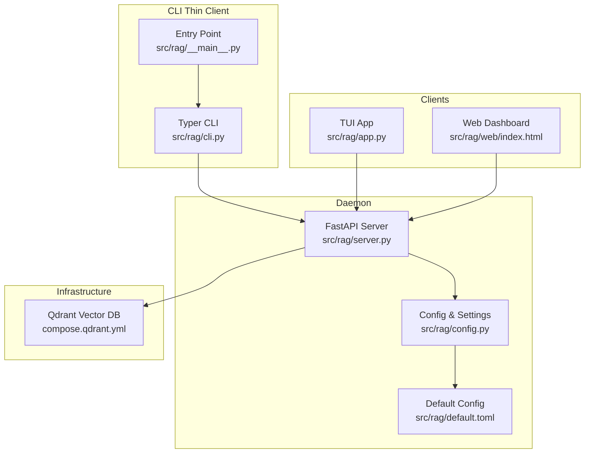
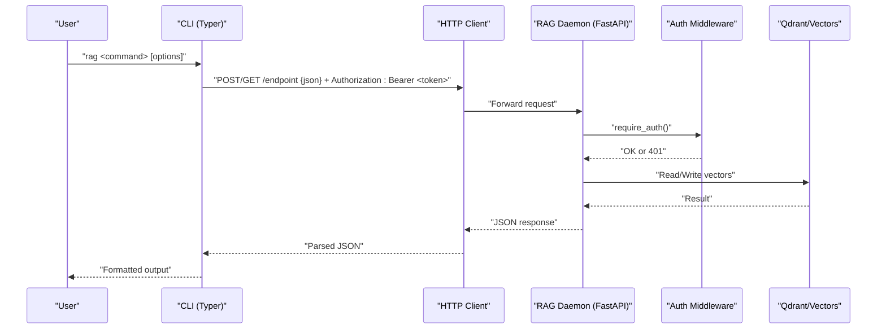
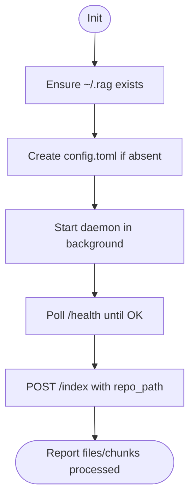
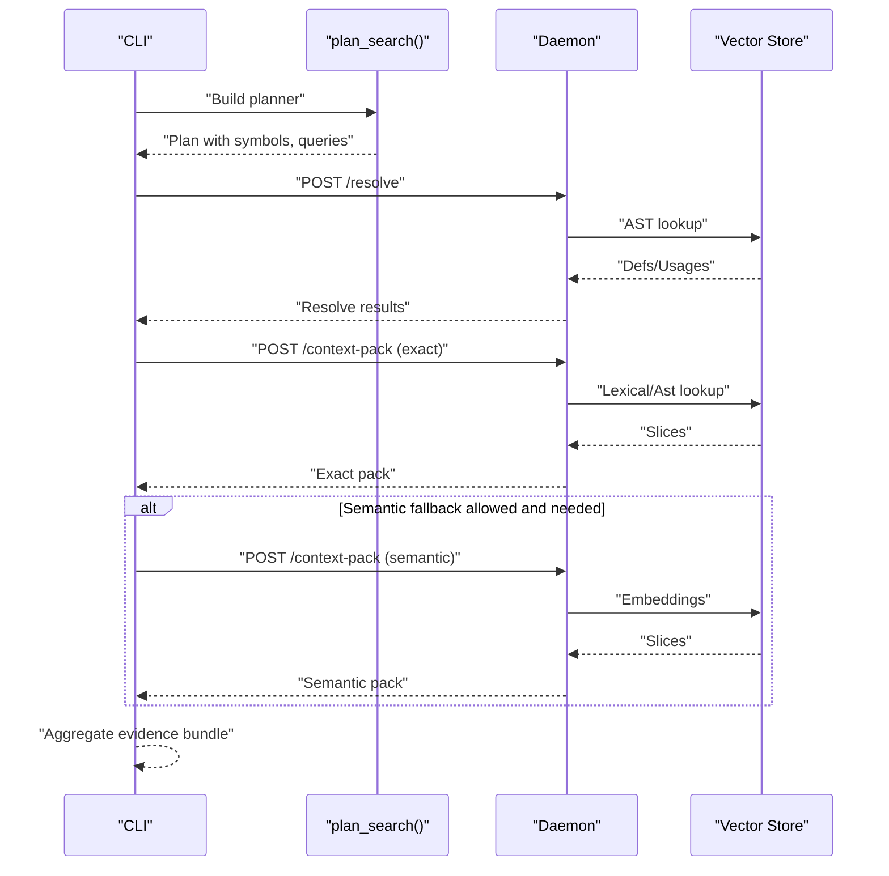
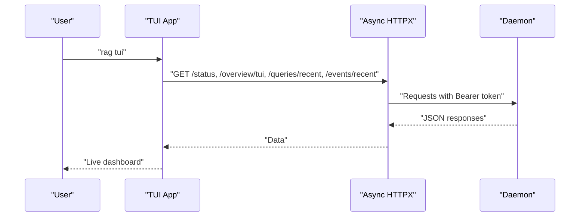
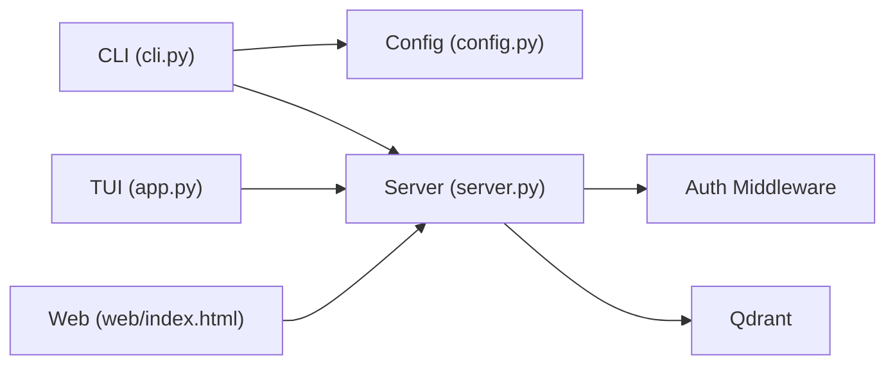

# CLI Interface

<cite>
**Referenced Files in This Document**
- [cli.py](file://src/rag/cli.py)
- [__main__.py](file://src/rag/__main__.py)
- [app.py](file://src/rag/app.py)
- [server.py](file://src/rag/server.py)
- [config.py](file://src/rag/config.py)
- [default.toml](file://src/rag/default.toml)
- [compose.qdrant.yml](file://compose.qdrant.yml)
</cite>

## Table of Contents
1. [Introduction](#introduction)
2. [Project Structure](#project-structure)
3. [Core Components](#core-components)
4. [Architecture Overview](#architecture-overview)
5. [Detailed Component Analysis](#detailed-component-analysis)
6. [Dependency Analysis](#dependency-analysis)
7. [Performance Considerations](#performance-considerations)
8. [Troubleshooting Guide](#troubleshooting-guide)
9. [Conclusion](#conclusion)
10. [Appendices](#appendices)

## Introduction
This document describes the CLI interface for the RAG system, which is built with Typer and acts as a thin client communicating with the RAG daemon over HTTP using bearer token authentication. The CLI provides commands for initialization, starting/stopping the daemon, searching, retrieving context packs, running the repository agent, launching the TUI and web dashboards, managing Qdrant, and administrative tasks such as configuration reload and diagnostics. It also documents the supervised daemon behavior, authentication, timeouts, and practical automation workflows.

## Project Structure
The CLI entry point is defined in a Typer application and delegates to HTTP endpoints exposed by the FastAPI server. The TUI and web dashboard are separate interactive clients that communicate with the same daemon.

**Diagram sources**
- [cli.py](file://src/rag/cli.py)
- [__main__.py](file://src/rag/__main__.py)
- [server.py](file://src/rag/server.py)
- [config.py](file://src/rag/config.py)
- [default.toml](file://src/rag/default.toml)
- [app.py](file://src/rag/app.py)

**Section sources**
- [cli.py](file://src/rag/cli.py)
- [__main__.py](file://src/rag/__main__.py)
- [server.py](file://src/rag/server.py)
- [config.py](file://src/rag/config.py)
- [default.toml](file://src/rag/default.toml)
- [app.py](file://src/rag/app.py)

## Core Components
- Typer CLI application with subcommands for initialization, daemon lifecycle, search, context retrieval, agent orchestration, TUI/web access, Qdrant management, diagnostics, and administration.
- Thin client that performs HTTP requests to the daemon with bearer token authentication and timeout controls.
- Supervised daemon behavior: CLI commands never directly start/stop the daemon; they communicate with a running daemon or spawn it in the background for convenience.
- Authentication: bearer token stored under ~/.rag/token and used by both CLI and TUI.
- Configuration: TOML-based settings merged from package defaults and user overrides.

**Section sources**
- [cli.py](file://src/rag/cli.py)
- [config.py](file://src/rag/config.py)
- [default.toml](file://src/rag/default.toml)

## Architecture Overview
The CLI is a thin client that communicates with the daemon over HTTP. The daemon enforces bearer token authentication and rate-limiting, and exposes endpoints for search, indexing, context packs, agent orchestration, and administrative functions.

**Diagram sources**
- [cli.py](file://src/rag/cli.py)
- [server.py](file://src/rag/server.py)

## Detailed Component Analysis

### Initialization and Setup
- Command: init
- Purpose: create user config, start the daemon in background, and index the current directory.
- Behavior:
  - Ensures ~/.rag exists and creates config.toml if missing.
  - Starts the daemon via subprocess with --headless.
  - Waits for /health endpoint readiness.
  - Sends an /index request with the current directory.
  - Prints summary statistics and helpful next steps.

**Diagram sources**
- [cli.py](file://src/rag/cli.py)

**Section sources**
- [cli.py](file://src/rag/cli.py)

### Starting the Daemon
- Command: start
- Options:
  - --headless / --no-tui: kept for backward compatibility; default behavior runs the server in-process.
  - --tui: spawns the daemon in background, waits for readiness, then launches the TUI in foreground.
  - --watch: enables file watcher for auto re-index; sets RAG_WATCH_PATH to current working directory.
- Supervised behavior: CLI never directly starts/stops the daemon; it runs the server in-process for supervised environments or spawns it for convenience.

**Section sources**
- [cli.py](file://src/rag/cli.py)

### Qdrant Management
- Commands:
  - qdrant-up: start local Qdrant via docker compose.
  - qdrant-down: stop local Qdrant.
  - qdrant-status: show configured mode (server/embedded), URL/path, and health.
- Notes:
  - Uses compose.qdrant.yml from repository root.
  - qdrant-status probes /healthz for remote mode.

**Section sources**
- [cli.py](file://src/rag/cli.py)
- [compose.qdrant.yml](file://compose.qdrant.yml)

### Search and Context Retrieval
- Command: search
  - Options: --top-k, --repo, --explain.
  - Behavior: posts to /search, prints strategy and results, optionally explains planner queries/filters.
- Command: context-pack
  - Options: --repo, --max-slices, --max-source-tokens, --no-ast-index, --no-semantic.
  - Behavior: posts to /context-pack and prints token-bounded slices.
- Command: resolve
  - Options: --repo, --definitions, --usages.
  - Behavior: posts to /resolve and prints definitions/usages.
- Command: call-tree
  - Options: --repo, --limit.
  - Behavior: posts to /call-tree and prints call tree nodes.

**Section sources**
- [cli.py](file://src/rag/cli.py)

### Repository Agent Orchestration
- Command: repo-agent
  - Options: --repo, --max-slices, --max-source-tokens, --definitions, --usages, --min-exact-slices, --no-semantic-fallback, --json.
  - Behavior:
    - Plans a retrieval strategy.
    - Calls /resolve, /context-pack (exact), optional /project-understand, /call-tree, optional /docs-search.
    - Optionally falls back to semantic context if thresholds are met.
    - Emits a structured report or human-readable summary.

**Diagram sources**
- [cli.py](file://src/rag/cli.py)

**Section sources**
- [cli.py](file://src/rag/cli.py)

### TUI and Web Dashboards
- Command: tui
  - Launches the TUI app which polls the daemon for status, queries, events, and overview.
- Command: web
  - Opens the web dashboard served by the daemon.

**Diagram sources**
- [app.py](file://src/rag/app.py)

**Section sources**
- [cli.py](file://src/rag/cli.py)
- [app.py](file://src/rag/app.py)

### Administrative Commands
- Command: status
  - GET /status and prints a formatted table of daemon state.
- Command: config
  - config: open config file in EDITOR (creates default if missing).
  - config reload: POST /admin/reload to hot-reload settings.
- Command: diagnose
  - Comprehensive health check: verifies daemon availability and component statuses.

**Section sources**
- [cli.py](file://src/rag/cli.py)

### Indexing and Data Management
- Command: index
  - Starts an indexing job, polls progress, and prints timing breakdowns.
  - Supports registering a named repository for multi-repo scenarios.
- Command: index-docs
  - Indexes documentation files into the docs collection.
- Command: backfill_code_index
  - Rebuilds exact/context-pack SQLite index from existing Qdrant payloads.
- Command: export/import
  - Exports/import code chunks to/from JSONL for backup/portability.
- Command: collections
  - Lists or deletes Qdrant collections.

**Section sources**
- [cli.py](file://src/rag/cli.py)

### Graph and Symbol Queries
- Command: files
  - Lists indexed files without scanning the filesystem.
- Command: node, callers, callees, impact, affected
  - AST/graph-based queries for symbols and impact analysis.

**Section sources**
- [cli.py](file://src/rag/cli.py)

### Additional Utilities
- Command: ask
  - Grounded question answering with citations.
- Command: list
  - Exhaustive enumeration of chunks matching payload flags.
- Command: diff
  - Searches within recent git changes.
- Command: overview
  - Shows codebase overview (language distribution, patterns, complexity).
- Command: install-claude
  - Installs a Claude Code slash command for RAG search.
- Command: plugins
  - Lists installed plugins.
- Command: repos
  - Lists registered repositories.

**Section sources**
- [cli.py](file://src/rag/cli.py)

## Dependency Analysis
- CLI depends on:
  - config.py for settings and token management.
  - server.py endpoints for all operations.
  - docker compose for Qdrant management.
- TUI and web depend on the same server endpoints and share the same bearer token mechanism.
- Authentication is enforced by the server’s require_auth dependency and validated via bearer token extraction.

**Diagram sources**
- [cli.py](file://src/rag/cli.py)
- [server.py](file://src/rag/server.py)
- [config.py](file://src/rag/config.py)
- [app.py](file://src/rag/app.py)

**Section sources**
- [cli.py](file://src/rag/cli.py)
- [server.py](file://src/rag/server.py)
- [config.py](file://src/rag/config.py)
- [app.py](file://src/rag/app.py)

## Performance Considerations
- Timeouts:
  - CLI uses varying timeouts per endpoint (e.g., 3–600 seconds) to balance responsiveness and long-running operations.
  - TUI uses shorter timeouts for frequent polling and longer ones for heavy operations.
- Token budgets:
  - context-pack and repo-agent commands include token budget controls to constrain context size.
- Streaming and caching:
  - Embedder warm-up probe runs periodically to track steady-state latency.
- Rate limiting:
  - Server applies per-token rate limiting via a token bucket.

**Section sources**
- [cli.py](file://src/rag/cli.py)
- [server.py](file://src/rag/server.py)

## Troubleshooting Guide
Common issues and resolutions:
- Daemon not running:
  - Use rag diagnose to check health and components.
  - Start with rag start --headless or rag start --tui.
- Connection lost to daemon:
  - Verify bearer token validity and that the daemon is bound to loopback.
  - Check server host/port settings and firewall.
- Authentication failures:
  - Ensure ~/.rag/token exists and matches the daemon’s expectation.
  - Regenerate token by removing ~/.rag/token and re-running a CLI command.
- Qdrant problems:
  - Use rag qdrant-status to check mode and health.
  - Start/stop via rag qdrant-up/down and verify docker compose file location.
- Long-running operations:
  - Increase timeouts or split operations (e.g., reduce token budgets or top-k).
- Rate limiting:
  - Reduce request frequency or adjust token bucket settings.

**Section sources**
- [cli.py](file://src/rag/cli.py)
- [server.py](file://src/rag/server.py)
- [config.py](file://src/rag/config.py)

## Conclusion
The CLI provides a comprehensive, thin-client interface to the RAG daemon, enabling end-to-end workflows from initialization to daily search and advanced agent operations. Its supervised daemon behavior ensures predictable lifecycle management, while robust authentication, timeouts, and diagnostics support reliable automation and integration.

## Appendices

### Authentication and Connection Handling
- Bearer token:
  - Stored at ~/.rag/token with restricted permissions.
  - Generated automatically if missing.
- Server binding:
  - Default binds to loopback to avoid exposing credentials on public interfaces.
- CSRF protection:
  - Enforced via bearer token or localhost-origin requirement for non-GET requests.

**Section sources**
- [config.py](file://src/rag/config.py)
- [server.py](file://src/rag/server.py)

### Practical Workflows

- Initial setup
  - Run rag init to create config, start daemon, and index current directory.
  - Verify with rag status and rag overview.

- Daily search
  - Use rag search "<query>" with --top-k and optional --repo.
  - For precise context, use rag context-pack with token budget controls.

- Agent-driven development
  - Use rag repo-agent --repo <name> to retrieve curated context and risk assessment.

- Continuous integration
  - Pre-warm daemon with rag start --headless in CI.
  - Index repositories with rag index <path> --name <repo>.
  - Run rag search and rag diff for change-aware queries.
  - Use rag export to back up indices and rag import to restore.

- Monitoring and maintenance
  - rag diagnose for full health check.
  - rag config reload to apply configuration changes without restart.
  - rag collections list/delete for Qdrant housekeeping.

**Section sources**
- [cli.py](file://src/rag/cli.py)