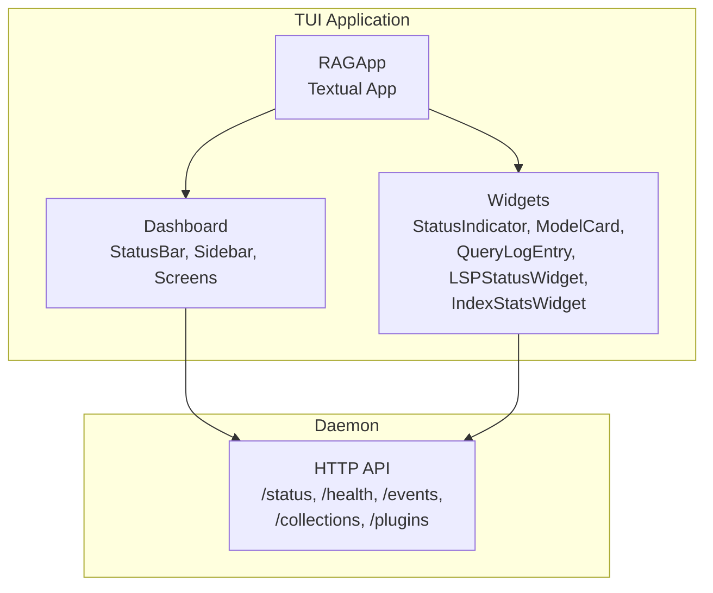
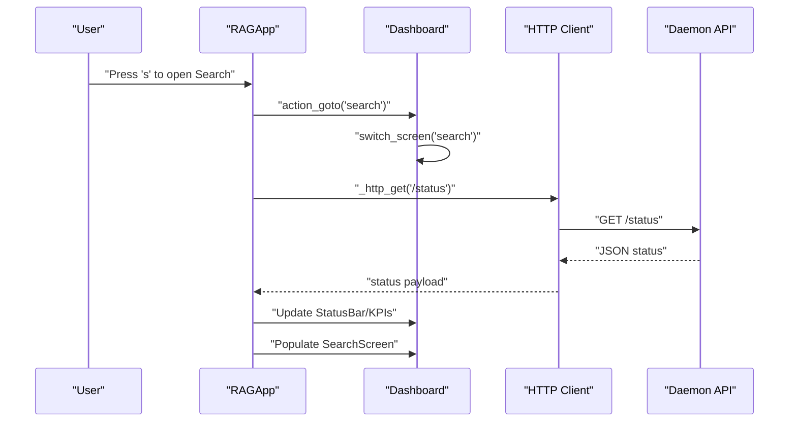
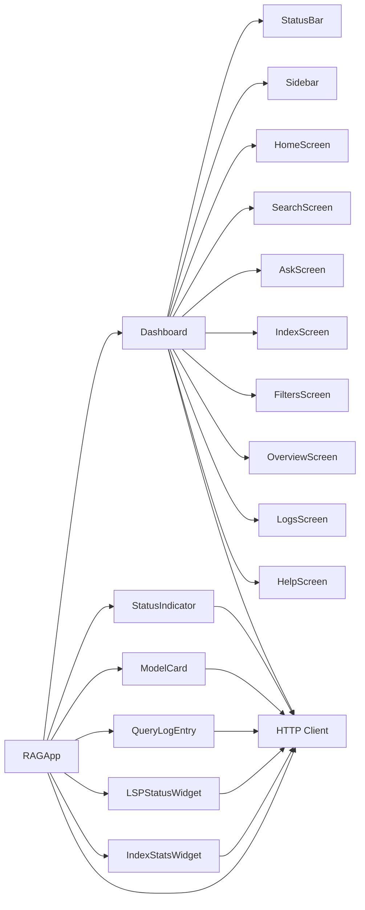

# TUI Interface

<cite>
**Referenced Files in This Document**
- [app.py](file://src/rag/app.py)
- [dashboard.py](file://src/rag/tui/dashboard.py)
- [widgets.py](file://src/rag/tui/widgets.py)
- [README.md](file://README.md)
- [pyproject.toml](file://pyproject.toml)
</cite>

## Table of Contents
1. [Introduction](#introduction)
2. [Project Structure](#project-structure)
3. [Core Components](#core-components)
4. [Architecture Overview](#architecture-overview)
5. [Detailed Component Analysis](#detailed-component-analysis)
6. [Dependency Analysis](#dependency-analysis)
7. [Performance Considerations](#performance-considerations)
8. [Troubleshooting Guide](#troubleshooting-guide)
9. [Conclusion](#conclusion)
10. [Appendices](#appendices)

## Introduction
This document describes the TUI (Text User Interface) built with the Textual framework for the RAG system. The TUI is a read-only dashboard that monitors and visualizes the running daemon via HTTP APIs. It provides navigation across eight screens, real-time status indicators, repository and indexing insights, search result visualization, and system diagnostics. The interface is optimized for terminal environments, supports keyboard-driven workflows, and integrates seamlessly with the daemon’s HTTP endpoints.

## Project Structure
The TUI is implemented as a Textual application composed of:
- A top status bar for daemon connectivity, repository, models, QPM, memory, and clock
- A left sidebar with navigation and quick actions
- A central content area with eight swappable screens
- A bottom command line for REPL-style commands and focus management
- Custom widgets for status, model cards, query logs, LSP detection, and index statistics
- An HTTP client that polls the daemon and updates reactive widgets

**Diagram sources**
- [app.py:270-289](file://src/rag/app.py#L270-L289)
- [dashboard.py:60-104](file://src/rag/tui/dashboard.py#L60-L104)
- [widgets.py:9-126](file://src/rag/tui/widgets.py#L9-L126)

**Section sources**
- [app.py:1-120](file://src/rag/app.py#L1-L120)
- [dashboard.py:1-50](file://src/rag/tui/dashboard.py#L1-L50)

## Core Components
- RAGApp: The Textual application that composes the dashboard, registers themes, binds keys, and runs polling tasks to fetch daemon state.
- Dashboard: Contains StatusBar, Sidebar, and the eight screens (Home, Search, Ask, Index, Filters, Overview, Logs, Help).
- Widgets: Reusable components for rendering status, model info, query logs, LSP detection, and index statistics.
- HTTP Layer: Lightweight async HTTP client that authenticates with a bearer token and updates UI state reactively.

Key responsibilities:
- Navigation: Keyboard bindings and command palette switch screens and trigger actions.
- Real-time monitoring: Periodic polling of daemon endpoints updates status bar and screen content.
- Read-only UX: All user-facing screens present data; write operations are intentionally restricted.

**Section sources**
- [app.py:237-250](file://src/rag/app.py#L237-L250)
- [app.py:270-289](file://src/rag/app.py#L270-L289)
- [dashboard.py:126-162](file://src/rag/tui/dashboard.py#L126-L162)
- [widgets.py:9-126](file://src/rag/tui/widgets.py#L9-L126)

## Architecture Overview
The TUI architecture is a reactive, event-driven loop:
- RAGApp initializes the Dashboard and registers theme
- RAGApp mounts and starts polling tasks for status, queries, stats, events, collections, plugins, overview, and health
- HTTP GET requests to the daemon update reactive widgets
- User interactions (keyboard, command palette, list selection) route to actions that switch screens or clear content

**Diagram sources**
- [app.py:1062-1067](file://src/rag/app.py#L1062-L1067)
- [app.py:363-400](file://src/rag/app.py#L363-L400)
- [dashboard.py:419-456](file://src/rag/tui/dashboard.py#L419-L456)

## Detailed Component Analysis

### Application and Navigation
- Keyboard bindings: Quick navigation (h, s, a, i, f, o, l), quit (q), help (?), command palette (ctrl+k), focus command line (:), and clear active content (c).
- Command palette: Modal screen with grouped commands for actions, navigation, and daemon inspection.
- Screen switching: Programmatic navigation via action_goto routes to the Dashboard’s switch_screen method.

Practical usage patterns:
- Daily monitoring: Use 'l' to jump to Logs and observe event heatmaps; periodically check 'o' for Overview summaries.
- Search workflow: Press 's', enter a query, and select a result to view details in the adjacent panel.
- Indexing: Open 'i', enter a repository path, and monitor progress bars and status messages.

Accessibility and interactions:
- Focus management: The command line can be focused with ':' for keyboard-centric workflows.
- Clearing: Use 'c' to reset active logs/results for a clean slate.

**Section sources**
- [app.py:237-250](file://src/rag/app.py#L237-L250)
- [app.py:1062-1087](file://src/rag/app.py#L1062-L1087)
- [dashboard.py:709-800](file://src/rag/tui/dashboard.py#L709-L800)

### Status Bar and System Metrics
- Daemon connectivity: Traffic-light dot indicates online/offline; automatically updates when daemon responds.
- Repository and models: Shows active repository name, embedder model/provider, and generator model.
- Throughput and memory: Queries-per-minute average and memory usage (RSS) are displayed.
- Clock: Local time updates periodically.

Real-time updates:
- Polling loop refreshes status every interval; successful responses mark daemon as up and update StatusBar fields.

**Section sources**
- [dashboard.py:60-104](file://src/rag/tui/dashboard.py#L60-L104)
- [app.py:363-400](file://src/rag/app.py#L363-L400)
- [app.py:663-684](file://src/rag/app.py#L663-L684)

### Widget System
- StatusIndicator: Colored dot and label for service statuses (e.g., running, ready, degraded, missing).
- ModelCard: Role, model short name, provider, and status with a colored indicator.
- QueryLogEntry: Timestamped query snippet, result count, and latency.
- LSPStatusWidget: Lists detected language servers and provides install hints for missing ones.
- IndexStatsWidget: Displays index points count and status.

Rendering and updates:
- Widgets expose update methods and refresh when reactive properties change.
- Render methods produce compact, terminal-friendly text with ANSI-like markup.

**Section sources**
- [widgets.py:9-126](file://src/rag/tui/widgets.py#L9-L126)

### Repository Status Displays
- Collections panel on Home shows indexed repositories and their chunk counts.
- Plugins panel lists installed plugins.
- Overview screen aggregates module summaries and graph insights.

Data sources:
- Polling endpoints for collections, plugins, and overview content feed these panels.

**Section sources**
- [dashboard.py:295-414](file://src/rag/tui/dashboard.py#L295-L414)
- [app.py:363-400](file://src/rag/app.py#L363-L400)

### Indexing Progress Tracking
- Index screen provides an input for absolute repository paths, an Index button, a status message, and a progress bar.
- Polling tasks update progress and recent indexing activity.

Usage:
- Paste a path, click Index, and watch the progress bar advance; status messages indicate current phase.

**Section sources**
- [dashboard.py:500-539](file://src/rag/tui/dashboard.py#L500-L539)
- [app.py:363-400](file://src/rag/app.py#L363-L400)

### Search Result Visualization
- Search screen has a query input, a results list, a detail panel, and a planner inspector hint.
- Selecting a result from the list triggers detail rendering in the adjacent panel.

Interactions:
- Mouse click or arrow keys to navigate results; Enter to run search; Ctrl+A toggles Ask mode.

**Section sources**
- [dashboard.py:419-456](file://src/rag/tui/dashboard.py#L419-L456)
- [app.py:1048-1057](file://src/rag/app.py#L1048-L1057)

### System Diagnostics
- Logs screen tails recent events with a 24-hour heatmap visualization.
- Health detail polling captures RSS memory usage for the TUI process.

Operational tips:
- Use Logs to diagnose performance spikes or frequent reconnections.
- Watch the status bar for memory trends during long sessions.

**Section sources**
- [dashboard.py:597-622](file://src/rag/tui/dashboard.py#L597-L622)
- [app.py:663-684](file://src/rag/app.py#L663-L684)

### Read-only Design and Daemon Integration
- The TUI is read-only: it does not mutate daemon state. All user-facing screens present data pulled from HTTP endpoints.
- Integration: RAGApp constructs base URL from settings, authenticates with a bearer token, and polls endpoints to keep the UI fresh.
- Error handling: Non-200 responses mark the daemon as down and notify the user once per outage.

**Section sources**
- [app.py:294-361](file://src/rag/app.py#L294-L361)
- [app.py:342-357](file://src/rag/app.py#L342-L357)

## Dependency Analysis
High-level dependencies:
- RAGApp depends on Dashboard and HTTP helpers
- Dashboard composes StatusBar, Sidebar, and screens
- Screens depend on Textual containers and widgets
- Widgets depend on textual.reactive and Static rendering

**Diagram sources**
- [app.py:270-289](file://src/rag/app.py#L270-L289)
- [dashboard.py:60-104](file://src/rag/tui/dashboard.py#L60-L104)
- [widgets.py:9-126](file://src/rag/tui/widgets.py#L9-L126)

**Section sources**
- [app.py:270-289](file://src/rag/app.py#L270-L289)
- [dashboard.py:60-104](file://src/rag/tui/dashboard.py#L60-L104)

## Performance Considerations
- Polling cadence: Status and memory are polled at intervals suitable for terminal UX (e.g., periodic memory updates every 15 seconds).
- Network timeouts: HTTP GET defaults to a short timeout; POST operations allow longer timeouts for heavy operations.
- Reactive updates: Widgets refresh only when reactive properties change, minimizing redraw overhead.
- Terminal rendering: Sparklines and bar charts are precomputed and rendered as strings to reduce layout churn.

Recommendations:
- Keep terminal font monospaced and ensure sufficient width for multi-column layouts.
- Prefer keyboard shortcuts for frequent navigation to avoid pointer movement overhead.
- Close unused screens or clear logs to reduce memory usage during long sessions.

[No sources needed since this section provides general guidance]

## Troubleshooting Guide
Common issues and resolutions:
- Daemon unreachable: The status bar shows offline; the app notifies once per outage. Start the daemon and ensure the configured host/port are correct.
- Slow responses: Increase network timeouts or reduce concurrent polling by adjusting intervals.
- Terminal rendering anomalies: Verify terminal supports the required glyphs and fonts; ensure monospace rendering is enabled.
- No data in screens: Confirm the daemon is indexing and has collections; check Logs for errors.

Operational checks:
- Use the command palette to inspect /status and /health detail.
- Switch to Logs and filter by severity to locate recent errors.
- Use 'c' to clear stale results and logs for a clean state.

**Section sources**
- [app.py:342-357](file://src/rag/app.py#L342-L357)
- [app.py:301-330](file://src/rag/app.py#L301-L330)
- [dashboard.py:657-702](file://src/rag/tui/dashboard.py#L657-L702)

## Conclusion
The TUI provides a fast, read-only, terminal-native dashboard for monitoring and diagnosing the RAG daemon. Its reactive architecture, extensive polling, and terminal-optimized widgets deliver real-time insights with minimal friction. By leveraging keyboard shortcuts, the command palette, and structured screens, users can efficiently track indexing progress, review search results, and troubleshoot system health.

[No sources needed since this section summarizes without analyzing specific files]

## Appendices

### Keyboard Shortcuts Reference
- Navigation: h (Home), s (Search), a (Ask), i (Index), f (Filters), o (Overview), l (Logs), ? (Help)
- Actions: q (Quit), c (Clear), : (Focus command line), ctrl+k (Command palette)
- Search: Enter to run; Ctrl+A toggles Ask mode

**Section sources**
- [app.py:237-250](file://src/rag/app.py#L237-L250)
- [dashboard.py:657-702](file://src/rag/tui/dashboard.py#L657-L702)

### Accessibility Notes
- Focus management: Command line and list widgets support keyboard navigation.
- Color contrast: Accent colors are used consistently for status and highlights.
- Monospace requirement: Layouts assume fixed-width fonts for alignment.

**Section sources**
- [dashboard.py:170-225](file://src/rag/tui/dashboard.py#L170-L225)
- [app.py:47-66](file://src/rag/app.py#L47-L66)

### Terminal Compatibility
- Required: Monospace fonts (e.g., JetBrains Mono, Geist Mono) for proper alignment.
- Tested terminals: Modern macOS, Linux, and Windows terminals with UTF-8 support.
- Recommendations: Enable true color and disable background image effects for best rendering.

**Section sources**
- [dashboard.py:1-22](file://src/rag/tui/dashboard.py#L1-L22)
- [pyproject.toml](file://pyproject.toml)