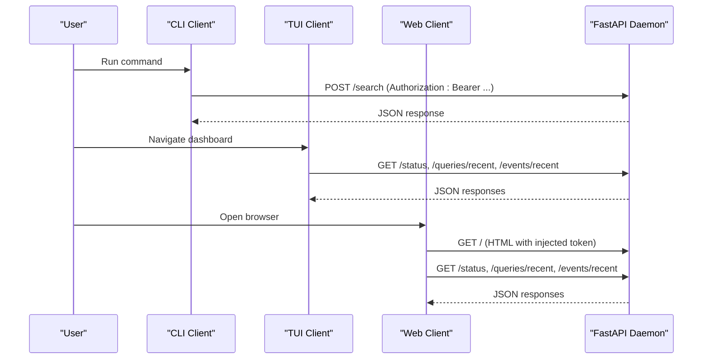
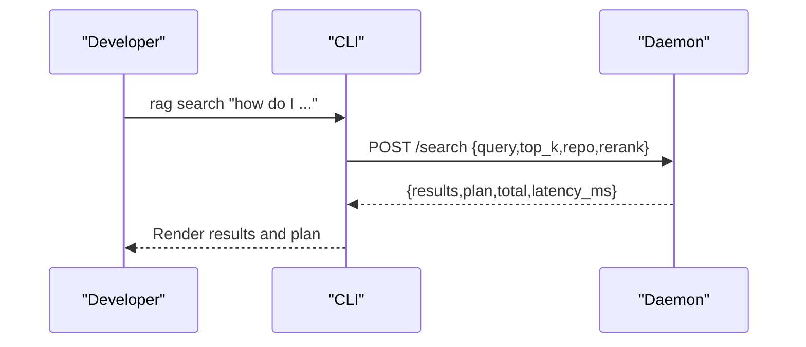
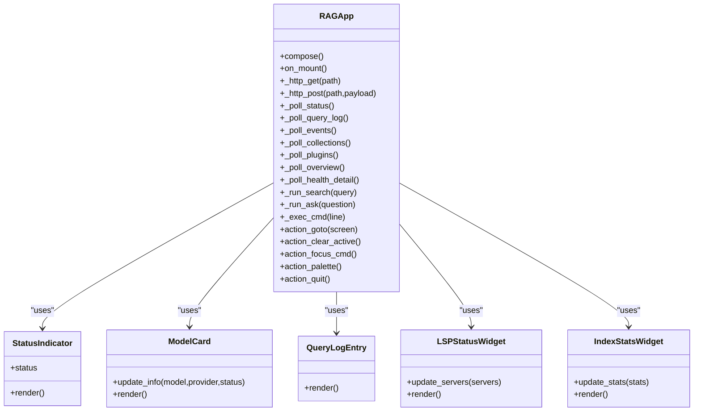
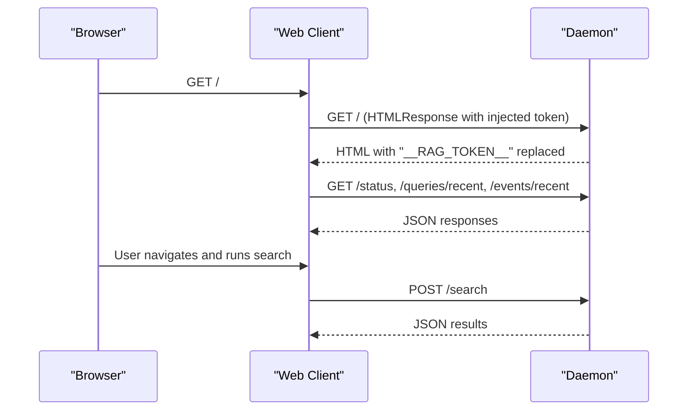
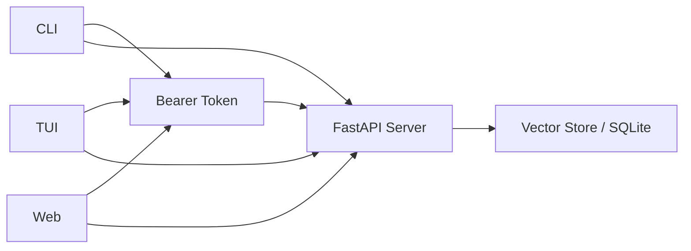

# User Interfaces

<cite>
**Referenced Files in This Document**
- [cli.py](file://src/rag/cli.py)
- [app.py](file://src/rag/app.py)
- [widgets.py](file://src/rag/tui/widgets.py)
- [index.html](file://src/rag/web/index.html)
- [server.py](file://src/rag/server.py)
</cite>

## Table of Contents
1. [Introduction](#introduction)
2. [Project Structure](#project-structure)
3. [Core Components](#core-components)
4. [Architecture Overview](#architecture-overview)
5. [Detailed Component Analysis](#detailed-component-analysis)
6. [Dependency Analysis](#dependency-analysis)
7. [Performance Considerations](#performance-considerations)
8. [Troubleshooting Guide](#troubleshooting-guide)
9. [Conclusion](#conclusion)

## Introduction
This document explains the three user interfaces of the RAG system: the CLI, the Textual TUI dashboard, and the web dashboard. It covers:
- Daily development workflows for the CLI, including commands, flags, and usage patterns
- The read-only TUI dashboard with navigation, real-time monitoring, and integration with the daemon
- The web dashboard for browser-based access and team collaboration
- The supervised daemon architecture where CLI and TUI are thin HTTP clients that never affect daemon operation

## Project Structure
The user interfaces are implemented as thin HTTP clients that communicate with a FastAPI daemon:
- CLI: Typer-based command-line client that talks to the daemon over HTTP
- TUI: Textual app that polls the daemon and renders a terminal dashboard
- Web: Browser SPA served by the daemon that polls the same endpoints

```mermaid
graph TB
subgraph "CLI"
CLI["src/rag/cli.py"]
end
subgraph "TUI"
TUI_APP["src/rag/app.py"]
TUI_WIDGETS["src/rag/tui/widgets.py"]
end
subgraph "Web"
WEB_HTML["src/rag/web/index.html"]
end
subgraph "Daemon"
SERVER["src/rag/server.py"]
end
CLI --> SERVER
TUI_APP --> SERVER
WEB_HTML --> SERVER
```

**Diagram sources**
- [cli.py:1-2274](file://src/rag/cli.py#L1-L2274)
- [app.py:1-1105](file://src/rag/app.py#L1-L1105)
- [widgets.py:1-126](file://src/rag/tui/widgets.py#L1-L126)
- [index.html:1-812](file://src/rag/web/index.html#L1-L812)
- [server.py:1-2586](file://src/rag/server.py#L1-L2586)

**Section sources**
- [cli.py:1-2274](file://src/rag/cli.py#L1-L2274)
- [app.py:1-1105](file://src/rag/app.py#L1-L1105)
- [widgets.py:1-126](file://src/rag/tui/widgets.py#L1-L126)
- [index.html:1-812](file://src/rag/web/index.html#L1-L812)
- [server.py:1-2586](file://src/rag/server.py#L1-L2586)

## Core Components
- CLI client: Thin Typer app that validates inputs, authenticates with a Bearer token, and posts requests to daemon endpoints
- TUI client: Textual app that polls endpoints and renders a terminal dashboard
- Web client: Browser SPA that polls the same endpoints and displays the same data
- Daemon: FastAPI server exposing read and write endpoints, with rate-limiting and CSRF guards

Key characteristics:
- All clients are read-only thin HTTP clients
- The daemon is supervised and isolated from client actions
- Authentication uses a Bearer token injected into the web dashboard at serve time

**Section sources**
- [cli.py:1-2274](file://src/rag/cli.py#L1-L2274)
- [app.py:1-1105](file://src/rag/app.py#L1-L1105)
- [index.html:423-812](file://src/rag/web/index.html#L423-L812)
- [server.py:582-800](file://src/rag/server.py#L582-L800)

## Architecture Overview
The system follows a supervised daemon pattern:
- CLI and TUI are thin HTTP clients that never mutate daemon state
- The web dashboard is a same-origin SPA served by the daemon
- All clients poll the same endpoints and share the same state



**Diagram sources**
- [cli.py:50-120](file://src/rag/cli.py#L50-L120)
- [app.py:301-331](file://src/rag/app.py#L301-L331)
- [index.html:516-720](file://src/rag/web/index.html#L516-L720)
- [server.py:1500-1605](file://src/rag/server.py#L1500-L1605)

**Section sources**
- [cli.py:1-2274](file://src/rag/cli.py#L1-L2274)
- [app.py:1-1105](file://src/rag/app.py#L1-L1105)
- [index.html:1-812](file://src/rag/web/index.html#L1-L812)
- [server.py:1-2586](file://src/rag/server.py#L1-L2586)

## Detailed Component Analysis

### CLI Interface
The CLI is a Typer application that:
- Ensures the daemon is running and reachable
- Authenticates with a Bearer token
- Posts to daemon endpoints for search, indexing, and diagnostics
- Provides convenience commands for starting the daemon and managing Qdrant

Common commands and flags:
- Initialization and startup
  - rag init [path]: Initialize config, start daemon, and index a directory
  - rag start [--headless] [--tui] [--watch]: Start the daemon; optionally spawn TUI or enable file watching
  - rag tui: Launch the read-only TUI dashboard
  - rag web [--open/--no-open]: Open the web dashboard in the browser
- Search and retrieval
  - rag search "query" [--top-k] [--repo] [--explain]: Search the codebase
  - rag context-pack "query" [--repo] [--max-slices] [--max-source-tokens] [--no-ast-index] [--no-semantic]: Token-bounded context pack
  - rag repo-agent "task" [--repo] [--max-slices] [--max-source-tokens] [--definitions] [--usages] [--min-exact-slices] [--no-semantic-fallback] [--json]: Central retrieval planner
  - rag ask "question" [--top-k] [--repo]: Grounded answer with citations
- Indexing and maintenance
  - rag index PATH [--full] [--lang] [--name]: Index a repository
  - rag index-docs PATH [--collection] [--doc-type] [--full]: Index docs
  - rag backfill-code-index [--repo] [--collection] [--keep-existing]: Backfill SQLite index
  - rag list FLAG [--lang] [--limit] [--value] [--lines]: Exhaustive enumeration
- Symbol and graph operations
  - rag resolve SYMBOLS... --repo [--usages] [--definitions]: Resolve definitions/usages
  - rag call-tree SYMBOL --repo [--limit]: Show call tree
  - rag files --repo QUERY [--limit] [--tests-only] [--json]: List files
  - rag node SYMBOL --repo [--limit] [--json]: Definitions/usages
  - rag callers SYMBOL --repo [--limit] [--json]: One-hop callers
  - rag callees SYMBOL --repo [--limit] [--json]: Likely callees
  - rag impact SYMBOL --repo [--limit] [--json]: Impact analysis
  - rag affected --repo [--file] [--since] [--limit] [--json]: Affected files/tests
  - rag understand "topic" --repo [--max-modules] [--max-slices] [--max-source-tokens]: Project understanding
- Diagnostics and infrastructure
  - rag qdrant-up/down/status: Manage local Qdrant server
  - rag benchmark-embeddings: Benchmark embedding throughput
  - rag diagnose: Diagnose daemon connectivity and health

Operational flow for a typical search:


**Diagram sources**
- [cli.py:426-476](file://src/rag/cli.py#L426-L476)
- [server.py:1500-1605](file://src/rag/server.py#L1500-L1605)

**Section sources**
- [cli.py:82-141](file://src/rag/cli.py#L82-L141)
- [cli.py:162-244](file://src/rag/cli.py#L162-L244)
- [cli.py:246-301](file://src/rag/cli.py#L246-L301)
- [cli.py:302-386](file://src/rag/cli.py#L302-L386)
- [cli.py:388-424](file://src/rag/cli.py#L388-L424)
- [cli.py:426-528](file://src/rag/cli.py#L426-L528)
- [cli.py:530-937](file://src/rag/cli.py#L530-L937)
- [cli.py:940-1023](file://src/rag/cli.py#L940-L1023)
- [cli.py:1025-1182](file://src/rag/cli.py#L1025-L1182)
- [cli.py:1184-1371](file://src/rag/cli.py#L1184-L1371)
- [cli.py:1373-1567](file://src/rag/cli.py#L1373-L1567)
- [cli.py:1569-1599](file://src/rag/cli.py#L1569-L1599)

### Textual TUI Dashboard
The TUI is a Textual app that:
- Connects to the daemon over HTTP and polls endpoints
- Renders a terminal dashboard with navigation, status, and real-time data
- Provides REPL-style command input (:cmd) and keyboard shortcuts

Key features:
- Navigation: Home, Search, Ask, Index, Filters, Overview, Logs, Help
- Real-time polling: Status, recent queries, events, collections, plugins, overview
- Command palette and keyboard shortcuts
- Lightweight rendering widgets for status indicators, model cards, query logs, LSP status, and index stats



**Diagram sources**
- [app.py:156-1105](file://src/rag/app.py#L156-L1105)
- [widgets.py:9-126](file://src/rag/tui/widgets.py#L9-L126)

Navigation and real-time monitoring:
- Status bar shows daemon status, repo, models, QPM, memory, and clock
- Home screen shows KPIs, recent queries sparkline, plugins, and collections
- Logs screen tails events and shows a 24h heatmap
- Search screen runs queries and previews results
- Ask screen retrieves and displays grounded answers with citations

Command palette and keyboard shortcuts:
- Shortcuts: q (quit), ?, ctrl+k (palette), colon (focus :cmd), h/s/a/i/f/o/l (screens)
- :cmd supports goto, search, ask, list, index, filters, strategy, status, health, events, collections, plugins, clear, reload

**Section sources**
- [app.py:1-1105](file://src/rag/app.py#L1-L1105)
- [widgets.py:1-126](file://src/rag/tui/widgets.py#L1-L126)

### Web Dashboard
The web dashboard is a single-page application served by the daemon:
- Same-origin design: the daemon injects a Bearer token into the page at serve time
- Polls the same endpoints as the TUI and CLI
- Provides the same screens: Home, Search, Logs

Key behaviors:
- Token injection: "__RAG_TOKEN__" placeholder replaced with daemon token
- Routing: Home, Search, Logs screens with navigation and keyboard shortcuts
- Real-time updates: status, recent queries, events, plugins, collections
- Search: runs queries and previews results with metadata



**Diagram sources**
- [index.html:423-812](file://src/rag/web/index.html#L423-L812)
- [server.py:2552-2582](file://src/rag/server.py#L2552-L2582)

**Section sources**
- [index.html:1-812](file://src/rag/web/index.html#L1-L812)
- [server.py:2543-2582](file://src/rag/server.py#L2543-L2582)

## Dependency Analysis
The three clients depend on the same FastAPI endpoints and share authentication and authorization:
- Authentication: Bearer token extracted from Authorization header
- CSRF protection: Non-GET/OPTIONS requests validated; localhost origin enforced when Origin present
- Rate limiting: Per-token bucket middleware
- Endpoints: Search, context-pack, resolve, call-tree, graph ops, enumerate, ask, index, overview, admin reload, web dashboard



**Diagram sources**
- [server.py:582-800](file://src/rag/server.py#L582-L800)
- [server.py:2543-2582](file://src/rag/server.py#L2543-L2582)

**Section sources**
- [server.py:582-800](file://src/rag/server.py#L582-L800)
- [server.py:2543-2582](file://src/rag/server.py#L2543-L2582)

## Performance Considerations
- CLI
  - Uses timeouts per request; long-running operations (indexing) use progress bars and polling
  - Batch embedding benchmarking helps tune batch sizes for throughput
- TUI
  - Polling intervals optimized for responsiveness without overloading the daemon
  - Sparklines and heatmaps computed client-side from polled data
  - Memory usage tracked via process RSS for diagnostics
- Web
  - Same polling strategy as TUI; lightweight DOM updates for real-time data
- Daemon
  - Warm probe for embedder latency measurement
  - Rate-limiting middleware prevents abuse
  - Background tasks (file watcher, periodic probes) managed during lifespan

[No sources needed since this section provides general guidance]

## Troubleshooting Guide
Common issues and resolutions:
- Daemon not running
  - CLI prints a clear message and exits; start with rag start or rag tui
  - TUI shows a warning and prompts to start the daemon
- Connection lost to daemon
  - CLI and TUI detect non-200 responses and mark daemon down
  - Reconnect attempts occur automatically
- Authentication failures
  - Ensure Bearer token is present; server enforces Authorization header
- Rate limiting
  - Exceeded token bucket returns 429; reduce request frequency
- Qdrant management
  - Use rag qdrant-up/down/status to manage local Qdrant server

**Section sources**
- [cli.py:33-70](file://src/rag/cli.py#L33-L70)
- [app.py:332-358](file://src/rag/app.py#L332-L358)
- [server.py:770-789](file://src/rag/server.py#L770-L789)

## Conclusion
The RAG system’s user interfaces are designed around a supervised daemon architecture:
- CLI, TUI, and web dashboards are thin HTTP clients that never mutate daemon state
- They share the same endpoints, authentication, and authorization mechanisms
- The daemon provides robust monitoring, rate limiting, and CSRF protections
- Developers can choose the interface that fits their workflow: command-line, terminal dashboard, or browser-based collaboration