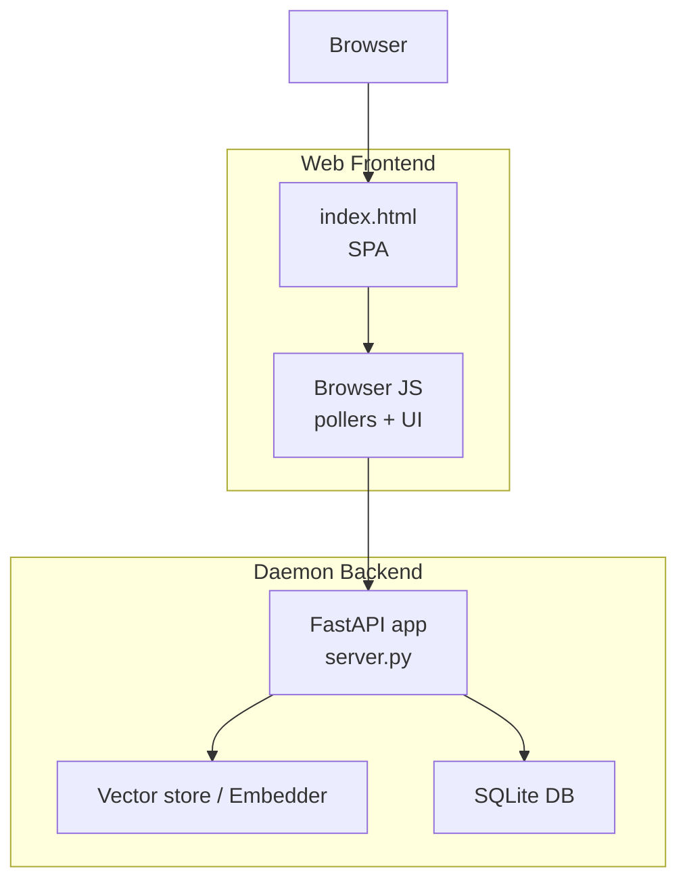
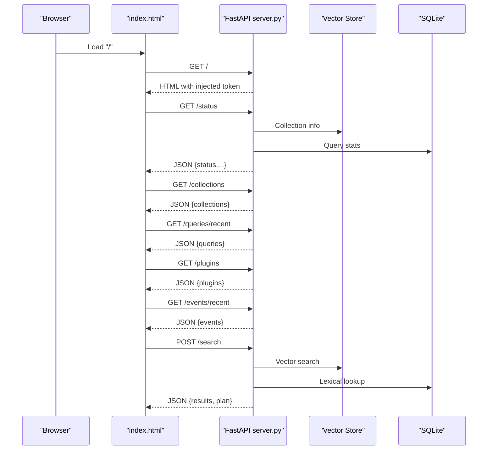
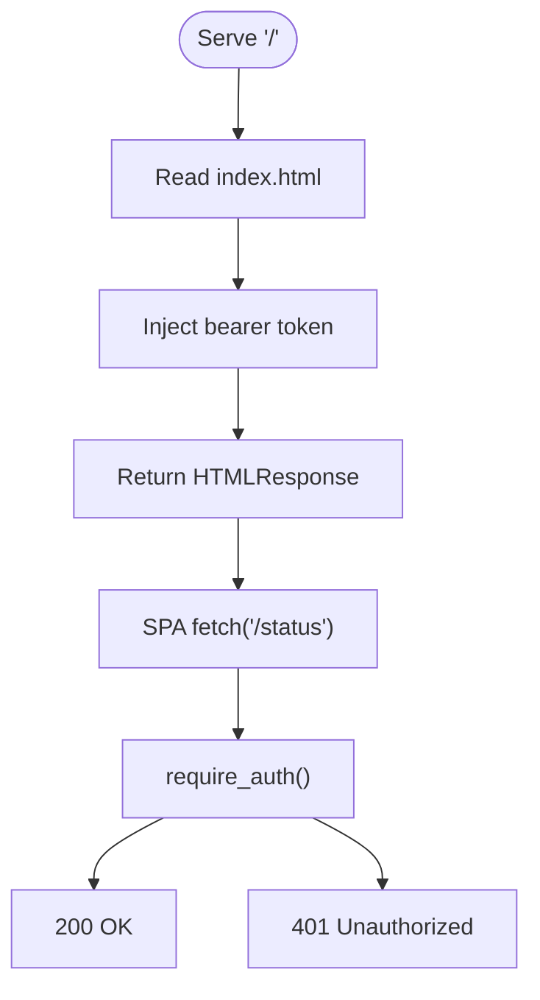
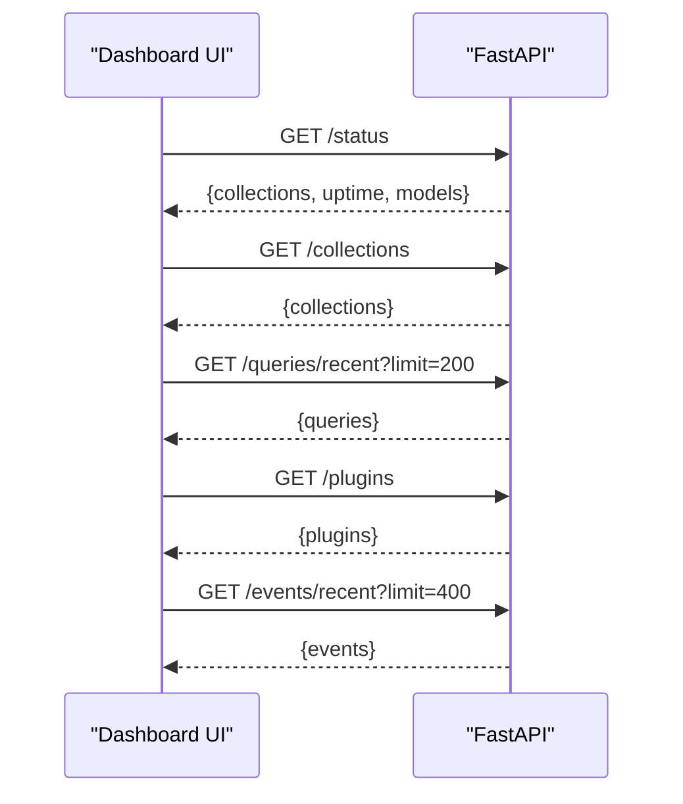
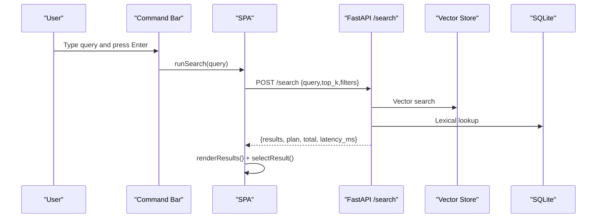
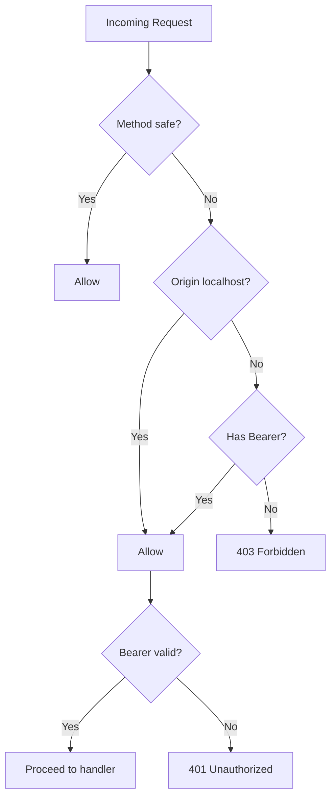
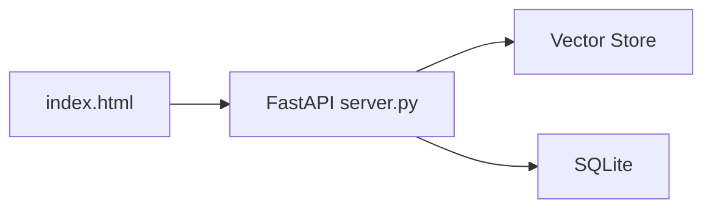

# Web Interface

<cite>
**Referenced Files in This Document**
- [index.html](file://src/rag/web/index.html)
- [server.py](file://src/rag/server.py)
- [config.py](file://src/rag/config.py)
- [app.py](file://src/rag/app.py)
- [deployment-linux.md](file://docs/deployment-linux.md)
- [test_auth.py](file://tests/test_auth.py)
- [test_routes.py](file://tests/test_routes.py)
</cite>

## Table of Contents
1. [Introduction](#introduction)
2. [Project Structure](#project-structure)
3. [Core Components](#core-components)
4. [Architecture Overview](#architecture-overview)
5. [Detailed Component Analysis](#detailed-component-analysis)
6. [Dependency Analysis](#dependency-analysis)
7. [Performance Considerations](#performance-considerations)
8. [Troubleshooting Guide](#troubleshooting-guide)
9. [Conclusion](#conclusion)
10. [Appendices](#appendices)

## Introduction
This document describes the browser-based dashboard served by the daemon, focusing on the web application architecture, responsive design, real-time data polling, and integration with the FastAPI backend. It covers user interface components (navigation, search, results, repository management, and monitoring), authentication and session management, browser compatibility, collaborative workflows, and deployment considerations.

## Project Structure
The web dashboard is a single-page application embedded as an HTML file served by the FastAPI daemon. The SPA communicates with the backend via authenticated HTTP endpoints and polls for live updates.

**Diagram sources**
- [server.py:2543-2582](file://src/rag/server.py#L2543-L2582)
- [index.html:423-800](file://src/rag/web/index.html#L423-L800)

**Section sources**
- [server.py:2543-2582](file://src/rag/server.py#L2543-L2582)
- [index.html:1-812](file://src/rag/web/index.html#L1-L812)

## Core Components
- Web dashboard SPA: A self-contained HTML page with embedded CSS and JavaScript that renders the dashboard UI, handles navigation, and polls backend endpoints.
- Authentication: Bearer token-based authentication injected into the page at serve time; CSRF protection via origin checks and bearer enforcement.
- Real-time updates: Periodic polling of status, collections, recent queries, plugin list, and event logs.
- Search UI: Command bar triggers search, results list previews code excerpts, and displays metadata.
- Monitoring panels: KPI cards, sparkline charts, recent queries, plugin and collection lists, and event logs with a 24-hour heatmap.

**Section sources**
- [index.html:423-800](file://src/rag/web/index.html#L423-L800)
- [server.py:579-817](file://src/rag/server.py#L579-L817)
- [server.py:840-1083](file://src/rag/server.py#L840-L1083)

## Architecture Overview
The web dashboard is served by the FastAPI daemon and is same-origin to the backend. The SPA injects the daemon’s bearer token into fetch requests and polls read-only endpoints for live data. The daemon enforces authentication and CSRF protection at the HTTP layer.

**Diagram sources**
- [server.py:2552-2572](file://src/rag/server.py#L2552-L2572)
- [server.py:876-958](file://src/rag/server.py#L876-L958)
- [server.py:1010-1051](file://src/rag/server.py#L1010-L1051)
- [server.py:959-1008](file://src/rag/server.py#L959-L1008)
- [server.py:1053-1083](file://src/rag/server.py#L1053-L1083)
- [server.py:1364-1604](file://src/rag/server.py#L1364-L1604)

## Detailed Component Analysis

### Web Application Architecture
- Same-origin design: The SPA is served by the daemon and includes the bearer token at runtime, eliminating CORS concerns for local access.
- Token injection: The server replaces a placeholder in index.html with the daemon token before sending the page.
- Authentication enforcement: All protected endpoints require a valid bearer token; unauthorized requests receive 401.
- CSRF guard: For non-safe methods, the server validates the Origin header against localhost or requires a bearer token.

**Diagram sources**
- [server.py:2552-2572](file://src/rag/server.py#L2552-L2572)
- [server.py:592-598](file://src/rag/server.py#L592-L598)

**Section sources**
- [server.py:2552-2572](file://src/rag/server.py#L2552-L2572)
- [server.py:592-598](file://src/rag/server.py#L592-L598)
- [server.py:798-817](file://src/rag/server.py#L798-L817)

### Responsive Design Principles
- Mobile-first viewport: The page sets a viewport meta tag for responsive scaling.
- Flexible layout: Flexbox-based layout adapts to available space; panels stack vertically on smaller screens.
- Typography: Monospace and sans-serif font stacks optimized for code and UI readability.
- Dark theme: CSS custom properties define a cohesive dark color scheme suitable for long sessions.

**Section sources**
- [index.html:1-812](file://src/rag/web/index.html#L1-L812)

### Real-Time Data Synchronization
- Polling intervals: The SPA polls endpoints at short intervals for live updates (status, queries, events, plugins).
- Sparkline rendering: Aggregates recent query activity into 48 bins over 24 hours and renders a compact sparkline.
- Event logs: Maintains a rolling window of events and updates a 24-hour heatmap.
- Delta updates: For event logs, the SPA scrolls to bottom when content is appended to simulate a live tail.

**Diagram sources**
- [index.html:515-718](file://src/rag/web/index.html#L515-L718)
- [server.py:876-958](file://src/rag/server.py#L876-L958)
- [server.py:1010-1051](file://src/rag/server.py#L1010-L1051)
- [server.py:959-1008](file://src/rag/server.py#L959-L1008)
- [server.py:1053-1083](file://src/rag/server.py#L1053-L1083)

**Section sources**
- [index.html:515-718](file://src/rag/web/index.html#L515-L718)
- [server.py:876-1083](file://src/rag/server.py#L876-L1083)

### User Interface Components
- Navigation: Top-level screens (Home, Search, Logs) with keyboard shortcuts and a command bar.
- Home panel: KPI cards (index size, embedder, generator, uptime), QPM sparkline, recent queries, plugin list, and collections list.
- Search screen: Command bar triggers search, results list with metadata, and preview pane for selected results.
- Logs screen: Live event log with severity coloring and a 24-hour heatmap of event volume.
- Repository management: Lists live repositories and their collection sizes.

**Section sources**
- [index.html:441-482](file://src/rag/web/index.html#L441-L482)
- [index.html:338-408](file://src/rag/web/index.html#L338-L408)
- [index.html:515-718](file://src/rag/web/index.html#L515-L718)

### Search Workflow
- Command bar: Press Enter to submit a query; navigates to the Search screen and triggers a POST to /search.
- Request payload: Includes query text, top_k, and optional filters.
- Response: Results array with file_path, language, lines, score, and code preview; plan metadata and latency_ms.
- Preview: Selecting a result populates the preview pane with code content.

**Diagram sources**
- [index.html:720-770](file://src/rag/web/index.html#L720-L770)
- [server.py:1364-1604](file://src/rag/server.py#L1364-L1604)

**Section sources**
- [index.html:720-770](file://src/rag/web/index.html#L720-L770)
- [server.py:1364-1604](file://src/rag/server.py#L1364-L1604)

### Repository Management and System Monitoring
- Collections: Lists default and named repository collections with live counts.
- Plugins: Displays loaded plugins and pattern counts.
- Events: Streams recent events with severity classification and a 24-hour heatmap.
- Health: Public /health endpoint reports component statuses.

**Section sources**
- [index.html:543-576](file://src/rag/web/index.html#L543-L576)
- [index.html:651-718](file://src/rag/web/index.html#L651-L718)
- [server.py:1010-1083](file://src/rag/server.py#L1010-L1083)
- [server.py:840-874](file://src/rag/server.py#L840-L874)

### Authentication and Session Management
- Bearer token: Generated and persisted at ~/.rag/token; the SPA receives it via token injection.
- Endpoint protection: require_auth() enforces Authorization: Bearer on protected routes.
- CSRF guard: Non-safe methods are blocked unless the Origin is localhost or a bearer token is present.
- Rate limiting: Per-token bucket middleware protects endpoints from abuse.

**Diagram sources**
- [server.py:798-817](file://src/rag/server.py#L798-L817)
- [server.py:592-598](file://src/rag/server.py#L592-L598)
- [server.py:770-789](file://src/rag/server.py#L770-L789)

**Section sources**
- [config.py:167-188](file://src/rag/config.py#L167-L188)
- [server.py:592-598](file://src/rag/server.py#L592-L598)
- [server.py:798-817](file://src/rag/server.py#L798-L817)
- [server.py:770-789](file://src/rag/server.py#L770-L789)

### Collaboration and Team Access Patterns
- Local-first design: The daemon binds to 127.0.0.1 by default; expose via a reverse proxy with TLS and bearer token for team access.
- Token sharing: The bearer token resides at ~/.rag/token; back it up securely.
- Remote development: Use SSH tunneling or a reverse proxy to reach the daemon from remote hosts while preserving the same-origin behavior for the SPA.

**Section sources**
- [config.py:35-50](file://src/rag/config.py#L35-L50)
- [deployment-linux.md:51-56](file://docs/deployment-linux.md#L51-L56)

### Integration with Daemon Backend APIs
- Base URL: SPA constructs paths relative to the daemon host/port; headers include Authorization: Bearer <token>.
- Protected endpoints: /status, /collections, /queries/recent, /queries/stats, /plugins, /events/recent, /search, and others.
- Public endpoints: /health is unauthenticated.
- Error handling: Non-200 responses throw errors; the SPA displays offline status or error messages.

**Section sources**
- [index.html:433-439](file://src/rag/web/index.html#L433-L439)
- [server.py:840-874](file://src/rag/server.py#L840-L874)
- [server.py:876-1083](file://src/rag/server.py#L876-L1083)

## Dependency Analysis
The SPA depends on the daemon for all data and authentication. The daemon depends on the vector store and SQLite for persistence and retrieval.

**Diagram sources**
- [index.html:423-800](file://src/rag/web/index.html#L423-L800)
- [server.py:840-1604](file://src/rag/server.py#L840-L1604)

**Section sources**
- [index.html:423-800](file://src/rag/web/index.html#L423-L800)
- [server.py:840-1604](file://src/rag/server.py#L840-L1604)

## Performance Considerations
- Polling cadence: Short intervals provide near-real-time updates but increase load; adjust limits and intervals for large deployments.
- Payload sizes: Responses include arrays of results and events; consider pagination or reduced limits for constrained networks.
- Rendering: Sparklines and heatmaps are computed client-side; large datasets may benefit from server-side aggregation.
- Token injection: The SPA avoids exposing the token to third-party origins by relying on same-origin behavior.

## Troubleshooting Guide
- Unauthorized errors: Verify the bearer token exists and matches the daemon’s token; check that the SPA is served from the same host/port.
- CSRF blocked: Ensure requests originate from localhost or include a valid bearer token.
- Search failures: Confirm the daemon is running, collections are populated, and the query length and top_k are within allowed ranges.
- Health issues: Use /health to diagnose vector store and embedder availability.

**Section sources**
- [test_auth.py:17-39](file://tests/test_auth.py#L17-L39)
- [test_routes.py:150-176](file://tests/test_routes.py#L150-L176)
- [server.py:840-874](file://src/rag/server.py#L840-L874)

## Conclusion
The web dashboard provides a lightweight, same-origin interface to the daemon’s capabilities. It leverages token-based authentication and CSRF guards for secure local access, and uses polling to deliver near-real-time insights into indexing, search, and system health. For team access, deploy behind a reverse proxy with TLS and bearer token enforcement.

## Appendices

### Browser Compatibility
- The SPA uses modern DOM APIs and fetch; it targets recent browsers with flexbox and CSS custom properties support.
- No explicit polyfills are included; ensure the target environment supports ES2017+ and modern fetch semantics.

**Section sources**
- [index.html:1-812](file://src/rag/web/index.html#L1-L812)

### Deployment Configurations
- Default bind address: 127.0.0.1; do not bind to 0.0.0.0 in production.
- Token location: ~/.rag/token; back it up on encrypted media.
- Linux systemd unit: Example unit file for user-level supervision.

**Section sources**
- [config.py:35-50](file://src/rag/config.py#L35-L50)
- [config.py:167-188](file://src/rag/config.py#L167-L188)
- [deployment-linux.md:1-57](file://docs/deployment-linux.md#L1-L57)