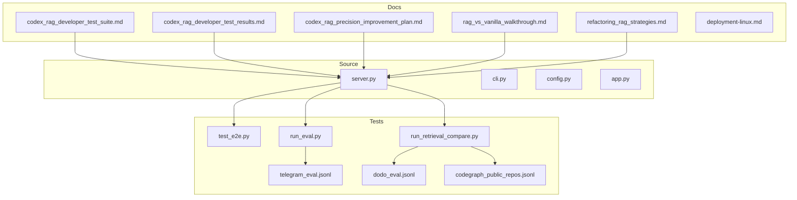
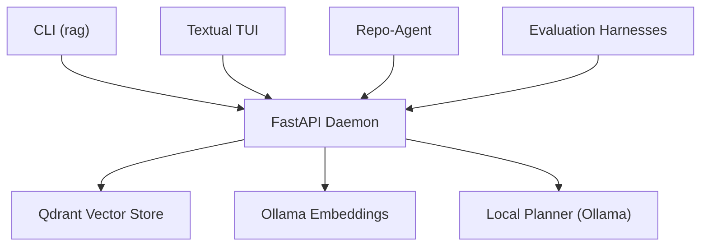
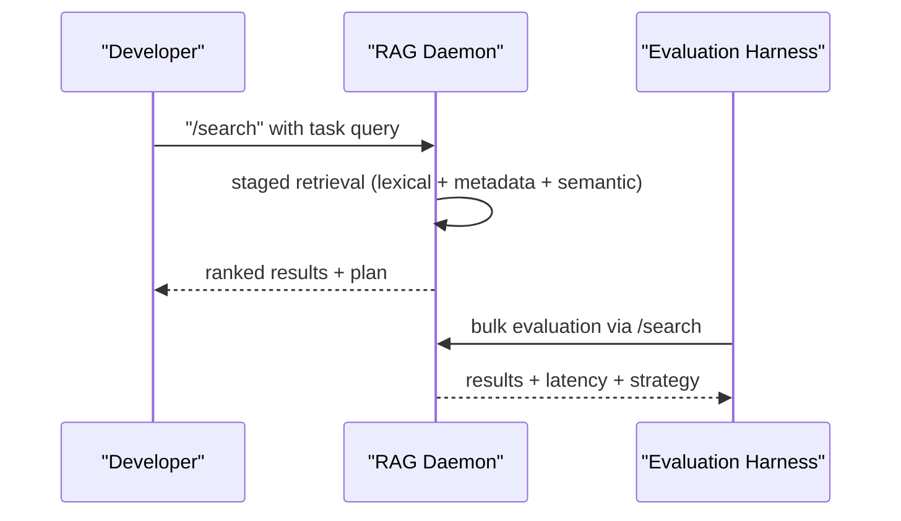
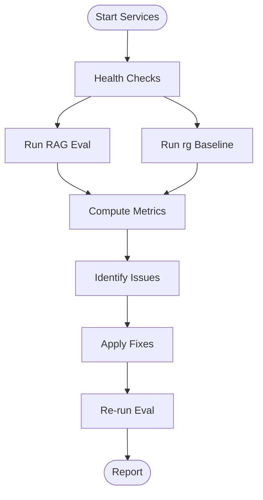
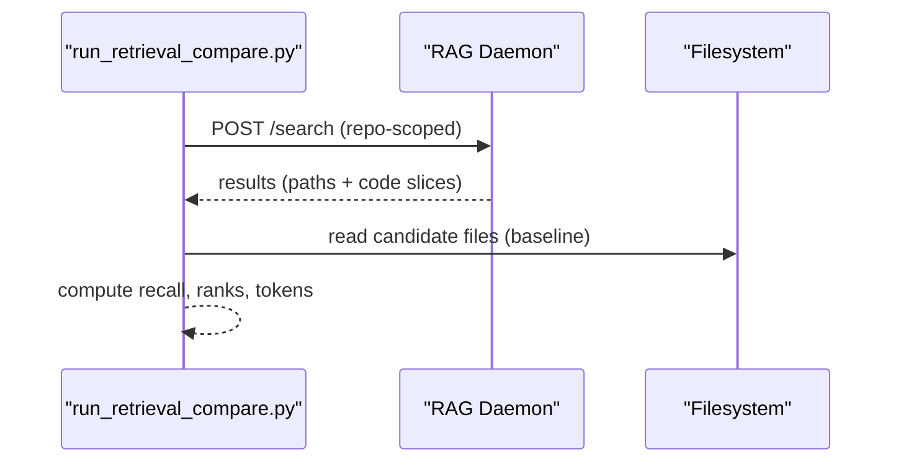
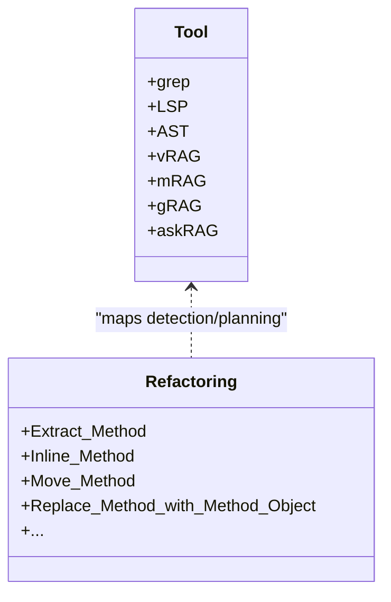
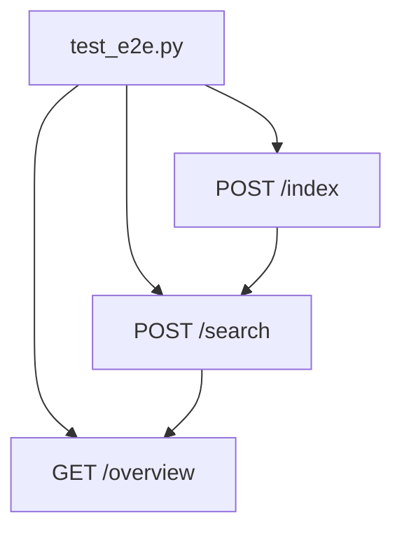
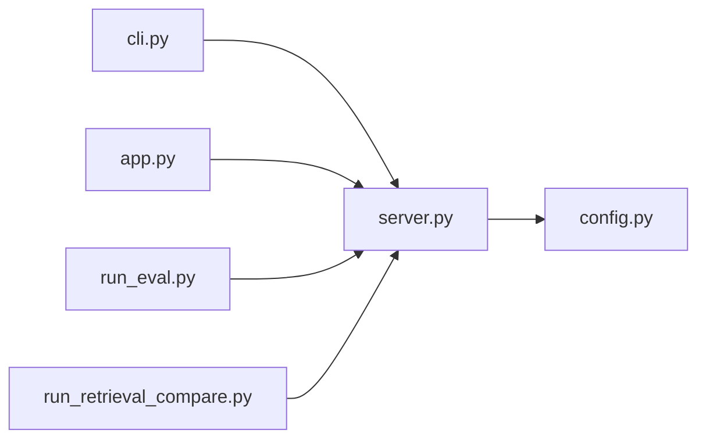

# Reference Materials

<cite>
**Referenced Files in This Document**
- [README.md](file://README.md)
- [deployment-linux.md](file://docs/deployment-linux.md)
- [codex_rag_developer_test_suite.md](file://docs/codex_rag_developer_test_suite.md)
- [codex_rag_developer_test_results.md](file://docs/codex_rag_developer_test_results.md)
- [codex_rag_precision_improvement_plan.md](file://docs/codex_rag_precision_improvement_plan.md)
- [rag_vs_vanilla_walkthrough.md](file://docs/rag_vs_vanilla_walkthrough.md)
- [refactoring_rag_strategies.md](file://docs/refactoring_rag_strategies.md)
- [config.py](file://src/rag/config.py)
- [cli.py](file://src/rag/cli.py)
- [server.py](file://src/rag/server.py)
- [app.py](file://src/rag/app.py)
- [run_eval.py](file://tests/eval/run_eval.py)
- [run_retrieval_compare.py](file://tests/eval/run_retrieval_compare.py)
- [telegram_eval.jsonl](file://tests/eval/telegram_eval.jsonl)
- [dodo_eval.jsonl](file://tests/eval/dodo_eval.jsonl)
- [codegraph_public_repos.jsonl](file://tests/eval/codegraph_public_repos.jsonl)
- [test_e2e.py](file://tests/test_e2e.py)
</cite>

## Table of Contents
1. [Introduction](#introduction)
2. [Project Structure](#project-structure)
3. [Core Components](#core-components)
4. [Architecture Overview](#architecture-overview)
5. [Detailed Component Analysis](#detailed-component-analysis)
6. [Dependency Analysis](#dependency-analysis)
7. [Performance Considerations](#performance-considerations)
8. [Troubleshooting Guide](#troubleshooting-guide)
9. [Conclusion](#conclusion)
10. [Appendices](#appendices)

## Introduction
This document consolidates reference materials for the RAG system, focusing on:
- Developer test suite results and precision improvement plans
- Comparative evaluation between RAG and vanilla search
- Performance benchmarks and evaluation methodologies
- Migration and upgrade guidance, configuration changes, and feature additions
- Frequently asked questions, troubleshooting, and common issue resolutions
- Reference tables for configuration options, command syntax, and API specifications
- Advanced usage scenarios, optimization techniques, and integration patterns
- Version compatibility, deprecation notices, and backward compatibility considerations

## Project Structure
The repository organizes functional areas into dedicated directories:
- docs: evaluation reports, precision plans, refactoring strategies, and deployment guides
- src/rag: core application modules (FastAPI server, CLI, configuration, agents, core components)
- tests: end-to-end tests, evaluation harnesses, and benchmark datasets
- config: default configuration templates
- scripts: installation helpers for agent skills
- skills: skill manifests for agent integrations

**Diagram sources**
- [server.py:1-200](file://src/rag/server.py#L1-L200)
- [cli.py:1-200](file://src/rag/cli.py#L1-L200)
- [config.py:1-120](file://src/rag/config.py#L1-L120)
- [app.py:1-120](file://src/rag/app.py#L1-L120)
- [test_e2e.py:1-120](file://tests/test_e2e.py#L1-L120)
- [run_eval.py:1-120](file://tests/eval/run_eval.py#L1-L120)
- [run_retrieval_compare.py:1-120](file://tests/eval/run_retrieval_compare.py#L1-L120)
- [telegram_eval.jsonl:1-9](file://tests/eval/telegram_eval.jsonl#L1-L9)
- [dodo_eval.jsonl:1-8](file://tests/eval/dodo_eval.jsonl#L1-L8)
- [codegraph_public_repos.jsonl:1-8](file://tests/eval/codegraph_public_repos.jsonl#L1-L8)

**Section sources**
- [README.md:1-74](file://README.md#L1-L74)

## Core Components
- FastAPI server: exposes search, indexing, status, and agent endpoints; validates requests and enforces limits
- CLI: thin HTTP client to the daemon; supports initialization, search, context packs, repo-agent orchestration, and diagnostics
- Configuration: TOML-based settings with Pydantic validation; supports server, embeddings, Qdrant, index, reranker, LLM, and LSP settings
- TUI: read-only Textual dashboard that polls daemon state and renders results
- Evaluation harnesses: RAG evaluation, retrieval comparison, and end-to-end smoke tests

Key capabilities:
- Search with configurable top_k and filters
- Context packs with token budgets and slice limits
- Repo-agent orchestration combining exact/lexical AST resolution and semantic fallback
- Token-based authentication and bearer token management
- Structured logging and health/status reporting

**Section sources**
- [server.py:33-120](file://src/rag/server.py#L33-L120)
- [cli.py:420-800](file://src/rag/cli.py#L420-L800)
- [config.py:118-194](file://src/rag/config.py#L118-L194)
- [app.py:156-220](file://src/rag/app.py#L156-L220)
- [test_e2e.py:253-314](file://tests/test_e2e.py#L253-L314)

## Architecture Overview
The system comprises a headless FastAPI daemon, a separate read-only TUI, and optional agent integrations. The daemon supervises vector search, code chunking, and retrieval planning.

**Diagram sources**
- [README.md:67-74](file://README.md#L67-L74)
- [server.py:1-40](file://src/rag/server.py#L1-L40)
- [cli.py:1-60](file://src/rag/cli.py#L1-L60)
- [app.py:1-60](file://src/rag/app.py#L1-L60)

## Detailed Component Analysis

### Developer Test Suite and Precision Improvement
The developer test suite compares plain Codex navigation versus RAG-assisted navigation across ten realistic tasks. The precision improvement plan outlines staged retrieval, exact lexical passes, metadata filtering, code graph expansion, and minimal context packing to reduce context size while maintaining or improving answer quality.

**Diagram sources**
- [codex_rag_developer_test_suite.md:14-42](file://docs/codex_rag_developer_test_suite.md#L14-L42)
- [codex_rag_developer_test_results.md:13-30](file://docs/codex_rag_developer_test_results.md#L13-L30)
- [codex_rag_precision_improvement_plan.md:46-77](file://docs/codex_rag_precision_improvement_plan.md#L46-L77)

**Section sources**
- [codex_rag_developer_test_suite.md:1-188](file://docs/codex_rag_developer_test_suite.md#L1-L188)
- [codex_rag_developer_test_results.md:1-388](file://docs/codex_rag_developer_test_results.md#L1-L388)
- [codex_rag_precision_improvement_plan.md:1-319](file://docs/codex_rag_precision_improvement_plan.md#L1-L319)

### RAG vs Vanilla Search Evaluation
The RAG vs vanilla walkthrough evaluates semantic search against a ripgrep baseline on Telegram code. It highlights current limitations (auth, shared collection, LOD availability) and proposes fixes for truthful evaluation, repo scoping, lexical boosts, and dashboard honesty.

**Diagram sources**
- [rag_vs_vanilla_walkthrough.md:15-60](file://docs/rag_vs_vanilla_walkthrough.md#L15-L60)
- [rag_vs_vanilla_walkthrough.md:61-122](file://docs/rag_vs_vanilla_walkthrough.md#L61-L122)
- [rag_vs_vanilla_walkthrough.md:144-226](file://docs/rag_vs_vanilla_walkthrough.md#L144-L226)

**Section sources**
- [rag_vs_vanilla_walkthrough.md:1-324](file://docs/rag_vs_vanilla_walkthrough.md#L1-L324)

### Retrieval Comparison and Benchmarks
The retrieval comparison script benchmarks RAG against rg + full-file reads, measuring recall, first-hit rank, latency, and approximate tokens. It demonstrates token savings potential when RAG returns bounded slices instead of whole files.

**Diagram sources**
- [run_retrieval_compare.py:189-254](file://tests/eval/run_retrieval_compare.py#L189-L254)
- [run_retrieval_compare.py:348-422](file://tests/eval/run_retrieval_compare.py#L348-L422)

**Section sources**
- [run_retrieval_compare.py:1-426](file://tests/eval/run_retrieval_compare.py#L1-L426)

### Refactoring Strategies and RAG Matrix
The refactoring strategies document maps refactorings and design patterns to the available tools (grep, LSP, AST, vRAG, mRAG, gRAG, askRAG), identifying where production-grade RAG earns its keep and where it is strictly worse.

**Diagram sources**
- [refactoring_rag_strategies.md:127-180](file://docs/refactoring_rag_strategies.md#L127-L180)
- [refactoring_rag_strategies.md:334-436](file://docs/refactoring_rag_strategies.md#L334-L436)

**Section sources**
- [refactoring_rag_strategies.md:1-507](file://docs/refactoring_rag_strategies.md#L1-L507)

### End-to-End Testing and Evaluation Datasets
The end-to-end test exercises the full index -> search loop with deterministic fake embeddings and patched heavy components. Evaluation datasets define tasks, queries, expected files, and thresholds for recall.

**Diagram sources**
- [test_e2e.py:253-314](file://tests/test_e2e.py#L253-L314)
- [telegram_eval.jsonl:1-9](file://tests/eval/telegram_eval.jsonl#L1-L9)
- [dodo_eval.jsonl:1-8](file://tests/eval/dodo_eval.jsonl#L1-L8)
- [codegraph_public_repos.jsonl:1-8](file://tests/eval/codegraph_public_repos.jsonl#L1-L8)

**Section sources**
- [test_e2e.py:1-314](file://tests/test_e2e.py#L1-L314)
- [run_eval.py:1-120](file://tests/eval/run_eval.py#L1-L120)
- [telegram_eval.jsonl:1-9](file://tests/eval/telegram_eval.jsonl#L1-L9)
- [dodo_eval.jsonl:1-8](file://tests/eval/dodo_eval.jsonl#L1-L8)
- [codegraph_public_repos.jsonl:1-8](file://tests/eval/codegraph_public_repos.jsonl#L1-L8)

## Dependency Analysis
The server defines request/response models and routes; the CLI and TUI depend on the daemon’s HTTP API; evaluation harnesses consume the same endpoints.

**Diagram sources**
- [server.py:33-120](file://src/rag/server.py#L33-L120)
- [cli.py:50-120](file://src/rag/cli.py#L50-L120)
- [app.py:294-331](file://src/rag/app.py#L294-L331)
- [run_eval.py:113-170](file://tests/eval/run_eval.py#L113-L170)
- [run_retrieval_compare.py:189-254](file://tests/eval/run_retrieval_compare.py#L189-L254)
- [config.py:118-194](file://src/rag/config.py#L118-L194)

**Section sources**
- [server.py:1-200](file://src/rag/server.py#L1-L200)
- [cli.py:1-200](file://src/rag/cli.py#L1-L200)
- [app.py:1-120](file://src/rag/app.py#L1-L120)
- [run_eval.py:1-120](file://tests/eval/run_eval.py#L1-L120)
- [run_retrieval_compare.py:1-120](file://tests/eval/run_retrieval_compare.py#L1-L120)
- [config.py:1-120](file://src/rag/config.py#L1-L120)

## Performance Considerations
- Embedding throughput: use the CLI benchmark to tune batch sizes for Ollama embeddings
- Token budgets: context packs limit source tokens and slices to reduce model context
- Repo scoping: ensure named repo collections exist to avoid cross-repo noise
- LOD strategies: disable or rebuild LOD collections when data is missing
- Latency: prefer exact/lexical retrieval for symbol-heavy queries; reserve semantic fallback for thin exact packs

[No sources needed since this section provides general guidance]

## Troubleshooting Guide
Common issues and resolutions:
- Daemon not reachable: verify health and token; ensure daemon is running and reachable
- Authentication failures: ensure bearer token is present and used by evaluation scripts
- Shared collection noise: isolate queries by repo or migrate chunks to named collections
- Missing LOD data: rebuild or disable LOD strategies until collections exist
- Dashboard misleading stats: expect operational improvements to show corrected counts

**Section sources**
- [rag_vs_vanilla_walkthrough.md:241-324](file://docs/rag_vs_vanilla_walkthrough.md#L241-L324)
- [README.md:71-74](file://README.md#L71-L74)

## Conclusion
This reference consolidates evaluation results, precision improvement plans, comparative benchmarks, and operational guidance for the RAG system. It provides actionable insights for optimizing retrieval quality, reducing context size, and integrating RAG into developer workflows.

[No sources needed since this section summarizes without analyzing specific files]

## Appendices

### A. Configuration Options Reference
- Server settings: host, port
- Embeddings: model, provider, dimension, batch size, keep alive
- Qdrant: mode, URL/path, code/docs collections
- Index: max chunk size, top_k, skip dirs
- Reranker: model, enabled flag, top_k
- LLM: Ollama URL, agent model, generation model
- LSP: enabled, auto-detect, timeout

**Section sources**
- [config.py:35-131](file://src/rag/config.py#L35-L131)

### B. CLI Command Reference
- Initialization and lifecycle: init, start, tui, web, qdrant-up/down/status
- Search and navigation: search, context-pack, repo-agent
- Diagnostics: diagnose, status, overview, collections
- Maintenance: verify, repair, export/import, plugins

**Section sources**
- [README.md:37-66](file://README.md#L37-L66)
- [cli.py:82-200](file://src/rag/cli.py#L82-L200)
- [cli.py:426-528](file://src/rag/cli.py#L426-L528)
- [cli.py:529-800](file://src/rag/cli.py#L529-L800)

### C. API Specification Reference
- Search: POST /search with query, top_k, filters, repo, rerank
- Context pack: POST /context-pack with query, repo, filters, max_slices, max_source_tokens, ast_index, semantic
- Resolve: POST /resolve for exact symbol definitions/usages
- Call tree: POST /call-tree for caller/callee exploration
- Project understand: POST /project-understand for architecture discovery
- Status and health: GET /status, GET /health, GET /collections

**Section sources**
- [server.py:33-120](file://src/rag/server.py#L33-L120)
- [server.py:160-200](file://src/rag/server.py#L160-L200)

### D. Evaluation Methodology Reference
- RAG evaluation: run_eval.py consumes JSONL tasks, posts to /search, computes recall, MRR, latency
- Retrieval comparison: run_retrieval_compare.py compares RAG vs rg + full-file reads, measures tokens and ranks
- Datasets: telegram_eval.jsonl, dodo_eval.jsonl, codegraph_public_repos.jsonl

**Section sources**
- [run_eval.py:1-120](file://tests/eval/run_eval.py#L1-L120)
- [run_retrieval_compare.py:1-120](file://tests/eval/run_retrieval_compare.py#L1-L120)
- [telegram_eval.jsonl:1-9](file://tests/eval/telegram_eval.jsonl#L1-L9)
- [dodo_eval.jsonl:1-8](file://tests/eval/dodo_eval.jsonl#L1-L8)
- [codegraph_public_repos.jsonl:1-8](file://tests/eval/codegraph_public_repos.jsonl#L1-L8)

### E. Migration and Upgrade Guidance
- Linux deployment: systemd unit for user-level daemon supervision
- Token management: ensure ~/.rag/token exists and backed up
- Service management: use rag service install/uninstall on macOS; systemd on Linux
- Configuration updates: TOML-based settings with Pydantic validation; extra keys allowed for backward compatibility

**Section sources**
- [deployment-linux.md:1-57](file://docs/deployment-linux.md#L1-L57)
- [config.py:162-194](file://src/rag/config.py#L162-L194)
- [README.md:31-36](file://README.md#L31-L36)

### F. Best Practices and Advanced Usage
- Use context-pack for bounded, token-aware context retrieval
- Prefer exact/lexical AST resolution for symbol-heavy tasks; enable semantic fallback only when needed
- Tune batch sizes for embeddings to balance throughput and interactivity
- Scope queries by repo to avoid cross-project noise
- Leverage repo-agent for complex tasks requiring multiple context packs and architecture understanding

**Section sources**
- [cli.py:478-528](file://src/rag/cli.py#L478-L528)
- [cli.py:529-800](file://src/rag/cli.py#L529-L800)
- [codex_rag_precision_improvement_plan.md:227-254](file://docs/codex_rag_precision_improvement_plan.md#L227-L254)