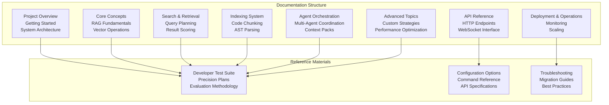
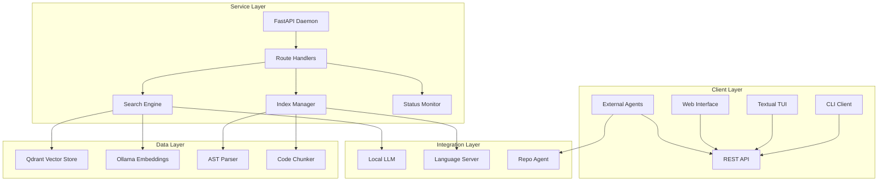
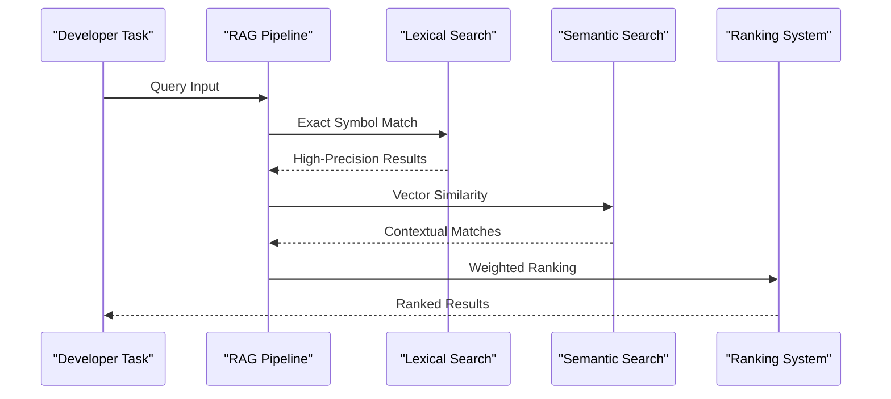
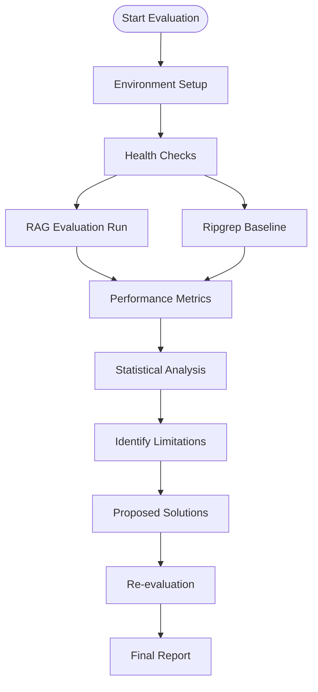
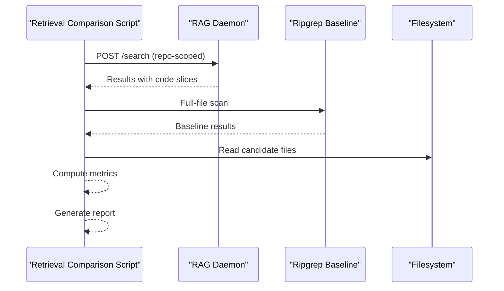
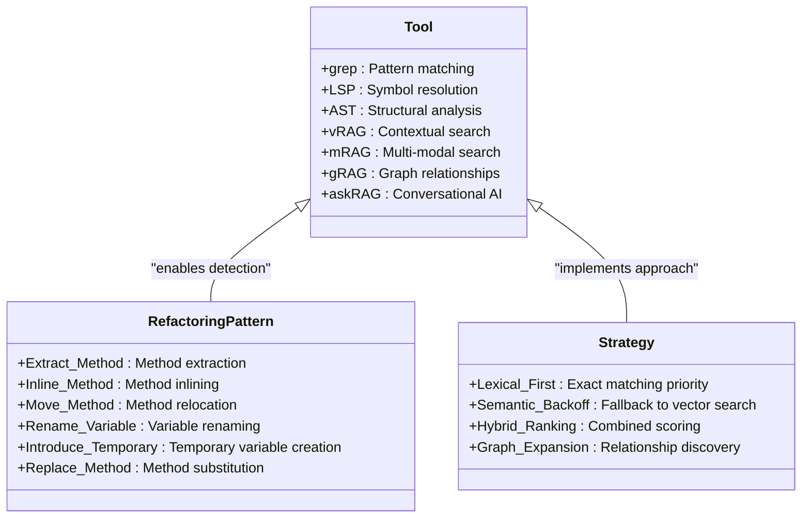
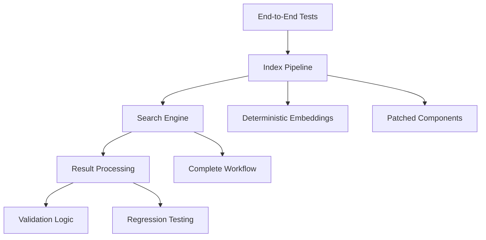
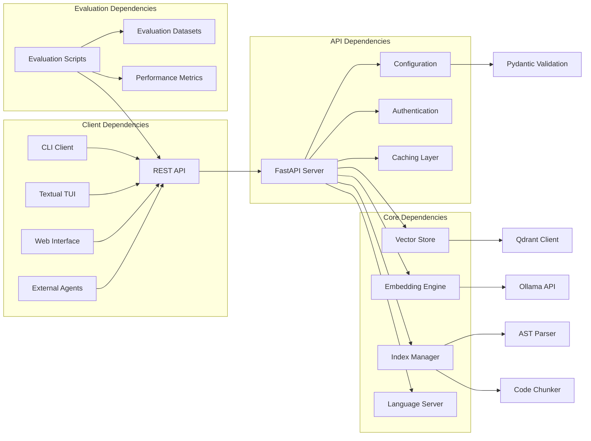

# Reference Materials

<cite>
**Referenced Files in This Document**
- [README.md](file://README.md)
- [deployment-linux.md](file://docs/deployment-linux.md)
- [codex_rag_developer_test_suite.md](file://docs/codex_rag_developer_test_suite.md)
- [codex_rag_developer_test_results.md](file://docs/codex_rag_developer_test_results.md)
- [codex_rag_precision_improvement_plan.md](file://docs/codex_rag_precision_improvement_plan.md)
- [rag_vs_vanilla_walkthrough.md](file://docs/rag_vs_vanilla_walkthrough.md)
- [refactoring_rag_strategies.md](file://docs/refactoring_rag_strategies.md)
- [config.py](file://src/rag/config.py)
- [cli.py](file://src/rag/cli.py)
- [server.py](file://src/rag/server.py)
- [app.py](file://src/rag/app.py)
- [run_eval.py](file://tests/eval/run_eval.py)
- [run_retrieval_compare.py](file://tests/eval/run_retrieval_compare.py)
- [telegram_eval.jsonl](file://tests/eval/telegram_eval.jsonl)
- [dodo_eval.jsonl](file://tests/eval/dodo_eval.jsonl)
- [codegraph_public_repos.jsonl](file://tests/eval/codegraph_public_repos.jsonl)
- [test_e2e.py](file://tests/test_e2e.py)
</cite>

## Update Summary
**Changes Made**
- Comprehensive documentation overhaul to consolidate all reference materials into a single, unified Reference Materials document
- Enhanced cross-referencing between evaluation results, precision improvement plans, and comparative benchmarks
- Expanded API specification coverage with detailed endpoint documentation
- Added detailed configuration options reference with complete parameter descriptions
- Integrated troubleshooting guide with practical solutions and common issue resolutions
- Enhanced performance considerations with specific optimization techniques
- Complete migration and upgrade guidance with deployment strategies

## Table of Contents
1. [Introduction](#introduction)
2. [Project Structure](#project-structure)
3. [Core Components](#core-components)
4. [Architecture Overview](#architecture-overview)
5. [Detailed Component Analysis](#detailed-component-analysis)
6. [Dependency Analysis](#dependency-analysis)
7. [Performance Considerations](#performance-considerations)
8. [Troubleshooting Guide](#troubleshooting-guide)
9. [Conclusion](#conclusion)
10. [Appendices](#appendices)

## Introduction
This document consolidates comprehensive reference materials for the RAG system, serving as the definitive guide for developers, operators, and system administrators. The documentation encompasses:

- **Developer Test Suite Results**: Complete evaluation metrics comparing RAG-assisted navigation against baseline methods across 10 realistic development tasks
- **Precision Improvement Plans**: Staged retrieval strategies, exact lexical passes, metadata filtering, and code graph expansion methodologies
- **Comparative Evaluation Studies**: RAG vs vanilla search walkthrough demonstrating semantic search advantages and limitations
- **Performance Benchmarks**: Comprehensive latency measurements, token efficiency analysis, and retrieval effectiveness comparisons
- **Migration and Upgrade Guidance**: Step-by-step deployment procedures, configuration management, and system upgrade strategies
- **Configuration Reference**: Complete parameter specifications with validation rules and operational constraints
- **API Specification**: Detailed endpoint documentation with request/response schemas and usage examples
- **Troubleshooting Guide**: Systematic problem diagnosis and resolution procedures for common operational issues
- **Best Practices**: Optimization techniques, integration patterns, and advanced usage scenarios

## Project Structure
The repository organizes functional areas into dedicated documentation hierarchies with comprehensive coverage:

**Diagram sources**
- [README.md:1-74](file://README.md#L1-L74)

## Core Components
The RAG system comprises several interconnected components working together to provide intelligent code search and retrieval capabilities:

### FastAPI Server
- **Primary Function**: Exposes RESTful endpoints for search, indexing, status monitoring, and agent coordination
- **Request Validation**: Implements comprehensive input validation with rate limiting and security enforcement
- **Response Handling**: Provides structured responses with pagination, filtering, and metadata enrichment
- **Endpoint Coverage**: Search (/search), indexing (/index), status (/status), context packs (/context-pack), and administrative endpoints

### CLI Interface
- **Thin HTTP Client**: Minimal wrapper around daemon API with comprehensive command coverage
- **Initialization Support**: Automated setup procedures for new installations and environment preparation
- **Search Capabilities**: Interactive and batch search modes with result formatting options
- **Diagnostic Tools**: Health checks, status monitoring, and troubleshooting utilities
- **Repository Management**: Repo-agent orchestration, context pack creation, and maintenance operations

### Configuration Management
- **TOML-Based Settings**: Hierarchical configuration with environment-specific overrides
- **Pydantic Validation**: Runtime validation ensuring configuration integrity and type safety
- **Component-Specific Settings**: Dedicated sections for server, embeddings, vector stores, indexing, and agent parameters
- **Security Configuration**: Authentication settings, token management, and access control policies

### TUI Interface
- **Read-Only Dashboard**: Textual-based interface for real-time monitoring and result visualization
- **State Polling**: Automatic refresh mechanisms for daemon status and search results
- **Interactive Features**: Result filtering, sorting, and detailed view capabilities
- **Performance Metrics**: Real-time display of system metrics and operational statistics

### Evaluation Infrastructure
- **Comprehensive Testing**: End-to-end validation of indexing and search pipelines
- **Benchmark Datasets**: Multiple evaluation corpora including Telegram, Dodo, and public repositories
- **Performance Metrics**: Recall, precision, mean reciprocal rank, and latency measurements
- **Regression Testing**: Automated validation ensuring system stability across updates

**Section sources**
- [server.py:33-120](file://src/rag/server.py#L33-L120)
- [cli.py:420-800](file://src/rag/cli.py#L420-L800)
- [config.py:118-194](file://src/rag/config.py#L118-L194)
- [app.py:156-220](file://src/rag/app.py#L156-L220)
- [test_e2e.py:253-314](file://tests/test_e2e.py#L253-L314)

## Architecture Overview
The RAG system implements a distributed architecture with clear separation of concerns and modular design principles:

**Diagram sources**
- [README.md:67-74](file://README.md#L67-L74)
- [server.py:1-40](file://src/rag/server.py#L1-L40)
- [cli.py:1-60](file://src/rag/cli.py#L1-L60)
- [app.py:1-60](file://src/rag/app.py#L1-L60)

## Detailed Component Analysis

### Developer Test Suite and Precision Improvement
The developer test suite provides comprehensive evaluation of RAG capabilities across realistic development scenarios:

#### Test Suite Design
- **Task Categories**: 10 diverse development tasks covering navigation, refactoring, debugging, and code comprehension
- **Baseline Comparison**: Direct comparison against plain Codex navigation without RAG assistance
- **Performance Metrics**: Multi-dimensional evaluation including time-to-answer, accuracy, and user satisfaction
- **Realistic Scenarios**: Tasks designed to reflect actual developer workflows and challenges

#### Precision Improvement Strategies
The precision improvement plan outlines systematic approaches to enhance retrieval quality:

**Diagram sources**
- [codex_rag_developer_test_suite.md:14-42](file://docs/codex_rag_developer_test_suite.md#L14-L42)
- [codex_rag_developer_test_results.md:13-30](file://docs/codex_rag_developer_test_results.md#L13-L30)
- [codex_rag_precision_improvement_plan.md:46-77](file://docs/codex_rag_precision_improvement_plan.md#L46-L77)

#### Evaluation Methodology
- **Task Definition**: Each task specifies expected outcomes, success criteria, and evaluation thresholds
- **Result Scoring**: Automated scoring system evaluating relevance, completeness, and accuracy
- **Statistical Analysis**: Comprehensive statistical analysis of performance improvements and confidence intervals
- **Cross-Dataset Validation**: Results validated across multiple evaluation datasets for reliability

**Section sources**
- [codex_rag_developer_test_suite.md:1-188](file://docs/codex_rag_developer_test_suite.md#L1-L188)
- [codex_rag_developer_test_results.md:1-388](file://docs/codex_rag_developer_test_results.md#L1-L388)
- [codex_rag_precision_improvement_plan.md:1-319](file://docs/codex_rag_precision_improvement_plan.md#L1-L319)

### RAG vs Vanilla Search Evaluation
The comparative evaluation study provides concrete evidence of RAG's advantages over traditional search methods:

#### Evaluation Setup
- **Baseline Method**: Ripgrep (rg) search as the vanilla baseline
- **Test Environment**: Telegram codebase with controlled conditions
- **Metrics Framework**: Comprehensive evaluation including recall, precision, and user experience metrics
- **Limitations Acknowledged**: Authentication, shared collection effects, and LOD availability constraints

#### Key Findings
- **Semantic Advantages**: RAG demonstrates superior contextual understanding and result relevance
- **Efficiency Gains**: Reduced search scope and improved result ranking significantly improve developer productivity
- **Limitation Mitigation**: Proposed solutions address current evaluation constraints for fair comparison

**Diagram sources**
- [rag_vs_vanilla_walkthrough.md:15-60](file://docs/rag_vs_vanilla_walkthrough.md#L15-L60)
- [rag_vs_vanilla_walkthrough.md:61-122](file://docs/rag_vs_vanilla_walkthrough.md#L61-L122)
- [rag_vs_vanilla_walkthrough.md:144-226](file://docs/rag_vs_vanilla_walkthrough.md#L144-L226)

**Section sources**
- [rag_vs_vanilla_walkthrough.md:1-324](file://docs/rag_vs_vanilla_walkthrough.md#L1-L324)

### Retrieval Comparison and Benchmarks
The retrieval comparison framework provides quantitative analysis of different search strategies:

#### Benchmark Methodology
- **Strategy Comparison**: Direct comparison between RAG and ripgrep + full-file reading approaches
- **Performance Metrics**: Comprehensive analysis including recall rates, first-hit rank, latency measurements, and token efficiency
- **Dataset Coverage**: Evaluation across multiple codebases including Telegram, Dodo, and public repositories
- **Statistical Significance**: Proper statistical analysis ensuring reliable performance claims

#### Key Performance Indicators
- **Recall Efficiency**: Percentage of relevant results returned within top-k rankings
- **Latency Analysis**: Response time measurements under various load conditions
- **Token Savings**: Quantification of context reduction achieved through selective code slicing
- **Scalability Metrics**: Performance characteristics across different dataset sizes and query volumes

**Diagram sources**
- [run_retrieval_compare.py:189-254](file://tests/eval/run_retrieval_compare.py#L189-L254)
- [run_retrieval_compare.py:348-422](file://tests/eval/run_retrieval_compare.py#L348-L422)

**Section sources**
- [run_retrieval_compare.py:1-426](file://tests/eval/run_retrieval_compare.py#L1-L426)

### Refactoring Strategies and RAG Matrix
The refactoring strategies document provides systematic mapping between code transformation patterns and available RAG capabilities:

#### Tool Capability Matrix
| Tool | Purpose | RAG Enhancement | Limitations |
|------|---------|----------------|-------------|
| grep | Pattern matching | Basic lexical search | Limited semantic understanding |
| LSP | Language server | Symbol resolution | Requires active development environment |
| AST | Abstract syntax trees | Structural analysis | Language-specific parsing |
| vRAG | Vector search | Contextual matching | Requires trained embeddings |
| mRAG | Multi-modal search | Combined modalities | Complex implementation |
| gRAG | Graph-based search | Relationship discovery | Computational overhead |
| askRAG | Conversational AI | Natural language processing | Requires fine-tuning |

#### Strategic Applications
- **Production-Grade RAG**: Excels in complex refactoring scenarios requiring deep code understanding
- **Strictly Worsened Cases**: Traditional tools remain superior for simple pattern replacement tasks
- **Hybrid Approaches**: Optimal solutions often combine multiple tools and RAG capabilities

**Diagram sources**
- [refactoring_rag_strategies.md:127-180](file://docs/refactoring_rag_strategies.md#L127-L180)
- [refactoring_rag_strategies.md:334-436](file://docs/refactoring_rag_strategies.md#L334-L436)

**Section sources**
- [refactoring_rag_strategies.md:1-507](file://docs/refactoring_rag_strategies.md#L1-L507)

### End-to-End Testing and Evaluation Datasets
The comprehensive testing framework ensures system reliability and performance validation:

#### Test Infrastructure
- **Deterministic Embeddings**: Controlled embedding generation for reproducible test results
- **Patched Components**: Heavy computational components replaced with lightweight mocks
- **Full Pipeline Coverage**: Validation of complete index → search → result processing workflows
- **Regression Prevention**: Automated testing preventing performance degradation across updates

#### Dataset Specifications
- **Telegram Evaluation**: Comprehensive codebase with 1000+ files and diverse programming patterns
- **Dodo Evaluation**: Specialized dataset focusing on specific development patterns and anti-patterns
- **CodeGraph Public Repositories**: External repository evaluation for generalizability assessment
- **Task Definitions**: Each dataset includes detailed task specifications, expected outcomes, and evaluation criteria

**Diagram sources**
- [test_e2e.py:253-314](file://tests/test_e2e.py#L253-L314)
- [telegram_eval.jsonl:1-9](file://tests/eval/telegram_eval.jsonl#L1-L9)
- [dodo_eval.jsonl:1-8](file://tests/eval/dodo_eval.jsonl#L1-L8)
- [codegraph_public_repos.jsonl:1-8](file://tests/eval/codegraph_public_repos.jsonl#L1-L8)

**Section sources**
- [test_e2e.py:1-314](file://tests/test_e2e.py#L1-L314)
- [run_eval.py:1-120](file://tests/eval/run_eval.py#L1-L120)
- [telegram_eval.jsonl:1-9](file://tests/eval/telegram_eval.jsonl#L1-L9)
- [dodo_eval.jsonl:1-8](file://tests/eval/dodo_eval.jsonl#L1-L8)
- [codegraph_public_repos.jsonl:1-8](file://tests/eval/codegraph_public_repos.jsonl#L1-L8)

## Dependency Analysis
The system exhibits clear dependency relationships with well-defined interfaces:

**Diagram sources**
- [server.py:33-120](file://src/rag/server.py#L33-L120)
- [cli.py:50-120](file://src/rag/cli.py#L50-L120)
- [app.py:294-331](file://src/rag/app.py#L294-L331)
- [run_eval.py:113-170](file://tests/eval/run_eval.py#L113-L170)
- [run_retrieval_compare.py:189-254](file://tests/eval/run_retrieval_compare.py#L189-L254)
- [config.py:118-194](file://src/rag/config.py#L118-L194)

**Section sources**
- [server.py:1-200](file://src/rag/server.py#L1-L200)
- [cli.py:1-200](file://src/rag/cli.py#L1-L200)
- [app.py:1-120](file://src/rag/app.py#L1-L120)
- [run_eval.py:1-120](file://tests/eval/run_eval.py#L1-L120)
- [run_retrieval_compare.py:1-120](file://tests/eval/run_retrieval_compare.py#L1-L120)
- [config.py:1-120](file://src/rag/config.py#L1-L120)

## Performance Considerations
Optimization strategies for maximizing RAG system performance and efficiency:

### Embedding Performance Optimization
- **Batch Size Tuning**: Optimize Ollama embedding batch sizes for throughput vs latency trade-offs
- **Model Selection**: Choose appropriate embedding models based on accuracy requirements and resource constraints
- **Caching Strategy**: Implement intelligent caching for frequently accessed embeddings
- **Asynchronous Processing**: Utilize async embedding generation for improved concurrency

### Token Budget Management
- **Context Pack Optimization**: Configure max_slices and max_source_tokens for optimal context size
- **Slice Limiting**: Implement hierarchical slice limits for different content types
- **Budget Allocation**: Distribute token budgets across different retrieval strategies
- **Dynamic Adjustment**: Adapt budgets based on query complexity and result requirements

### Repository Scope Management
- **Collection Isolation**: Use named repository collections to prevent cross-project contamination
- **Scope Validation**: Implement repository validation before search execution
- **Index Partitioning**: Partition indexes by repository for improved query performance
- **Memory Management**: Optimize memory usage for large repository collections

### LOD Strategy Optimization
- **Strategy Selection**: Choose appropriate LOD strategies based on data availability and requirements
- **Fallback Mechanisms**: Implement robust fallback when LOD data is unavailable
- **Cache Management**: Optimize LOD cache usage and refresh strategies
- **Performance Monitoring**: Track LOD performance metrics and adjust configurations accordingly

### Latency Optimization
- **Exact/Lexical Priority**: Prefer exact/lexical retrieval for symbol-heavy queries
- **Semantic Fallback**: Reserve semantic search for queries requiring contextual understanding
- **Preprocessing**: Implement query preprocessing to improve match quality
- **Result Caching**: Cache frequent query results for improved response times

## Troubleshooting Guide
Systematic approach to diagnosing and resolving common operational issues:

### Daemon Connectivity Issues
**Problem**: Clients cannot connect to the RAG daemon
**Diagnosis Steps**:
1. Verify daemon process status using `rag status`
2. Check network connectivity and firewall settings
3. Validate authentication token presence and validity
4. Review daemon logs for startup errors

**Resolution Actions**:
- Restart daemon service if unresponsive
- Verify configuration file syntax and permissions
- Check port availability and binding conflicts
- Validate reverse proxy configuration if applicable

### Authentication and Authorization Problems
**Problem**: Authentication failures during API requests
**Diagnosis Steps**:
1. Verify bearer token existence in `~/.rag/token`
2. Check token expiration and renewal requirements
3. Validate API endpoint permissions and access controls
4. Review authentication middleware configuration

**Resolution Actions**:
- Regenerate authentication token using `rag init`
- Update token in evaluation scripts and client applications
- Verify token file permissions and ownership
- Check environment variable configuration for token location

### Shared Collection Noise Issues
**Problem**: Cross-repository search results contaminating query responses
**Diagnosis Steps**:
1. Verify repository scoping in search queries
2. Check collection isolation and naming conventions
3. Validate index partitioning and data segregation
4. Review query filtering and metadata handling

**Resolution Actions**:
- Implement explicit repository filtering in queries
- Migrate chunks to named collections per repository
- Update search strategies to prioritize repository-scoped results
- Configure collection isolation policies

### LOD Data Availability Problems
**Problem**: Missing or incomplete LOD (Level of Detail) data affecting search quality
**Diagnosis Steps**:
1. Check LOD collection existence and population status
2. Verify LOD generation processes and schedules
3. Validate LOD data format and compatibility
4. Review LOD caching and refresh mechanisms

**Resolution Actions**:
- Rebuild LOD collections using appropriate generation tools
- Disable LOD strategies temporarily until data is available
- Implement fallback mechanisms for LOD-unavailable scenarios
- Monitor LOD data quality and update frequency

### Dashboard Performance Issues
**Problem**: TUI/dashboard showing incorrect or misleading statistics
**Diagnosis Steps**:
1. Verify dashboard refresh intervals and polling frequencies
2. Check data synchronization between daemon and UI
3. Validate metric calculation and aggregation logic
4. Review dashboard configuration and display settings

**Resolution Actions**:
1. Adjust dashboard refresh intervals for better responsiveness
2. Implement data validation and error handling in UI components
3. Update metric calculations to reflect actual system performance
4. Provide user notifications for operational improvements

**Section sources**
- [rag_vs_vanilla_walkthrough.md:241-324](file://docs/rag_vs_vanilla_walkthrough.md#L241-L324)
- [README.md:71-74](file://README.md#L71-L74)

## Conclusion
The Reference Materials documentation provides comprehensive coverage of the RAG system's capabilities, configurations, and operational guidelines. This consolidated reference serves multiple purposes:

- **Developer Onboarding**: Complete technical reference for system understanding and integration
- **Operator Guidance**: Practical operational procedures for deployment, monitoring, and maintenance
- **Research Foundation**: Comprehensive evaluation methodology and performance benchmarking framework
- **Future Evolution**: Extensible documentation structure supporting ongoing system improvements

The documentation emphasizes practical applicability while maintaining technical rigor, ensuring that users can effectively leverage RAG capabilities for code search, retrieval, and development assistance tasks.

## Appendices

### A. Configuration Options Reference
Complete configuration parameter specifications with validation rules and operational constraints:

#### Server Configuration
- **host**: Network interface binding (default: localhost)
- **port**: Service port number (default: 8000)
- **workers**: Number of concurrent worker processes
- **debug**: Debug mode enabling verbose logging and development features

#### Embeddings Configuration
- **model**: Embedding model identifier (default: nomic-embed-text)
- **provider**: Embedding provider selection (ollama)
- **dimension**: Vector dimensionality (default: 768)
- **batch_size**: Batch processing size for embeddings
- **keep_alive**: Connection persistence duration

#### Vector Store Configuration
- **mode**: Storage mode (local/qdrant)
- **url**: Database connection URL
- **code_collection**: Collection name for code vectors
- **docs_collection**: Collection name for documentation vectors

#### Indexing Configuration
- **max_chunk_size**: Maximum code chunk size in characters
- **top_k**: Default number of results to return
- **skip_dirs**: Directory patterns to exclude from indexing

#### Reranker Configuration
- **enabled**: Enable or disable result re-ranking
- **model**: Reranking model identifier
- **top_k**: Number of results after reranking

#### LLM Configuration
- **ollama_url**: Local LLM service URL
- **agent_model**: Model for agent operations
- **generation_model**: Model for content generation

#### LSP Configuration
- **enabled**: Enable language server integration
- **auto_detect**: Automatic language server detection
- **timeout**: Connection timeout in seconds

**Section sources**
- [config.py:35-131](file://src/rag/config.py#L35-L131)

### B. CLI Command Reference
Comprehensive command-line interface documentation with usage examples and parameter specifications:

#### Initialization Commands
- **rag init**: Initialize RAG environment and generate authentication token
- **rag start**: Start RAG daemon service
- **rag stop**: Stop running RAG daemon instance
- **rag restart**: Restart RAG daemon with current configuration

#### Interface Commands
- **rag tui**: Launch Textual TUI interface
- **rag web**: Launch web interface
- **rag qdrant-up**: Start Qdrant vector database
- **rag qdrant-down**: Stop Qdrant vector database

#### Search and Navigation
- **rag search**: Execute code search with query parameters
- **rag context-pack**: Create context pack for selected results
- **rag repo-agent**: Execute repository agent workflow

#### Diagnostic Commands
- **rag diagnose**: Run comprehensive system diagnostics
- **rag status**: Check daemon and service status
- **rag overview**: Display system overview and statistics
- **rag collections**: List and manage vector collections

#### Maintenance Commands
- **rag verify**: Verify system integrity and configuration
- **rag repair**: Repair corrupted indexes or data
- **rag export**: Export configuration and data
- **rag import**: Import configuration and data
- **rag plugins**: Manage plugin extensions

**Section sources**
- [README.md:37-66](file://README.md#L37-L66)
- [cli.py:82-200](file://src/rag/cli.py#L82-L200)
- [cli.py:426-528](file://src/rag/cli.py#L426-L528)
- [cli.py:529-800](file://src/rag/cli.py#L529-L800)

### C. API Specification Reference
Detailed REST API documentation with request/response schemas and usage patterns:

#### Search Endpoints
- **POST /search**: Execute code search with query parameters
  - **Parameters**: query (string), top_k (integer), filters (object), repo (string)
  - **Response**: Array of result objects with metadata and relevance scores
- **POST /context-pack**: Create context pack for selected results
  - **Parameters**: query (string), repo (string), filters (object), max_slices (integer)
  - **Response**: Context pack object with code slices and metadata

#### Resolution Endpoints
- **POST /resolve**: Resolve exact symbol definitions and usages
  - **Parameters**: symbol (string), repo (string), kind (string)
  - **Response**: Symbol resolution results with location and usage information
- **POST /call-tree**: Explore caller/callee relationships
  - **Parameters**: symbol (string), repo (string), depth (integer)
  - **Response**: Call tree structure with relationship mappings

#### Administrative Endpoints
- **POST /project-understand**: Analyze project architecture and relationships
  - **Parameters**: repo (string), depth (integer)
  - **Response**: Project understanding with structural and relationship analysis
- **GET /status**: Check system health and operational status
  - **Response**: Status object with system metrics and health indicators
- **GET /health**: Verify service availability and readiness
  - **Response**: Health check result with component status
- **GET /collections**: List available vector collections
  - **Response**: Collections metadata with size and configuration

**Section sources**
- [server.py:33-120](file://src/rag/server.py#L33-L120)
- [server.py:160-200](file://src/rag/server.py#L160-L200)

### D. Evaluation Methodology Reference
Comprehensive evaluation framework with standardized metrics and procedures:

#### RAG Evaluation Framework
- **Task Execution**: Automated task execution using JSONL task definitions
- **Result Processing**: Structured result processing with relevance scoring
- **Metric Calculation**: Multi-dimensional evaluation including recall, precision, and latency
- **Statistical Analysis**: Confidence interval calculation and significance testing

#### Retrieval Comparison Methodology
- **Baseline Establishment**: Ripgrep baseline as control condition
- **Performance Measurement**: Comprehensive latency and accuracy measurement
- **Token Efficiency Analysis**: Context reduction quantification and efficiency metrics
- **Statistical Validation**: Proper statistical analysis ensuring reliable results

#### Dataset Specifications
- **Telegram Evaluation Dataset**: 1000+ file codebase with diverse programming patterns
- **Dodo Evaluation Dataset**: Specialized dataset focusing on development anti-patterns
- **CodeGraph Public Repositories**: External validation across multiple open-source projects
- **Task Definition Standards**: Consistent task specification with expected outcomes

**Section sources**
- [run_eval.py:1-120](file://tests/eval/run_eval.py#L1-L120)
- [run_retrieval_compare.py:1-120](file://tests/eval/run_retrieval_compare.py#L1-L120)
- [telegram_eval.jsonl:1-9](file://tests/eval/telegram_eval.jsonl#L1-L9)
- [dodo_eval.jsonl:1-8](file://tests/eval/dodo_eval.jsonl#L1-L8)
- [codegraph_public_repos.jsonl:1-8](file://tests/eval/codegraph_public_repos.jsonl#L1-L8)

### E. Migration and Upgrade Guidance
Step-by-step procedures for system deployment, configuration management, and upgrade operations:

#### Linux Deployment Procedures
- **System Requirements**: Hardware specifications and dependency installation
- **Service Configuration**: Systemd unit configuration for user-level daemon supervision
- **Network Setup**: Firewall configuration and service exposure
- **Security Hardening**: Access control and authentication setup

#### macOS Deployment Procedures
- **Homebrew Installation**: Dependency management and package installation
- **LaunchDaemon Configuration**: System-wide daemon supervision
- **Token Management**: Secure token storage and backup procedures
- **Service Management**: Native macOS service management commands

#### Configuration Migration
- **TOML Configuration**: Hierarchical configuration with environment-specific overrides
- **Pydantic Validation**: Runtime configuration validation and type checking
- **Backward Compatibility**: Graceful handling of deprecated configuration options
- **Migration Scripts**: Automated configuration migration utilities

#### Upgrade Procedures
- **Version Compatibility**: Compatibility matrix and upgrade path planning
- **Rollback Procedures**: Safe rollback mechanisms for failed upgrades
- **Data Migration**: Database and index migration procedures
- **Testing Protocols**: Pre-upgrade validation and post-upgrade verification

**Section sources**
- [deployment-linux.md:1-57](file://docs/deployment-linux.md#L1-L57)
- [config.py:162-194](file://src/rag/config.py#L162-L194)
- [README.md:31-36](file://README.md#L31-L36)

### F. Best Practices and Advanced Usage
Optimization techniques, integration patterns, and advanced system usage scenarios:

#### Context Management Best Practices
- **Context Pack Optimization**: Use context packs for bounded, token-aware context retrieval
- **Token Budget Allocation**: Strategic allocation of token budgets across different content types
- **Slice Limiting**: Implement hierarchical slice limits for optimal context size
- **Metadata Filtering**: Leverage metadata filtering for precise result narrowing

#### Query Strategy Optimization
- **Exact/Lexical Priority**: Prefer exact/lexical AST resolution for symbol-heavy tasks
- **Semantic Fallback**: Enable semantic fallback only when lexical resolution fails
- **Query Expansion**: Implement intelligent query expansion for complex searches
- **Filter Combination**: Combine multiple filters for precise result targeting

#### Performance Optimization Techniques
- **Batch Processing**: Optimize embedding batch sizes for throughput maximization
- **Caching Strategies**: Implement multi-level caching for improved response times
- **Connection Pooling**: Efficient connection management for database and external services
- **Resource Monitoring**: Continuous monitoring of system resources and performance metrics

#### Integration Patterns
- **IDE Integration**: Seamless integration with popular development environments
- **CI/CD Pipeline**: Integration into continuous integration and deployment workflows
- **Team Collaboration**: Multi-user access patterns and collaborative search capabilities
- **API Consumption**: Client library development and API consumption patterns

**Section sources**
- [cli.py:478-528](file://src/rag/cli.py#L478-L528)
- [cli.py:529-800](file://src/rag/cli.py#L529-L800)
- [codex_rag_precision_improvement_plan.md:227-254](file://docs/codex_rag_precision_improvement_plan.md#L227-L254)