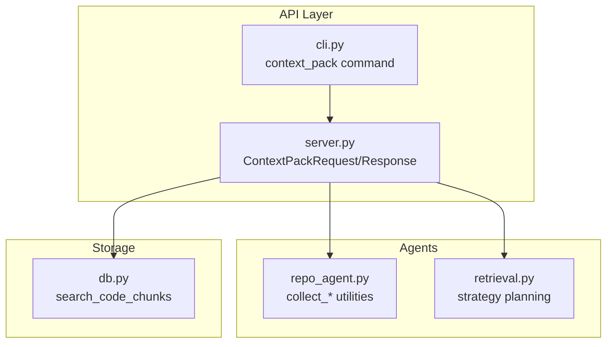
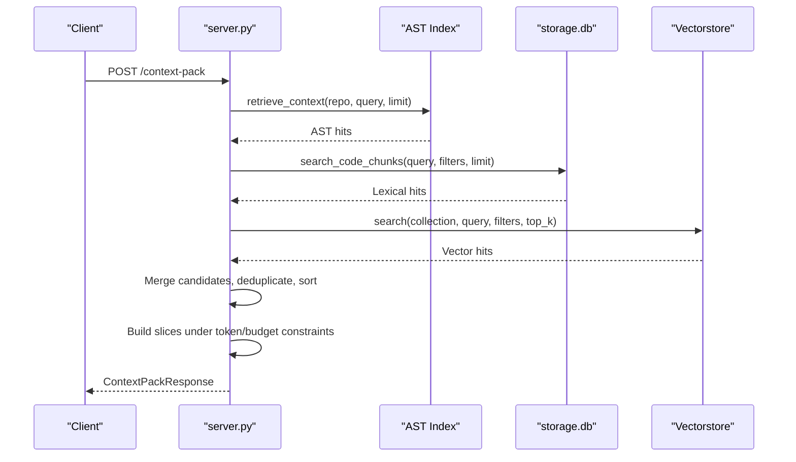
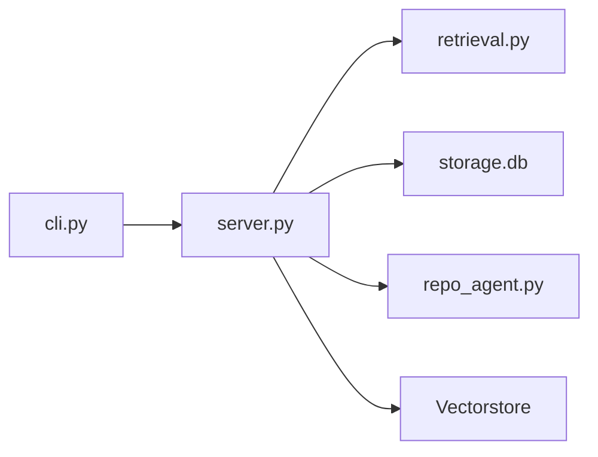

# Context Pack Construction

<cite>
**Referenced Files in This Document**
- [server.py](file://src/rag/server.py)
- [cli.py](file://src/rag/cli.py)
- [repo_agent.py](file://src/rag/agents/repo_agent.py)
- [retrieval.py](file://src/rag/agents/retrieval.py)
- [db.py](file://src/rag/storage/db.py)
- [test_routes.py](file://tests/test_routes.py)
</cite>

## Table of Contents
1. [Introduction](#introduction)
2. [Project Structure](#project-structure)
3. [Core Components](#core-components)
4. [Architecture Overview](#architecture-overview)
5. [Detailed Component Analysis](#detailed-component-analysis)
6. [Dependency Analysis](#dependency-analysis)
7. [Performance Considerations](#performance-considerations)
8. [Troubleshooting Guide](#troubleshooting-guide)
9. [Conclusion](#conclusion)

## Introduction
This document explains how the system constructs context packs for user queries and AI assistance. It covers the aggregation of search results, token budgeting, result merging strategies, and formatting for presentation. It also documents how different search strategies are integrated, how results from multiple sources are coordinated, and how prioritization ensures relevant information is included first. Examples illustrate composition for different query types and user scenarios, along with formatting options, metadata inclusion, and performance optimization techniques.

## Project Structure
The context pack pipeline spans several modules:
- HTTP API and request/response models for context pack construction
- CLI command for local invocation
- Agent utilities for collecting and organizing evidence from context packs
- Retrieval planning for strategy selection
- Storage layer for exact/lexical matches
- Tests validating bounded token usage and AST-driven inclusion

**Diagram sources**
- [server.py](file://src/rag/server.py)
- [cli.py](file://src/rag/cli.py)
- [repo_agent.py](file://src/rag/agents/repo_agent.py)
- [retrieval.py](file://src/rag/agents/retrieval.py)
- [db.py](file://src/rag/storage/db.py)

**Section sources**
- [server.py](file://src/rag/server.py)
- [cli.py](file://src/rag/cli.py)

## Core Components
- ContextPackRequest: Defines input parameters for context pack construction, including query, repository scope, filters, slice limits, token budgets, and toggles for AST index and semantic inclusion.
- ContextPackResponse: Encapsulates the assembled context pack with slices, totals, and latency metrics.
- CLI context_pack: Provides a command-line interface to request and render context packs locally with token and slice constraints.
- Agent utilities: Collect top files, tests, and modules from packs for downstream reporting and reuse.
- Retrieval planner: Determines strategy selection based on query keywords and filters.
- Exact/lexical storage: Supplies precise symbol/file/string matches from SQLite-backed chunk storage.
- Vectorstore integration: Supplies semantic matches as fallback when exact coverage is insufficient.

**Section sources**
- [server.py](file://src/rag/server.py)
- [cli.py](file://src/rag/cli.py)
- [repo_agent.py](file://src/rag/agents/repo_agent.py)
- [retrieval.py](file://src/rag/agents/retrieval.py)
- [db.py](file://src/rag/storage/db.py)

## Architecture Overview
The context pack assembly follows a multi-source, token-aware pipeline:
- Optional AST index retrieval for named repositories
- Exact/lexical chunk retrieval from storage
- Optional semantic vector search to fill gaps
- Candidate ranking by score
- Slice assembly respecting max_slices and max_source_tokens
- Overlap avoidance and citation generation
- Response packaging with metadata and timing

**Diagram sources**
- [server.py](file://src/rag/server.py)
- [db.py](file://src/rag/storage/db.py)

## Detailed Component Analysis

### ContextPackRequest and ContextPackResponse
- Request fields:
  - query: user query string with length constraints
  - repo: optional repository name to scope search
  - filters: optional filter dictionary for narrowing results
  - max_slices: upper bound on number of slices
  - max_source_tokens: token budget for source content
  - use_ast_index: enable AST-driven symbol/file retrieval for named repos
  - include_semantic: include semantic vector search when exact coverage is insufficient
- Response fields:
  - query, repo, slices, total, total_source_tokens, latency_ms

These models define the contract for assembling and returning context packs.

**Section sources**
- [server.py](file://src/rag/server.py)

### CLI context_pack Command
- Accepts query, optional repo, max_slices, max_source_tokens, and toggles for AST index and semantic inclusion
- Sends a POST to the /context-pack endpoint
- Prints a human-readable summary of the resulting slices, including file paths, lines, reasons for inclusion, names, scores, and token estimates

This command is useful for local testing and debugging.

**Section sources**
- [cli.py](file://src/rag/cli.py)

### Strategy Planning for Search Coordination
- Strategy detection considers query keywords to select among:
  - lod_drill: hierarchical drill-down through LOD collections
  - filtered: filtered search
  - graph_walk: graph traversal for call/use/dependency chains
  - aggregate: counting/statistics queries
  - global: module-level summaries
  - naive: exact/raw search (alias for hybrid)
- Strategy selection influences how subsequent retrieval is executed

This coordination ensures appropriate search modes for different query intents.

**Section sources**
- [retrieval.py](file://src/rag/agents/retrieval.py)

### Exact/Lexical Retrieval via Storage
- Uses storage.search_code_chunks to find exact or lexical matches
- Limits are scaled by max_slices to ensure sufficient candidates
- Adds why_included metadata indicating exact_or_lexical_match

This provides deterministic, precise matches as the foundation of the pack.

**Section sources**
- [server.py](file://src/rag/server.py)
- [db.py](file://src/rag/storage/db.py)

### Semantic Retrieval Fallback
- When exact coverage is insufficient and include_semantic is enabled, performs vector search
- Merges vector hits into candidates with why_included set to semantic_match
- Uses token estimates and citations for each hit

This augments exact matches with semantically relevant content.

**Section sources**
- [server.py](file://src/rag/server.py)

### Candidate Merging, Deduplication, and Ranking
- Deduplicates candidates using a composite key built from file_path, line range, chunk_type, and name
- Sorts candidates by score in descending order
- Builds slices while enforcing:
  - max_slices cap
  - max_source_tokens budget
  - Overlap avoidance between slices
- Computes token totals and returns a structured response

This ensures high-quality, non-redundant packs within budget.

**Section sources**
- [server.py](file://src/rag/server.py)

### Evidence Collection Utilities
- collect_top_files: aggregates top files across packs, tracking first occurrence rank, slice count, and max score
- collect_tests: collects test-related slices from packs, avoiding duplicates
- collect_modules: compacts module-level understanding data for presentation
- compact_slice: reduces server-side slice to stable report fields

These utilities support downstream reporting and reuse of context pack evidence.

**Section sources**
- [repo_agent.py](file://src/rag/agents/repo_agent.py)

### Token Limit Management and Prioritization
- Token estimation per candidate enables budget-aware selection
- Prioritization by score ensures most relevant content is included first
- Overlap checks prevent redundant inclusion of overlapping code spans
- Budget enforcement stops slice addition once either max_slices or max_source_tokens is reached

This guarantees efficient use of token budgets while preserving relevance.

**Section sources**
- [server.py](file://src/rag/server.py)

### Integration Between Strategies and Results
- Strategy selection influences downstream retrieval:
  - lod_drill coordinates hierarchical steps (modules → files → chunks)
  - global focuses on module summaries
  - filtered applies repository-scoped filters
- Context pack assembly remains strategy-agnostic, consuming unified results from various strategies

This separation allows flexible retrieval strategies while maintaining consistent packaging.

**Section sources**
- [retrieval.py](file://src/rag/agents/retrieval.py)
- [server.py](file://src/rag/server.py)

### Examples of Context Pack Composition

- Example 1: Symbol-focused query in a named repository
  - use_ast_index enabled
  - AST index yields symbol and usage slices
  - why_included reflects AST-driven inclusion
  - Token budget respected; slices selected by score

- Example 2: Exact/lexical match query with bounded tokens
  - include_semantic disabled
  - storage.search_code_chunks supplies exact matches
  - why_included marked as exact_or_lexical_match
  - total_source_tokens ≤ configured budget

- Example 3: Semantic gap filling
  - include_semantic enabled and exact matches insufficient
  - vector search adds semantically relevant slices
  - why_included marked as semantic_match

These examples demonstrate how different query types and user preferences shape the final pack.

**Section sources**
- [test_routes.py](file://tests/test_routes.py)

### Formatting Options, Metadata, and Presentation
- Slice metadata includes:
  - file_path, lines, name, chunk_type
  - why_included (reason for inclusion)
  - score, token_estimate, citation
- CLI rendering displays:
  - file path and line range
  - reason for inclusion and chunk type
  - name, score, and token estimate
  - preview of code lines (limited for readability)

This ensures clarity and traceability for users and AI assistants.

**Section sources**
- [server.py](file://src/rag/server.py)
- [cli.py](file://src/rag/cli.py)

## Dependency Analysis
The context pack assembly depends on:
- Request/response models for API boundary
- CLI for local invocation
- Storage for exact/lexical matches
- Vectorstore for semantic augmentation
- Agent utilities for downstream evidence extraction
- Retrieval planner for strategy selection

**Diagram sources**
- [cli.py](file://src/rag/cli.py)
- [server.py](file://src/rag/server.py)
- [retrieval.py](file://src/rag/agents/retrieval.py)
- [db.py](file://src/rag/storage/db.py)
- [repo_agent.py](file://src/rag/agents/repo_agent.py)

**Section sources**
- [server.py](file://src/rag/server.py)
- [cli.py](file://src/rag/cli.py)
- [retrieval.py](file://src/rag/agents/retrieval.py)
- [db.py](file://src/rag/storage/db.py)
- [repo_agent.py](file://src/rag/agents/repo_agent.py)

## Performance Considerations
- Candidate scaling: limits for lexical and semantic retrieval are increased relative to max_slices to improve coverage before filtering
- Deduplication: composite keys prevent redundant inclusion, reducing downstream processing overhead
- Early termination: loop exits when either max_slices or max_source_tokens is reached
- Overlap checks: avoid reprocessing overlapping slices
- Token estimation: per-candidate estimates enable budget-aware selection without rescoring
- Strategy gating: for repository-scoped searches, certain strategies switch to hybrid to stay within scoped collections

These measures optimize throughput and memory usage during large aggregations.

**Section sources**
- [server.py](file://src/rag/server.py)

## Troubleshooting Guide
Common issues and remedies:
- Excessive token usage:
  - Reduce max_source_tokens or max_slices
  - Verify token estimates and overlap avoidance are functioning
- Empty or sparse packs:
  - Enable include_semantic to add vector search fallback
  - Adjust filters or query phrasing for better lexical matches
- Duplicate or overlapping slices:
  - Confirm deduplication and overlap checks are active
- AST index failures:
  - use_ast_index is logged and skipped on exceptions; disable it if repository lacks AST index
- Authentication or connectivity errors:
  - CLI handles connection loss and HTTP errors; retry after resolving network/auth issues

Validation tests:
- Bounded token usage and exact match inclusion are validated by tests
- AST-driven inclusion is verified for named repositories

**Section sources**
- [server.py](file://src/rag/server.py)
- [test_routes.py](file://tests/test_routes.py)

## Conclusion
The context pack construction pipeline integrates exact/lexical, semantic, and AST-driven sources into a single, token-aware bundle. Strategy-aware retrieval is coordinated at the API level, while the pack builder enforces strict budget constraints and prioritizes relevance. The result is a compact, well-formatted set of evidence suitable for both user consumption and AI assistance, with robust controls for performance and reliability.