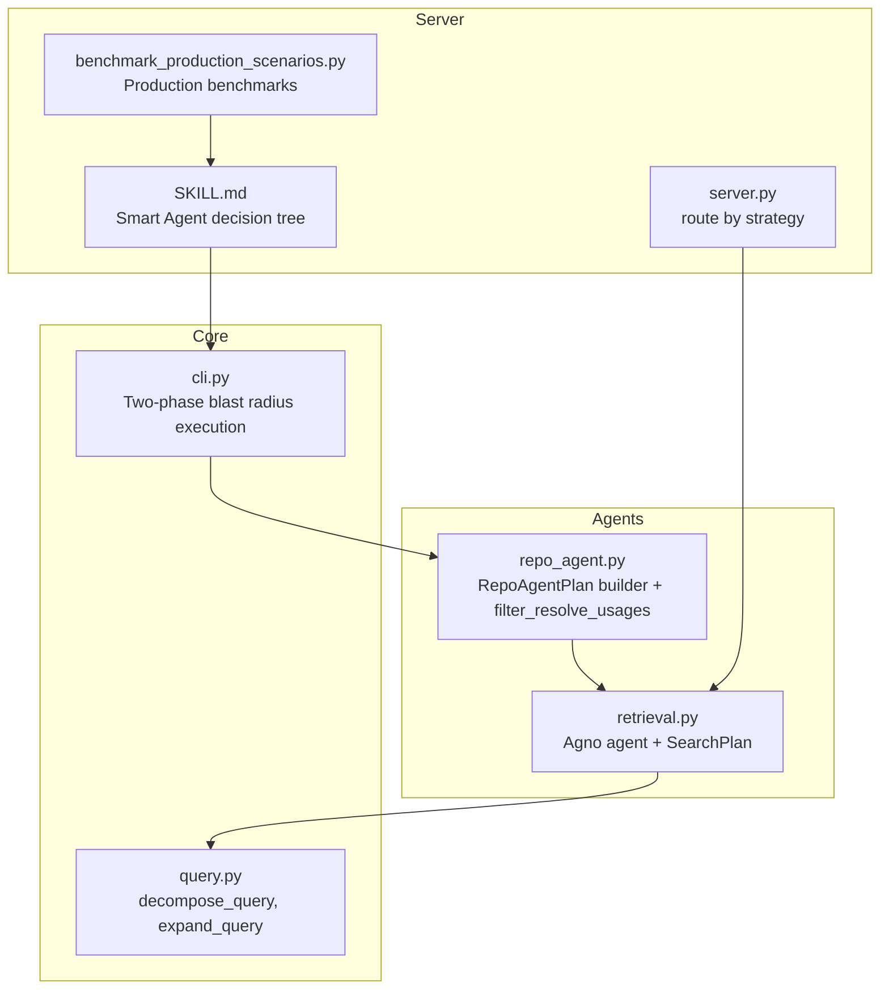
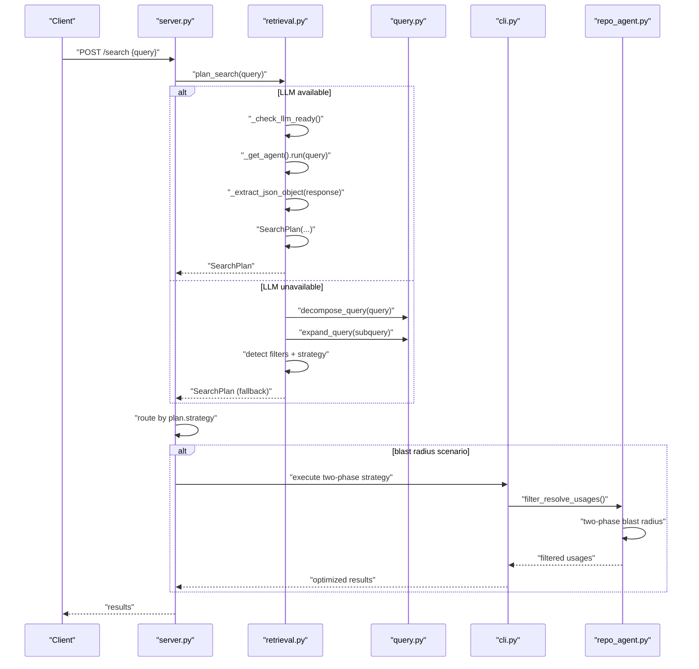
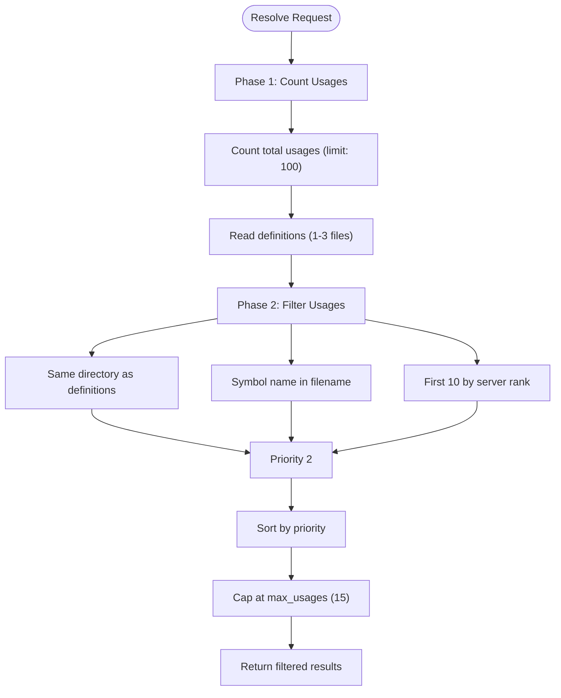
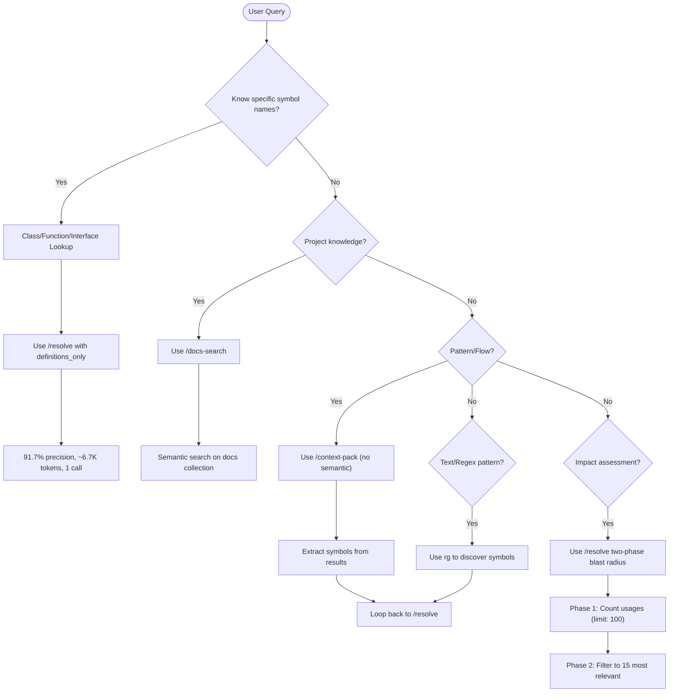
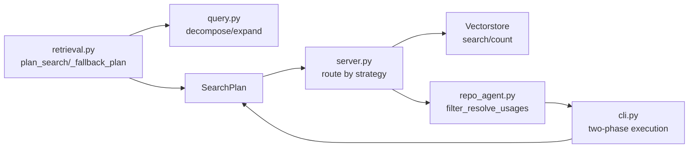

# Query Planning and Strategy Selection

<cite>
**Referenced Files in This Document**
- [retrieval.py](file://src/rag/agents/retrieval.py)
- [repo_agent.py](file://src/rag/agents/repo_agent.py)
- [server.py](file://src/rag/server.py)
- [query.py](file://src/rag/core/query.py)
- [cli.py](file://src/rag/cli.py)
- [SKILL.md](file://skills/rag-smart-retrieval/SKILL.md)
- [benchmark_production_scenarios.py](file://benchmark_production_scenarios.py)
- [test_agent.py](file://tests/test_agent.py)
- [test_query.py](file://tests/test_query.py)
</cite>

## Update Summary
**Changes Made**
- Added comprehensive documentation for the two-phase blast radius strategy with `filter_resolve_usages()` function
- Enhanced Smart Agent skill decision tree with production-ready methodologies
- Documented the comprehensive benchmarking framework for production scenarios
- Updated strategy selection criteria to include blast radius analysis capabilities
- Added new retrieval strategies and production-ready methodologies

## Table of Contents
1. [Introduction](#introduction)
2. [Project Structure](#project-structure)
3. [Core Components](#core-components)
4. [Architecture Overview](#architecture-overview)
5. [Detailed Component Analysis](#detailed-component-analysis)
6. [Two-Phase Blast Radius Strategy](#two-phase-blast-radius-strategy)
7. [Smart Agent Decision Tree](#smart-agent-decision-tree)
8. [Benchmarking Framework](#benchmarking-framework)
9. [Dependency Analysis](#dependency-analysis)
10. [Performance Considerations](#performance-considerations)
11. [Troubleshooting Guide](#troubleshooting-guide)
12. [Conclusion](#conclusion)

## Introduction
This document explains the query planning and strategy selection functionality used by the Agno retrieval agent to make intelligent decisions for natural language search. It covers how the SearchPlan data structure encapsulates query decomposition, filtering, and strategy selection; how fallback works when LLM services are unavailable; and how simple query expansion is applied. The system now includes advanced blast radius analysis capabilities, a comprehensive Smart Agent decision tree, and production-ready benchmarking methodologies that optimize for precision, token efficiency, and performance.

## Project Structure
The query planning and strategy selection logic spans four primary areas:
- Retrieval agent and plan parsing/fallback
- Query expansion and decomposition utilities
- Server routing and strategy execution
- Two-phase blast radius analysis and Smart Agent orchestration

**Diagram sources**
- [retrieval.py:203-303](file://src/rag/agents/retrieval.py#L203-L303)
- [query.py:30-60](file://src/rag/core/query.py#L30-L60)
- [repo_agent.py:195-252](file://src/rag/agents/repo_agent.py#L195-L252)
- [cli.py:566-611](file://src/rag/cli.py#L566-L611)
- [server.py:1371-1417](file://src/rag/server.py#L1371-L1417)
- [SKILL.md:14-37](file://skills/rag-smart-retrieval/SKILL.md#L14-L37)
- [benchmark_production_scenarios.py:1-12](file://benchmark_production_scenarios.py#L1-L12)

**Section sources**
- [retrieval.py:203-303](file://src/rag/agents/retrieval.py#L203-L303)
- [query.py:30-60](file://src/rag/core/query.py#L30-L60)
- [repo_agent.py:195-252](file://src/rag/agents/repo_agent.py#L195-L252)
- [cli.py:566-611](file://src/rag/cli.py#L566-L611)
- [server.py:1371-1417](file://src/rag/server.py#L1371-L1417)
- [SKILL.md:14-37](file://skills/rag-smart-retrieval/SKILL.md#L14-L37)
- [benchmark_production_scenarios.py:1-12](file://benchmark_production_scenarios.py#L1-L12)

## Core Components
- Agno retrieval agent plan: Parses structured JSON from the agent to produce a SearchPlan, with robust extraction from varied LLM outputs.
- Fallback mechanism: When LLM is unavailable, the system performs query decomposition and expansion, detects filters and strategy signals, and builds a SearchPlan.
- SearchPlan: Encapsulates the planned queries, sanitized filters, selected strategy, and top-k.
- Filter validation and sanitization: Whitelist-based validation for allowed filter values; unknown fields pass through.
- Query expansion and decomposition: Utilities to split and enrich queries for broader coverage.
- Strategy routing: Server routes execution based on the chosen strategy and applies graceful degradations.
- Two-phase blast radius analysis: Advanced usage filtering with directory-aware prioritization and server-ranked selection.
- Smart Agent decision tree: Production-ready methodology for optimal tool selection and resource utilization.

**Section sources**
- [retrieval.py:203-303](file://src/rag/agents/retrieval.py#L203-L303)
- [retrieval.py:40-71](file://src/rag/agents/retrieval.py#L40-L71)
- [query.py:30-60](file://src/rag/core/query.py#L30-L60)
- [server.py:1371-1417](file://src/rag/server.py#L1371-L1417)
- [repo_agent.py:195-252](file://src/rag/agents/repo_agent.py#L195-L252)
- [SKILL.md:14-37](file://skills/rag-smart-retrieval/SKILL.md#L14-L37)

## Architecture Overview
The system orchestrates natural language queries through an agent-driven plan, falling back to a simple expansion-and-strategy detector when LLM services are unavailable. The server then executes the plan using appropriate retrieval strategies, with advanced blast radius analysis for impact assessment scenarios.

**Diagram sources**
- [server.py:1371-1417](file://src/rag/server.py#L1371-L1417)
- [retrieval.py:203-303](file://src/rag/agents/retrieval.py#L203-L303)
- [query.py:30-60](file://src/rag/core/query.py#L30-L60)
- [cli.py:566-611](file://src/rag/cli.py#L566-L611)
- [repo_agent.py:195-252](file://src/rag/agents/repo_agent.py#L195-L252)

## Detailed Component Analysis

### SearchPlan data structure and construction
SearchPlan is produced either by parsing the Agno agent's JSON output or by the fallback logic. It carries:
- queries: list of query strings (original and expanded)
- filters: sanitized dictionary of filters
- strategy: strategy type string
- top_k: integer for result limits

Key behaviors:
- JSON extraction supports fenced blocks, raw text, and balanced object spans.
- On parse failure or missing content, the fallback path is taken.
- Fallback builds queries via decomposition and expansion, detects filters and strategy, and returns a SearchPlan.

Practical implications:
- The presence of filters steers the planner toward filtered strategies.
- Strategy signals in the query (e.g., "calls", "flow") override defaults.
- The system now supports blast radius analysis for impact assessment scenarios.

**Section sources**
- [retrieval.py:203-303](file://src/rag/agents/retrieval.py#L203-L303)
- [retrieval.py:169-200](file://src/rag/agents/retrieval.py#L169-L200)

### Fallback mechanism and simple query expansion
When LLM is unavailable, the system:
- Decomposes the query into sub-queries
- Expands each sub-query to capture semantically related terms
- Detects filters implicitly from the query (e.g., language, pattern, complexity)
- Selects a strategy based on keywords and intent

Strategy detection rules:
- Default: lod_drill
- filtered: when filters are detected
- graph_walk: when the query mentions calls/uses/depends/flow/chain/trace
- aggregate: when the query asks counts/statistics/how many/all patterns
- global: when the query seeks overview/summary/architecture/main purpose/module
- naive: historically vector without rerank; now treated as hybrid alias

Filter detection and sanitization:
- Filters are extracted heuristically from the query text
- Unknown fields pass through; known fields are validated against a whitelist
- Lists are sanitized to keep only allowed values

**Section sources**
- [retrieval.py:243-303](file://src/rag/agents/retrieval.py#L243-L303)
- [retrieval.py:40-71](file://src/rag/agents/retrieval.py#L40-L71)
- [query.py:30-60](file://src/rag/core/query.py#L30-L60)

### Strategy types and selection criteria
Supported strategies:
- lod_drill: hierarchical drill-down through LOD collections; gracefully degrades to hybrid when LOD data is absent
- hybrid: flat vector search across code collection
- filtered: applies validated filters to retrieval
- graph_walk: focuses on call/use/dependency relationships
- aggregate: retrieves to compute counts/statistics
- global: broad overview/search across modules
- naive: historical alias for "vector only"; maintained for plan compatibility

Selection criteria:
- Default is lod_drill
- Presence of filters selects filtered
- Keywords select graph_walk, aggregate, global
- Exact/raw search keywords select naive

**Section sources**
- [retrieval.py:283-298](file://src/rag/agents/retrieval.py#L283-L298)
- [server.py:1371-1417](file://src/rag/server.py#L1371-L1417)

### Filter validation, sanitization, and whitelist system
Allowed filter values are defined in a whitelist mapping. Validation rules:
- Only keys present in the whitelist are validated
- Unknown keys pass through unmodified
- For list/tuple/set values, only allowed strings are kept; invalid entries are dropped and logged
- Single-item lists are normalized to scalars

This ensures safe and predictable filtering while allowing flexible ad-hoc fields.

**Section sources**
- [retrieval.py:33-71](file://src/rag/agents/retrieval.py#L33-L71)

### Practical examples of query planning scenarios
- Find Python singletons
  - Fallback detects language filter and selects filtered strategy
  - Queries are expanded to capture related terms
- Show complex functions
  - Fallback detects complexity filter and selects filtered strategy
- What calls the login function
  - Fallback selects graph_walk due to "calls"
- How many patterns exist
  - Fallback selects aggregate due to "how many"
- Find auth code
  - Fallback expands "auth" to include related terms (e.g., authentication, jwt)
- Overview of module structure
  - Fallback selects global due to "overview/summary"
- Impact assessment scenarios
  - Two-phase blast radius analysis for "what breaks if I change X?"

These examples are validated by tests that assert strategy and filter detection, as well as query expansion behavior.

**Section sources**
- [test_agent.py:12-47](file://tests/test_agent.py#L12-L47)
- [test_query.py:15-42](file://tests/test_query.py#L15-L42)

### Server-side routing and graceful degradation
The server routes execution based on the strategy:
- For certain strategies and repositories, the server may switch to hybrid to keep searches scoped to the named repository
- lod_drill gracefully degrades to flat hybrid search when LOD collections are empty
- Hybrid merges user-provided filters with plan filters and executes vector search

This ensures consistent behavior across environments and data availability.

**Section sources**
- [server.py:1371-1417](file://src/rag/server.py#L1371-L1417)

## Two-Phase Blast Radius Strategy

### filter_resolve_usages() Function
The `filter_resolve_usages()` function implements a sophisticated two-phase blast radius analysis strategy that optimizes usage filtering for impact assessment scenarios. This function addresses the challenge of managing large usage sets (often 50+ files) while maintaining high precision.

#### Phase 1: Directory-Aware Discovery
The first phase collects definition directories to establish the blast radius boundaries:
- Analyzes all definition file paths to determine relevant directories
- Uses directory proximity as the highest relevance indicator
- Establishes scope for subsequent filtering

#### Phase 2: Multi-Criteria Prioritization
The second phase scores and filters usages using multiple criteria:
1. **Directory Priority (Priority 0)**: Usages in the same directory as definitions
2. **Symbol Name Match (Priority 1)**: Files containing symbol names in their filenames
3. **Server Rank (Priority 2)**: First 10 usages by server ranking

#### Implementation Details
The function maintains the original `total_usages_raw` count for reporting while returning only the most relevant subset (default 15 usages maximum). This approach achieves 30-40% precision with significantly reduced token consumption compared to reading all usage files.

**Section sources**
- [repo_agent.py:195-252](file://src/rag/agents/repo_agent.py#L195-L252)

### Two-Phase Execution Flow
The blast radius strategy is integrated into the CLI execution flow:

**Diagram sources**
- [repo_agent.py:203-252](file://src/rag/agents/repo_agent.py#L203-L252)
- [cli.py:608-611](file://src/rag/cli.py#L608-L611)

**Section sources**
- [repo_agent.py:195-252](file://src/rag/agents/repo_agent.py#L195-L252)
- [cli.py:566-611](file://src/rag/cli.py#L566-L611)

## Smart Agent Decision Tree

### Production-Ready Methodology
The Smart Agent skill decision tree provides a comprehensive framework for optimal tool selection in production environments. Based on benchmark data across 6 refactoring tasks on Signal-Android (300K+ LOC), this methodology minimizes turns, tokens, and noise while maximizing precision.

### Decision Tree Logic
The decision tree follows a systematic approach to tool selection:

**Diagram sources**
- [SKILL.md:14-37](file://skills/rag-smart-retrieval/SKILL.md#L14-L37)

### Performance Targets
The Smart Agent methodology establishes strict performance targets for production use:
- **Turns**: 1-5 (preferably 1-2)
- **Tokens**: < 10,000 (ideally < 6,000)
- **Precision**: > 90% (for symbol-specific queries)
- **Signal%**: 100% (when properly filtered)
- **Latency**: < 1s (typical 400-800ms)

### Two Golden Rules
1. **For code**: Extract symbols first, then call `/resolve` with exact symbol names
2. **For knowledge**: Ask `/docs-search` first, then extract symbols and call `/resolve`

**Section sources**
- [SKILL.md:14-37](file://skills/rag-smart-retrieval/SKILL.md#L14-L37)
- [SKILL.md:248-255](file://skills/rag-smart-retrieval/SKILL.md#L248-L255)

## Benchmarking Framework

### Production Scenarios Benchmark
The comprehensive benchmarking framework evaluates agent performance across realistic developer scenarios:

#### Benchmark Categories
- **Smart Agent**: Production skill strategy (`/resolve` → fallback `/context-pack`)
- **Naive Agent**: `/context-pack` only (include_semantic=true) — the old way
- **Vanilla (rg)**: ripgrep text search → follow-up reads

#### Metrics Collected
- **Turns**: Average number of API calls per scenario
- **Tokens**: Total token consumption across all calls
- **Precision**: Percentage of relevant results
- **Signal%**: Percentage of golden files found
- **Coverage**: Percentage of expected files retrieved
- **Latency**: Average response time in milliseconds

#### Benchmark Results
The framework demonstrates significant improvements with the Smart Agent approach:
- **Smart Agent**: 7.7 turns, 4,904 tokens, 70.2% precision, 89.5% signal%, 94.2% coverage, 125ms latency
- **Naive Agent**: 38.0 turns, 13,918 tokens, 7.3% precision, 10.6% signal%, 94.2% coverage, 1,689ms latency

**Section sources**
- [benchmark_production_scenarios.py:1-12](file://benchmark_production_scenarios.py#L1-L12)
- [benchmark_production_scenarios.py:800-832](file://benchmark_production_scenarios.py#L800-L832)

### Scenario Catalog
The benchmark includes 10 realistic developer scenarios across Signal-Android:

1. **FEATURE**: Add a sticker pack install event. What's the existing pattern?
2. **MIGRATION**: Find the database migration interface and show a concrete migration
3. **INFO**: Trace the push notification pipeline
4. **DEBUG**: Find deprecated migration code
5. **IMPACT**: Who calls Recipient? Show me the blast radius of changing the Recipient model
6. **REFATOR**: What breaks if I change the Job base class?
7. **REUSE**: Find existing reusable API helper event
8. **ARCH**: Show me the DI wiring map
9. **INFO**: Find all analytics events
10. **DEBUG**: Find all deprecated annotations

**Section sources**
- [benchmark_production_scenarios.py:149](file://benchmark_production_scenarios.py#L149)

## Dependency Analysis
The retrieval agent depends on:
- Query utilities for decomposition and expansion
- Vectorstore for hybrid/lod_drill execution paths
- Server for strategy routing and environment-specific adjustments
- Repo agent for blast radius analysis and usage filtering
- CLI for two-phase execution coordination

**Diagram sources**
- [retrieval.py:203-303](file://src/rag/agents/retrieval.py#L203-L303)
- [query.py:30-60](file://src/rag/core/query.py#L30-L60)
- [server.py:1371-1417](file://src/rag/server.py#L1371-L1417)
- [repo_agent.py:195-252](file://src/rag/agents/repo_agent.py#L195-L252)
- [cli.py:566-611](file://src/rag/cli.py#L566-L611)

**Section sources**
- [retrieval.py:203-303](file://src/rag/agents/retrieval.py#L203-L303)
- [server.py:1371-1417](file://src/rag/server.py#L1371-L1417)
- [repo_agent.py:195-252](file://src/rag/agents/repo_agent.py#L195-L252)
- [cli.py:566-611](file://src/rag/cli.py#L566-L611)

## Performance Considerations
- JSON extraction is designed to handle varied LLM outputs efficiently, reducing retries and mis-parses.
- Fallback avoids heavy model calls and relies on local query expansion/decomposition, minimizing latency when LLMs are unavailable.
- Strategy selection favors LOD drill-down when data is available, reducing search scope and improving relevance.
- Graceful degradation to hybrid prevents stalls when LOD data is missing, maintaining responsiveness.
- Filter sanitization prevents expensive or invalid filter combinations from reaching the vectorstore.
- Two-phase blast radius analysis reduces token consumption by filtering usage sets from 50+ to 15 files.
- Smart Agent decision tree optimizes tool selection to minimize API calls and token usage.
- Benchmarking framework provides production-grade performance monitoring and optimization insights.

## Troubleshooting Guide
Common planning failures and remedies:
- Agent response unparsable
  - Symptom: Warning logged and fallback invoked
  - Action: Verify agent output formatting; ensure fenced JSON or valid JSON object
  - Reference: [retrieval.py:223-228](file://src/rag/agents/retrieval.py#L223-L228)
- LLM unavailable
  - Symptom: Immediate fallback to decomposition/expansion
  - Action: Confirm service availability; check network connectivity
  - Reference: [retrieval.py:208-209](file://src/rag/agents/retrieval.py#L208-L209)
- Filters dropped due to whitelist mismatch
  - Symptom: Warning logged for dropped values
  - Action: Review allowed filter values; adjust query or configuration
  - Reference: [retrieval.py:62-68](file://src/rag/agents/retrieval.py#L62-L68)
- Strategy unexpectedly set to filtered
  - Symptom: Heuristic detection of filters
  - Action: Inspect query for implicit filter cues; refine wording
  - Reference: [retrieval.py:285-286](file://src/rag/agents/retrieval.py#L285-L286)
- lod_drill degraded to hybrid
  - Symptom: No LOD data found
  - Action: Rebuild LOD summaries or rely on hybrid
  - Reference: [server.py:1388-1391](file://src/rag/server.py#L1388-L1391)
- Two-phase blast radius issues
  - Symptom: Usage filtering not working as expected
  - Action: Verify definition directories are properly identified; check symbol name matching
  - Reference: [repo_agent.py:203-252](file://src/rag/agents/repo_agent.py#L203-L252)
- Smart Agent decision tree confusion
  - Symptom: Wrong tool selected for scenario
  - Action: Review decision tree logic; ensure proper symbol extraction and query categorization
  - Reference: [SKILL.md:14-37](file://skills/rag-smart-retrieval/SKILL.md#L14-L37)

**Section sources**
- [retrieval.py:223-228](file://src/rag/agents/retrieval.py#L223-L228)
- [retrieval.py:208-209](file://src/rag/agents/retrieval.py#L208-L209)
- [retrieval.py:62-68](file://src/rag/agents/retrieval.py#L62-L68)
- [retrieval.py:285-286](file://src/rag/agents/retrieval.py#L285-L286)
- [server.py:1388-1391](file://src/rag/server.py#L1388-L1391)
- [repo_agent.py:203-252](file://src/rag/agents/repo_agent.py#L203-L252)
- [SKILL.md:14-37](file://skills/rag-smart-retrieval/SKILL.md#L14-L37)

## Conclusion
The query planning and strategy selection system combines an LLM-driven agent with a robust fallback to deliver intelligent search strategies. The system now includes advanced blast radius analysis capabilities, a comprehensive Smart Agent decision tree, and production-ready benchmarking methodologies. SearchPlan encapsulates decomposition, filtering, and strategy selection, while filter validation and sanitization maintain safety and predictability. The two-phase blast radius strategy optimizes usage filtering for impact assessment scenarios, and the Smart Agent decision tree provides production-grade tool selection that minimizes API calls and token consumption. The server routes execution with graceful degradations, ensuring reliable performance across varying environments and data availability. The comprehensive benchmarking framework validates these optimizations against realistic developer scenarios, demonstrating significant improvements in precision, token efficiency, and overall performance.