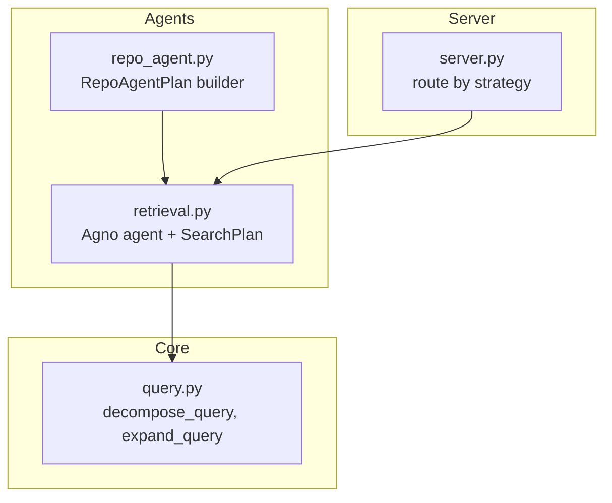
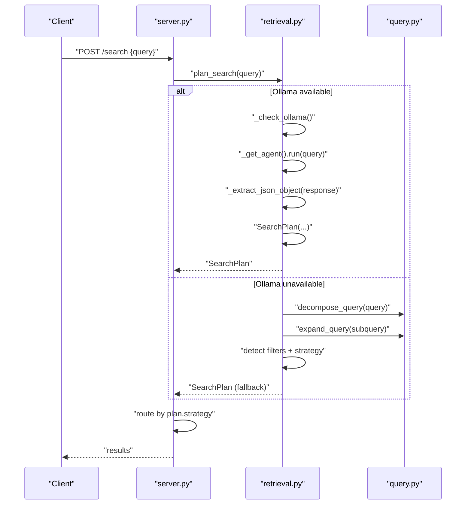
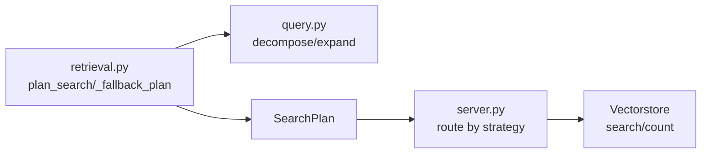

# Query Planning and Strategy Selection

<cite>
**Referenced Files in This Document**
- [retrieval.py](file://src/rag/agents/retrieval.py)
- [repo_agent.py](file://src/rag/agents/repo_agent.py)
- [server.py](file://src/rag/server.py)
- [query.py](file://src/rag/core/query.py)
- [test_agent.py](file://tests/test_agent.py)
- [test_query.py](file://tests/test_query.py)
</cite>

## Table of Contents
1. [Introduction](#introduction)
2. [Project Structure](#project-structure)
3. [Core Components](#core-components)
4. [Architecture Overview](#architecture-overview)
5. [Detailed Component Analysis](#detailed-component-analysis)
6. [Dependency Analysis](#dependency-analysis)
7. [Performance Considerations](#performance-considerations)
8. [Troubleshooting Guide](#troubleshooting-guide)
9. [Conclusion](#conclusion)

## Introduction
This document explains the query planning and strategy selection functionality used by the Agno retrieval agent to make intelligent decisions for natural language search. It covers how the SearchPlan data structure encapsulates query decomposition, filtering, and strategy selection; how fallback works when Ollama is unavailable; and how simple query expansion is applied. It also documents the supported strategy types, filter validation and sanitization, and practical examples of planning scenarios, troubleshooting, and performance considerations.

## Project Structure
The query planning and strategy selection logic spans three primary areas:
- Retrieval agent and plan parsing/fallback
- Query expansion and decomposition utilities
- Server routing and strategy execution

**Diagram sources**
- [retrieval.py:203-303](file://src/rag/agents/retrieval.py#L203-L303)
- [query.py:30-60](file://src/rag/core/query.py#L30-L60)
- [repo_agent.py:351-377](file://src/rag/agents/repo_agent.py#L351-L377)
- [server.py:1371-1417](file://src/rag/server.py#L1371-L1417)

**Section sources**
- [retrieval.py:203-303](file://src/rag/agents/retrieval.py#L203-L303)
- [query.py:30-60](file://src/rag/core/query.py#L30-L60)
- [repo_agent.py:351-377](file://src/rag/agents/repo_agent.py#L351-L377)
- [server.py:1371-1417](file://src/rag/server.py#L1371-L1417)

## Core Components
- Agno retrieval agent plan: Parses structured JSON from the agent to produce a SearchPlan, with robust extraction from varied LLM outputs.
- Fallback mechanism: When Ollama is unavailable, the system performs query decomposition and expansion, detects filters and strategy signals, and builds a SearchPlan.
- SearchPlan: Encapsulates the planned queries, sanitized filters, selected strategy, and top-k.
- Filter validation and sanitization: Whitelist-based validation for allowed filter values; unknown fields pass through.
- Query expansion and decomposition: Utilities to split and enrich queries for broader coverage.
- Strategy routing: Server routes execution based on the chosen strategy and applies graceful degradations.

**Section sources**
- [retrieval.py:203-303](file://src/rag/agents/retrieval.py#L203-L303)
- [retrieval.py:40-71](file://src/rag/agents/retrieval.py#L40-L71)
- [query.py:30-60](file://src/rag/core/query.py#L30-L60)
- [server.py:1371-1417](file://src/rag/server.py#L1371-L1417)

## Architecture Overview
The system orchestrates natural language queries through an agent-driven plan, falling back to a simple expansion-and-strategy detector when LLM services are unavailable. The server then executes the plan using appropriate retrieval strategies.

**Diagram sources**
- [server.py:1371-1417](file://src/rag/server.py#L1371-L1417)
- [retrieval.py:203-303](file://src/rag/agents/retrieval.py#L203-L303)
- [query.py:30-60](file://src/rag/core/query.py#L30-L60)

## Detailed Component Analysis

### SearchPlan data structure and construction
SearchPlan is produced either by parsing the Agno agent’s JSON output or by the fallback logic. It carries:
- queries: list of query strings (original and expanded)
- filters: sanitized dictionary of filters
- strategy: strategy type string
- top_k: integer for result limits

Key behaviors:
- JSON extraction supports fenced blocks, raw text, and balanced object spans.
- On parse failure or missing content, the fallback path is taken.
- Fallback builds queries via decomposition and expansion, detects filters and strategy, and returns a SearchPlan.

Practical implications:
- The presence of filters steers the planner toward filtered strategies.
- Strategy signals in the query (e.g., “calls”, “flow”) override defaults.

**Section sources**
- [retrieval.py:203-303](file://src/rag/agents/retrieval.py#L203-L303)
- [retrieval.py:169-200](file://src/rag/agents/retrieval.py#L169-L200)

### Fallback mechanism and simple query expansion
When Ollama is unavailable, the system:
- Decomposes the query into sub-queries
- Expands each sub-query to capture semantically related terms
- Detects filters implicitly from the query (e.g., language, pattern, complexity)
- Selects a strategy based on keywords and intent

Strategy detection rules:
- Default: lod_drill
- filtered: when filters are detected
- graph_walk: when the query mentions calls/uses/depends/flow/chain/trace
- aggregate: when the query asks counts/statistics/how many/all patterns
- global: when the query seeks overview/summary/architecture/main purpose/module
- naive: historically vector without rerank; now treated as hybrid alias

Filter detection and sanitization:
- Filters are extracted heuristically from the query text
- Unknown fields pass through; known fields are validated against a whitelist
- Lists are sanitized to keep only allowed values

**Section sources**
- [retrieval.py:243-303](file://src/rag/agents/retrieval.py#L243-L303)
- [retrieval.py:40-71](file://src/rag/agents/retrieval.py#L40-L71)
- [query.py:30-60](file://src/rag/core/query.py#L30-L60)

### Strategy types and selection criteria
Supported strategies:
- lod_drill: hierarchical drill-down through LOD collections; gracefully degrades to hybrid when LOD data is absent
- hybrid: flat vector search across code collection
- filtered: applies validated filters to retrieval
- graph_walk: focuses on call/use/dependency relationships
- aggregate: retrieves to compute counts/statistics
- global: broad overview/search across modules
- naive: historical alias for “vector only”; maintained for plan compatibility

Selection criteria:
- Default is lod_drill
- Presence of filters selects filtered
- Keywords select graph_walk, aggregate, global
- Exact/raw search keywords select naive

**Section sources**
- [retrieval.py:283-298](file://src/rag/agents/retrieval.py#L283-L298)
- [server.py:1371-1417](file://src/rag/server.py#L1371-L1417)

### Filter validation, sanitization, and whitelist system
Allowed filter values are defined in a whitelist mapping. Validation rules:
- Only keys present in the whitelist are validated
- Unknown keys pass through unmodified
- For list/tuple/set values, only allowed strings are kept; invalid entries are dropped and logged
- Single-item lists are normalized to scalars

This ensures safe and predictable filtering while allowing flexible ad-hoc fields.

**Section sources**
- [retrieval.py:33-71](file://src/rag/agents/retrieval.py#L33-L71)

### Practical examples of query planning scenarios
- Find Python singletons
  - Fallback detects language filter and selects filtered strategy
  - Queries are expanded to capture related terms
- Show complex functions
  - Fallback detects complexity filter and selects filtered strategy
- What calls the login function
  - Fallback selects graph_walk due to “calls”
- How many patterns exist
  - Fallback selects aggregate due to “how many”
- Find auth code
  - Fallback expands “auth” to include related terms (e.g., authentication, jwt)
- Overview of module structure
  - Fallback selects global due to “overview/summary”

These examples are validated by tests that assert strategy and filter detection, as well as query expansion behavior.

**Section sources**
- [test_agent.py:12-47](file://tests/test_agent.py#L12-L47)
- [test_query.py:15-42](file://tests/test_query.py#L15-L42)

### Server-side routing and graceful degradation
The server routes execution based on the strategy:
- For certain strategies and repositories, the server may switch to hybrid to keep searches scoped to the named repository
- lod_drill gracefully degrades to flat hybrid search when LOD collections are empty
- Hybrid merges user-provided filters with plan filters and executes vector search

This ensures consistent behavior across environments and data availability.

**Section sources**
- [server.py:1371-1417](file://src/rag/server.py#L1371-L1417)

## Dependency Analysis
The retrieval agent depends on:
- Query utilities for decomposition and expansion
- Vectorstore for hybrid/lod_drill execution paths
- Server for strategy routing and environment-specific adjustments

**Diagram sources**
- [retrieval.py:203-303](file://src/rag/agents/retrieval.py#L203-L303)
- [query.py:30-60](file://src/rag/core/query.py#L30-L60)
- [server.py:1371-1417](file://src/rag/server.py#L1371-L1417)

**Section sources**
- [retrieval.py:203-303](file://src/rag/agents/retrieval.py#L203-L303)
- [server.py:1371-1417](file://src/rag/server.py#L1371-L1417)

## Performance Considerations
- JSON extraction is designed to handle varied LLM outputs efficiently, reducing retries and mis-parses.
- Fallback avoids heavy model calls and relies on local query expansion/decomposition, minimizing latency when LLMs are unavailable.
- Strategy selection favors LOD drill-down when data is available, reducing search scope and improving relevance.
- Graceful degradation to hybrid prevents stalls when LOD data is missing, maintaining responsiveness.
- Filter sanitization prevents expensive or invalid filter combinations from reaching the vectorstore.

[No sources needed since this section provides general guidance]

## Troubleshooting Guide
Common planning failures and remedies:
- Agent response unparsable
  - Symptom: Warning logged and fallback invoked
  - Action: Verify agent output formatting; ensure fenced JSON or valid JSON object
  - Reference: [retrieval.py:223-228](file://src/rag/agents/retrieval.py#L223-L228)
- Ollama unavailable
  - Symptom: Immediate fallback to decomposition/expansion
  - Action: Confirm service availability; check network connectivity
  - Reference: [retrieval.py:208-209](file://src/rag/agents/retrieval.py#L208-L209)
- Filters dropped due to whitelist mismatch
  - Symptom: Warning logged for dropped values
  - Action: Review allowed filter values; adjust query or configuration
  - Reference: [retrieval.py:62-68](file://src/rag/agents/retrieval.py#L62-L68)
- Strategy unexpectedly set to filtered
  - Symptom: Heuristic detection of filters
  - Action: Inspect query for implicit filter cues; refine wording
  - Reference: [retrieval.py:285-286](file://src/rag/agents/retrieval.py#L285-L286)
- lod_drill degraded to hybrid
  - Symptom: No LOD data found
  - Action: Rebuild LOD summaries or rely on hybrid
  - Reference: [server.py:1388-1391](file://src/rag/server.py#L1388-L1391)

**Section sources**
- [retrieval.py:223-228](file://src/rag/agents/retrieval.py#L223-L228)
- [retrieval.py:208-209](file://src/rag/agents/retrieval.py#L208-L209)
- [retrieval.py:62-68](file://src/rag/agents/retrieval.py#L62-L68)
- [retrieval.py:285-286](file://src/rag/agents/retrieval.py#L285-L286)
- [server.py:1388-1391](file://src/rag/server.py#L1388-L1391)

## Conclusion
The query planning and strategy selection system combines an LLM-driven agent with a robust fallback to deliver intelligent search strategies. SearchPlan encapsulates decomposition, filtering, and strategy selection, while filter validation and sanitization maintain safety and predictability. The server routes execution with graceful degradations, ensuring reliable performance across varying environments and data availability.