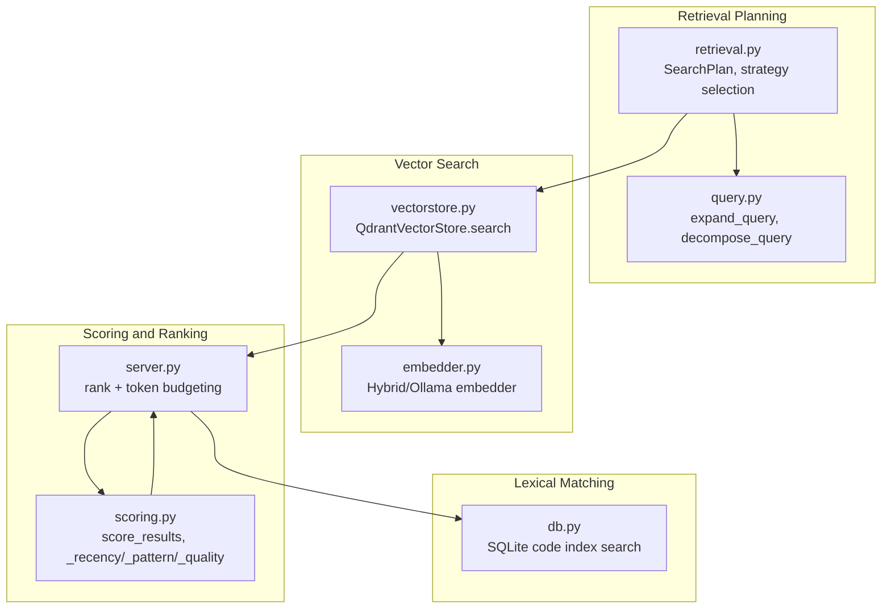
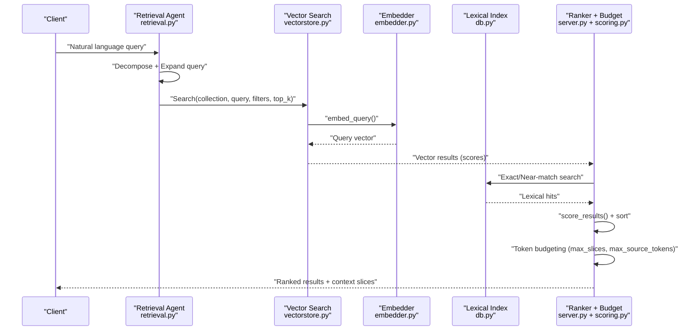
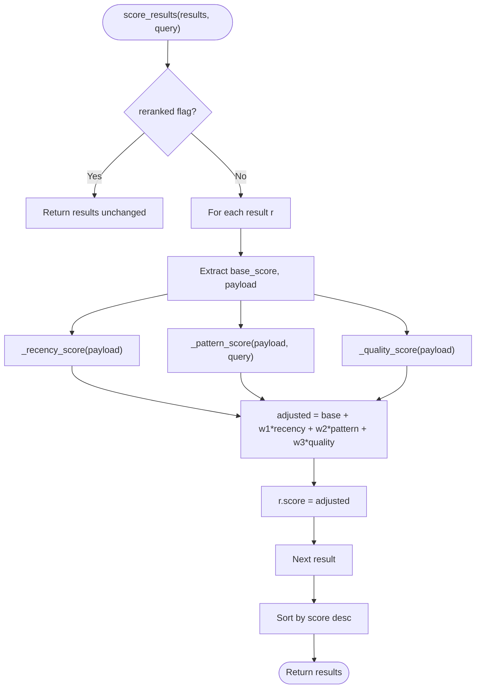
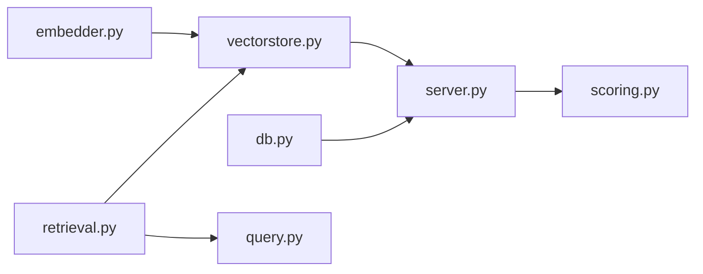

# Result Scoring and Ranking

<cite>
**Referenced Files in This Document**
- [scoring.py](file://src/rag/core/scoring.py)
- [retrieval.py](file://src/rag/agents/retrieval.py)
- [query.py](file://src/rag/core/query.py)
- [vectorstore.py](file://src/rag/core/vectorstore.py)
- [embedder.py](file://src/rag/core/embedder.py)
- [db.py](file://src/rag/storage/db.py)
- [server.py](file://src/rag/server.py)
- [test_scoring.py](file://tests/test_scoring.py)
</cite>

## Table of Contents
1. [Introduction](#introduction)
2. [Project Structure](#project-structure)
3. [Core Components](#core-components)
4. [Architecture Overview](#architecture-overview)
5. [Detailed Component Analysis](#detailed-component-analysis)
6. [Dependency Analysis](#dependency-analysis)
7. [Performance Considerations](#performance-considerations)
8. [Troubleshooting Guide](#troubleshooting-guide)
9. [Conclusion](#conclusion)
10. [Appendices](#appendices)

## Introduction
This document explains how the search system computes and applies result scores, integrates vector similarity with lexical matching and contextual relevance, and balances result quality with performance constraints. It covers:
- How vector similarity scores are combined with recency, pattern relevance, and code quality signals
- How lexical matching is integrated into the final ranking and content aggregation
- The token budgeting mechanism that controls result aggregation and content slicing
- Ranking factors: semantic similarity, lexical matches, source proximity, and content relevance
- Scoring configuration options and customization possibilities
- Performance optimization techniques and troubleshooting ranking anomalies

## Project Structure
The scoring and ranking pipeline spans several modules:
- Retrieval planning and query expansion
- Dense vector search and embedding
- Lexical matching against a code index
- Scoring adjustments and final ranking
- Token budgeting for content aggregation

**Diagram sources**
- [retrieval.py:203-303](file://src/rag/agents/retrieval.py#L203-L303)
- [query.py:31-52](file://src/rag/core/query.py#L31-L52)
- [vectorstore.py:424-465](file://src/rag/core/vectorstore.py#L424-L465)
- [embedder.py:189-245](file://src/rag/core/embedder.py#L189-L245)
- [db.py:278-316](file://src/rag/storage/db.py#L278-L316)
- [scoring.py:31-142](file://src/rag/core/scoring.py#L31-L142)
- [server.py:1537-1563](file://src/rag/server.py#L1537-L1563)

**Section sources**
- [retrieval.py:203-303](file://src/rag/agents/retrieval.py#L203-L303)
- [vectorstore.py:424-465](file://src/rag/core/vectorstore.py#L424-L465)
- [scoring.py:31-142](file://src/rag/core/scoring.py#L31-L142)
- [server.py:1537-1563](file://src/rag/server.py#L1537-L1563)

## Core Components
- Dense vector search and embedding: The system embeds queries and documents using an Ollama-backed embedder and performs dense vector search against Qdrant.
- Retrieval planning and query expansion: A retrieval agent decides the search strategy and expands/decodes the query to improve recall.
- Lexical matching: A SQLite-based code index is queried for exact or near-exact matches to complement vector search.
- Scoring and ranking: Results are adjusted by recency, pattern relevance, and code quality signals, then ranked.
- Token budgeting: Content aggregation respects a maximum token budget and a maximum number of slices to balance quality and performance.

Key implementation references:
- Dense search and scoring integration: [server.py:1537-1563](file://src/rag/server.py#L1537-L1563)
- Vector search and payload fields: [vectorstore.py:424-465](file://src/rag/core/vectorstore.py#L424-L465), [vectorstore.py:23-73](file://src/rag/core/vectorstore.py#L23-L73)
- Embedding pipeline: [embedder.py:189-245](file://src/rag/core/embedder.py#L189-L245)
- Retrieval planning and fallback: [retrieval.py:203-303](file://src/rag/agents/retrieval.py#L203-L303), [query.py:31-52](file://src/rag/core/query.py#L31-L52)
- Scoring adjustments: [scoring.py:31-142](file://src/rag/core/scoring.py#L31-L142)
- Lexical scoring: [db.py:298-316](file://src/rag/storage/db.py#L298-L316)

**Section sources**
- [server.py:1537-1563](file://src/rag/server.py#L1537-L1563)
- [vectorstore.py:424-465](file://src/rag/core/vectorstore.py#L424-L465)
- [embedder.py:189-245](file://src/rag/core/embedder.py#L189-L245)
- [retrieval.py:203-303](file://src/rag/agents/retrieval.py#L203-L303)
- [query.py:31-52](file://src/rag/core/query.py#L31-L52)
- [scoring.py:31-142](file://src/rag/core/scoring.py#L31-L142)
- [db.py:298-316](file://src/rag/storage/db.py#L298-L316)

## Architecture Overview
The end-to-end ranking pipeline integrates vector similarity, lexical matching, and contextual relevance while enforcing token budgets.

**Diagram sources**
- [retrieval.py:203-303](file://src/rag/agents/retrieval.py#L203-L303)
- [vectorstore.py:424-465](file://src/rag/core/vectorstore.py#L424-L465)
- [embedder.py:189-245](file://src/rag/core/embedder.py#L189-L245)
- [db.py:278-316](file://src/rag/storage/db.py#L278-L316)
- [server.py:1537-1563](file://src/rag/server.py#L1537-L1563)
- [scoring.py:31-142](file://src/rag/core/scoring.py#L31-L142)

## Detailed Component Analysis

### Dense Vector Similarity and Payload Fields
- Vector search uses a dense query vector to retrieve top-k results from Qdrant. Each result carries a content snippet, a base score, and a payload with structured metadata.
- Payload fields include language, chunk type, patterns, domains, layers, code quality flags, complexity metrics, and LOD metadata. These fields inform lexical filtering and scoring adjustments.

Key references:
- Vector search method and payload mapping: [vectorstore.py:424-465](file://src/rag/core/vectorstore.py#L424-L465)
- Payload field indexes (keyword/integer): [vectorstore.py:23-73](file://src/rag/core/vectorstore.py#L23-L73)

**Section sources**
- [vectorstore.py:424-465](file://src/rag/core/vectorstore.py#L424-L465)
- [vectorstore.py:23-73](file://src/rag/core/vectorstore.py#L23-L73)

### Retrieval Planning and Query Expansion
- The retrieval agent selects a strategy (e.g., hierarchical drill-down, filtered, graph walk, aggregate, global, naive) and generates multiple queries with expansions.
- Fallback logic detects language, pattern, complexity, and strategy cues from the query when the agent is unavailable.

Key references:
- Strategy selection and fallback: [retrieval.py:203-303](file://src/rag/agents/retrieval.py#L203-L303)
- Query expansion and decomposition: [query.py:31-52](file://src/rag/core/query.py#L31-L52)

**Section sources**
- [retrieval.py:203-303](file://src/rag/agents/retrieval.py#L203-L303)
- [query.py:31-52](file://src/rag/core/query.py#L31-L52)

### Lexical Matching and Contextual Relevance
- Lexical hits are retrieved from a SQLite code index and merged into the candidate set before ranking. The lexical scoring function considers exact symbol matches, parent symbol matches, path substrings, and occurrence counts, plus a bonus for function/method chunks.
- The server merges lexical results with vector results, deduplicating by payload key, then applies scoring and token budgeting.

Key references:
- Lexical search and scoring: [db.py:278-316](file://src/rag/storage/db.py#L278-L316)
- Merge and rank with token budgeting: [server.py:1537-1563](file://src/rag/server.py#L1537-L1563), [server.py:2047-2118](file://src/rag/server.py#L2047-L2118)

**Section sources**
- [db.py:278-316](file://src/rag/storage/db.py#L278-L316)
- [server.py:1537-1563](file://src/rag/server.py#L1537-L1563)
- [server.py:2047-2118](file://src/rag/server.py#L2047-L2118)

### Scoring Adjustments: Recency, Patterns, Quality
- Base vector scores are adjusted by:
  - Recency: exponential decay based on last modified date
  - Pattern relevance: boosted if the query matches domain patterns or if payload contains high-value patterns
  - Code quality: penalties for dead code candidates and high cyclomatic complexity; modest boosts for docstrings, public visibility, and unit tests
- The adjusted score is the base score plus weighted adjustments, then results are sorted descending by score.

Key references:
- Scoring function and helpers: [scoring.py:31-142](file://src/rag/core/scoring.py#L31-L142)
- Tests validating flag normalization and penalties: [test_scoring.py:8-42](file://tests/test_scoring.py#L8-L42)

**Diagram sources**
- [scoring.py:31-57](file://src/rag/core/scoring.py#L31-L57)
- [scoring.py:60-97](file://src/rag/core/scoring.py#L60-L97)
- [scoring.py:117-142](file://src/rag/core/scoring.py#L117-L142)

**Section sources**
- [scoring.py:31-142](file://src/rag/core/scoring.py#L31-L142)
- [test_scoring.py:8-42](file://tests/test_scoring.py#L8-L42)

### Token Budgeting and Content Aggregation
- After merging lexical and vector results, the system sorts by score and aggregates content slices respecting:
  - Maximum number of slices (max_slices)
  - Maximum total source tokens (max_source_tokens)
- Overlapping candidates are skipped to avoid duplication; slices are estimated by token counts.

Key references:
- Sorting, slicing, and budget enforcement: [server.py:2047-2118](file://src/rag/server.py#L2047-L2118)

**Section sources**
- [server.py:2047-2118](file://src/rag/server.py#L2047-L2118)

### Ranking Factors and Their Contributions
- Semantic similarity: base score from dense vector search
- Lexical matches: exact symbol/file/path matches and occurrence counts from SQLite index
- Source proximity: lexical hits are merged early to promote direct matches
- Content relevance: payload flags (public, has docstring, has unit test) and complexity signals
- Recency: exponential decay of modification age

Key references:
- Vector base score and payload fields: [vectorstore.py:424-465](file://src/rag/core/vectorstore.py#L424-L465), [vectorstore.py:23-73](file://src/rag/core/vectorstore.py#L23-L73)
- Lexical scoring function: [db.py:298-316](file://src/rag/storage/db.py#L298-L316)
- Quality and pattern scoring: [scoring.py:117-142](file://src/rag/core/scoring.py#L117-L142), [scoring.py:80-97](file://src/rag/core/scoring.py#L80-L97)
- Recency scoring: [scoring.py:60-77](file://src/rag/core/scoring.py#L60-L77)

**Section sources**
- [vectorstore.py:424-465](file://src/rag/core/vectorstore.py#L424-L465)
- [vectorstore.py:23-73](file://src/rag/core/vectorstore.py#L23-L73)
- [db.py:298-316](file://src/rag/storage/db.py#L298-L316)
- [scoring.py:60-77](file://src/rag/core/scoring.py#L60-L77)
- [scoring.py:80-97](file://src/rag/core/scoring.py#L80-L97)
- [scoring.py:117-142](file://src/rag/core/scoring.py#L117-L142)

### Scoring Configuration Options and Customization
- Recency weight and decay: controlled by constants and maximum age threshold
- Pattern weights and high-value pattern set
- Quality signal thresholds and penalties
- Strategy selection and top_k tuning influence the initial candidate pool size

Key references:
- Constants and scoring helpers: [scoring.py:19-28](file://src/rag/core/scoring.py#L19-L28), [scoring.py:60-97](file://src/rag/core/scoring.py#L60-L97), [scoring.py:117-142](file://src/rag/core/scoring.py#L117-L142)
- Strategy and top_k selection: [retrieval.py:203-303](file://src/rag/agents/retrieval.py#L203-L303)

**Section sources**
- [scoring.py:19-28](file://src/rag/core/scoring.py#L19-L28)
- [scoring.py:60-97](file://src/rag/core/scoring.py#L60-L97)
- [scoring.py:117-142](file://src/rag/core/scoring.py#L117-L142)
- [retrieval.py:203-303](file://src/rag/agents/retrieval.py#L203-L303)

## Dependency Analysis
The ranking pipeline depends on:
- Embedding dimension and model availability
- Qdrant payload indexes for efficient filtering
- SQLite index for lexical matching
- Scoring constants and helper functions

**Diagram sources**
- [embedder.py:189-245](file://src/rag/core/embedder.py#L189-L245)
- [vectorstore.py:424-465](file://src/rag/core/vectorstore.py#L424-L465)
- [server.py:1537-1563](file://src/rag/server.py#L1537-L1563)
- [db.py:278-316](file://src/rag/storage/db.py#L278-L316)
- [scoring.py:31-142](file://src/rag/core/scoring.py#L31-L142)
- [retrieval.py:203-303](file://src/rag/agents/retrieval.py#L203-L303)
- [query.py:31-52](file://src/rag/core/query.py#L31-L52)

**Section sources**
- [embedder.py:189-245](file://src/rag/core/embedder.py#L189-L245)
- [vectorstore.py:424-465](file://src/rag/core/vectorstore.py#L424-L465)
- [server.py:1537-1563](file://src/rag/server.py#L1537-L1563)
- [db.py:278-316](file://src/rag/storage/db.py#L278-L316)
- [scoring.py:31-142](file://src/rag/core/scoring.py#L31-L142)
- [retrieval.py:203-303](file://src/rag/agents/retrieval.py#L203-L303)
- [query.py:31-52](file://src/rag/core/query.py#L31-L52)

## Performance Considerations
- Prefer server-side filtering in Qdrant to avoid post-filtering recall loss and reduce candidate set size early.
- Tune top_k to balance latency and recall; larger top_k increases downstream ranking and token budgeting costs.
- Use payload indexes for frequent filters to accelerate filtering and reduce scan overhead.
- Leverage lexical matching to inject high-confidence exact matches early, reducing reliance on noisy embeddings for direct symbol/file queries.
- Monitor embedding dimension mismatches to prevent silent corruption during upserts.
- Apply token budgeting aggressively to cap context size and maintain response latency.

[No sources needed since this section provides general guidance]

## Troubleshooting Guide
Common issues and resolutions:
- Unexpected low lexical scores: verify allowed filter fields and sanitization; ensure query terms align with stored file_path/name/parent_name.
- Quality score anomalies: confirm payload flags are normalized correctly (“true”/“false” strings vs. booleans); missing flags default appropriately.
- Recency boosting not applied: check last modified timestamps and timezone handling; verify maximum age threshold.
- Dimension mismatch errors: re-index after changing embedding models to ensure collection dimension matches embedder dimension.
- Slow retrieval: enable payload indexes for heavy filters; reduce top_k; prefer filtered or graph_walk strategies when appropriate.

Key references:
- Lexical scoring and allowed filters: [db.py:278-316](file://src/rag/storage/db.py#L278-L316)
- Flag normalization and tests: [scoring.py:100-114](file://src/rag/core/scoring.py#L100-L114), [test_scoring.py:8-42](file://tests/test_scoring.py#L8-L42)
- Recency scoring: [scoring.py:60-77](file://src/rag/core/scoring.py#L60-L77)
- Collection dimension guard: [vectorstore.py:260-295](file://src/rag/core/vectorstore.py#L260-L295)

**Section sources**
- [db.py:278-316](file://src/rag/storage/db.py#L278-L316)
- [scoring.py:100-114](file://src/rag/core/scoring.py#L100-L114)
- [test_scoring.py:8-42](file://tests/test_scoring.py#L8-L42)
- [scoring.py:60-77](file://src/rag/core/scoring.py#L60-L77)
- [vectorstore.py:260-295](file://src/rag/core/vectorstore.py#L260-L295)

## Conclusion
The system combines dense vector similarity with lexical matching and contextual relevance, then adjusts scores using recency, pattern relevance, and code quality signals. A strict token budgeting mechanism ensures performance remains acceptable while preserving result quality. Tuning strategy selection, top_k, payload indexes, and scoring weights enables customization for diverse query types and performance targets.

[No sources needed since this section summarizes without analyzing specific files]

## Appendices

### Example Score Calculation Workflow
- Step 1: Retrieve top-k vector results with payload fields.
- Step 2: Query lexical index for exact or near-exact matches and merge into candidates.
- Step 3: Compute adjusted scores using recency, pattern, and quality adjustments.
- Step 4: Sort by score descending and apply token budgeting to produce final slices.

References:
- [server.py:1537-1563](file://src/rag/server.py#L1537-L1563)
- [scoring.py:31-142](file://src/rag/core/scoring.py#L31-L142)
- [db.py:278-316](file://src/rag/storage/db.py#L278-L316)

**Section sources**
- [server.py:1537-1563](file://src/rag/server.py#L1537-L1563)
- [scoring.py:31-142](file://src/rag/core/scoring.py#L31-L142)
- [db.py:278-316](file://src/rag/storage/db.py#L278-L316)