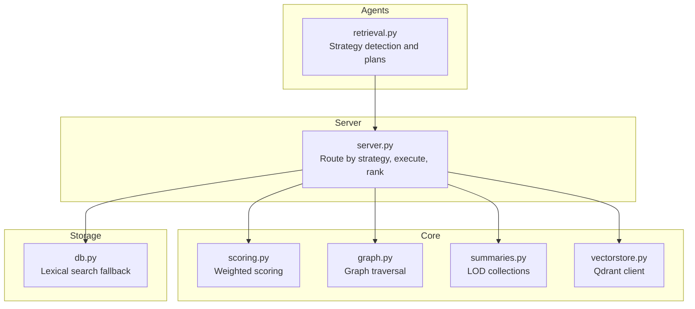
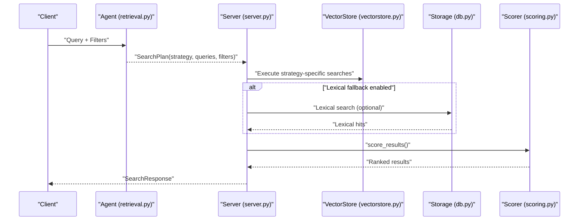
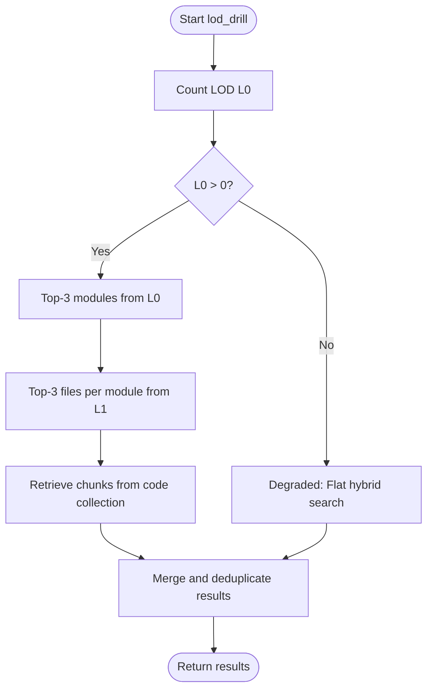
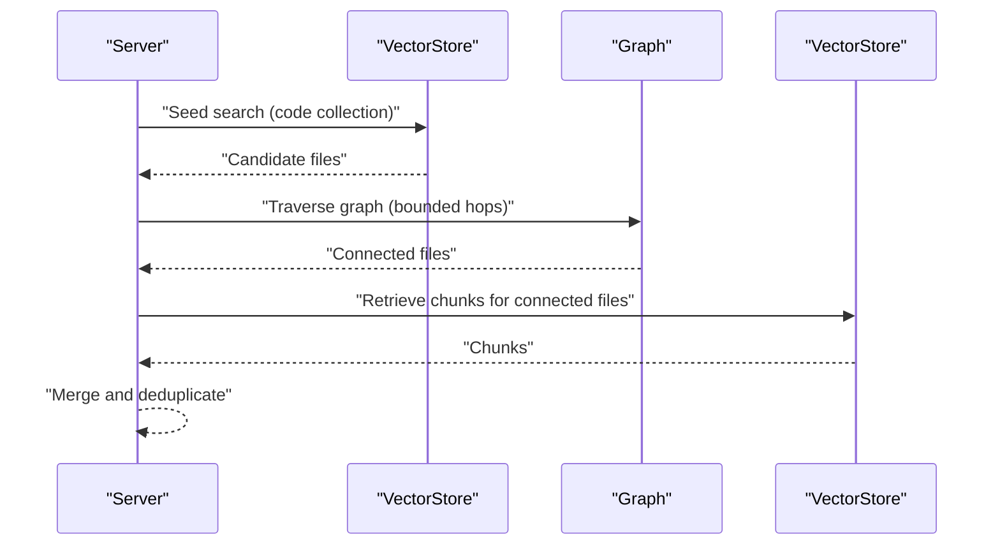
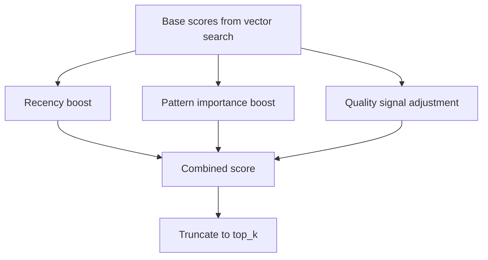
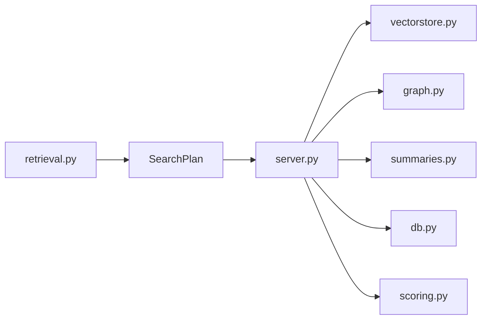

# Search Algorithms and Strategies

<cite>
**Referenced Files in This Document**
- [retrieval.py](file://src/rag/agents/retrieval.py)
- [server.py](file://src/rag/server.py)
- [scoring.py](file://src/rag/core/scoring.py)
- [graph.py](file://src/rag/core/graph.py)
- [summaries.py](file://src/rag/core/summaries.py)
- [vectorstore.py](file://src/rag/core/vectorstore.py)
- [db.py](file://src/rag/storage/db.py)
- [refactoring_rag_strategies.md](file://docs/refactoring_rag_strategies.md)
- [rag_vs_vanilla_walkthrough.md](file://docs/rag_vs_vanilla_walkthrough.md)
- [CLAUDE.md](file://CLAUDE.md)
</cite>

## Table of Contents
1. [Introduction](#introduction)
2. [Project Structure](#project-structure)
3. [Core Components](#core-components)
4. [Architecture Overview](#architecture-overview)
5. [Detailed Component Analysis](#detailed-component-analysis)
6. [Dependency Analysis](#dependency-analysis)
7. [Performance Considerations](#performance-considerations)
8. [Troubleshooting Guide](#troubleshooting-guide)
9. [Conclusion](#conclusion)

## Introduction
This document explains the multi-strategy search system used by the RAG pipeline. It covers seven strategies: lod_drill (hierarchical drill-down), hybrid (flat vector search), filtered (targeted searches), graph_walk (relationship analysis), aggregate (statistical queries), global (overview searches), and naive (simple vector search). For each strategy, we describe intent, implementation, use cases, performance characteristics, fallback behaviors, and how they complement each other. We also document the result ranking mechanism and scoring algorithms, and provide optimization and troubleshooting guidance.

## Project Structure
The search system spans several modules:
- Agents orchestrate strategy selection and plan creation
- Server executes the chosen strategy and merges results
- Core modules implement scoring, graph traversal, summaries, and vector search
- Storage provides lexical search fallback
- Documentation outlines intended behaviors and examples

**Diagram sources**
- [retrieval.py](file://src/rag/agents/retrieval.py)
- [server.py](file://src/rag/server.py)
- [scoring.py](file://src/rag/core/scoring.py)
- [graph.py](file://src/rag/core/graph.py)
- [summaries.py](file://src/rag/core/summaries.py)
- [vectorstore.py](file://src/rag/core/vectorstore.py)
- [db.py](file://src/rag/storage/db.py)

**Section sources**
- [retrieval.py](file://src/rag/agents/retrieval.py)
- [server.py](file://src/rag/server.py)

## Core Components
- Strategy detection and plan creation: The agent inspects the query and optional filters to choose a strategy and expand queries.
- Strategy execution: The server routes to the appropriate path, performs vector searches, optionally traverses the graph, aggregates results, and applies scoring.
- Ranking and scoring: A weighted scoring function adjusts base scores using recency, pattern importance, and quality signals.
- Fallbacks: Lexical search against code chunks augments vector results when available; LOD drill-down degrades gracefully when LOD collections are missing.

**Section sources**
- [retrieval.py](file://src/rag/agents/retrieval.py)
- [server.py](file://src/rag/server.py)
- [scoring.py](file://src/rag/core/scoring.py)
- [db.py](file://src/rag/storage/db.py)

## Architecture Overview
The end-to-end flow:
1. Query enters the server and a SearchPlan is produced by the agent.
2. The server selects a strategy and executes it:
   - lod_drill: hierarchical drill-down through LOD collections with fallback to hybrid
   - graph_walk: vector seed plus graph traversal
   - hybrid/filtered/naive/aggregate: vector search with optional filters and aggregation
3. Lexical search fallback enriches results when available.
4. Results are scored and truncated to requested top_k.

**Diagram sources**
- [retrieval.py](file://src/rag/agents/retrieval.py)
- [server.py](file://src/rag/server.py)
- [vectorstore.py](file://src/rag/core/vectorstore.py)
- [db.py](file://src/rag/storage/db.py)
- [scoring.py](file://src/rag/core/scoring.py)

## Detailed Component Analysis

### Strategy Detection and Planning
- Strategy detection logic chooses a default and overrides based on keywords and filters.
- The plan includes expanded queries, sanitized filters, and the selected strategy.

Key behaviors:
- Default: lod_drill
- Overrides:
  - filters present → filtered
  - relationship keywords → graph_walk
  - statistical keywords → aggregate
  - overview keywords → global
  - exact/literal keywords → naive

Implementation references:
- Strategy detection and plan construction
- [retrieval.py](file://src/rag/agents/retrieval.py)

**Section sources**
- [retrieval.py](file://src/rag/agents/retrieval.py)

### lod_drill (Hierarchical Drill-Down)
Intent:
- Navigate from high-level summaries to files and then to code chunks for precise context.

Implementation highlights:
- Checks LOD L0 collection count; if empty, degrades to hybrid search.
- First hop: top-3 modules from LOD L0.
- Second hop: top-3 files per module from LOD L1.
- Third hop: retrieve chunks from the code collection for the selected files.
- Aggregation: deduplicates by point_id and tracks which queries matched each result.

Fallback behavior:
- When LOD L0 is empty, logs degradation and executes flat hybrid search.

Performance characteristics:
- Hierarchical filtering reduces search space progressively.
- Degradation ensures coverage even without LOD data.

Complementary use cases:
- When the query targets a subsystem or module and needs precise grounding.

References:
- Strategy routing and LOD checks
- [server.py](file://src/rag/server.py)
- LOD constants and collections
- [summaries.py](file://src/rag/core/summaries.py)

**Diagram sources**
- [server.py](file://src/rag/server.py)
- [summaries.py](file://src/rag/core/summaries.py)

**Section sources**
- [server.py](file://src/rag/server.py)
- [summaries.py](file://src/rag/core/summaries.py)

### hybrid (Flat Vector Search)
Intent:
- Perform dense semantic search over the code collection with optional filters.

Implementation highlights:
- Iterates over expanded queries, merges external filters, and searches the code collection.
- Aggregates results by point_id and records matched queries per result.

Performance characteristics:
- Fast and comprehensive for broad queries.
- Benefits from lexical fallback to improve precision for exact matches.

Complementary use cases:
- General-purpose queries where hierarchy is not needed.

References:
- Strategy routing and hybrid execution
- [server.py](file://src/rag/server.py)

**Section sources**
- [server.py](file://src/rag/server.py)

### filtered (Targeted Searches)
Intent:
- Apply metadata filters to narrow the search space while retaining semantic similarity.

Implementation highlights:
- Same vector search pattern as hybrid, but with sanitized filters applied to each query.

Performance characteristics:
- Reduces false positives by constraining to relevant subsets (e.g., language, complexity).
- Useful when the query specifies domain or structural constraints.

Complementary use cases:
- Queries with explicit filters (e.g., “find Python files with high cyclomatic complexity”).

References:
- Strategy detection and filtered execution
- [retrieval.py](file://src/rag/agents/retrieval.py)
- [server.py](file://src/rag/server.py)

**Section sources**
- [retrieval.py](file://src/rag/agents/retrieval.py)
- [server.py](file://src/rag/server.py)

### graph_walk (Relationship Analysis)
Intent:
- Seed with vector search and traverse relationships captured in a graph to discover connected files and context.

Implementation highlights:
- Vector seed search to identify candidate files.
- Graph traversal up to a bounded number of hops to collect related files.
- Retrieve chunks for the connected files and merge with initial results.

Performance characteristics:
- Effective for queries about call graphs, dependencies, or control flow.
- Traversal cost scales with graph density and hop limit.

Complementary use cases:
- Queries containing relationship keywords (e.g., “calls”, “uses”, “depends”, “flow”, “chain”, “trace”).

References:
- Strategy detection and graph traversal
- [retrieval.py](file://src/rag/agents/retrieval.py)
- [graph.py](file://src/rag/core/graph.py)

**Diagram sources**
- [server.py](file://src/rag/server.py)
- [graph.py](file://src/rag/core/graph.py)

**Section sources**
- [retrieval.py](file://src/rag/agents/retrieval.py)
- [graph.py](file://src/rag/core/graph.py)

### aggregate (Statistical Queries)
Intent:
- Support queries requiring counts, totals, or statistical overviews.

Implementation highlights:
- Executes vector searches across the code collection and post-processes results to compute statistics.
- Uses the same query expansion and filter merging as hybrid.

Performance characteristics:
- Efficient for counting and enumeration tasks.
- Leverages vector search for relevant candidates and metadata for counts.

Complementary use cases:
- Queries with statistical keywords (e.g., “how many”, “count”, “all patterns”, “statistics”).

References:
- Strategy detection and aggregate execution
- [retrieval.py](file://src/rag/agents/retrieval.py)
- [server.py](file://src/rag/server.py)

**Section sources**
- [retrieval.py](file://src/rag/agents/retrieval.py)
- [server.py](file://src/rag/server.py)

### global (Overview Searches)
Intent:
- Provide a high-level overview by searching module-level summaries.

Implementation highlights:
- Targets the summary collection to retrieve top summaries aligned with the query.
- Typically used for architecture-level understanding.

Performance characteristics:
- Fast and conceptually aligned with high-level questions.
- Degrades gracefully when summaries are unavailable (e.g., disabled indexing).

Complementary use cases:
- Queries seeking architecture, purpose, or module-level insights.

References:
- Strategy detection and global execution
- [retrieval.py](file://src/rag/agents/retrieval.py)
- [summaries.py](file://src/rag/core/summaries.py)

**Section sources**
- [retrieval.py](file://src/rag/agents/retrieval.py)
- [summaries.py](file://src/rag/core/summaries.py)

### naive (Simple Vector Search)
Intent:
- Historically indicated “vector search without rerank.” Now effectively an alias for hybrid.

Implementation highlights:
- Same as hybrid; maintained for plan-shape compatibility.

Complementary use cases:
- Queries requesting exact or literal semantics.

References:
- Strategy detection and naive handling
- [retrieval.py](file://src/rag/agents/retrieval.py)

**Section sources**
- [retrieval.py](file://src/rag/agents/retrieval.py)

### Result Ranking and Scoring
- Recency boost: Recent modifications increase relevance within a maximum age window.
- Pattern importance: Certain domain patterns increase relevance.
- Quality signals: Quality-related metadata can adjust scores.
- Exact match promotion: Lexical search against code chunks promotes direct matches before scoring.
- Final truncation: Results are truncated to the requested top_k.

References:
- Scoring weights and logic
- [scoring.py](file://src/rag/core/scoring.py)
- Lexical promotion and truncation
- [server.py](file://src/rag/server.py)

**Diagram sources**
- [scoring.py](file://src/rag/core/scoring.py)
- [server.py](file://src/rag/server.py)

**Section sources**
- [scoring.py](file://src/rag/core/scoring.py)
- [server.py](file://src/rag/server.py)

### Token Budgeting and Result Merging
- The system merges results across multiple queries and deduplicates by point_id.
- Match tracking records which original queries contributed to each result.
- Top-k truncation occurs after merging and scoring.

References:
- Result merging and truncation
- [server.py](file://src/rag/server.py)

**Section sources**
- [server.py](file://src/rag/server.py)

### Fallback Behaviors and Error Handling
- lod_drill degradation: When LOD L0 is empty, the strategy falls back to hybrid and logs the reason.
- Lexical fallback: When available, code chunk lexical search augments vector results; failures are logged and ignored.
- Global strategy in repo-scoped requests: Requests scoped to a named repository force hybrid for consistency.
- Error handling: Internal exceptions are caught, logged, and returned as a 500 response.

References:
- lod_drill degradation and fallback
- [server.py](file://src/rag/server.py)
- Lexical fallback and global strategy override
- [server.py](file://src/rag/server.py)
- Error handling
- [server.py](file://src/rag/server.py)

**Section sources**
- [server.py](file://src/rag/server.py)

### Examples and Complementarity
- lod_drill excels for module-centric queries needing precise grounding; degrades to hybrid when LOD is missing.
- graph_walk complements semantic search by surfacing related files via relationships.
- filtered narrows hybrid to relevant subsets using metadata filters.
- aggregate supports counting and statistical queries efficiently.
- global answers high-level architecture questions using summaries.
- naive aligns with exact-match intents; treated as hybrid alias.
- Together, these strategies cover diverse query intents and provide robust coverage.

References:
- Strategy documentation and examples
- [CLAUDE.md](file://CLAUDE.md)
- [rag_vs_vanilla_walkthrough.md](file://docs/rag_vs_vanilla_walkthrough.md)
- [refactoring_rag_strategies.md](file://docs/refactoring_rag_strategies.md)

**Section sources**
- [CLAUDE.md](file://CLAUDE.md)
- [rag_vs_vanilla_walkthrough.md](file://docs/rag_vs_vanilla_walkthrough.md)
- [refactoring_rag_strategies.md](file://docs/refactoring_rag_strategies.md)

## Dependency Analysis
- Agents depend on query analysis to produce SearchPlans.
- Server depends on vectorstore for dense retrieval, graph for traversal, summaries for LOD collections, and storage for lexical fallback.
- Scoring is decoupled and applied uniformly across strategies.

**Diagram sources**
- [retrieval.py](file://src/rag/agents/retrieval.py)
- [server.py](file://src/rag/server.py)
- [vectorstore.py](file://src/rag/core/vectorstore.py)
- [graph.py](file://src/rag/core/graph.py)
- [summaries.py](file://src/rag/core/summaries.py)
- [db.py](file://src/rag/storage/db.py)
- [scoring.py](file://src/rag/core/scoring.py)

**Section sources**
- [retrieval.py](file://src/rag/agents/retrieval.py)
- [server.py](file://src/rag/server.py)

## Performance Considerations
- Prefer filtered for constrained domains to reduce search space.
- Use graph_walk for relationship-heavy queries to avoid exhaustive scans.
- Aggregate leverages vector seeds and metadata for efficient counting.
- LOD drill-down reduces dimensionality by progressing through summaries first.
- Enable lexical fallback to improve precision for exact matches.
- Tune top_k per strategy to balance recall and latency.
- Monitor LOD availability; degraded lod_drill still provides coverage via hybrid.

[No sources needed since this section provides general guidance]

## Troubleshooting Guide
Common issues and resolutions:
- No LOD data: lod_drill logs degradation and falls back to hybrid. Verify LOD indexing and environment settings.
- Empty results: Check filters and top_k; confirm vectorstore connectivity and collection contents.
- Slow graph_walk: Reduce hop limits or restrict seed search; ensure graph indices are built.
- Lexical fallback failing: Confirm database connectivity and schema; errors are logged and ignored.
- Mixed results across queries: Review result merging and deduplication; verify point_id uniqueness.
- Error responses: Inspect server logs for stack traces; the server returns structured 500 errors on internal failures.

**Section sources**
- [server.py](file://src/rag/server.py)

## Conclusion
The RAG system’s multi-strategy search combines hierarchical drill-down, semantic vector search, graph traversal, filtered narrowing, statistical aggregation, and global overviews. Strategy selection is query-driven, with robust fallbacks and a unified scoring pipeline. Together, these approaches deliver precision, recall, and performance across diverse query intents.