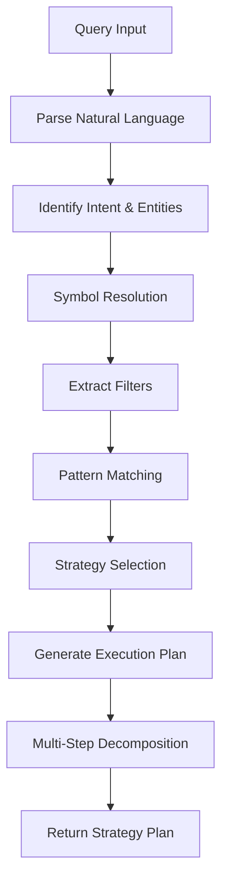
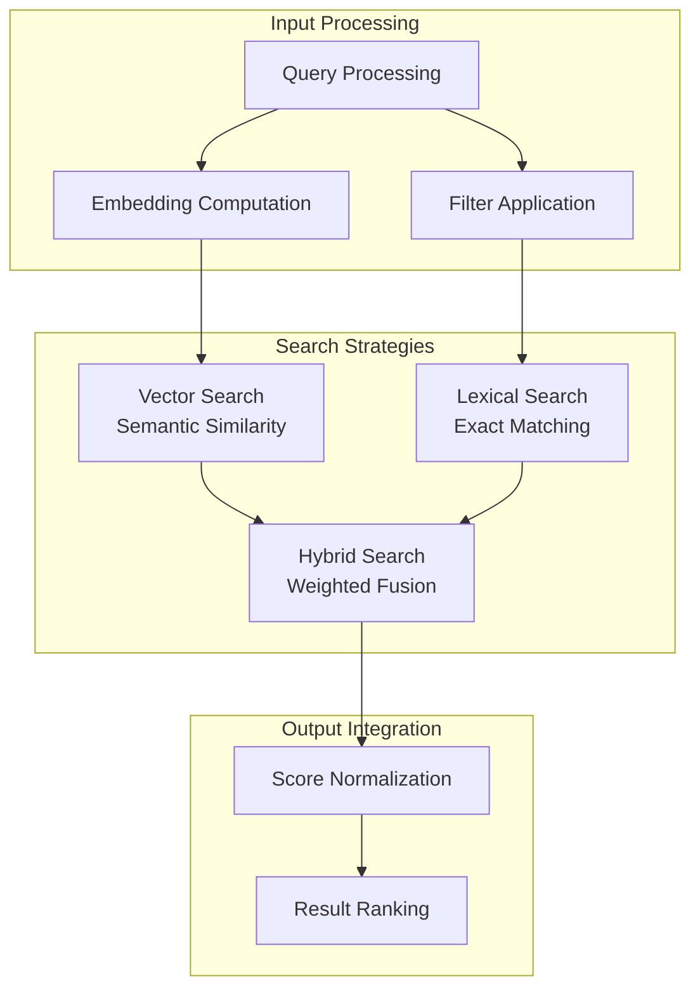
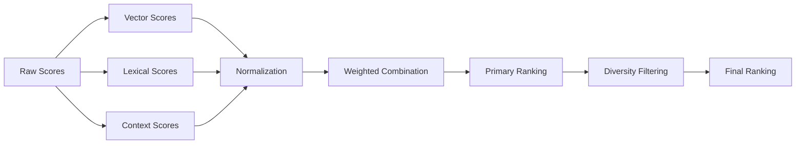
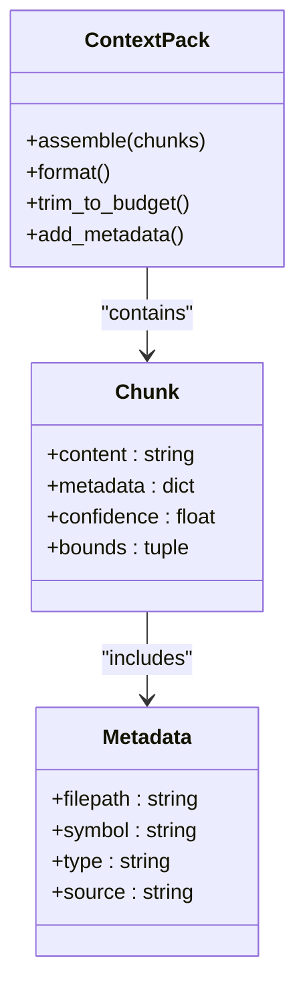
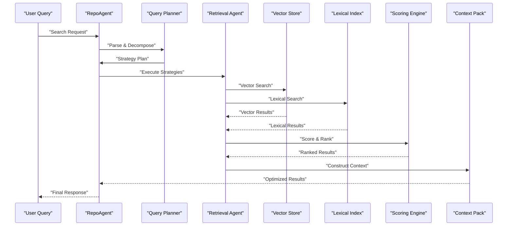

# Search and Retrieval

<cite>
**Referenced Files in This Document**
- [repo_agent.py](file://src/rag/agents/repo_agent.py)
- [retrieval.py](file://src/rag/agents/retrieval.py)
- [query.py](file://src/rag/core/query.py)
- [vectorstore.py](file://src/rag/core/vectorstore.py)
- [scoring.py](file://src/rag/core/scoring.py)
- [indexer.py](file://src/rag/core/indexer.py)
- [chunker.py](file://src/rag/core/chunker.py)
- [embedder.py](file://src/rag/core/embedder.py)
- [cache.py](file://src/rag/core/cache.py)
- [ast_index.py](file://src/rag/core/ast_index.py)
- [crossref.py](file://src/rag/core/crossref.py)
- [patterns.py](file://src/rag/core/patterns.py)
- [default.toml](file://config/default.toml)
- [default.toml](file://src/rag/default.toml)
</cite>

## Update Summary
**Changes Made**
- Complete overhaul of Search and Retrieval documentation with comprehensive coverage of all four key areas
- Added dedicated sections for Query Planning and Strategy Selection
- Expanded Search Algorithms and Strategies documentation
- Enhanced Result Scoring and Ranking section with detailed mechanisms
- Improved Context Pack Construction documentation
- Updated all diagrams to reflect the new comprehensive structure
- Added practical examples and troubleshooting guidance

## Table of Contents
1. [Introduction](#introduction)
2. [Query Planning and Strategy Selection](#query-planning-and-strategy-selection)
3. [Search Algorithms and Strategies](#search-algorithms-and-strategies)
4. [Result Scoring and Ranking](#result-scoring-and-ranking)
5. [Context Pack Construction](#context-pack-construction)
6. [Architecture Overview](#architecture-overview)
7. [Detailed Component Analysis](#detailed-component-analysis)
8. [Performance Considerations](#performance-considerations)
9. [Troubleshooting Guide](#troubleshooting-guide)
10. [Practical Examples](#practical-examples)
11. [Configuration Reference](#configuration-reference)
12. [Conclusion](#conclusion)

## Introduction
This comprehensive documentation covers the multi-strategy search engine and intelligent query planning capabilities of the system. The search and retrieval system implements a sophisticated pipeline that combines dense vector search, lexical lookup, and hybrid approaches, all orchestrated by an intelligent query planner. The system supports complex query decomposition, symbol resolution, context pack construction, and result scoring with token budgeting mechanisms.

The architecture centers around the RepoAgent's orchestration across multiple sources and the Retrieval agent's execution of selected strategies. This documentation provides both conceptual understanding and technical depth for developers implementing custom search strategies.

## Query Planning and Strategy Selection
The query planning phase transforms natural language queries into executable retrieval plans through intelligent strategy selection and decomposition.

### Query Decomposition Process
Natural language queries undergo systematic parsing and decomposition:
- Intent identification and entity extraction
- Symbol resolution using AST indices and cross-references
- Filter extraction and validation
- Multi-step plan generation with operator precedence

### Strategy Selection Mechanisms
The system employs a decision matrix for strategy selection:
- **Dense Vector Strategy**: Selected for semantic queries requiring contextual understanding
- **Lexical Strategy**: Chosen for exact pattern matching and symbol lookups
- **Hybrid Strategy**: Applied when both semantic and exact matching are beneficial
- **Multi-Source Strategy**: Used for cross-repository and cross-language queries

### Pattern-Based Query Rewriting
Advanced pattern recognition enables query optimization:
- Common query templates detection
- Automatic filter inference from context
- Composite query decomposition
- Cross-reference chain resolution

**Diagram sources**
- [query.py](file://src/rag/core/query.py)
- [patterns.py](file://src/rag/core/patterns.py)
- [ast_index.py](file://src/rag/core/ast_index.py)
- [crossref.py](file://src/rag/core/crossref.py)

**Section sources**
- [query.py](file://src/rag/core/query.py)
- [patterns.py](file://src/rag/core/patterns.py)
- [ast_index.py](file://src/rag/core/ast_index.py)
- [crossref.py](file://src/rag/core/crossref.py)

## Search Algorithms and Strategies
The system implements three primary search strategies with sophisticated hybridization capabilities.

### Dense Vector Search Implementation
Vector search leverages pre-computed embeddings for semantic similarity:
- **Embedding Computation**: Query and document embeddings generated using configured models
- **Similarity Metrics**: Configurable distance functions (cosine, euclidean, dot product)
- **Filter Integration**: Real-time filtering during vector operations
- **Top-K Optimization**: Efficient candidate retrieval with pruning strategies

### Lexical Lookup and AST Integration
Text-based search utilizing structural awareness:
- **AST Index Utilization**: Symbol definitions and references resolved through abstract syntax trees
- **Cross-Reference Mapping**: Declaration-to-usage and usage-to-declaration relationships
- **Chunk Boundary Alignment**: Structural unit-based chunking preserves semantic boundaries
- **Pattern Matching**: Regular expressions and structural patterns for enhanced recall

### Hybrid Search Architecture
Integrating multiple signal sources:
- **Weighted Combination**: Configurable fusion of vector and lexical scores
- **Normalization Techniques**: Score standardization across different scales
- **Adaptive Weighting**: Dynamic weight adjustment based on query characteristics
- **Confidence Scoring**: Multi-modal confidence estimation

**Diagram sources**
- [vectorstore.py](file://src/rag/core/vectorstore.py)
- [embedder.py](file://src/rag/core/embedder.py)
- [scoring.py](file://src/rag/core/scoring.py)
- [ast_index.py](file://src/rag/core/ast_index.py)
- [crossref.py](file://src/rag/core/crossref.py)

**Section sources**
- [vectorstore.py](file://src/rag/core/vectorstore.py)
- [embedder.py](file://src/rag/core/embedder.py)
- [scoring.py](file://src/rag/core/scoring.py)
- [ast_index.py](file://src/rag/core/ast_index.py)
- [crossref.py](file://src/rag/core/crossref.py)
- [chunker.py](file://src/rag/core/chunker.py)

## Result Scoring and Ranking
The scoring system integrates multiple evidence sources with sophisticated normalization and ranking mechanisms.

### Multi-Modal Score Integration
Scores from different strategies are harmonized through:
- **Vector Similarity Scores**: Cosine similarity and distance-based metrics
- **Lexical Match Scores**: Exact match weights and proximity scoring
- **Contextual Relevance**: Position-based and structural importance weighting
- **Confidence Estimation**: Multi-source confidence aggregation

### Normalization and Weighting
Consistent score scaling across different modalities:
- **Min-Max Normalization**: Feature-wise score scaling to common range
- **Z-Score Standardization**: Distribution-based normalization
- **Adaptive Weighting**: Query-dependent score weight adjustment
- **Threshold Filtering**: Initial score-based candidate pruning

### Ranking and Reranking
Sophisticated ordering mechanisms:
- **Primary Ranking**: Multi-criteria sorting with configurable weights
- **Secondary Reranking**: Fine-grained reordering based on contextual factors
- **Diversity Enhancement**: Redundancy reduction across final results
- **Quality Gates**: Minimum score thresholds and relevance filtering

**Diagram sources**
- [scoring.py](file://src/rag/core/scoring.py)
- [vectorstore.py](file://src/rag/core/vectorstore.py)
- [ast_index.py](file://src/rag/core/ast_index.py)

**Section sources**
- [scoring.py](file://src/rag/core/scoring.py)
- [vectorstore.py](file://src/rag/core/vectorstore.py)
- [ast_index.py](file://src/rag/core/ast_index.py)

## Context Pack Construction
The context pack assembly process creates cohesive, structured contexts for downstream processing.

### Chunk Assembly and Metadata Integration
Relevant document chunks are systematically assembled:
- **Semantic Grouping**: Logically related chunks grouped by topic and context
- **Metadata Enrichment**: File paths, symbol definitions, confidence scores, and provenance
- **Boundary Preservation**: Structural boundaries maintained to prevent context fragmentation
- **Redundancy Elimination**: Duplicate and overlapping content removed

### Formatting and Presentation
Structured presentation for downstream consumption:
- **Hierarchical Organization**: Nested structure reflecting document hierarchy
- **Reference Anchoring**: Cross-references and citations properly formatted
- **Noise Reduction**: Non-essential content filtered out
- **Format Standardization**: Consistent structure across different source types

### Token Budget Management
Efficient context construction within resource constraints:
- **Dynamic Trimming**: Context size adjusted based on available token budget
- **Priority-Based Selection**: Higher confidence and relevance content prioritized
- **Progressive Loading**: Context expanded incrementally as needed
- **Fallback Strategies**: Alternative content selection when budget constraints apply

**Diagram sources**
- [scoring.py](file://src/rag/core/scoring.py)
- [chunker.py](file://src/rag/core/chunker.py)

**Section sources**
- [scoring.py](file://src/rag/core/scoring.py)
- [chunker.py](file://src/rag/core/chunker.py)

## Architecture Overview
The search and retrieval system follows a modular, pipeline-based architecture with intelligent orchestration.

### System Architecture
The architecture consists of interconnected modules working in concert:
- **RepoAgent**: Central coordinator managing multi-source retrieval operations
- **Retrieval Agent**: Executes specific search strategies and aggregates results
- **Query Planner**: Transforms natural language into executable retrieval plans
- **Scoring Engine**: Integrates and ranks results from multiple sources
- **Context Manager**: Constructs and optimizes final result packages

### Data Flow Pipeline
Information flows through a well-defined pipeline:
1. Query input and parsing
2. Strategy selection and plan generation
3. Concurrent execution of selected strategies
4. Result integration and scoring
5. Context pack construction and optimization
6. Final result delivery

**Diagram sources**
- [repo_agent.py](file://src/rag/agents/repo_agent.py)
- [retrieval.py](file://src/rag/agents/retrieval.py)
- [query.py](file://src/rag/core/query.py)
- [vectorstore.py](file://src/rag/core/vectorstore.py)
- [scoring.py](file://src/rag/core/scoring.py)

**Section sources**
- [repo_agent.py](file://src/rag/agents/repo_agent.py)
- [retrieval.py](file://src/rag/agents/retrieval.py)
- [query.py](file://src/rag/core/query.py)
- [vectorstore.py](file://src/rag/core/vectorstore.py)
- [scoring.py](file://src/rag/core/scoring.py)

## Detailed Component Analysis

### RepoAgent Coordination
The RepoAgent serves as the central orchestrator for multi-source retrieval operations.

#### Multi-Repository Management
- **Repository Scoping**: Intelligent filtering of repositories based on query context
- **Source Coordination**: Synchronized execution across multiple data sources
- **Result Consolidation**: Unified result set with source attribution and provenance
- **Resource Management**: Balanced workload distribution across repositories

#### Strategy Execution Management
- **Concurrent Processing**: Parallel execution of multiple search strategies
- **Progressive Refinement**: Iterative improvement through successive strategy application
- **Failure Recovery**: Graceful handling of partial failures across sources
- **Performance Monitoring**: Real-time tracking of execution metrics and bottlenecks

**Section sources**
- [repo_agent.py](file://src/rag/agents/repo_agent.py)

### Retrieval Agent Operations
The Retrieval Agent executes specific search strategies and manages result integration.

#### Strategy Execution Engine
- **Vector Strategy Handler**: Manages embedding computation and similarity search
- **Lexical Strategy Handler**: Coordinates text-based matching and pattern recognition
- **Hybrid Strategy Coordinator**: Integrates results from multiple strategies
- **Real-time Filtering**: Dynamic filter application during search execution

#### Result Integration and Quality Control
- **Cross-Source Deduplication**: Removal of duplicate results across different sources
- **Quality Assessment**: Confidence scoring and relevance validation
- **Context Enhancement**: Additional metadata enrichment for results
- **Performance Optimization**: Caching and result reuse strategies

**Section sources**
- [retrieval.py](file://src/rag/agents/retrieval.py)

### Vector Store Operations
The vector store provides efficient similarity search capabilities.

#### Embedding Management
- **Embedding Computation**: On-demand and batch embedding generation
- **Storage Optimization**: Efficient vector storage with compression techniques
- **Index Maintenance**: Regular updates to embedding indexes
- **Memory Management**: Optimized memory usage for large-scale embeddings

#### Search Optimization
- **Approximate Nearest Neighbor**: Scalable similarity search implementation
- **Filter Integration**: Real-time filtering during vector operations
- **Batch Processing**: Efficient batch query processing
- **Performance Tuning**: Configurable parameters for different use cases

**Section sources**
- [vectorstore.py](file://src/rag/core/vectorstore.py)
- [embedder.py](file://src/rag/core/embedder.py)

### Caching and Performance Optimization
Comprehensive caching strategies ensure optimal performance across repeated operations.

#### Multi-Level Caching Architecture
- **Embedding Cache**: Persistent storage of computed embeddings
- **Search Result Cache**: Cached results with expiration policies
- **Intermediate Result Cache**: Caching of partially computed results
- **Configuration Cache**: Optimized parameter configurations

#### Cache Management Policies
- **Eviction Strategies**: LRU and LFU cache replacement policies
- **Consistency Guarantees**: Cache invalidation and synchronization
- **Performance Monitoring**: Cache hit rate and effectiveness tracking
- **Resource Optimization**: Memory usage optimization and tuning

**Section sources**
- [cache.py](file://src/rag/core/cache.py)

## Performance Considerations
The system implements comprehensive performance optimization strategies across all components.

### Optimization Strategies
- **Early Pruning**: Strategic filtering to reduce candidate sets before expensive operations
- **Parallel Processing**: Concurrent execution of independent search strategies
- **Memory Optimization**: Efficient memory usage through streaming and batching
- **Network Optimization**: Minimized data transfer through intelligent caching

### Scalability Features
- **Horizontal Scaling**: Support for distributed vector storage and processing
- **Load Balancing**: Intelligent distribution of workloads across resources
- **Resource Pooling**: Shared resource management for multiple concurrent searches
- **Adaptive Scaling**: Dynamic resource allocation based on workload demands

### Monitoring and Profiling
- **Performance Metrics**: Comprehensive tracking of query latency and throughput
- **Resource Usage**: Monitoring of CPU, memory, and storage utilization
- **Cache Effectiveness**: Tracking of cache hit rates and optimization opportunities
- **Error Rate Monitoring**: Proactive identification of performance degradation

## Troubleshooting Guide
Comprehensive troubleshooting guidance for common search and retrieval issues.

### Common Issues and Solutions
- **Poor Query Understanding**: Verify query parsing configuration and pattern recognition
- **Slow Search Performance**: Check vector store indexing status and embedding cache effectiveness
- **Low Recall Rates**: Review lexical index completeness and cross-reference accuracy
- **High Latency**: Analyze network connectivity and resource utilization patterns

### Diagnostic Procedures
- **Query Analysis**: Examine query decomposition and strategy selection decisions
- **Performance Profiling**: Identify bottlenecks in the search pipeline
- **Resource Monitoring**: Track memory usage and computational overhead
- **Integration Testing**: Validate component interactions and data flow

### Configuration Optimization
- **Parameter Tuning**: Adjust similarity thresholds and ranking weights
- **Index Maintenance**: Regular updates to vector and lexical indexes
- **Cache Configuration**: Optimize cache sizes and eviction policies
- **Resource Allocation**: Balance system resources across competing demands

**Section sources**
- [cache.py](file://src/rag/core/cache.py)
- [vectorstore.py](file://src/rag/core/vectorstore.py)
- [ast_index.py](file://src/rag/core/ast_index.py)
- [crossref.py](file://src/rag/core/crossref.py)

## Practical Examples
Real-world scenarios demonstrating the system's capabilities and proper result interpretation.

### Complex Query Scenarios
- **Multi-Repository Symbol Search**: Finding all implementations of a function across multiple repositories
- **Cross-Language Reference**: Locating related code patterns across different programming languages
- **Historical Context Analysis**: Understanding evolution of design patterns over time
- **Requirement Traceability**: Mapping requirements to implementation across large codebases

### Result Interpretation Guidelines
- **Confidence Scoring**: Understanding score distributions and confidence intervals
- **Source Attribution**: Properly attributing results to their originating repositories
- **Contextual Relevance**: Interpreting results within their original context
- **Quality Assessment**: Evaluating result quality and relevance for specific use cases

### Advanced Usage Patterns
- **Iterative Refinement**: Using initial results to guide subsequent search iterations
- **Cross-Reference Exploration**: Leveraging symbol relationships for deeper insights
- **Pattern Recognition**: Identifying common patterns and anti-patterns across codebases
- **Knowledge Graph Construction**: Building semantic relationships from retrieved results

## Configuration Reference
Comprehensive configuration options for optimizing search and retrieval performance.

### Core Configuration Parameters
- **Embedding Model Settings**: Model selection, dimensionality, and computational requirements
- **Vector Store Parameters**: Index type, similarity metric, and storage configuration
- **Indexing Configuration**: Chunk size, overlap, and structural boundary handling
- **Scoring Weights**: Strategy-specific weights and normalization parameters
- **Token Budget Limits**: Context size constraints and budget management policies

### Advanced Configuration Options
- **Strategy Selection Criteria**: Thresholds and heuristics for automatic strategy selection
- **Caching Policies**: Cache sizes, expiration times, and eviction strategies
- **Parallel Processing Limits**: Concurrency limits and resource allocation
- **Monitoring and Logging**: Performance metrics collection and diagnostic options

**Section sources**
- [default.toml](file://src/rag/default.toml)
- [default.toml](file://config/default.toml)

## Conclusion
The comprehensive search and retrieval system provides a robust foundation for intelligent code search and discovery. Through its multi-strategy approach, intelligent query planning, and sophisticated scoring mechanisms, the system delivers both precision and recall across diverse codebases and use cases.

The modular architecture ensures scalability and maintainability while the extensive configuration options allow for fine-tuned optimization across different deployment scenarios. The system's ability to handle complex, multi-source queries makes it particularly valuable for large-scale development environments and research applications.

Future enhancements will continue to focus on improving query understanding, expanding support for additional data types, and optimizing performance for increasingly large codebases and distributed environments.