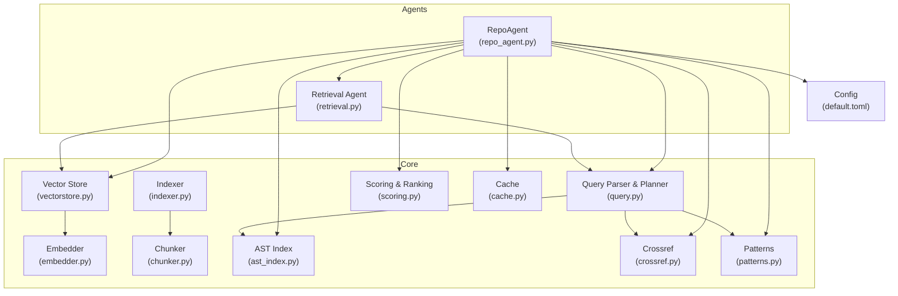
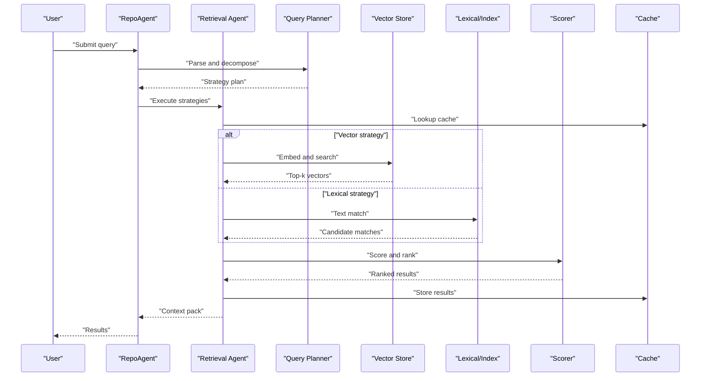
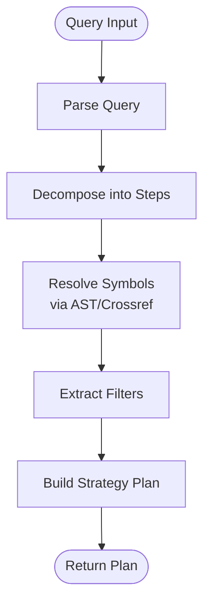
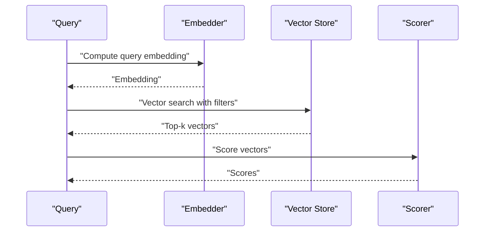
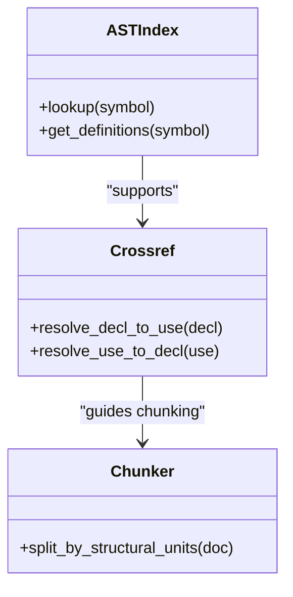
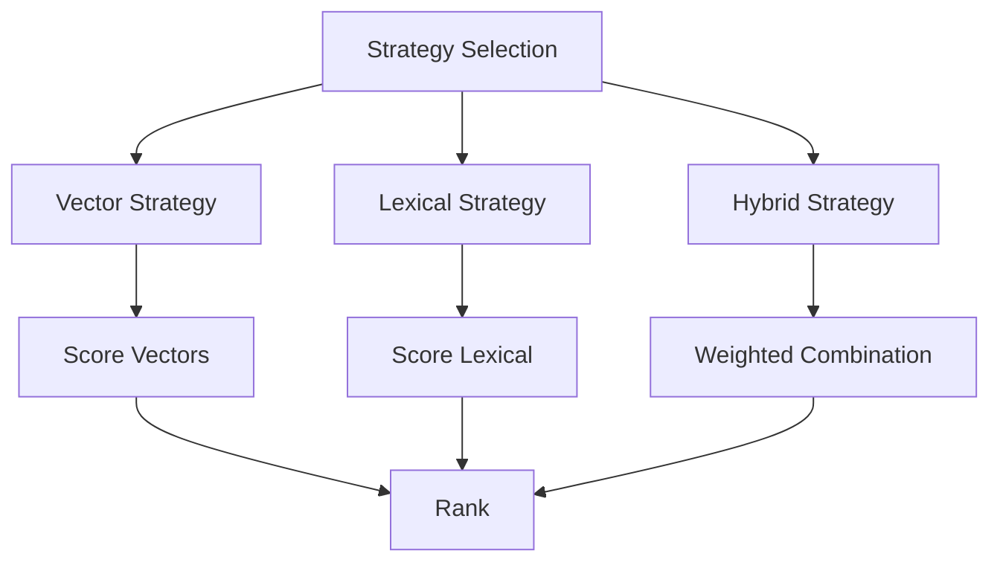
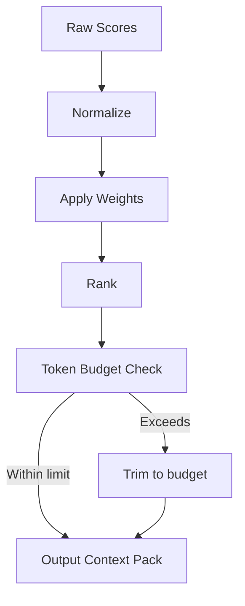
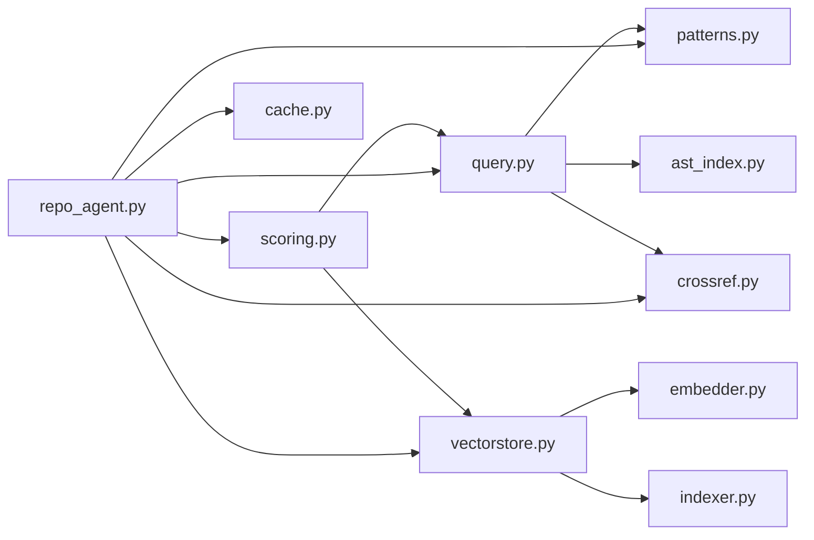

# Search and Retrieval

<cite>
**Referenced Files in This Document**
- [repo_agent.py](file://src/rag/agents/repo_agent.py)
- [retrieval.py](file://src/rag/agents/retrieval.py)
- [query.py](file://src/rag/core/query.py)
- [vectorstore.py](file://src/rag/core/vectorstore.py)
- [scoring.py](file://src/rag/core/scoring.py)
- [indexer.py](file://src/rag/core/indexer.py)
- [chunker.py](file://src/rag/core/chunker.py)
- [embedder.py](file://src/rag/core/embedder.py)
- [cache.py](file://src/rag/core/cache.py)
- [ast_index.py](file://src/rag/core/ast_index.py)
- [crossref.py](file://src/rag/core/crossref.py)
- [patterns.py](file://src/rag/core/patterns.py)
- [default.toml](file://config/default.toml)
- [default.toml](file://src/rag/default.toml)
</cite>

## Table of Contents
1. [Introduction](#introduction)
2. [Project Structure](#project-structure)
3. [Core Components](#core-components)
4. [Architecture Overview](#architecture-overview)
5. [Detailed Component Analysis](#detailed-component-analysis)
6. [Dependency Analysis](#dependency-analysis)
7. [Performance Considerations](#performance-considerations)
8. [Troubleshooting Guide](#troubleshooting-guide)
9. [Conclusion](#conclusion)
10. [Appendices](#appendices)

## Introduction
This document explains the search and retrieval capabilities of the system with a focus on multi-strategy search engines and intelligent query planning. It covers dense vector search, lexical lookup, and hybrid approaches; query decomposition and symbol resolution; context pack construction; the Agno query planner’s strategy selection; and the RepoAgent’s orchestration across multiple sources. It also documents result scoring, ranking, token budgeting, query syntax, filtering, and advanced patterns, with practical examples and troubleshooting guidance.

## Project Structure
The search and retrieval stack is primarily implemented under src/rag/core and src/rag/agents. Key modules include:
- Agents: RepoAgent orchestrates retrieval across repositories and sources; Retrieval agent coordinates search strategies.
- Core: Query parsing and decomposition; vector store and embedding; indexing and chunking; scoring and ranking; caching; AST indexing and cross-references; pattern matching; and configuration.

**Diagram sources**
- [repo_agent.py](file://src/rag/agents/repo_agent.py)
- [retrieval.py](file://src/rag/agents/retrieval.py)
- [query.py](file://src/rag/core/query.py)
- [vectorstore.py](file://src/rag/core/vectorstore.py)
- [embedder.py](file://src/rag/core/embedder.py)
- [indexer.py](file://src/rag/core/indexer.py)
- [chunker.py](file://src/rag/core/chunker.py)
- [scoring.py](file://src/rag/core/scoring.py)
- [cache.py](file://src/rag/core/cache.py)
- [ast_index.py](file://src/rag/core/ast_index.py)
- [crossref.py](file://src/rag/core/crossref.py)
- [patterns.py](file://src/rag/core/patterns.py)
- [default.toml](file://src/rag/default.toml)

**Section sources**
- [repo_agent.py](file://src/rag/agents/repo_agent.py)
- [retrieval.py](file://src/rag/agents/retrieval.py)
- [query.py](file://src/rag/core/query.py)
- [vectorstore.py](file://src/rag/core/vectorstore.py)
- [scoring.py](file://src/rag/core/scoring.py)
- [indexer.py](file://src/rag/core/indexer.py)
- [chunker.py](file://src/rag/core/chunker.py)
- [embedder.py](file://src/rag/core/embedder.py)
- [cache.py](file://src/rag/core/cache.py)
- [ast_index.py](file://src/rag/core/ast_index.py)
- [crossref.py](file://src/rag/core/crossref.py)
- [patterns.py](file://src/rag/core/patterns.py)
- [default.toml](file://src/rag/default.toml)

## Core Components
- Query decomposition and planning: Parses natural-language queries, identifies intent, decomposes into executable steps, and selects strategies (dense vector, lexical, hybrid).
- Vector search: Embeddings-based similarity search with configurable distance metrics and filters.
- Lexical lookup: Text-based matching via indices and AST structures.
- Hybrid search: Combines multiple signals with learned or configured weights.
- Scoring and ranking: Aggregates scores from multiple strategies, normalizes, and ranks results.
- Context pack construction: Assembles relevant chunks and metadata into a cohesive context for downstream tasks.
- Token budgeting: Enforces limits on prompt tokens to keep costs and latency manageable.
- Caching: Reuses embeddings and search results to improve performance and reduce load.
- Pattern matching and cross-references: Enhances recall by leveraging structural and semantic relationships.

**Section sources**
- [query.py](file://src/rag/core/query.py)
- [vectorstore.py](file://src/rag/core/vectorstore.py)
- [scoring.py](file://src/rag/core/scoring.py)
- [cache.py](file://src/rag/core/cache.py)
- [patterns.py](file://src/rag/core/patterns.py)
- [crossref.py](file://src/rag/core/crossref.py)
- [ast_index.py](file://src/rag/core/ast_index.py)

## Architecture Overview
The system integrates a planner-driven retrieval pipeline:
- RepoAgent coordinates retrieval across repositories and sources.
- The Retrieval agent executes selected strategies and aggregates results.
- Query decomposition leverages patterns, AST indices, and cross-references.
- Vector search and lexical lookup feed into a unified scoring and ranking stage.
- Results are constrained by token budgets and cached when appropriate.

**Diagram sources**
- [repo_agent.py](file://src/rag/agents/repo_agent.py)
- [retrieval.py](file://src/rag/agents/retrieval.py)
- [query.py](file://src/rag/core/query.py)
- [vectorstore.py](file://src/rag/core/vectorstore.py)
- [scoring.py](file://src/rag/core/scoring.py)
- [cache.py](file://src/rag/core/cache.py)

## Detailed Component Analysis

### Query Decomposition and Symbol Resolution
- Natural language queries are parsed into structured plans with operators for retrieval, filtering, and aggregation.
- Symbol resolution resolves identifiers to concrete entities (files, functions, classes) using AST indices and cross-references.
- Filters are extracted and applied during both lexical and vector search stages.
- Pattern matching enhances recall by recognizing common query templates and rewriting them into executable forms.

**Diagram sources**
- [query.py](file://src/rag/core/query.py)
- [patterns.py](file://src/rag/core/patterns.py)
- [ast_index.py](file://src/rag/core/ast_index.py)
- [crossref.py](file://src/rag/core/crossref.py)

**Section sources**
- [query.py](file://src/rag/core/query.py)
- [patterns.py](file://src/rag/core/patterns.py)
- [ast_index.py](file://src/rag/core/ast_index.py)
- [crossref.py](file://src/rag/core/crossref.py)

### Dense Vector Search
- Embeddings are computed for query and document chunks using the embedder module.
- Vector search retrieves top-k candidates based on similarity; filters can be applied to restrict the candidate set.
- Distance metrics and normalization are configurable to balance precision and recall.

**Diagram sources**
- [embedder.py](file://src/rag/core/embedder.py)
- [vectorstore.py](file://src/rag/core/vectorstore.py)
- [scoring.py](file://src/rag/core/scoring.py)

**Section sources**
- [vectorstore.py](file://src/rag/core/vectorstore.py)
- [embedder.py](file://src/rag/core/embedder.py)
- [scoring.py](file://src/rag/core/scoring.py)

### Lexical Lookup and AST Indexing
- Lexical matching uses pre-built indices and AST structures to locate relevant symbols and textual occurrences.
- Cross-reference links connect declarations to usages, improving recall for symbol-heavy queries.
- Chunk boundaries align with structural units to preserve meaning and improve relevance.

**Diagram sources**
- [ast_index.py](file://src/rag/core/ast_index.py)
- [crossref.py](file://src/rag/core/crossref.py)
- [chunker.py](file://src/rag/core/chunker.py)

**Section sources**
- [ast_index.py](file://src/rag/core/ast_index.py)
- [crossref.py](file://src/rag/core/crossref.py)
- [chunker.py](file://src/rag/core/chunker.py)

### Hybrid Search and Strategy Selection
- The planner selects among dense vector, lexical, and hybrid strategies based on query characteristics and available indices.
- Hybrid scoring combines vector and lexical signals with configurable weights and normalization.

**Diagram sources**
- [query.py](file://src/rag/core/query.py)
- [vectorstore.py](file://src/rag/core/vectorstore.py)
- [scoring.py](file://src/rag/core/scoring.py)

**Section sources**
- [query.py](file://src/rag/core/query.py)
- [scoring.py](file://src/rag/core/scoring.py)

### Result Scoring, Ranking, and Token Budgeting
- Scores from multiple strategies are normalized and combined; optional reranking can refine order.
- Token budgeting constrains the total context size passed to downstream steps, ensuring cost and latency controls.
- Caching avoids recomputation of embeddings and repeated search results.

**Diagram sources**
- [scoring.py](file://src/rag/core/scoring.py)
- [cache.py](file://src/rag/core/cache.py)

**Section sources**
- [scoring.py](file://src/rag/core/scoring.py)
- [cache.py](file://src/rag/core/cache.py)

### Context Pack Construction
- Chunks are assembled with metadata (file path, symbol, confidence score).
- Context packs are formatted for downstream consumption, preserving structure and minimizing noise.

**Section sources**
- [scoring.py](file://src/rag/core/scoring.py)

### RepoAgent Coordination Across Sources
- RepoAgent orchestrates retrieval across repositories and sources, applying per-source filters and coordinating strategy execution.
- It consolidates results and ensures consistent context packaging.

**Section sources**
- [repo_agent.py](file://src/rag/agents/repo_agent.py)

### Query Syntax, Filtering, and Advanced Patterns
- Queries support filtering by file patterns, symbol types, and repository scopes.
- Advanced patterns enable multi-target queries, cross-file references, and composite strategies.

**Section sources**
- [query.py](file://src/rag/core/query.py)
- [patterns.py](file://src/rag/core/patterns.py)

### Practical Examples and Result Interpretation
- Example 1: “Find all usages of the function named X in the current repository.”
  - Decomposition: resolve symbol X, lexical search for usages, vector refinement if needed.
  - Result interpretation: prioritize declarations closest to usage sites; filter out unrelated matches.
- Example 2: “Explain how Y is implemented across files.”
  - Decomposition: resolve Y, lexical search for definitions and related comments, AST-based cross-references.
  - Result interpretation: group by file and symbol; highlight key implementation points.
- Example 3: “Compare two similar functions Z1 and Z2 across modules.”
  - Decomposition: resolve both symbols, lexical and vector search, weighted hybrid scoring.
  - Result interpretation: align matched chunks by symbol; present side-by-side summaries.

[No sources needed since this section provides conceptual examples]

## Dependency Analysis
The retrieval pipeline exhibits strong cohesion around query planning and scoring, with clear separation of concerns:
- Query planner depends on patterns, AST index, and crossref.
- Vector store depends on embedder and indexing infrastructure.
- Scoring integrates lexical and vector signals.
- RepoAgent composes these modules into a cohesive retrieval workflow.

**Diagram sources**
- [query.py](file://src/rag/core/query.py)
- [patterns.py](file://src/rag/core/patterns.py)
- [ast_index.py](file://src/rag/core/ast_index.py)
- [crossref.py](file://src/rag/core/crossref.py)
- [vectorstore.py](file://src/rag/core/vectorstore.py)
- [embedder.py](file://src/rag/core/embedder.py)
- [indexer.py](file://src/rag/core/indexer.py)
- [scoring.py](file://src/rag/core/scoring.py)
- [repo_agent.py](file://src/rag/agents/repo_agent.py)
- [cache.py](file://src/rag/core/cache.py)

**Section sources**
- [query.py](file://src/rag/core/query.py)
- [vectorstore.py](file://src/rag/core/vectorstore.py)
- [scoring.py](file://src/rag/core/scoring.py)
- [repo_agent.py](file://src/rag/agents/repo_agent.py)
- [patterns.py](file://src/rag/core/patterns.py)
- [ast_index.py](file://src/rag/core/ast_index.py)
- [crossref.py](file://src/rag/core/crossref.py)
- [embedder.py](file://src/rag/core/embedder.py)
- [indexer.py](file://src/rag/core/indexer.py)
- [cache.py](file://src/rag/core/cache.py)

## Performance Considerations
- Embedding reuse: Cache embeddings to avoid recomputation.
- Early pruning: Apply filters early in lexical and vector search to reduce candidate sets.
- Top-k tuning: Adjust k and similarity thresholds to balance precision and recall.
- Chunk alignment: Structural chunking reduces irrelevant context and improves retrieval quality.
- Parallelization: Run lexical and vector strategies concurrently when feasible.
- Token budgeting: Dynamically trim context to fit model limits.

[No sources needed since this section provides general guidance]

## Troubleshooting Guide
- No results returned:
  - Verify indexing completeness and chunk boundaries.
  - Check filters for overly restrictive conditions.
  - Confirm embeddings are enabled and not empty.
- Low precision:
  - Increase top-k or adjust similarity threshold.
  - Add more specific filters (file patterns, symbol types).
  - Enable hybrid scoring and tune weights.
- Slow performance:
  - Enable caching for embeddings and search results.
  - Reduce token budget or trim context.
  - Parallelize strategy execution.
- Misresolved symbols:
  - Inspect AST index and cross-reference integrity.
  - Ensure symbol names are unambiguous in the current context.

**Section sources**
- [cache.py](file://src/rag/core/cache.py)
- [vectorstore.py](file://src/rag/core/vectorstore.py)
- [ast_index.py](file://src/rag/core/ast_index.py)
- [crossref.py](file://src/rag/core/crossref.py)

## Conclusion
The system’s retrieval pipeline combines robust query decomposition, flexible strategy selection, and efficient scoring to deliver precise and timely results. By leveraging dense vector search, lexical lookup, and hybrid approaches—guided by the Agno-style planner—and coordinated by the RepoAgent, it supports complex, multi-source queries with strong performance and interpretability.

[No sources needed since this section summarizes without analyzing specific files]

## Appendices

### Configuration Reference
- Key configuration keys include embedding model settings, vector store parameters, indexing chunk sizes, scoring weights, and token budget limits.
- Defaults are provided in the configuration files; override per environment as needed.

**Section sources**
- [default.toml](file://src/rag/default.toml)
- [default.toml](file://config/default.toml)