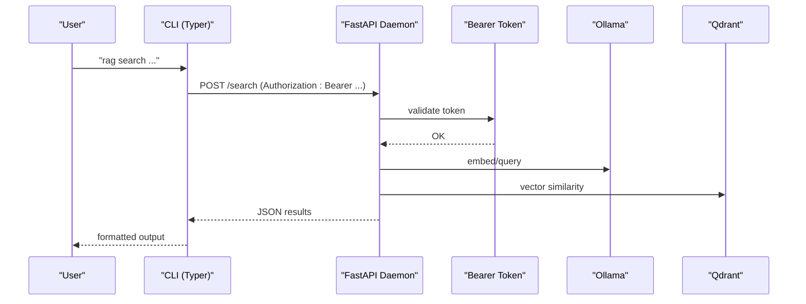
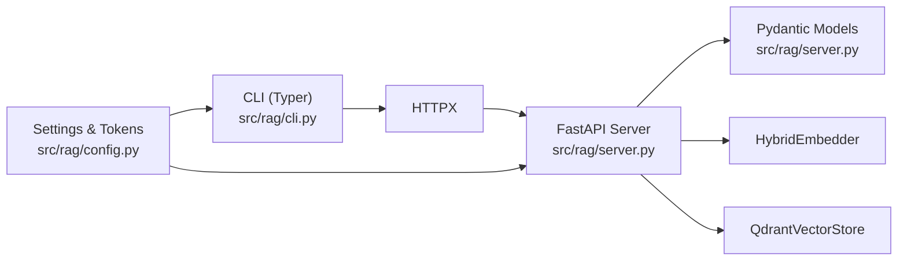

# CLI Interface

<cite>
**Referenced Files in This Document**
- [cli.py](file://src/rag/cli.py)
- [__main__.py](file://src/rag/__main__.py)
- [app.py](file://src/rag/app.py)
- [config.py](file://src/rag/config.py)
- [server.py](file://src/rag/server.py)
- [compose.qdrant.yml](file://compose.qdrant.yml)
- [default.toml](file://config/default.toml)
- [README.md](file://README.md)
- [repo_agent.py](file://src/rag/agents/repo_agent.py)
- [benchmark_efficiency.py](file://tests/eval/benchmark_efficiency.py)
- [benchmark_production_scenarios.py](file://benchmark_production_scenarios.py)
</cite>

## Update Summary
**Changes Made**
- Updated repo-agent command documentation to reflect two-phase blast-radius strategy with enhanced usage filtering
- Added documentation for improved reporting of filtered usage counts and blast radius analysis
- Updated model configuration to reflect Gemini 3 Flash integration
- Enhanced performance metrics documentation with new evaluation metrics
- Added benchmarking improvements and token efficiency reporting

## Table of Contents
1. [Introduction](#introduction)
2. [Project Structure](#project-structure)
3. [Core Components](#core-components)
4. [Architecture Overview](#architecture-overview)
5. [Detailed Component Analysis](#detailed-component-analysis)
6. [Dependency Analysis](#dependency-analysis)
7. [Performance Considerations](#performance-considerations)
8. [Troubleshooting Guide](#troubleshooting-guide)
9. [Conclusion](#conclusion)
10. [Appendices](#appendices)

## Introduction
This document provides comprehensive CLI documentation for the RAG command-line interface. It covers all CLI commands, their parameters, usage examples, expected outputs, authentication, error handling, configuration, and operational workflows. The CLI is a thin Typer-based client that communicates with a headless FastAPI daemon over HTTP, protected by a bearer token stored under the user's home directory.

**Updated** Enhanced with two-phase strategy support, improved usage filtering, and comprehensive performance metrics reporting.

## Project Structure
The CLI is implemented as a Typer application with subcommands for initialization, daemon lifecycle, search, context retrieval, agent orchestration, TUI and web dashboards, Qdrant management, benchmarking, and diagnostics. The daemon is a FastAPI server that validates requests, enforces authentication, and serves endpoints for search, indexing, and introspection.

```mermaid
graph TB
subgraph "CLI Layer"
CLI["Typer CLI<br/>src/rag/cli.py"]
MAIN["Entry Point<br/>src/rag/__main__.py"]
ENDPOINTS["HTTP Endpoints<br/>src/rag/server.py"]
ENDPOINTS --> SEARCH["Search<br/>/search"]
ENDPOINTS --> CONTEXT["Context Pack<br/>/context-pack"]
ENDPOINTS --> RESOLVE["Resolve<br/>/resolve"]
ENDPOINTS --> STATUS["System Status<br/>/status"]
ENDPOINTS --> HEALTH["Health Check<br/>/health"]
ENDPOINTS --> ASK["Grounded QA<br/>/ask"]
ENDPOINTS --> INDEX["Indexing<br/>/index"]
ENDPOINTS --> GRAPH["Graph Queries<br/>/graph/*"]
ENDPOINTS --> COLLECTIONS["Collections<br/>/collections"]
ENDPOINTS --> DOCS["Docs Index<br/>/index/docs"]
ENDPOINTS --> OVERVIEW["Overview<br/>/overview"]
ENDPOINTS --> DIFF["Diff Search<br/>/diff"]
ENDPOINTS --> EVENTS["Event Catalog<br/>/generate-event-catalog"]
ENDPOINTS --> EXPORT["Export/Import<br/>/export,/import"]
ENDPOINTS --> DIAGNOSE["Diagnosis<br/>/diagnose"]
ENDPOINTS --> VERIFY["Verification<br/>/verify,/repair"]
ENDPOINTS --> SERVICE["Service Management<br/>/service"]
ENDPOINTS --> CONFIG["Config Management<br/>/config"]
ENDPOINTS --> REPOS["Multi-Repo<br/>/repos"]
ENDPOINTS --> BACKFILL["Backfill<br/>/backfill-code-index"]
ENDPOINTS --> LIST["List Chunks<br/>/list"]
ENDPOINTS --> FILES["Files List<br/>/files"]
ENDPOINTS --> NODE["Symbol Node<br/>/node"]
ENDPOINTS --> CALLERS["Callers<br/>/callers"]
ENDPOINTS --> CALLEES["Callees<br/>/callees"]
ENDPOINTS --> IMPACT["Impact Analysis<br/>/impact"]
ENDPOINTS --> AFFECTED["Affected Files<br/>/affected"]
ENDPOINTS --> UNDERSTAND["Project Understanding<br/>/understand"]
ENDPOINTS --> ASK["Grounded Question Answering<br/>/ask"]
ENDPOINTS --> LIST["Chunk Enumeration<br/>/list"]
ENDPOINTS --> INDEX["Repository Indexing<br/>/index"]
ENDPOINTS --> INDEX_DOCS["Docs Indexing<br/>/index-docs"]
ENDPOINTS --> GENERATE_EVENT["Event Catalog<br/>/generate-event-catalog"]
ENDPOINTS --> STATUS["System Status<br/>/status"]
ENDPOINTS --> CONFIG["Config Management<br/>/config"]
ENDPOINTS --> REPOS["Multi-Repo<br/>/repos"]
ENDPOINTS --> EXPORT["Data Export<br/>/export"]
ENDPOINTS --> IMPORT["Data Import<br/>/import"]
ENDPOINTS --> DIFF["Git Diff Search<br/>/diff"]
ENDPOINTS --> OVERVIEW["Codebase Overview<br/>/overview"]
ENDPOINTS --> INSTALL_CLAUDE["Claude Code Integration<br/>/install-claude"]
ENDPOINTS --> PLUGINS["Plugin Management<br/>/plugins"]
ENDPOINTS --> COLLECTIONS["Collection Management<br/>/collections"]
ENDPOINTS --> VERIFY["Index Verification<br/>/verify,/repair"]
ENDPOINTS --> SERVICE["Service Management<br/>/service"]
ENDPOINTS --> DIAGNOSE["System Diagnostics<br/>/diagnose"]
ENDPOINTS --> BACKFILL["Code Index Backfill<br/>/backfill-code-index"]
ENDPOINTS --> LIST["Chunk Listing<br/>/list"]
ENDPOINTS --> FILES["File Listing<br/>/files"]
ENDPOINTS --> NODE["Symbol Node<br/>/node"]
ENDPOINTS --> CALLERS["Callers<br/>/callers"]
ENDPOINTS --> CALLEES["Callees<br/>/callees"]
ENDPOINTS --> IMPACT["Impact Analysis<br/>/impact"]
ENDPOINTS --> AFFECTED["Affected Files<br/>/affected"]
ENDPOINTS --> UNDERSTAND["Project Understanding<br/>/understand"]
ENDPOINTS --> ASK["Grounded Question Answering<br/>/ask"]
ENDPOINTS --> LIST["Chunk Enumeration<br/>/list"]
ENDPOINTS --> INDEX["Repository Indexing<br/>/index"]
ENDPOINTS --> INDEX_DOCS["Docs Indexing<br/>/index-docs"]
ENDPOINTS --> GENERATE_EVENT["Event Catalog<br/>/generate-event-catalog"]
ENDPOINTS --> STATUS["System Status<br/>/status"]
ENDPOINTS --> CONFIG["Config Management<br/>/config"]
ENDPOINTS --> REPOS["Multi-Repo<br/>/repos"]
ENDPOINTS --> EXPORT["Data Export<br/>/export"]
ENDPOINTS --> IMPORT["Data Import<br/>/import"]
ENDPOINTS --> DIFF["Git Diff Search<br/>/diff"]
ENDPOINTS --> OVERVIEW["Codebase Overview<br/>/overview"]
ENDPOINTS --> INSTALL_CLAUDE["Claude Code Integration<br/>/install-claude"]
ENDPOINTS --> PLUGINS["Plugin Management<br/>/plugins"]
ENDPOINTS --> COLLECTIONS["Collection Management<br/>/collections"]
ENDPOINTS --> VERIFY["Index Verification<br/>/verify,/repair"]
ENDPOINTS --> SERVICE["Service Management<br/>/service"]
ENDPOINTS --> DIAGNOSE["System Diagnostics<br/>/diagnose"]
ENDPOINTS --> BACKFILL["Code Index Backfill<br/>/backfill-code-index"]
ENDPOINTS --> LIST["Chunk Listing<br/>/list"]
ENDPOINTS --> FILES["File Listing<br/>/files"]
ENDPOINTS --> NODE["Symbol Node<br/>/node"]
ENDPOINTS --> CALLERS["Callers<br/>/callers"]
ENDPOINTS --> CALLEES["Callees<br/>/callees"]
ENDPOINTS --> IMPACT["Impact Analysis<br/>/impact"]
ENDPOINTS --> AFFECTED["Affected Files<br/>/affected"]
ENDPOINTS --> UNDERSTAND["Project Understanding<br/>/understand"]
ENDPOINTS --> ASK["Grounded Question Answering<br/>/ask"]
ENDPOINTS --> LIST["Chunk Enumeration<br/>/list"]
ENDPOINTS --> INDEX["Repository Indexing<br/>/index"]
ENDPOINTS --> INDEX_DOCS["Docs Indexing<br/>/index-docs"]
ENDPOINTS --> GENERATE_EVENT["Event Catalog<br/>/generate-event-catalog"]
ENDPOINTS --> STATUS["System Status<br/>/status"]
ENDPOINTS --> CONFIG["Config Management<br/>/config"]
ENDPOINTS --> REPOS["Multi-Repo<br/>/repos"]
ENDPOINTS --> EXPORT["Data Export<br/>/export"]
ENDPOINTS --> IMPORT["Data Import<br/>/import"]
ENDPOINTS --> DIFF["Git Diff Search<br/>/diff"]
ENDPOINTS --> OVERVIEW["Codebase Overview<br/>/overview"]
ENDPOINTS --> INSTALL_CLAUDE["Claude Code Integration<br/>/install-claude"]
ENDPOINTS --> PLUGINS["Plugin Management<br/>/plugins"]
ENDPOINTS --> COLLECTIONS["Collection Management<br/>/collections"]
ENDPOINTS --> VERIFY["Index Verification<br/>/verify,/repair"]
ENDPOINTS --> SERVICE["Service Management<br/>/service"]
ENDPOINTS --> DIAGNOSE["System Diagnostics<br/>/diagnose"]
ENDPOINTS --> BACKFILL["Code Index Backfill<br/>/backfill-code-index"]
ENDPOINTS --> LIST["Chunk Listing<br/>/list"]
ENDPOINTS --> FILES["File Listing<br/>/files"]
ENDPOINTS --> NODE["Symbol Node<br/>/node"]
ENDPOINTS --> CALLERS["Callers<br/>/callers"]
ENDPOINTS --> CALLEES["Callees<br/>/callees"]
ENDPOINTS --> IMPACT["Impact Analysis<br/>/impact"]
ENDPOINTS --> AFFECTED["Affected Files<br/>/affected"]
ENDPOINTS --> UNDERSTAND["Project Understanding<br/>/understand"]
ENDPOINTS --> ASK["Grounded Question Answering<br/>/ask"]
ENDPOINTS --> LIST["Chunk Enumeration<br/>/list"]
ENDPOINTS --> INDEX["Repository Indexing<br/>/index"]
ENDPOINTS --> INDEX_DOCS["Docs Indexing<br/>/index-docs"]
ENDPOINTS --> GENERATE_EVENT["Event Catalog<br/>/generate-event-catalog"]
ENDPOINTS --> STATUS["System Status<br/>/status"]
ENDPOINTS --> CONFIG["Config Management<br/>/config"]
ENDPOINTS --> REPOS["Multi-Repo<br/>/repos"]
ENDPOINTS --> EXPORT["Data Export<br/>/export"]
ENDPOINTS --> IMPORT["Data Import<br/>/import"]
ENDPOINTS --> DIFF["Git Diff Search<br/>/diff"]
ENDPOINTS --> OVERVIEW["Codebase Overview<br/>/overview"]
ENDPOINTS --> INSTALL_CLAUDE["Claude Code Integration<br/>/install-claude"]
ENDPOINTS --> PLUGINS["Plugin Management<br/>/plugins"]
ENDPOINTS --> COLLECTIONS["Collection Management<br/>/collections"]
ENDPOINTS --> VERIFY["Index Verification<br/>/verify,/repair"]
ENDPOINTS --> SERVICE["Service Management<br/>/service"]
ENDPOINTS --> DIAGNOSE["System Diagnostics<br/>/diagnose"]
ENDPOINTS --> BACKFILL["Code Index Backfill<br/>/backfill-code-index"]
ENDPOINTS --> LIST["Chunk Listing<br/>/list"]
ENDPOINTS --> FILES["File Listing<br/>/files"]
ENDPOINTS --> NODE["Symbol Node<br/>/node"]
ENDPOINTS --> CALLERS["Callers<br/>/callers"]
ENDPOINTS --> CALLEES["Callees<br/>/callees"]
ENDPOINTS --> IMPACT["Impact Analysis<br/>/impact"]
ENDPOINTS --> AFFECTED["Affected Files<br/>/affected"]
ENDPOINTS --> UNDERSTAND["Project Understanding<br/>/understand"]
ENDPOINTS --> ASK["Grounded Question Answering<br/>/ask"]
ENDPOINTS --> LIST["Chunk Enumeration<br/>/list"]
ENDPOINTS --> INDEX["Repository Indexing<br/>/index"]
ENDPOINTS --> INDEX_DOCS["Docs Indexing<br/>/index-docs"]
ENDPOINTS --> GENERATE_EVENT["Event Catalog<br/>/generate-event-catalog"]
ENDPOINTS --> STATUS["System Status<br/>/status"]
ENDPOINTS --> CONFIG["Config Management<br/>/config"]
ENDPOINTS --> REPOS["Multi-Repo<br/>/repos"]
ENDPOINTS --> EXPORT["Data Export<br/>/export"]
ENDPOINTS --> IMPORT["Data Import<br/>/import"]
ENDPOINTS --> DIFF["Git Diff Search<br/>/diff"]
ENDPOINTS --> OVERVIEW["Codebase Overview<br/>/overview"]
ENDPOINTS --> INSTALL_CLAUDE["Claude Code Integration<br/>/install-claude"]
ENDPOINTS --> PLUGINS["Plugin Management<br/>/plugins"]
ENDPOINTS --> COLLECTIONS["Collection Management<br/>/collections"]
ENDPOINTS --> VERIFY["Index Verification<br/>/verify,/repair"]
ENDPOINTS --> SERVICE["Service Management<br/>/service"]
ENDPOINTS --> DIAGNOSE["System Diagnostics<br/>/diagnose"]
ENDPOINTS --> BACKFILL["Code Index Backfill<br/>/backfill-code-index"]
ENDPOINTS --> LIST["Chunk Listing<br/>/list"]
ENDPOINTS --> FILES["File Listing<br/>/files"]
ENDPOINTS --> NODE["Symbol Node<br/>/node"]
ENDPOINTS --> CALLERS["Callers<br/>/callers"]
ENDPOINTS --> CALLEES["Callees<br/>/callees"]
ENDPOINTS --> IMPACT["Impact Analysis<br/>/impact"]
ENDPOINTS --> AFFECTED["Affected Files<br/>/affected"]
ENDPOINTS --> UNDERSTAND["Project Understanding<br/>/understand"]
ENDPOINTS --> ASK["Grounded Question Answering<br/>/ask"]
ENDPOINTS --> LIST["Chunk Enumeration<br/>/list"]
ENDPOINTS --> INDEX["Repository Indexing<br/>/index"]
ENDPOINTS --> INDEX_DOCS["Docs Indexing<br/>/index-docs"]
ENDPOINTS --> GENERATE_EVENT["Event Catalog<br/>/generate-event-catalog"]
ENDPOINTS --> STATUS["System Status<br/>/status"]
ENDPOINTS --> CONFIG["Config Management<br/>/config"]
ENDPOINTS --> REPOS["Multi-Repo<br/>/repos"]
ENDPOINTS --> EXPORT["Data Export<br/>/export"]
ENDPOINTS --> IMPORT["Data Import<br/>/import"]
ENDPOINTS --> DIFF["Git Diff Search<br/>/diff"]
ENDPOINTS --> OVERVIEW["Codebase Overview<br/>/overview"]
ENDPOINTS --> INSTALL_CLAUDE["Claude Code Integration<br/>/install-claude"]
ENDPOINTS --> PLUGINS["Plugin Management<br/>/plugins"]
ENDPOINTS --> COLLECTIONS["Collection Management<br/>/collections"]
ENDPOINTS --> VERIFY["Index Verification<br/>/verify,/repair"]
ENDPOINTS --> SERVICE["Service Management<br/>/service"]
ENDPOINTS --> DIAGNOSE["System Diagnostics<br/>/diagnose"]
ENDPOINTS --> BACKFILL["Code Index Backfill<br/>/backfill-code-index"]
ENDPOINTS --> LIST["Chunk Listing<br/>/list"]
ENDPOINTS --> FILES["File Listing<br/>/files"]
ENDPOINTS --> NODE["Symbol Node<br/>/node"]
ENDPOINTS --> ......
```

**Diagram sources**
- [cli.py:1-200](file://src/rag/cli.py#L1-L200)
- [__main__.py:1-6](file://src/rag/__main__.py#L1-L6)
- [server.py:579-620](file://src/rag/server.py#L579-L620)
- [config.py:23-32](file://src/rag/config.py#L23-L32)

**Section sources**
- [cli.py:1-200](file://src/rag/cli.py#L1-L200)
- [__main__.py:1-6](file://src/rag/__main__.py#L1-L6)
- [README.md:37-74](file://README.md#L37-L74)

## Core Components
- CLI entry point: Typer application with commands for initialization, daemon control, search, context packs, agent workflows, TUI/web dashboards, Qdrant management, benchmarking, and diagnostics.
- Daemon: FastAPI server exposing endpoints for search, indexing, context packs, graph queries, and status. Authentication enforced via Authorization: Bearer token.
- Configuration: TOML-based settings merged from package defaults and user overrides, with runtime validation and token persistence.

Key behaviors:
- Authentication: All protected CLI commands require a running daemon and a valid bearer token read from ~/.rag/token.
- Startup: The CLI can start the daemon in background or foreground, optionally with a file watcher for auto re-indexing.
- Health probing: CLI commands probe /health (unauthenticated) to detect daemon readiness.

**Section sources**
- [cli.py:24-77](file://src/rag/cli.py#L24-L77)
- [config.py:162-188](file://src/rag/config.py#L162-L188)
- [server.py:579-598](file://src/rag/server.py#L579-L598)

## Architecture Overview
The CLI is a read-only HTTP client to the daemon. The daemon is supervised and persists across TUI sessions. The CLI orchestrates workflows by invoking daemon endpoints and rendering results.



**Diagram sources**
- [cli.py:425-476](file://src/rag/cli.py#L425-L476)
- [server.py:579-620](file://src/rag/server.py#L579-L620)

## Detailed Component Analysis

### Authentication and Token Management
- Token location: ~/.rag/token
- CLI reads token via get_or_create_token() and attaches Authorization: Bearer header to requests.
- Daemon validates token using secrets.compare_digest and raises 401 Unauthorized otherwise.
- CLI probes /health (unauthenticated) to check daemon availability.

Operational notes:
- If token file is missing, CLI creates one with secure permissions.
- CLI prints actionable messages when daemon is unreachable or returns non-200 responses.

**Section sources**
- [config.py:167-188](file://src/rag/config.py#L167-L188)
- [cli.py:29-31](file://src/rag/cli.py#L29-L31)
- [server.py:592-598](file://src/rag/server.py#L592-L598)

### init
Purpose: Initialize configuration, start the daemon in background, and index the current directory.

Parameters:
- path: Repository path to initialize (default: current directory)

Behavior:
- Ensures ~/.rag exists.
- Copies default config if ~/.rag/config.toml does not exist.
- Starts daemon in background with headless mode.
- Waits up to 10 seconds for /health to succeed.
- Sends POST /index with repo_path and waits for completion.
- Prints summary of files processed and chunks indexed.

Usage example:
- rag init .
- rag init ../my-repo

Expected outputs:
- Config path printed.
- Daemon URL printed.
- Indexing summary with files processed and chunks indexed.

Common issues:
- Daemon fails to start: run rag diagnose and ensure Ollama is running.
- Indexing failure: check logs and retry with rag index.

**Section sources**
- [cli.py:82-141](file://src/rag/cli.py#L82-L141)

### start
Purpose: Start the RAG daemon (HTTP server). Optional flags enable TUI spawning and file watching.

Parameters:
- --headless / --no-tui: Aliases for default behavior (server-only).
- --tui: Start daemon in background, then launch TUI in foreground.
- --watch / -w: Enable file watcher for auto re-indexing.

Behavior:
- Creates ~/.rag if needed.
- Optionally sets RAG_WATCH_PATH to current working directory.
- Starts Uvicorn server bound to settings.server.host/port.
- Uses rotating structured logging to avoid disk fill.

Usage examples:
- rag start
- rag start --tui
- rag start --watch
- rag start --headless

Expected outputs:
- Starting message with host:port.
- Logging path if configured.

Notes:
- Use --tui to combine daemon start with TUI launch.
- Watch mode requires a running daemon.

**Section sources**
- [cli.py:162-243](file://src/rag/cli.py#L162-L243)

### search
Purpose: Perform hybrid search over the indexed codebase.

Parameters:
- query: Required search query.
- --top-k / -k: Number of results (default: 5).
- --no-rerank: Deprecated option (ignored).
- --repo / -r: Restrict search to a named repository.
- --explain: Print planner's queries and filters.

Behavior:
- Requires running daemon.
- Posts to /search with query, top_k, repo, and rerank.
- Renders strategy, queries/filters (when --explain), and ranked results with code previews.

Usage examples:
- rag search "authentication middleware"
- rag search "error handling" --top-k 10
- rag search "React hooks" --repo myproject --explain

Expected outputs:
- Strategy and filters (when requested).
- Ranked results with file path, lines, score, and code preview.

**Section sources**
- [cli.py:425-476](file://src/rag/cli.py#L425-L476)
- [server.py:33-68](file://src/rag/server.py#L33-L68)

### context-pack
Purpose: Retrieve a token-bounded source context pack for a query.

Parameters:
- query: Required context query.
- --repo / -r: Named repository.
- --max-slices / -n: Maximum number of source slices (default: 8).
- --max-source-tokens / -t: Source token budget (default: 6000).
- --no-ast-index: Skip AST/lexical precision lookup.
- --no-semantic: Only use exact/lexical matches.

Behavior:
- Requires running daemon.
- Posts to /context-pack with query, repo, and flags.
- Prints slices with file path, lines, inclusion reason, and code preview.

Usage examples:
- rag context-pack "login flow"
- rag context-pack "error handling" --repo proj --max-slices 10 --max-source-tokens 8000

Expected outputs:
- Summary statistics and slice listings with token estimates.

**Section sources**
- [cli.py:478-528](file://src/rag/cli.py#L478-L528)
- [server.py:76-107](file://src/rag/server.py#L76-L107)

### repo-agent
Purpose: Centralized retrieval planner that builds a context pack using AST/exact/lexical context first, with optional semantic fallback.

Parameters:
- query: Developer task or navigation question.
- --repo / -r: Named repository.
- --max-slices / -n: Maximum exact context slices (default: 8).
- --max-source-tokens / -t: Source token budget (default: 6000).
- --definitions / -d: Maximum definition slices (default: 8).
- --usages / -u: Maximum usage slices (default: 12).
- --min-exact-slices: Semantic fallback threshold (default: 3).
- --no-semantic-fallback: Never use embeddings; return only AST/exact/lexical context.
- --json: Print machine-readable JSON.

**Updated** Enhanced with two-phase blast-radius strategy and improved usage filtering.

Workflow:
- Plans search queries and filters.
- Resolves symbols and collects definitions/usages using two-phase blast-radius strategy:
  - Phase 1: Collect definition directories to understand target scope
  - Phase 2: Filter usages based on directory proximity, symbol name matching, and server ranking
- Builds exact context pack (AST/exact/lexical).
- Optionally performs semantic fallback if exact context is thin.
- Gathers architecture context, call trees, and documentation search results.
- Produces a comprehensive report with metrics and risks.

Usage examples:
- rag repo-agent "implement caching layer" --repo myproj
- rag repo-agent "fix memory leak" --repo proj --json > report.json

Expected outputs:
- Human-readable report with planner metadata, symbol resolution, context slices, architecture insights, docs, risks, and metrics.
- JSON output when --json is used.

**Section sources**
- [cli.py:530-944](file://src/rag/cli.py#L530-L944)
- [server.py:109-176](file://src/rag/server.py#L109-L176)
- [repo_agent.py:200-252](file://src/rag/agents/repo_agent.py#L200-L252)

### Two-Phase Blast-Radius Strategy
The repo-agent implements a sophisticated two-phase strategy for filtering symbol usages:

**Phase 1: Directory Scope Analysis**
- Analyzes definition locations to determine target directories
- Establishes blast-radius boundaries for relevant code areas

**Phase 2: Usage Filtering**
- Prioritizes usages in the same directory as definitions (highest priority)
- Keeps usages whose filenames contain symbol names (medium priority)
- Retains first N usages by server ranking (lowest priority)
- Caps total usages at the specified maximum

**Enhanced Reporting**
- Shows both raw usage count and filtered usage count
- Provides detailed breakdown of why each usage was included
- Reports total usages before filtering for transparency

**Section sources**
- [repo_agent.py:200-252](file://src/rag/agents/repo_agent.py#L200-L252)
- [cli.py:829-849](file://src/rag/cli.py#L829-L849)

### tui
Purpose: Launch the read-only TUI dashboard against a running daemon.

Parameters: None.

Behavior:
- Ensures ~/.rag exists.
- Checks daemon readiness via /health.
- Spawns RAGApp (Textual) to poll and render daemon state.

Usage example:
- rag tui

Expected outputs:
- Interactive dashboard with status, collections, recent queries, logs, and overview panels.

**Section sources**
- [cli.py:388-400](file://src/rag/cli.py#L388-L400)
- [app.py:156-289](file://src/rag/app.py#L156-L289)

### web
Purpose: Open the web dashboard served by the daemon.

Parameters:
- --open / --no-open: Open in default browser or print URL.

Behavior:
- Ensures ~/.rag exists.
- Checks daemon readiness.
- Prints URL and opens browser if requested.

Usage example:
- rag web
- rag web --no-open

**Section sources**
- [cli.py:402-423](file://src/rag/cli.py#L402-L423)

### qdrant-up
Purpose: Start local Qdrant server via Docker Compose.

Parameters: None.

Behavior:
- Uses compose.qdrant.yml to start qdrant service.
- Prints success message with URL and storage path.

Usage example:
- rag qdrant-up

Expected outputs:
- Qdrant server running at http://127.0.0.1:6333 with mounted storage.

**Section sources**
- [cli.py:246-262](file://src/rag/cli.py#L246-L262)
- [compose.qdrant.yml:1-11](file://compose.qdrant.yml#L1-L11)

### qdrant-down
Purpose: Stop local Qdrant server started by qdrant-up.

Parameters: None.

Behavior:
- Stops and removes containers defined in compose.qdrant.yml.

Usage example:
- rag qdrant-down

**Section sources**
- [cli.py:265-279](file://src/rag/cli.py#L265-L279)

### qdrant-status
Purpose: Show configured Qdrant backend and server health.

Parameters: None.

Behavior:
- Reads settings.qdrant.mode and prints mode, URL/path, and health status.

Usage example:
- rag qdrant-status

**Section sources**
- [cli.py:282-300](file://src/rag/cli.py#L282-L300)
- [config.py:64-81](file://src/rag/config.py#L64-L81)

### benchmark-embeddings
Purpose: Benchmark Ollama embedding throughput across batch sizes.

Parameters:
- path: Optional repository path to sample real files.
- --batch-sizes: Comma-separated batch sizes (default: 64,128,256).
- --samples: Number of texts to embed per batch size (default: 256).
- --chars: Max characters per sampled text (default: 1600).

Behavior:
- Validates batch sizes and samples.
- Samples text from files or generates templates.
- Warms the model with a small batch.
- Times embedding runs for each batch size and prints a table.

Usage example:
- rag benchmark-embeddings
- rag benchmark-embeddings . --batch-sizes 32,64,128,256 --samples 128

Expected outputs:
- Benchmark table with Batch, Texts, Seconds, and Texts/sec.

**Section sources**
- [cli.py:302-385](file://src/rag/cli.py#L302-L385)

### install-agent
Purpose: Install project-owned agent guidance (e.g., Codex skills).

Parameters:
- target: Agent to configure (currently supports: codex).

Behavior:
- Validates target argument.
- Executes scripts/install-codex-skills.sh from project root.
- Propagates installer exit code.

Usage example:
- rag install-agent codex

**Section sources**
- [cli.py:143-160](file://src/rag/cli.py#L143-L160)

### Additional Commands (selected)
Note: The CLI defines many additional commands for graph exploration, indexing, and diagnostics. The following are summarized for completeness.

- resolve: Resolve exact symbol definitions and usages via AST index.
- call-tree: Show AST call tree nodes with compact slices.
- files: List indexed files without scanning the filesystem.
- node, callers, callees, impact, affected: Graph queries for symbols and impact analysis.
- understand: Project understanding with module summaries and recommended context slices.
- backfill_code_index: Backfill exact/context-pack SQLite index from existing Qdrant payloads.
- ask: Grounded question answering with retrieval and LLM generation.
- list: Enumerate chunks matching a payload flag.
- index: Index a repository with progress reporting and timing breakdown.
- index-docs: Index documentation files into the docs collection.
- diagnose: Full system health check (daemon, Ollama, LSP, cache, Qdrant).
- service install/uninstall/status: Manage launchd service on macOS.

**Section sources**
- [cli.py:946-2282](file://src/rag/cli.py#L946-2282)

## Dependency Analysis
The CLI depends on:
- Typer for command parsing and routing.
- httpx for HTTP requests to the daemon.
- Rich for colored terminal output and progress bars.
- Pydantic models for request/response validation in the server.

The server depends on:
- Pydantic for request/response models.
- HybridEmbedder and QdrantVectorStore for retrieval.
- get_or_create_token for bearer token validation.



**Diagram sources**
- [cli.py:1-20](file://src/rag/cli.py#L1-L20)
- [server.py:1-30](file://src/rag/server.py#L1-L30)
- [config.py:1-32](file://src/rag/config.py#L1-L32)

**Section sources**
- [cli.py:1-20](file://src/rag/cli.py#L1-L20)
- [server.py:1-30](file://src/rag/server.py#L1-L30)
- [config.py:1-32](file://src/rag/config.py#L1-L32)

## Performance Considerations
- Use --top-k judiciously; higher values increase latency and token usage.
- Prefer exact/lexical context first to minimize embedding calls; rely on semantic fallback only when needed.
- Tune batch sizes with benchmark-embeddings to balance throughput and responsiveness.
- Enable --watch only during active development to avoid unnecessary re-indexing.
- Monitor daemon logs and collection sizes; large collections increase query latency.
- **Updated** Leverage two-phase blast-radius strategy to reduce usage processing overhead.
- **Updated** Monitor filtered usage counts to assess effectiveness of blast-radius filtering.

## Troubleshooting Guide
Common issues and resolutions:
- Daemon not running:
  - Start with rag start --headless or rag start --tui.
  - Verify with rag web or rag tui.
- Unauthorized:
  - Ensure ~/.rag/token exists and matches daemon's expectation.
  - Restart daemon to refresh token if needed.
- Connection lost to daemon:
  - Check network/firewall and host/port settings.
  - Confirm server.host is loopback (not wildcard) due to security restrictions.
- Ollama not found:
  - Ensure ollama serve is running and required models are pulled.
  - Use rag diagnose to verify model presence.
- Qdrant connectivity:
  - For server mode, confirm URL and health endpoint.
  - For embedded mode, verify path permissions.
- Index failures:
  - Run rag verify and rag repair to detect and fix orphans/duplicates.
  - Retry with rag index using --full for a clean rebuild.

Diagnostic command:
- rag diagnose: Reports daemon, Ollama, LSP, cache, and Qdrant statuses.

**Section sources**
- [config.py:35-50](file://src/rag/config.py#L35-L50)
- [cli.py:2152-2215](file://src/rag/cli.py#L2152-L2215)

## Conclusion
The RAG CLI provides a cohesive interface to initialize, operate, and observe a supervised FastAPI daemon. By leveraging bearer-token authentication, structured configuration, and robust diagnostics, it supports efficient code search, context retrieval, and agent-driven workflows. Use the provided commands to bootstrap environments, monitor health, tune performance, and integrate with development pipelines.

**Updated** Enhanced with sophisticated two-phase blast-radius strategies, improved usage filtering, comprehensive performance metrics, and Gemini 3 Flash model integration for optimal developer experience.

## Appendices

### Configuration File Locations and Environment Variables
- Default configuration: config/default.toml (merged into user config)
- User configuration: ~/.rag/config.toml
- Token: ~/.rag/token
- Environment variables:
  - RAG_WATCH_PATH: when --watch is used, sets the watched directory for auto re-indexing.

**Section sources**
- [default.toml:1-41](file://config/default.toml#L1-L41)
- [config.py:23-32](file://src/rag/config.py#L23-L32)
- [cli.py:216-220](file://src/rag/cli.py#L216-L220)

### Startup Behaviors
- init: Creates config, starts daemon, waits for /health, then indexes.
- start: Starts daemon in foreground or background; optionally enables watch mode.
- tui/web: Require a running daemon; otherwise prompt to start it.

**Section sources**
- [cli.py:82-141](file://src/rag/cli.py#L82-L141)
- [cli.py:162-243](file://src/rag/cli.py#L162-L243)
- [cli.py:388-423](file://src/rag/cli.py#L388-L423)

### Practical Workflows
- Quickstart:
  - ollama pull gemini-2.0-flash
  - rag init .
  - rag search "auth middleware"
  - rag tui
- Agent-centric development:
  - rag repo-agent "implement caching layer" --repo myproj --max-slices 10
  - Review JSON report and iterate on context packs.
- Automation:
  - Use rag index --full periodically to maintain freshness.
  - Use rag benchmark-embeddings to tune batch sizes for CI.
- **Updated** Performance optimization:
  - Monitor blast-radius filtering effectiveness through usage count reporting.
  - Use two-phase strategy to reduce processing overhead for large symbol sets.

**Section sources**
- [README.md:25-35](file://README.md#L25-L35)
- [cli.py:302-385](file://src/rag/cli.py#L302-L385)
- [cli.py:530-944](file://src/rag/cli.py#L530-L944)
- [config.py:121-126](file://src/rag/config.py#L121-L126)

### Performance Metrics and Benchmarking
**Updated** Enhanced metrics reporting and benchmarking capabilities:

- **Token Efficiency**: Measures source token consumption for different approaches
- **Blast Radius Analysis**: Tracks usage filtering effectiveness
- **Latency Metrics**: Comprehensive timing breakdown for all operations
- **Coverage Analysis**: Evaluates search coverage across different scenarios

Benchmarking examples:
- Token efficiency comparison between naive corpus and RAG approaches
- Performance regression testing across different query types
- Impact analysis for symbol changes and refactoring scenarios

**Section sources**
- [benchmark_efficiency.py:1-116](file://tests/eval/benchmark_efficiency.py#L1-L116)
- [benchmark_production_scenarios.py:771-832](file://benchmark_production_scenarios.py#L771-L832)
- [cli.py:849-854](file://src/rag/cli.py#L849-L854)