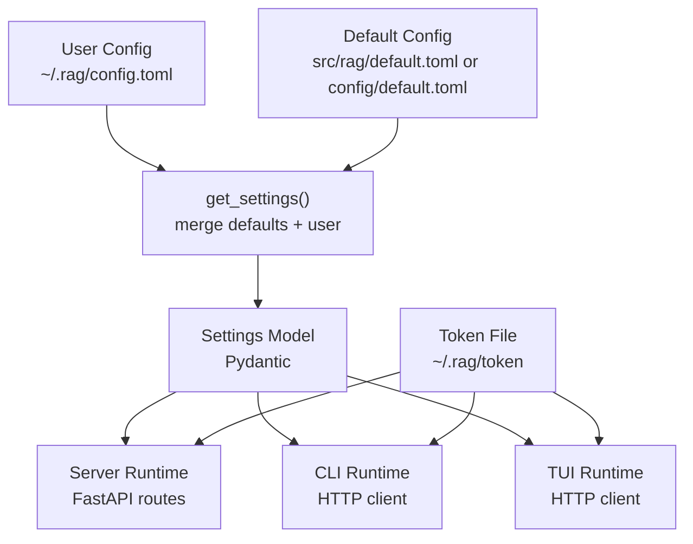
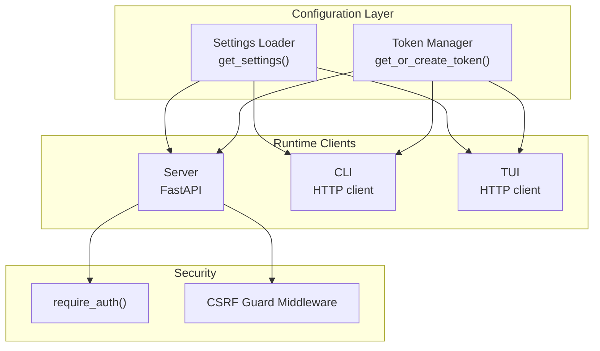
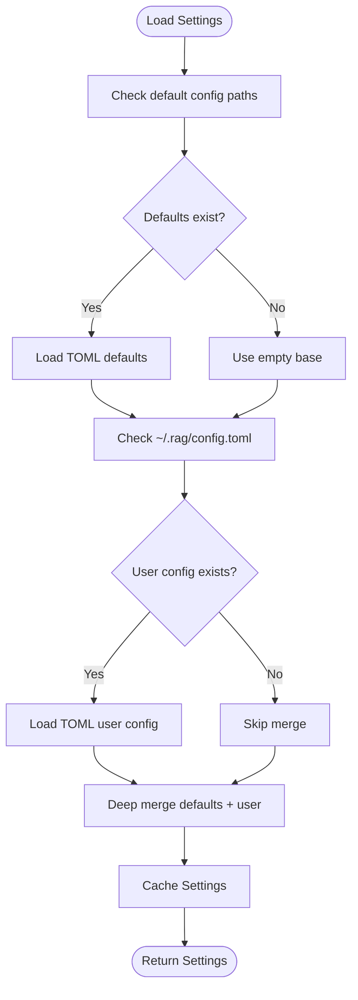
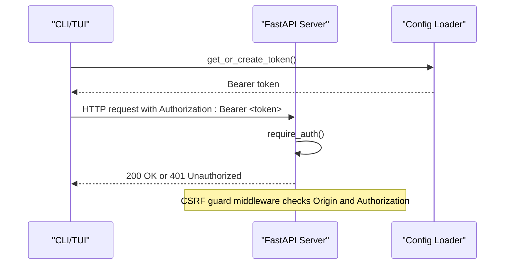
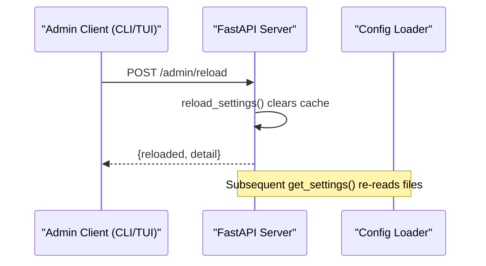
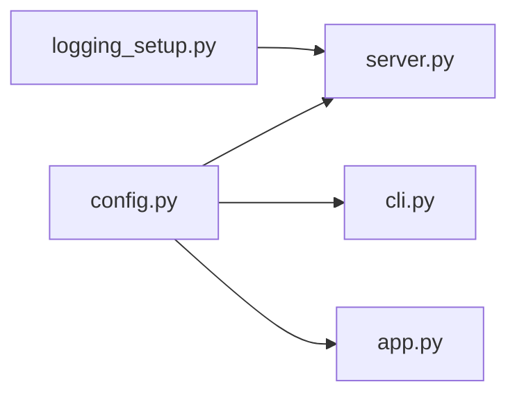

# Configuration Management

<cite>
**Referenced Files in This Document**
- [config.py](file://src/rag/config.py)
- [default.toml](file://src/rag/default.toml)
- [default.toml](file://config/default.toml)
- [server.py](file://src/rag/server.py)
- [app.py](file://src/rag/app.py)
- [cli.py](file://src/rag/cli.py)
- [test_config.py](file://tests/test_config.py)
- [logging_setup.py](file://src/rag/integration/logging_setup.py)
- [deployment-linux.md](file://docs/deployment-linux.md)
</cite>

## Table of Contents
1. [Introduction](#introduction)
2. [Project Structure](#project-structure)
3. [Core Components](#core-components)
4. [Architecture Overview](#architecture-overview)
5. [Detailed Component Analysis](#detailed-component-analysis)
6. [Dependency Analysis](#dependency-analysis)
7. [Performance Considerations](#performance-considerations)
8. [Troubleshooting Guide](#troubleshooting-guide)
9. [Conclusion](#conclusion)
10. [Appendices](#appendices)

## Introduction
This document explains how configuration works in the system, including the settings model, configuration file structure, runtime behavior, and security controls. It covers configuration precedence, validation, hot-reloading, and operational guidance for teams integrating the daemon with local development and production environments.

## Project Structure
Configuration is centralized in a TOML-based settings system backed by Pydantic models. The system loads defaults from the package and merges user overrides from a home-directory config file. The server, CLI, and TUI read these settings at runtime. Security-sensitive token management and reload hooks are integrated into the configuration layer.

**Diagram sources**
- [config.py:150-159](file://src/rag/config.py#L150-L159)
- [default.toml](file://src/rag/default.toml)
- [default.toml](file://config/default.toml)
- [server.py:18](file://src/rag/server.py#L18)
- [cli.py:12](file://src/rag/cli.py#L12)
- [app.py:38](file://src/rag/app.py#L38)

**Section sources**
- [config.py:23-32](file://src/rag/config.py#L23-L32)
- [default.toml](file://src/rag/default.toml)
- [default.toml](file://config/default.toml)

## Core Components
- Settings model hierarchy defines all configuration sections and validations.
- TOML loader and deep merge define precedence and composition.
- Token management secures API access.
- Hot-reload capability refreshes settings without restarting the server.

Key responsibilities:
- Define server, embedding, Qdrant, indexing, reranking, LLM, and LSP settings.
- Validate ranges and formats (e.g., ports, URLs, directory lists).
- Load defaults from package or repository, merge user overrides.
- Provide a reload hook to re-read configuration on demand.

**Section sources**
- [config.py:35-131](file://src/rag/config.py#L35-L131)
- [config.py:133-159](file://src/rag/config.py#L133-L159)
- [config.py:167-188](file://src/rag/config.py#L167-L188)
- [config.py:191-193](file://src/rag/config.py#L191-L193)

## Architecture Overview
The configuration system is consumed by the server, CLI, and TUI. Authentication depends on a bearer token stored under the user’s home directory. The server enforces authorization and CSRF protections, while the CLI/TUI use the token for authenticated requests.

**Diagram sources**
- [config.py:150-188](file://src/rag/config.py#L150-L188)
- [server.py:592-598](file://src/rag/server.py#L592-L598)
- [server.py:798-815](file://src/rag/server.py#L798-L815)
- [cli.py:24-30](file://src/rag/cli.py#L24-L30)
- [app.py:294-299](file://src/rag/app.py#L294-L299)

## Detailed Component Analysis

### Settings Model and Precedence
- Defaults are loaded from either the repository-provided default or the package default.
- User overrides are merged deeply into the defaults.
- Settings are cached to avoid repeated file I/O; a reload function clears the cache to re-read on next access.

**Diagram sources**
- [config.py:26-32](file://src/rag/config.py#L26-L32)
- [config.py:133-159](file://src/rag/config.py#L133-L159)

**Section sources**
- [config.py:23-32](file://src/rag/config.py#L23-L32)
- [config.py:133-159](file://src/rag/config.py#L133-L159)

### Configuration Sections and Options
- Server settings: host, port; host rejects wildcard binds for security.
- Embedding settings: model, provider placeholder, dimension, batch size, keep-alive.
- Qdrant settings: mode, URL, path, code/docs collections; validates URL scheme and normalizes URL.
- Index settings: max chunk size, retrieval top-k, skip directories.
- Reranker settings: model, enabled flag, top-k; marked as deprecated and ignored at runtime.
- LLM settings: Ollama URL, agent model, generation model fallback.
- LSP settings: enabled, auto-detect, timeout.

Validation highlights:
- Port bounds, URL schemes, directory path safety, and dimension ranges.
- Host bind restrictions prevent exposing the daemon without TLS and bearer token.

**Section sources**
- [config.py:35-116](file://src/rag/config.py#L35-L116)
- [config.py:118-131](file://src/rag/config.py#L118-L131)
- [default.toml](file://src/rag/default.toml)
- [default.toml](file://config/default.toml)

### Security and Access Control
- Bearer token: stored at ~/.rag/token with restricted permissions; used by server for authorization and by CLI/TUI for authenticated requests.
- Authorization dependency enforces Bearer token matching the stored token.
- CSRF guard middleware blocks cross-origin unsafe requests without a valid bearer token.
- Server binds to loopback by default; exposing via a reverse proxy is recommended.

**Diagram sources**
- [config.py:167-188](file://src/rag/config.py#L167-L188)
- [server.py:592-598](file://src/rag/server.py#L592-L598)
- [server.py:798-815](file://src/rag/server.py#L798-L815)

**Section sources**
- [config.py:167-188](file://src/rag/config.py#L167-L188)
- [server.py:592-598](file://src/rag/server.py#L592-L598)
- [server.py:798-815](file://src/rag/server.py#L798-L815)
- [deployment-linux.md:51-55](file://docs/deployment-linux.md#L51-L55)

### Hot-Reloading Configuration
- The server exposes an admin endpoint to reload configuration without restart.
- The CLI and TUI can trigger reload and receive feedback.
- Internally, the reload function clears the settings cache so the next read re-parses files.

**Diagram sources**
- [server.py:2477-2541](file://src/rag/server.py#L2477-L2541)
- [config.py:191-193](file://src/rag/config.py#L191-L193)
- [cli.py:1730-1758](file://src/rag/cli.py#L1730-L1758)
- [app.py:961-963](file://src/rag/app.py#L961-L963)

**Section sources**
- [server.py:2477-2541](file://src/rag/server.py#L2477-L2541)
- [config.py:191-193](file://src/rag/config.py#L191-L193)
- [cli.py:1730-1758](file://src/rag/cli.py#L1730-L1758)
- [app.py:961-963](file://src/rag/app.py#L961-L963)

### Runtime Behavior Modification
- Server reads settings during startup and uses them to initialize embedder, vector store, and logging.
- CLI and TUI read settings to construct base URLs and attach Authorization headers.
- Restart count persistence and warm probe timing inform operational dashboards.

**Section sources**
- [server.py:604-715](file://src/rag/server.py#L604-L715)
- [cli.py:24-30](file://src/rag/cli.py#L24-L30)
- [app.py:294-299](file://src/rag/app.py#L294-L299)

### Configuration Validation and Tests
- Unit tests validate port ranges, host bind restrictions, provider patterns, dimension bounds, URL schemes, and index bounds.
- These tests ensure the Pydantic validators catch invalid configurations early.

**Section sources**
- [test_config.py:6-72](file://tests/test_config.py#L6-L72)

## Dependency Analysis
- The server depends on the configuration loader for runtime settings and token management.
- The CLI and TUI depend on the configuration loader for base URLs and token creation.
- Logging setup integrates with the daemon lifecycle and persists structured logs.

**Diagram sources**
- [config.py:150-188](file://src/rag/config.py#L150-L188)
- [server.py:18](file://src/rag/server.py#L18)
- [cli.py:12](file://src/rag/cli.py#L12)
- [app.py:38](file://src/rag/app.py#L38)
- [logging_setup.py:81-107](file://src/rag/integration/logging_setup.py#L81-L107)

**Section sources**
- [server.py:18](file://src/rag/server.py#L18)
- [cli.py:12](file://src/rag/cli.py#L12)
- [app.py:38](file://src/rag/app.py#L38)
- [logging_setup.py:81-107](file://src/rag/integration/logging_setup.py#L81-L107)

## Performance Considerations
- Keep-alive settings for the embedding backend influence cold/warm-up costs; adjust based on workload patterns.
- Retrieval top-k impacts latency and result quality; tune for balance.
- Batch size affects throughput during embedding; ensure it aligns with GPU/CPU capacity.
- Warm probe timing provides periodic latency measurements for dashboards.

[No sources needed since this section provides general guidance]

## Troubleshooting Guide
Common issues and resolutions:
- Unauthorized errors: verify the bearer token file exists and has restricted permissions; confirm Authorization header is included in requests.
- Forbidden origin errors: ensure requests originate from localhost or supply a valid bearer token.
- Configuration reload not applied: confirm the reload endpoint was called and that the next settings read re-parses files.
- Path validation failures: ensure repository and docs paths are absolute, existing directories and do not contain traversal sequences.
- Logs location and rotation: the daemon writes structured logs to ~/.rag/logs with rotation; consult systemd journal on Linux.

**Section sources**
- [server.py:592-598](file://src/rag/server.py#L592-L598)
- [server.py:798-815](file://src/rag/server.py#L798-L815)
- [server.py:316-327](file://src/rag/server.py#L316-L327)
- [logging_setup.py:81-107](file://src/rag/integration/logging_setup.py#L81-L107)
- [deployment-linux.md:1-57](file://docs/deployment-linux.md#L1-L57)

## Conclusion
The configuration system provides a robust, validated, and secure foundation for operating the daemon. Defaults are sensible, user overrides are cleanly merged, and security is enforced through token-based auth and CSRF guards. Hot-reloading enables safe runtime adjustments, and logging ensures observability across environments.

[No sources needed since this section summarizes without analyzing specific files]

## Appendices

### Configuration File Locations and Precedence
- Defaults:
  - Repository default: config/default.toml
  - Package default: src/rag/default.toml
- User override: ~/.rag/config.toml
- Precedence: defaults ← merge user overrides → Settings model

**Section sources**
- [config.py:26-32](file://src/rag/config.py#L26-L32)
- [config.py:150-159](file://src/rag/config.py#L150-L159)
- [default.toml](file://config/default.toml)
- [default.toml](file://src/rag/default.toml)

### Security-Related Settings and Controls
- Token file location and permissions: ~/.rag/token (restricted)
- Authorization enforcement: require_auth()
- CSRF protection: middleware checks Origin and Authorization
- Default server bind: loopback; expose via reverse proxy with TLS

**Section sources**
- [config.py:167-188](file://src/rag/config.py#L167-L188)
- [server.py:592-598](file://src/rag/server.py#L592-L598)
- [server.py:798-815](file://src/rag/server.py#L798-L815)
- [deployment-linux.md:51-55](file://docs/deployment-linux.md#L51-L55)

### Hot-Reload Operations
- Trigger reload via admin endpoint
- Clear settings cache to force re-parse on next read
- CLI/TUI commands support editing and reloading configuration

**Section sources**
- [server.py:2477-2541](file://src/rag/server.py#L2477-L2541)
- [config.py:191-193](file://src/rag/config.py#L191-L193)
- [cli.py:1730-1758](file://src/rag/cli.py#L1730-L1758)
- [app.py:961-963](file://src/rag/app.py#L961-L963)

### Operational Notes
- Linux systemd deployment and log rotation
- Reverse proxy exposure with TLS and bearer token
- Restart count persistence and warm probe timing

**Section sources**
- [deployment-linux.md:1-57](file://docs/deployment-linux.md#L1-L57)
- [server.py:628-641](file://src/rag/server.py#L628-L641)
- [server.py:645-655](file://src/rag/server.py#L645-L655)