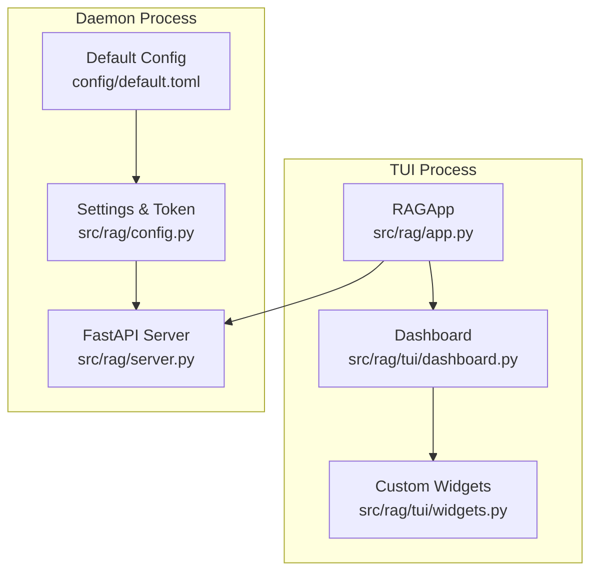
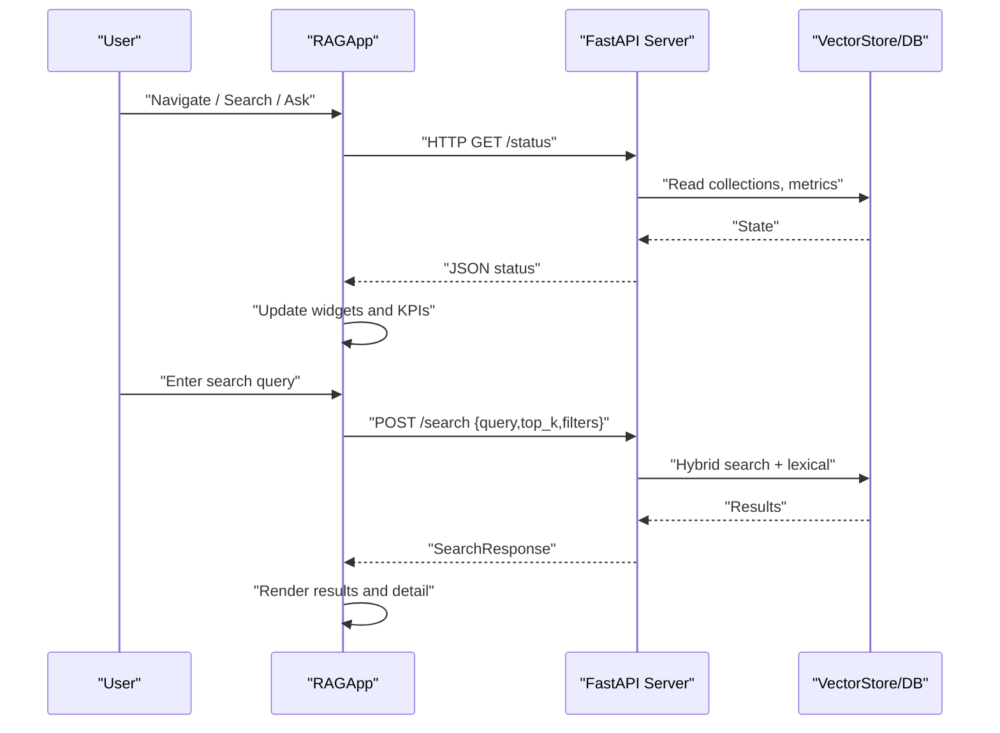
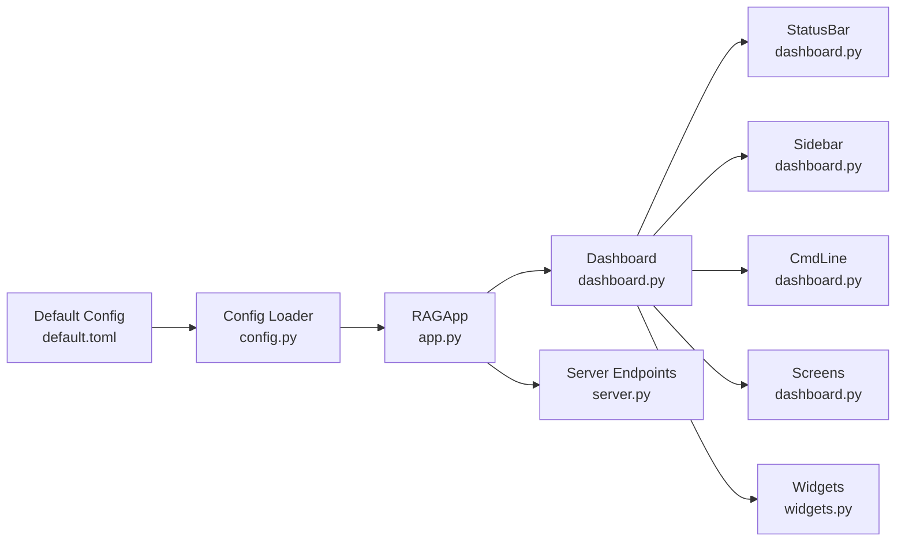

# TUI Interface

<cite>
**Referenced Files in This Document**
- [app.py](file://src/rag/app.py)
- [dashboard.py](file://src/rag/tui/dashboard.py)
- [widgets.py](file://src/rag/tui/widgets.py)
- [cli.py](file://src/rag/cli.py)
- [config.py](file://src/rag/config.py)
- [default.toml](file://config/default.toml)
- [server.py](file://src/rag/server.py)
</cite>

## Table of Contents
1. [Introduction](#introduction)
2. [Project Structure](#project-structure)
3. [Core Components](#core-components)
4. [Architecture Overview](#architecture-overview)
5. [Detailed Component Analysis](#detailed-component-analysis)
6. [Dependency Analysis](#dependency-analysis)
7. [Performance Considerations](#performance-considerations)
8. [Troubleshooting Guide](#troubleshooting-guide)
9. [Conclusion](#conclusion)
10. [Appendices](#appendices)

## Introduction
This document describes the Terminal User Interface (TUI) for the RAG System. It explains navigation controls, keyboard shortcuts, interactive features, dashboard components, real-time monitoring, indexing status, search results display, system metrics, configuration and theming, and step-by-step tutorials for common tasks. It also covers widget interactions, data visualization components, and real-time updates, along with troubleshooting guidance and performance optimization tips.

## Project Structure
The TUI is implemented as a Textual app that renders a dashboard composed of:
- A top status bar
- A left navigation sidebar
- A bottom command line
- A central screen area that swaps among eight screens
- A command palette modal

The app is a read-only HTTP client that polls the daemon for state and displays it in real time.

**Diagram sources**
- [app.py:270-273](file://src/rag/app.py#L270-L273)
- [dashboard.py:814-851](file://src/rag/tui/dashboard.py#L814-L851)
- [widgets.py:9-126](file://src/rag/tui/widgets.py#L9-L126)
- [server.py:841-874](file://src/rag/server.py#L841-L874)
- [config.py:150-159](file://src/rag/config.py#L150-L159)
- [default.toml:1-41](file://config/default.toml#L1-L41)

**Section sources**
- [app.py:156-289](file://src/rag/app.py#L156-L289)
- [dashboard.py:814-898](file://src/rag/tui/dashboard.py#L814-L898)

## Core Components
- RAGApp: Textual app that registers a theme, initializes polling tasks, and handles HTTP communication with the daemon.
- Dashboard: Outer container that hosts the status bar, sidebar, command line, and active screen.
- Screens: Home, Search, Ask, Index, Filters, Overview, Logs, Help.
- Custom widgets: StatusIndicator, ModelCard, QueryLogEntry, LSPStatusWidget, IndexStatsWidget.
- Command palette: Modal for fuzzy-searching commands.
- CLI integration: The TUI can be launched via the CLI.

Key responsibilities:
- Real-time updates via periodic HTTP polling (/status, /queries/recent, /queries/stats, /collections, /plugins, /events/recent, /overview/tui, /health/detail).
- Interactive features: search, ask, filters, indexing, logs tailing, overview.
- Theming and styling via a built-in theme and CSS.

**Section sources**
- [app.py:47-66](file://src/rag/app.py#L47-L66)
- [app.py:237-250](file://src/rag/app.py#L237-L250)
- [dashboard.py:814-898](file://src/rag/tui/dashboard.py#L814-L898)
- [widgets.py:9-126](file://src/rag/tui/widgets.py#L9-L126)
- [cli.py:388-400](file://src/rag/cli.py#L388-L400)

## Architecture Overview
The TUI is a read-only client that communicates with the daemon over HTTP. It polls endpoints for live data and renders it in a responsive terminal UI.

**Diagram sources**
- [app.py:363-456](file://src/rag/app.py#L363-L456)
- [app.py:722-793](file://src/rag/app.py#L722-L793)
- [server.py:877-954](file://src/rag/server.py#L877-L954)
- [server.py:1364-1562](file://src/rag/server.py#L1364-L1562)

## Detailed Component Analysis

### Navigation and Shortcuts
- Global bindings:
  - Quit: q
  - Help: ? (toggle Help screen)
  - Command palette: Ctrl+K
  - Focus command line: :
  - Navigate screens: h (Home), s (Search), a (Ask), i (Index), f (Filters), o (Overview), l (Logs)
  - Clear active: c
- Sidebar highlights the active screen and shows action hints.
- Command line supports colon-prefixed commands for quick actions.

**Section sources**
- [app.py:237-250](file://src/rag/app.py#L237-L250)
- [dashboard.py:111-162](file://src/rag/tui/dashboard.py#L111-L162)
- [dashboard.py:170-225](file://src/rag/tui/dashboard.py#L170-L225)

### Dashboard Layout and Screens
- Status bar: daemon dot, screen name, repo, embedder, generator, QPM, memory, clock.
- Sidebar: navigation items and action hints.
- Command line: REPL-style input with hints and palette access.
- Screens:
  - Home: KPIs, QPM sparkline, recent queries list, plugins, collections.
  - Search: input, results list, detail preview with syntax highlighting.
  - Ask: input, streamed answer, citations list.
  - Index: path input, index button, status, progress, repos and recent jobs lists.
  - Filters: language checkboxes, concurrency and pattern filters, strategy radio set.
  - Overview: summaries, communities, top nodes.
  - Logs: live tail with heatmap.
  - Help: hotkeys, active config, examples.

**Section sources**
- [dashboard.py:60-104](file://src/rag/tui/dashboard.py#L60-L104)
- [dashboard.py:295-414](file://src/rag/tui/dashboard.py#L295-L414)
- [dashboard.py:419-456](file://src/rag/tui/dashboard.py#L419-L456)
- [dashboard.py:461-495](file://src/rag/tui/dashboard.py#L461-L495)
- [dashboard.py:500-540](file://src/rag/tui/dashboard.py#L500-L540)
- [dashboard.py:544-593](file://src/rag/tui/dashboard.py#L544-L593)
- [dashboard.py:628-652](file://src/rag/tui/dashboard.py#L628-L652)
- [dashboard.py:597-623](file://src/rag/tui/dashboard.py#L597-L623)
- [dashboard.py:657-702](file://src/rag/tui/dashboard.py#L657-L702)

### Custom Widgets
- StatusIndicator: colored dot and status text for components.
- ModelCard: role, model name/provider, status.
- QueryLogEntry: formatted recent query entry with timestamp, query snippet, result count, latency.
- LSPStatusWidget: list of detected language servers and install hints.
- IndexStatsWidget: documents count and index status.

These widgets are reactive and refresh when updated by polling or user actions.

**Section sources**
- [widgets.py:9-126](file://src/rag/tui/widgets.py#L9-L126)

### Real-Time Monitoring and Updates
- Daemon connectivity:
  - Periodic polling of /status, /queries/recent, /queries/stats, /collections, /plugins, /events/recent, /overview/tui, /health/detail.
  - Automatic notifications and status dot updates when daemon becomes reachable/unreachable.
- Home screen:
  - KPI cards for index size, embedder, generator, uptime.
  - 24-hour QPM sparkline and recent queries list.
  - Plugins and collections panels.
- Logs screen:
  - Live tail of events with a 24-hour heatmap.
- Overview screen:
  - Periodic summaries, communities, and top nodes.

Rendering helpers:
- Sparkline and bar chart utilities for visualizations.

**Section sources**
- [app.py:363-456](file://src/rag/app.py#L363-L456)
- [app.py:458-526](file://src/rag/app.py#L458-L526)
- [app.py:527-567](file://src/rag/app.py#L527-L567)
- [app.py:568-591](file://src/rag/app.py#L568-L591)
- [app.py:592-632](file://src/rag/app.py#L592-L632)
- [app.py:633-662](file://src/rag/app.py#L633-L662)
- [app.py:663-684](file://src/rag/app.py#L663-L684)
- [app.py:90-135](file://src/rag/app.py#L90-L135)

### Search and Results Display
- Search flow:
  - Enter query in Search screen or use :search command.
  - Apply filters from Filters screen.
  - POST /search with query, top_k, filters.
  - Render planner info, results list, and detail preview with syntax highlighting.
- Ask flow:
  - Enter question in Ask screen or use :ask command.
  - Streamed answer in RichLog with citations list.

**Section sources**
- [app.py:722-793](file://src/rag/app.py#L722-L793)
- [app.py:794-842](file://src/rag/app.py#L794-L842)
- [server.py:1364-1562](file://src/rag/server.py#L1364-L1562)

### Indexing Status and Management
- Index screen:
  - Input absolute path, click Index.
  - Shows status message, progress bar, repos list, recent jobs list.
- Background:
  - POST /index/start triggers indexing job.
  - GET /index/progress/{job_id} and /index/jobs poll for progress and history.

**Section sources**
- [dashboard.py:500-540](file://src/rag/tui/dashboard.py#L500-L540)
- [server.py:1174-1288](file://src/rag/server.py#L1174-L1288)
- [server.py:1277-1284](file://src/rag/server.py#L1277-L1284)

### System Metrics and Logs
- Status bar shows daemon dot, repo, embedder, generator, QPM, memory, and clock.
- Logs screen tails events and shows a 24-hour heatmap.
- Health detail polling updates memory usage from the TUI process.

**Section sources**
- [dashboard.py:60-104](file://src/rag/tui/dashboard.py#L60-L104)
- [app.py:663-684](file://src/rag/app.py#L663-L684)
- [app.py:592-632](file://src/rag/app.py#L592-L632)

### Theming and Customization
- Built-in theme registration and activation.
- CSS overrides for screens, status bar, command line, inputs, lists, logs, progress bars, checkboxes, radios.
- Color scheme: dark slate background, teal accents, violet for models, blue identifiers.

**Section sources**
- [app.py:47-66](file://src/rag/app.py#L47-L66)
- [app.py:162-235](file://src/rag/app.py#L162-L235)

### Widget Interactions and Data Visualization
- Reactive widgets update automatically when polled or when user selects results.
- Sparkline rendering for QPM and event volume.
- Bar charts for histograms using Unicode block characters.

**Section sources**
- [widgets.py:9-126](file://src/rag/tui/widgets.py#L9-L126)
- [app.py:90-135](file://src/rag/app.py#L90-L135)

### Step-by-Step Tutorials

#### Search Code
1. Open the TUI and navigate to Search (s) or use :search.
2. Enter your query in the input field.
3. Press Enter to submit.
4. Browse results in the left list; select an item to see the code preview on the right.
5. Optional: refine with Filters (f) and apply strategy overrides.

**Section sources**
- [app.py:722-793](file://src/rag/app.py#L722-L793)
- [dashboard.py:419-456](file://src/rag/tui/dashboard.py#L419-L456)

#### Monitor Indexing Progress
1. Go to Index (i) screen.
2. Enter an absolute repository path and click Index.
3. Watch the progress bar and status messages.
4. Use /index/progress and /index/jobs endpoints for detailed status.

**Section sources**
- [dashboard.py:500-540](file://src/rag/tui/dashboard.py#L500-L540)
- [server.py:1174-1288](file://src/rag/server.py#L1174-L1288)

#### View System Logs
1. Go to Logs (l) screen.
2. Observe the live tail of events in the RichLog.
3. Use the 24-hour heatmap to gauge event volume.

**Section sources**
- [dashboard.py:597-623](file://src/rag/tui/dashboard.py#L597-L623)

#### Manage Repositories
1. From Index screen, enter a repository path and click Index.
2. Switch to Overview (o) to see summaries, communities, and top nodes.

**Section sources**
- [dashboard.py:500-540](file://src/rag/tui/dashboard.py#L500-L540)
- [dashboard.py:628-652](file://src/rag/tui/dashboard.py#L628-L652)

#### Configure and Customize
1. Launch TUI via CLI: rag tui.
2. Adjust settings in ~/.rag/config.toml (merged with defaults).
3. Restart daemon to apply changes; TUI will reflect new settings on next poll.

**Section sources**
- [cli.py:388-400](file://src/rag/cli.py#L388-L400)
- [config.py:150-159](file://src/rag/config.py#L150-L159)
- [default.toml:1-41](file://config/default.toml#L1-L41)

## Dependency Analysis
- RAGApp depends on:
  - Settings and token loader for base URL and auth headers.
  - HTTP client for polling endpoints.
  - Dashboard and screens for UI composition.
- Dashboard depends on:
  - StatusBar, Sidebar, CmdLine, and screen classes.
  - Custom widgets for specialized panels.
- Server endpoints provide:
  - /status, /queries/recent, /queries/stats, /collections, /plugins, /events/recent, /overview/tui, /health/detail, /search, and indexing endpoints.

**Diagram sources**
- [app.py:270-273](file://src/rag/app.py#L270-L273)
- [dashboard.py:814-851](file://src/rag/tui/dashboard.py#L814-L851)
- [server.py:841-874](file://src/rag/server.py#L841-L874)
- [config.py:150-159](file://src/rag/config.py#L150-L159)
- [default.toml:1-41](file://config/default.toml#L1-L41)

**Section sources**
- [app.py:294-331](file://src/rag/app.py#L294-L331)
- [server.py:841-1040](file://src/rag/server.py#L841-L1040)

## Performance Considerations
- Polling intervals:
  - Status and stats: ~5 seconds.
  - Query log: ~1 second.
  - Events: ~1.5 seconds.
  - Collections and plugins: longer intervals to reduce load.
- Memory usage:
  - TUI polls RSS of itself and displays in status bar.
- Rendering:
  - Sparklines and bar charts are computed locally; keep widths reasonable.
- Network:
  - Short timeouts for responsiveness; handle non-200 gracefully.

[No sources needed since this section provides general guidance]

## Troubleshooting Guide
- Daemon unreachable:
  - TUI notifies and updates status dot; start daemon with rag start or rag start --tui.
- Authentication:
  - TUI uses a bearer token stored in ~/.rag/token; ensure it exists and is readable.
- Slow responses:
  - Reduce top_k, disable heavy filters, or switch to simpler strategies.
- Terminal rendering issues:
  - Ensure monospace fonts and UTF-8 support; widgets rely on Unicode block characters.

**Section sources**
- [app.py:332-358](file://src/rag/app.py#L332-L358)
- [config.py:167-189](file://src/rag/config.py#L167-L189)
- [cli.py:388-400](file://src/rag/cli.py#L388-L400)

## Conclusion
The TUI provides a real-time, read-only dashboard for the RAG daemon. It offers efficient navigation, live metrics, searchable results, and actionable screens for indexing and logs. Its architecture keeps the UI lightweight and responsive while delegating all heavy lifting to the daemon.

[No sources needed since this section summarizes without analyzing specific files]

## Appendices

### Keyboard Shortcuts Reference
- q: Quit
- ?: Toggle Help
- Ctrl+K: Command palette
- : : Focus command line
- h/s/a/i/f/o/l: Navigate to Home/Search/Ask/Index/Filters/Overview/Logs
- c: Clear active log/results

**Section sources**
- [app.py:237-250](file://src/rag/app.py#L237-L250)
- [dashboard.py:111-162](file://src/rag/tui/dashboard.py#L111-L162)

### Command Palette Commands
- Actions: search, ask, list filters, index, reload config, clear log
- Navigate: go to Home/Search/Ask/Index/Filters/Overview/Logs/Help
- Daemon: show /status, /health detail, recent events, collections, plugins

**Section sources**
- [dashboard.py:709-801](file://src/rag/tui/dashboard.py#L709-L801)