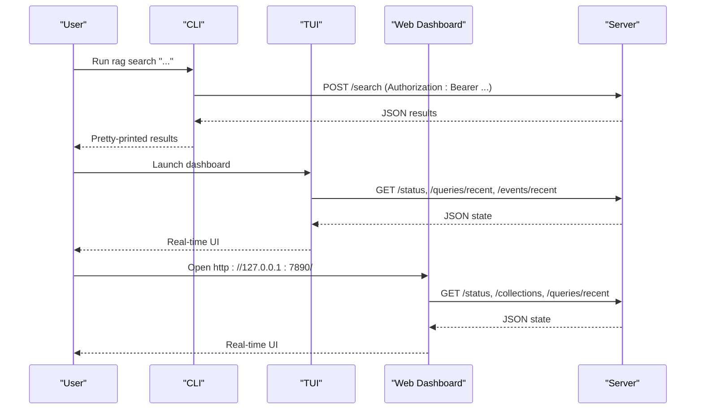
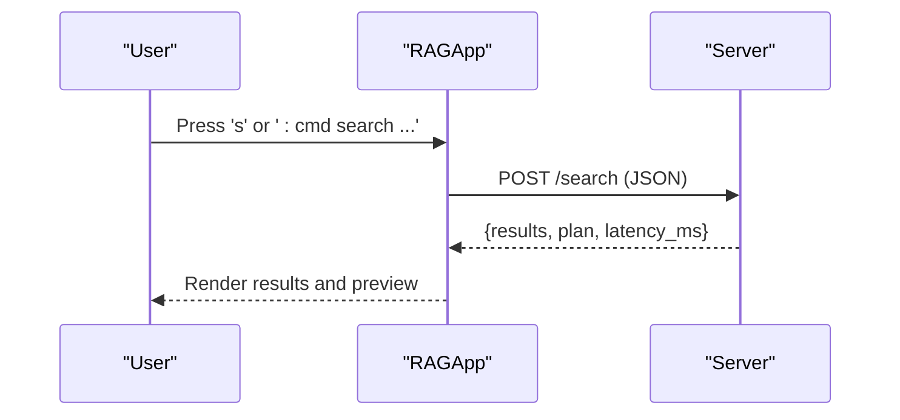
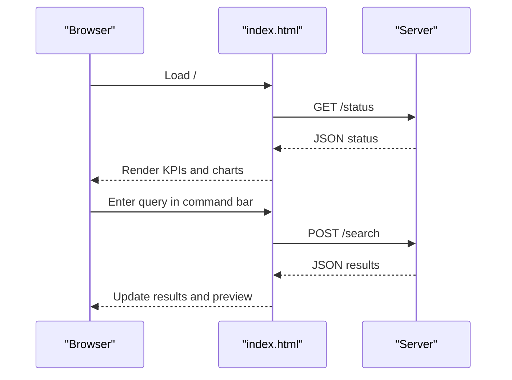
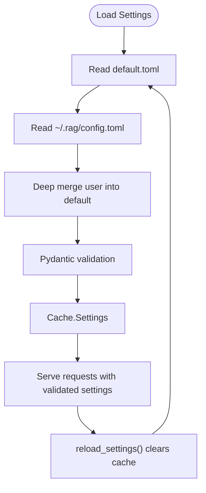
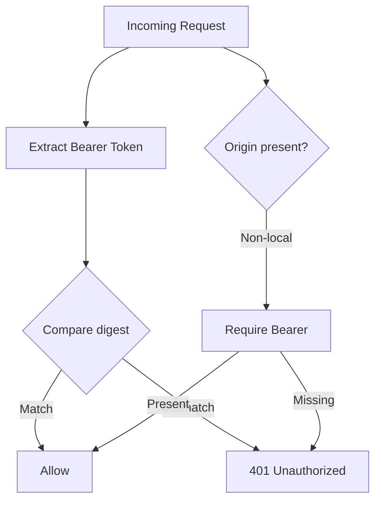
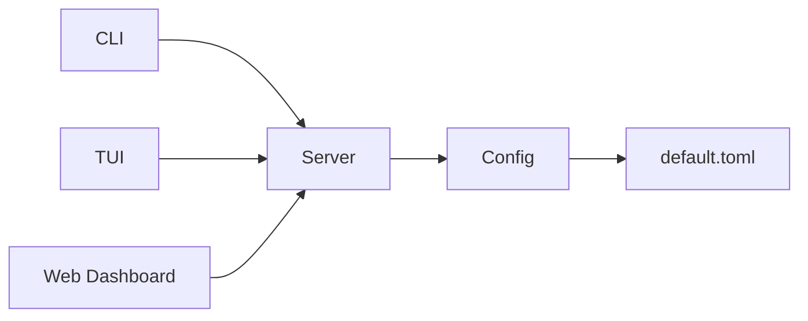

# User Interfaces

<cite>
**Referenced Files in This Document**
- [cli.py](file://src/rag/cli.py)
- [app.py](file://src/rag/app.py)
- [widgets.py](file://src/rag/tui/widgets.py)
- [index.html](file://src/rag/web/index.html)
- [server.py](file://src/rag/server.py)
- [config.py](file://src/rag/config.py)
- [default.toml](file://src/rag/default.toml)
- [README.md](file://README.md)
</cite>

## Table of Contents
1. [Introduction](#introduction)
2. [Project Structure](#project-structure)
3. [Core Components](#core-components)
4. [Architecture Overview](#architecture-overview)
5. [Detailed Component Analysis](#detailed-component-analysis)
6. [Dependency Analysis](#dependency-analysis)
7. [Performance Considerations](#performance-considerations)
8. [Troubleshooting Guide](#troubleshooting-guide)
9. [Conclusion](#conclusion)
10. [Appendices](#appendices)

## Introduction
This document explains the three main user interfaces of the RAG system: CLI, TUI, and web dashboard. It covers:
- CLI command reference with parameters, behaviors, and usage examples
- TUI navigation, controls, and real-time monitoring
- Web dashboard features, browser-based access, and collaborative workflows
- Configuration management, environment overrides, and hot-reloading
- Authentication, authorization, and security considerations
- Practical workflows and integration patterns

## Project Structure
The RAG system consists of:
- A headless FastAPI server (daemon) that serves HTTP APIs
- A CLI thin client that talks to the daemon
- A read-only Textual TUI dashboard that connects to the daemon
- A browser-based web dashboard served by the daemon
- A configuration system with TOML-based defaults and user overrides

```mermaid
graph TB
subgraph "CLI"
CLI["src/rag/cli.py"]
end
subgraph "Server"
Srv["src/rag/server.py"]
CFG["src/rag/config.py"]
DEF["src/rag/default.toml"]
end
subgraph "TUI"
TUIApp["src/rag/app.py"]
Widgets["src/rag/tui/widgets.py"]
end
subgraph "Web"
WebHTML["src/rag/web/index.html"]
end
CLI --> Srv
TUIApp --> Srv
WebHTML --> Srv
CFG --> Srv
DEF --> CFG
```

**Diagram sources**
- [cli.py:1-2274](file://src/rag/cli.py#L1-L2274)
- [server.py:1-2586](file://src/rag/server.py#L1-L2586)
- [config.py:1-194](file://src/rag/config.py#L1-L194)
- [default.toml:1-41](file://src/rag/default.toml#L1-L41)
- [app.py:1-1105](file://src/rag/app.py#L1-L1105)
- [widgets.py:1-126](file://src/rag/tui/widgets.py#L1-L126)
- [index.html:1-812](file://src/rag/web/index.html#L1-L812)

**Section sources**
- [README.md:1-74](file://README.md#L1-L74)

## Core Components
- CLI: Thin client that validates prerequisites, probes the daemon, and forwards requests to the server with bearer token authentication. It prints human-readable results and supports JSON output for scripting.
- TUI: Read-only Textual app that polls the daemon for status, query logs, events, and collections; renders interactive screens for search, ask, index, filters, overview, and logs.
- Web Dashboard: Static HTML page served by the daemon that injects a bearer token and polls the same endpoints as the TUI for real-time monitoring.
- Server: FastAPI app exposing search, indexing, context packs, graph queries, ask, and administrative endpoints behind bearer token auth and CSRF guard.
- Config: TOML-based settings with Pydantic validation, caching, and hot-reload support.

**Section sources**
- [cli.py:1-2274](file://src/rag/cli.py#L1-L2274)
- [app.py:1-1105](file://src/rag/app.py#L1-L1105)
- [index.html:1-812](file://src/rag/web/index.html#L1-L812)
- [server.py:1-2586](file://src/rag/server.py#L1-L2586)
- [config.py:1-194](file://src/rag/config.py#L1-L194)
- [default.toml:1-41](file://src/rag/default.toml#L1-L41)

## Architecture Overview
The system separates concerns:
- Daemon (server) is the supervised process, always running and serving HTTP
- CLI/TUI/Web are thin clients that communicate over HTTP with bearer token auth
- Authentication is enforced via a single bearer token stored under ~/.rag/token
- Security measures include localhost-only bind by default, CSRF guard, and rate-limiting middleware



**Diagram sources**
- [cli.py:426-476](file://src/rag/cli.py#L426-L476)
- [app.py:363-456](file://src/rag/app.py#L363-L456)
- [index.html:516-541](file://src/rag/web/index.html#L516-L541)
- [server.py:1596-1604](file://src/rag/server.py#L1596-L1604)

## Detailed Component Analysis

### CLI Reference
The CLI is a Typer app that wraps server endpoints. It:
- Probes the daemon’s health endpoint before running commands
- Injects Authorization: Bearer token from ~/.rag/token
- Emits JSON for machine-readable output when requested
- Provides commands for search, context packs, repo agent, resolve, call trees, graph queries, ask, index, index-docs, enumerate, and more

Key commands and parameters:
- rag init [path]: Initialize config, start daemon, index current directory
- rag start [--tui] [--watch]: Start daemon; optionally spawn TUI and enable file watcher
- rag tui: Launch read-only TUI
- rag web [--open/--no-open]: Open web dashboard
- rag search QUERY [--top-k N] [--repo NAME] [--explain]: Search with optional planner details
- rag context-pack QUERY [--repo NAME] [--max-slices N] [--max-source-tokens N] [--no-ast-index] [--no-semantic]
- rag repo-agent QUERY --repo NAME [--max-slices N] [--max-source-tokens N] [--definitions N] [--usages N] [--min-exact-slices N] [--no-semantic-fallback] [--json]
- rag resolve SYMBOLS... --repo NAME [--usages N] [--definitions N]
- rag call-tree SYMBOL --repo NAME [--limit N]
- rag files --repo NAME [QUERY] [--limit N] [--tests-only] [--json]
- rag node SYMBOL --repo NAME [--limit N] [--json]
- rag callers SYMBOL --repo NAME [--limit N] [--json]
- rag callees SYMBOL --repo NAME [--limit N] [--json]
- rag impact SYMBOL --repo NAME [--limit N] [--json]
- rag affected --repo NAME [--file PATH] [--since REF] [--limit N] [--json]
- rag understand QUERY --repo NAME [--max-modules N] [--max-slices N] [--max-source-tokens N]
- rag backfill-code-index [--repo NAME] [--collection NAME] [--keep-existing]
- rag ask QUESTION [--top-k N] [--repo NAME]
- rag list FLAG [--lang LANG] [--limit N] [--value VAL] [--lines]
- rag index PATH [--full] [--lang LANG...] [--name NAME]
- rag index-docs PATH [--collection NAME] [--doc-type TYPE...] [--full]
- rag qdrant-up / qdrant-down / qdrant-status
- rag benchmark-embeddings [--batch-sizes SIZES] [--samples N] [--chars N]
- Additional maintenance commands: diagnose, verify, repair, repos, export/import, plugins, collections, config, install-agent, service, overview, diff

Usage examples (descriptive):
- Initialize and index a repository: rag init .
- Search for “authentication middleware” with top-10 results: rag search "authentication middleware" --top-k 10
- Get a token-bounded context pack for a refactor: rag context-pack "React component state" --repo myproj --max-slices 8 --max-source-tokens 6000
- Run the repo agent for a task: rag repo-agent "add pagination to ProductList" --repo myproj --max-slices 6 --max-source-tokens 4000
- Resolve symbol definitions: rag resolve MyService --repo myproj --definitions 10 --usages 15
- Inspect call tree: rag call-tree handleRequest --repo myproj --limit 30
- List Kotlin suspend functions: rag list is_suspend --lang kotlin
- Index a repository incrementally: rag index ./myproj
- Start the daemon with file watching: rag start --watch
- Open the web dashboard: rag web

Security and authentication:
- All CLI commands require a running daemon and a valid bearer token
- Unauthorized requests receive HTTP 401

**Section sources**
- [cli.py:82-1599](file://src/rag/cli.py#L82-L1599)
- [README.md:37-66](file://README.md#L37-L66)

### TUI Navigation and Controls
The TUI is a read-only Textual app that:
- Connects to the daemon over HTTP with bearer token auth
- Polls status, query logs, events, collections, plugins, and overview data
- Renders screens: Home, Search, Ask, Index, Filters, Overview, Logs, Help
- Supports a command palette (:cmd) and keyboard shortcuts

Navigation and controls:
- Shortcuts: h/home, s/search, a/ask, i/index, f/filters, o/overview, l/logs, c/clear, q/quit, ⌘K/palette, colon/:cmd
- Command palette supports goto, search, ask, list, index, filters, strategy, status, health, events, collections, plugins, clear, reload
- Real-time monitoring: sparklines, recent queries, event logs, memory usage, QPM, collections, plugins
- Search screen shows results with selectable previews; Ask screen shows answer and citations



**Diagram sources**
- [app.py:722-793](file://src/rag/app.py#L722-L793)
- [server.py:1596-1604](file://src/rag/server.py#L1596-L1604)

**Section sources**
- [app.py:156-1105](file://src/rag/app.py#L156-L1105)
- [widgets.py:1-126](file://src/rag/tui/widgets.py#L1-L126)

### Web Dashboard Features
The web dashboard is a static HTML page served by the daemon:
- Injects a bearer token at serve time and uses it for all API calls
- Routes: Home, Search, Logs
- Real-time polling: status, collections, recent queries (sparkline), plugins, events (heatmap), and logs tail
- Search: runs queries and previews results with file path, language, lines, and score
- Command bar: enter queries, switch screens, and jump to search



**Diagram sources**
- [index.html:423-800](file://src/rag/web/index.html#L423-L800)
- [server.py:1596-1604](file://src/rag/server.py#L1596-L1604)

**Section sources**
- [index.html:1-812](file://src/rag/web/index.html#L1-L812)

### Configuration Management
Configuration is TOML-based with Pydantic validation:
- Defaults are loaded from default.toml (package or repo-specific)
- User config merges into defaults; unknown keys are allowed for backward compatibility
- Settings include server host/port, embeddings, qdrant, index, LLM, and LSP
- get_settings() caches results; reload_settings() clears cache to re-read config
- Environment overrides are not explicitly defined in the code; rely on config file edits

Security-sensitive defaults:
- server.host defaults to 127.0.0.1; binding to all interfaces raises a validation error

Hot-reloading:
- CLI admin reload endpoint triggers config reload; TUI responds to config changes via periodic polling



**Diagram sources**
- [config.py:150-194](file://src/rag/config.py#L150-L194)
- [default.toml:1-41](file://src/rag/default.toml#L1-L41)

**Section sources**
- [config.py:1-194](file://src/rag/config.py#L1-L194)
- [default.toml:1-41](file://src/rag/default.toml#L1-L41)

### Authentication, Authorization, and Security
- Authentication: All protected endpoints require Authorization: Bearer <token>
- Token location: ~/.rag/token; created if absent with secure permissions
- Authorization enforcement: require_auth dependency compares token securely
- CSRF protection: Middleware enforces either a valid bearer token or localhost-origin for non-safe methods
- Rate limiting: Per-token token bucket middleware guards against abuse
- Bind policy: server.host must be loopback; public exposure is rejected by validation
- TLS: Not implemented; use a reverse proxy for HTTPS in production



**Diagram sources**
- [server.py:592-598](file://src/rag/server.py#L592-L598)
- [server.py:798-808](file://src/rag/server.py#L798-L808)
- [config.py:35-50](file://src/rag/config.py#L35-L50)

**Section sources**
- [server.py:582-808](file://src/rag/server.py#L582-L808)
- [config.py:23-50](file://src/rag/config.py#L23-L50)

### Practical Workflows and Integration Patterns
Common workflows:
- Quickstart: rag init . → rag search "..." → rag tui
- Incremental indexing: rag index ./myproj (default incremental) → monitor via TUI/web
- Context-driven development: rag context-pack "...", review slices, then open editor
- Symbol-centric tasks: rag resolve, rag call-tree, rag node, rag impact
- Documentation search: rag docs-search (via server docs-search route)
- Maintenance: rag verify, rag repair, rag diagnose

Integration patterns:
- Scripting: Use --json on CLI commands to pipe machine-readable output into editors or CI
- Automation: Use rag index --full for scheduled rebuilds; combine with file watcher (--watch)
- Collaboration: Share dashboard URL locally; ensure only authorized users access the daemon

**Section sources**
- [cli.py:1374-1567](file://src/rag/cli.py#L1374-L1567)
- [README.md:25-35](file://README.md#L25-L35)

## Dependency Analysis
High-level dependencies:
- CLI depends on server endpoints and bearer token management
- TUI and Web depend on the same server endpoints and share the same token injection mechanism
- Server depends on config for settings and validates inputs via Pydantic models
- Config depends on default.toml and user config merging



**Diagram sources**
- [cli.py:1-2274](file://src/rag/cli.py#L1-L2274)
- [server.py:1-2586](file://src/rag/server.py#L1-L2586)
- [config.py:1-194](file://src/rag/config.py#L1-L194)
- [default.toml:1-41](file://src/rag/default.toml#L1-L41)
- [app.py:1-1105](file://src/rag/app.py#L1-L1105)
- [index.html:1-812](file://src/rag/web/index.html#L1-L812)

**Section sources**
- [cli.py:1-2274](file://src/rag/cli.py#L1-L2274)
- [server.py:1-2586](file://src/rag/server.py#L1-L2586)
- [config.py:1-194](file://src/rag/config.py#L1-L194)
- [default.toml:1-41](file://src/rag/default.toml#L1-L41)
- [app.py:1-1105](file://src/rag/app.py#L1-L1105)
- [index.html:1-812](file://src/rag/web/index.html#L1-L812)

## Performance Considerations
- Embedding warm-up: server periodically measures embedder warm latency to inform UI captions
- Streaming: Ask endpoint uses non-streaming generation; consider latency trade-offs
- Token budgets: context-pack enforces max slices and max source tokens to bound LLM prompts
- Poll intervals: TUI and web poll at tuned intervals; adjust for responsiveness vs. load
- Rate limiting: Per-token buckets protect the daemon under load

[No sources needed since this section provides general guidance]

## Troubleshooting Guide
- rag diagnose: health check for daemon, Ollama, LSP servers, and cache
- Verify and repair: detect and remove orphaned/duplicate chunks
- Check token and connectivity: ensure ~/.rag/token exists and daemon is reachable
- Watch mode: use rag start --watch to auto-reindex on changes
- Rate limits: if receiving 429, reduce request frequency or increase token capacity

**Section sources**
- [README.md:71-74](file://README.md#L71-L74)
- [server.py:770-788](file://src/rag/server.py#L770-L788)

## Conclusion
The RAG system offers three complementary interfaces:
- CLI for automation and scripting
- TUI for interactive exploration and monitoring
- Web dashboard for browser-based collaboration

Security is enforced with bearer token auth, CSRF guard, and localhost-only bind by default. Configuration is robust and hot-reloadable. Together, these interfaces support efficient code search, retrieval, and developer workflows.

[No sources needed since this section summarizes without analyzing specific files]

## Appendices

### Appendix A: CLI Command Reference Summary
- Initialization and lifecycle: init, start, tui, web, qdrant-up/down/status
- Search and retrieval: search, context-pack, repo-agent, docs-search
- Indexing: index, index-docs, backfill-code-index
- Graph and symbol analysis: resolve, call-tree, files, node, callers, callees, impact, affected, understand
- Utilities: ask, list/enumerate, benchmark-embeddings, diagnose, verify/repair, repos, export/import, plugins, collections, config, install-agent, overview, diff

**Section sources**
- [cli.py:82-1599](file://src/rag/cli.py#L82-L1599)
- [README.md:37-66](file://README.md#L37-L66)

### Appendix B: TUI Screens and Shortcuts
- Screens: Home, Search, Ask, Index, Filters, Overview, Logs, Help
- Shortcuts: h, s, a, i, f, o, l, c, q, ⌘K, colon
- Command palette: goto, search, ask, list, index, filters, strategy, status, health, events, collections, plugins, clear, reload

**Section sources**
- [app.py:237-250](file://src/rag/app.py#L237-L250)
- [app.py:916-967](file://src/rag/app.py#L916-L967)

### Appendix C: Web Dashboard Routes and Features
- Routes: Home, Search, Logs
- Features: status KPIs, sparklines, recent queries, collections, plugins, events heatmap, logs tail, search results preview
- Command bar: enter queries, switch screens, jump to search

**Section sources**
- [index.html:442-482](file://src/rag/web/index.html#L442-L482)
- [index.html:516-793](file://src/rag/web/index.html#L516-L793)