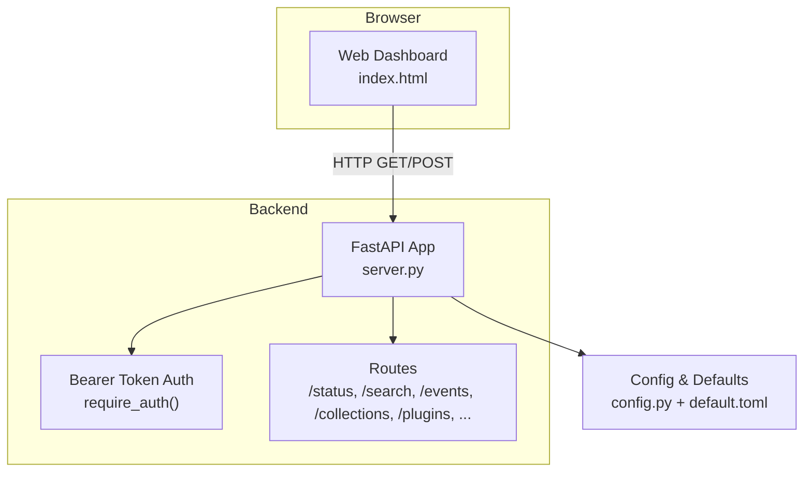
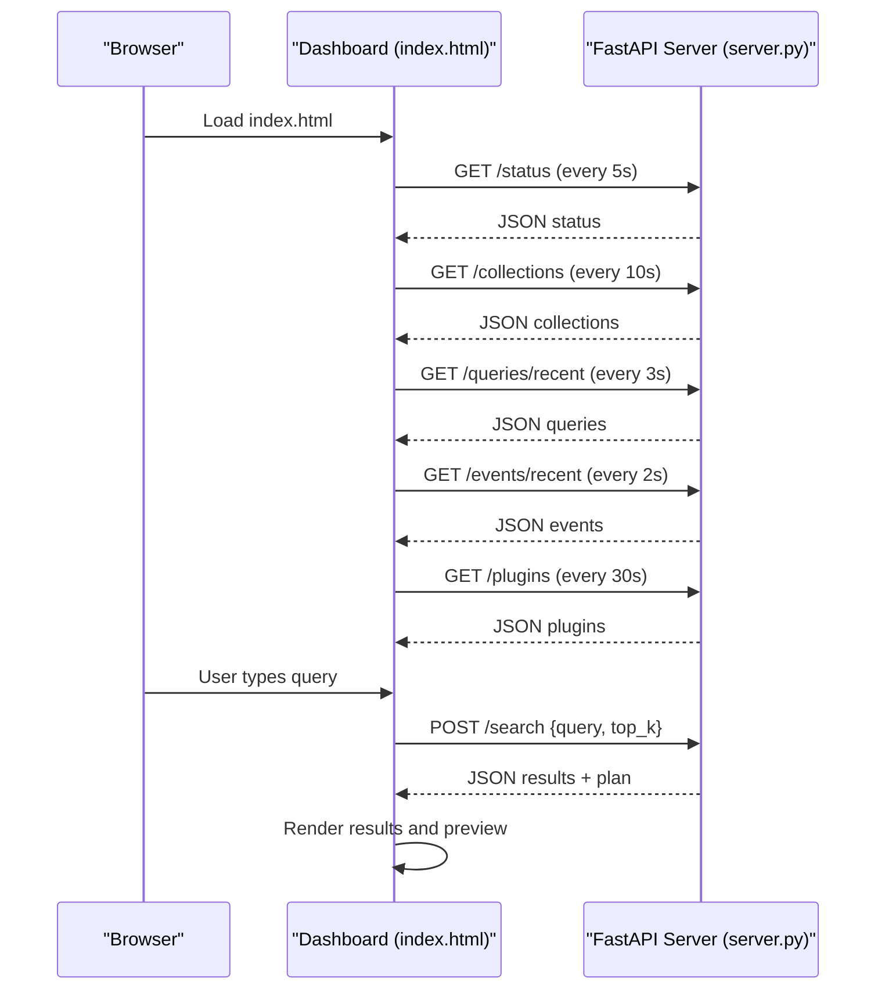
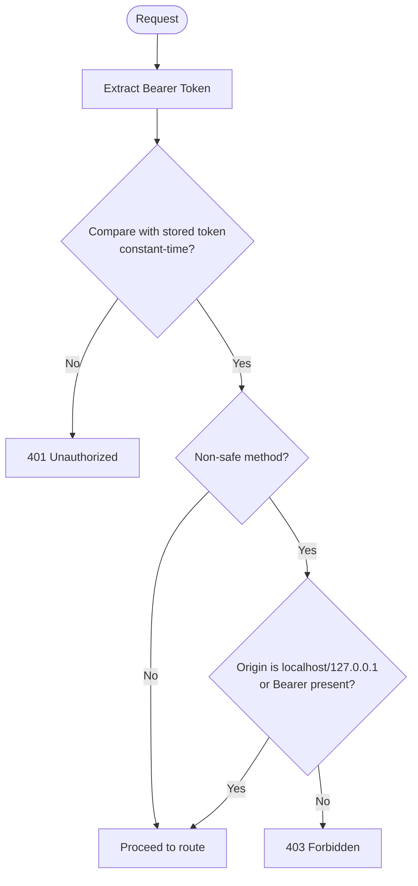
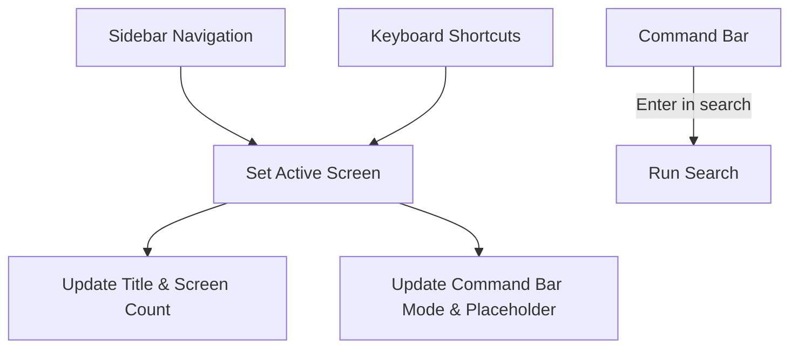
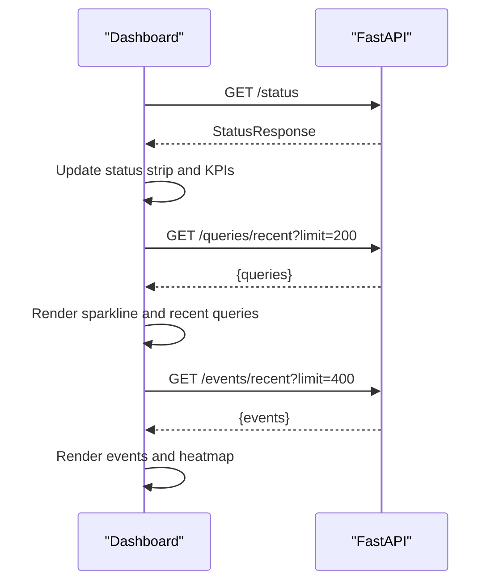
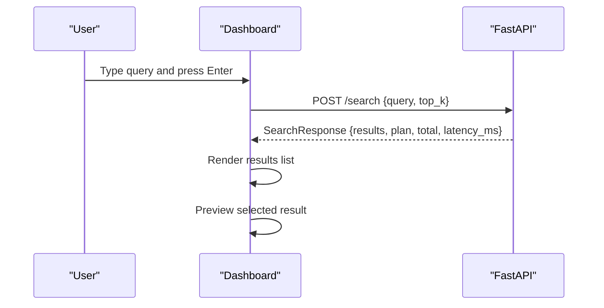
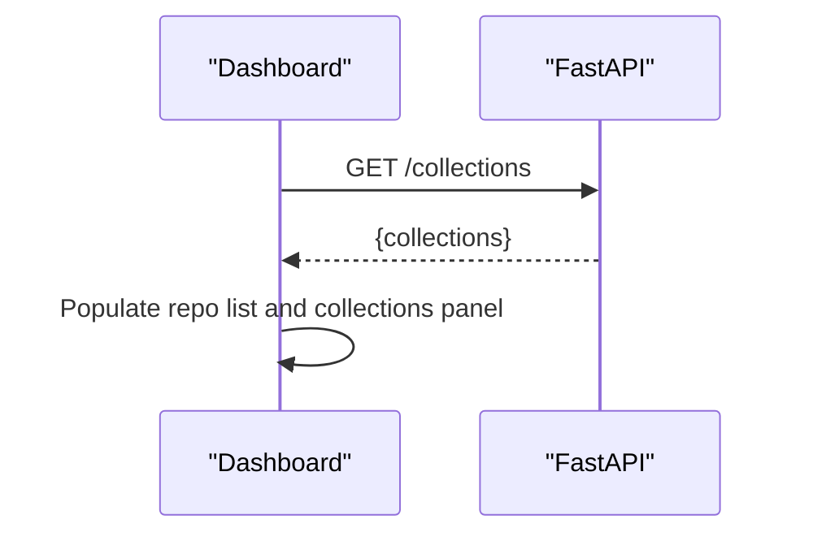
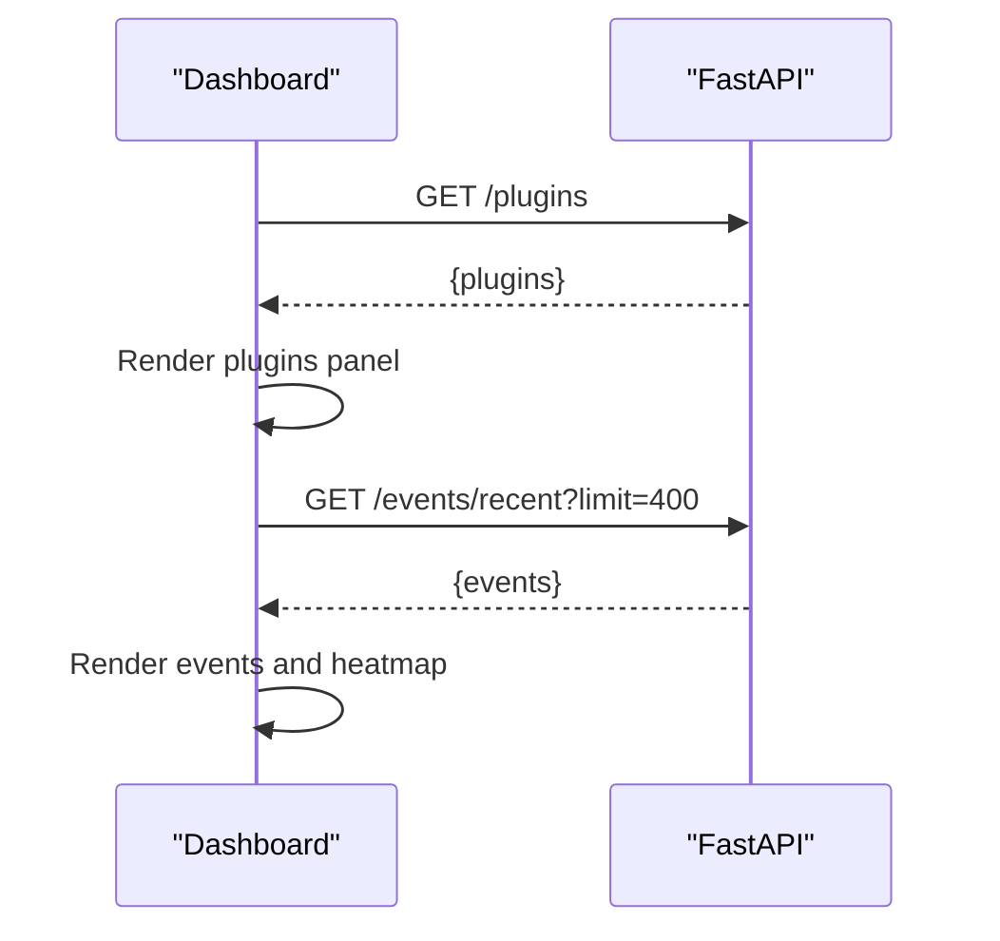
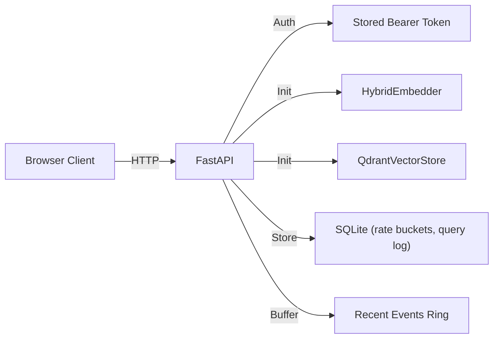

# Web Interface

<cite>
**Referenced Files in This Document**
- [index.html](file://src/rag/web/index.html)
- [server.py](file://src/rag/server.py)
- [config.py](file://src/rag/config.py)
- [default.toml](file://config/default.toml)
- [app.py](file://src/rag/app.py)
</cite>

## Table of Contents
1. [Introduction](#introduction)
2. [Project Structure](#project-structure)
3. [Core Components](#core-components)
4. [Architecture Overview](#architecture-overview)
5. [Detailed Component Analysis](#detailed-component-analysis)
6. [Dependency Analysis](#dependency-analysis)
7. [Performance Considerations](#performance-considerations)
8. [Troubleshooting Guide](#troubleshooting-guide)
9. [Conclusion](#conclusion)
10. [Appendices](#appendices)

## Introduction
This document describes the browser-based web dashboard for the RAG system. It covers the user interface, interactive capabilities, authentication and security, search and visualization, repository management, system monitoring, responsive design, cross-browser compatibility, accessibility, API endpoints, and operational guidance. The dashboard is a single-page application embedded in a static HTML file and communicates with the backend via HTTP endpoints protected by a bearer token.

## Project Structure
The web dashboard is a standalone HTML page with inline styles and JavaScript. It is served by the FastAPI backend and injected with a bearer token at serve time. The backend exposes HTTP endpoints for status, search, collections, plugins, events, and more. Configuration is TOML-based and includes server binding behavior and defaults.

**Diagram sources**
- [index.html:423-812](file://src/rag/web/index.html#L423-L812)
- [server.py:582-598](file://src/rag/server.py#L582-L598)
- [server.py:841-1200](file://src/rag/server.py#L841-L1200)
- [config.py:150-194](file://src/rag/config.py#L150-L194)
- [default.toml:1-41](file://config/default.toml#L1-L41)

**Section sources**
- [index.html:1-812](file://src/rag/web/index.html#L1-L812)
- [server.py:1-2586](file://src/rag/server.py#L1-L2586)
- [config.py:1-194](file://src/rag/config.py#L1-L194)
- [default.toml:1-41](file://config/default.toml#L1-L41)

## Core Components
- Static HTML/CSS/JS dashboard:
  - Terminal-style layout with title bar, chrome bar, status strip, navigation sidebar, main content screens, and command bar.
  - Responsive design using flexbox and constrained viewport.
  - Inline styles define a cohesive dark theme with accent colors.
- Client-side JavaScript:
  - Token injection placeholder replaced by the backend at serve time.
  - HTTP client wrapper with Authorization header.
  - Screen routing and navigation.
  - Polling functions for status, queries, events, plugins, and repositories.
  - Search workflow with result rendering and preview.
  - Keyboard shortcuts and command bar integration.
- Backend FastAPI server:
  - Authentication via Bearer token with CSRF guard middleware.
  - HTTP endpoints for status, search, recent queries, stats, collections, plugins, events, and more.
  - Rate limiting and global error handling.
  - Lifespan initialization of embedder, vector store, and background tasks.

**Section sources**
- [index.html:10-293](file://src/rag/web/index.html#L10-L293)
- [index.html:423-812](file://src/rag/web/index.html#L423-L812)
- [server.py:582-816](file://src/rag/server.py#L582-L816)
- [server.py:841-1200](file://src/rag/server.py#L841-L1200)

## Architecture Overview
The web dashboard is a client-only SPA that polls the backend for data and submits search requests. The backend enforces authentication and serves JSON responses. There are no WebSocket connections in the current implementation.

**Diagram sources**
- [index.html:433-774](file://src/rag/web/index.html#L433-L774)
- [server.py:877-1200](file://src/rag/server.py#L877-L1200)

## Detailed Component Analysis

### Authentication and Security
- Bearer token:
  - The client sends Authorization: Bearer <token> on all protected endpoints.
  - The token is read from a secure file in the user’s home directory and created if absent.
  - The server validates the token using constant-time comparison.
- CSRF protection:
  - For non-safe methods, the server checks Origin against localhost/127.0.0.1 or requires a Bearer token.
- Server binding:
  - The default server host is loopback-only to avoid exposing the token over the network.
  - Reverse proxies should be used to expose the service securely with TLS termination.

**Diagram sources**
- [server.py:582-598](file://src/rag/server.py#L582-L598)
- [server.py:798-816](file://src/rag/server.py#L798-L816)

**Section sources**
- [config.py:167-189](file://src/rag/config.py#L167-L189)
- [server.py:582-598](file://src/rag/server.py#L582-L598)
- [server.py:798-816](file://src/rag/server.py#L798-L816)
- [default.toml:1-4](file://config/default.toml#L1-L4)

### UI Layout and Navigation
- Layout:
  - Terminal-inspired container with title bar, chrome bar, status strip, sidebar, main content area, and command bar.
  - Screens: Home/Dashboard, Search, Logs.
- Navigation:
  - Sidebar items route to screens; extra items are placeholders.
  - Keyboard shortcuts: 1/2/3 to switch screens; “/” or “:” to focus command bar.
- Command bar:
  - Mode-aware placeholders; Enter executes search when in search mode.

**Diagram sources**
- [index.html:441-482](file://src/rag/web/index.html#L441-L482)
- [index.html:775-792](file://src/rag/web/index.html#L775-L792)

**Section sources**
- [index.html:296-421](file://src/rag/web/index.html#L296-L421)
- [index.html:441-482](file://src/rag/web/index.html#L441-L482)
- [index.html:775-792](file://src/rag/web/index.html#L775-L792)

### Status and Monitoring
- Status strip displays daemon connectivity, port, active repositories, chunk counts, embedder/generator info, warm-up latency, uptime, and clock.
- Home screen KPI cards show index size, embedder, generator, and uptime.
- Recent queries panel shows sparkline and recent query rows.
- Events panel shows live-tailing events and a 24-hour heatmap.

**Diagram sources**
- [index.html:516-718](file://src/rag/web/index.html#L516-L718)
- [server.py:877-1008](file://src/rag/server.py#L877-L1008)
- [server.py:1076-1083](file://src/rag/server.py#L1076-L1083)

**Section sources**
- [index.html:311-322](file://src/rag/web/index.html#L311-L322)
- [index.html:338-372](file://src/rag/web/index.html#L338-L372)
- [index.html:394-408](file://src/rag/web/index.html#L394-L408)
- [server.py:877-1008](file://src/rag/server.py#L877-L1008)
- [server.py:1076-1083](file://src/rag/server.py#L1076-L1083)

### Search Workflow
- The command bar triggers POST /search with query and top_k.
- The backend plans the search strategy, executes vector and lexical retrieval, merges results, and returns results with plan metadata.
- The UI renders results as clickable items and previews selected chunks.

**Diagram sources**
- [index.html:720-774](file://src/rag/web/index.html#L720-L774)
- [server.py:1363-1559](file://src/rag/server.py#L1363-L1559)

**Section sources**
- [index.html:720-774](file://src/rag/web/index.html#L720-L774)
- [server.py:1363-1559](file://src/rag/server.py#L1363-L1559)

### Repository Management
- Repositories are shown in the sidebar and collections panel.
- The UI lists live collections (non-empty) and repository names.
- The backend aggregates collection info across default and repo-specific collections.

**Diagram sources**
- [index.html:543-576](file://src/rag/web/index.html#L543-L576)
- [server.py:1011-1051](file://src/rag/server.py#L1011-L1051)

**Section sources**
- [index.html:543-576](file://src/rag/web/index.html#L543-L576)
- [server.py:1011-1051](file://src/rag/server.py#L1011-L1051)

### Plugins and System Monitoring
- Plugins list shows plugin names and pattern counts.
- Events panel tails recent events and shows a 24-hour heatmap.
- The backend maintains an in-memory ring buffer of events and supports rate limiting.

**Diagram sources**
- [index.html:635-649](file://src/rag/web/index.html#L635-L649)
- [index.html:669-718](file://src/rag/web/index.html#L669-L718)
- [server.py:1053-1083](file://src/rag/server.py#L1053-L1083)

**Section sources**
- [index.html:635-649](file://src/rag/web/index.html#L635-L649)
- [index.html:669-718](file://src/rag/web/index.html#L669-L718)
- [server.py:1053-1083](file://src/rag/server.py#L1053-L1083)

### Real-time Updates and Polling
- The dashboard polls endpoints at intervals:
  - Status: every 5 seconds
  - Collections: every 10 seconds
  - Queries: every 3 seconds
  - Plugins: every 30 seconds
  - Events: every 2 seconds
- The UI updates DOM elements and maintains scroll position for event logs.

**Section sources**
- [index.html:800-809](file://src/rag/web/index.html#L800-L809)
- [index.html:516-718](file://src/rag/web/index.html#L516-L718)

## Dependency Analysis
- Client to server:
  - All protected routes depend on Bearer token authentication.
  - CSRF guard middleware restricts non-safe methods.
- Backend to internal systems:
  - Embedder and vector store initialized during lifespan.
  - Event ring buffer and recent indexed files maintained in-memory.
  - Rate limiting uses persistent storage.

**Diagram sources**
- [server.py:582-598](file://src/rag/server.py#L582-L598)
- [server.py:603-716](file://src/rag/server.py#L603-L716)
- [server.py:770-789](file://src/rag/server.py#L770-L789)

**Section sources**
- [server.py:582-598](file://src/rag/server.py#L582-L598)
- [server.py:603-716](file://src/rag/server.py#L603-L716)
- [server.py:770-789](file://src/rag/server.py#L770-L789)

## Performance Considerations
- Polling cadence:
  - Status and collections: moderate intervals to balance freshness and load.
  - Queries and events: shorter intervals for near-real-time updates.
- Rendering:
  - Sparklines and heatmaps computed client-side from aggregated data.
  - Event list maintains scroll position to preserve user context.
- Backend:
  - Warm-up latency probe runs periodically to capture steady-state embedder latency.
  - Rate limiting prevents abuse; failures are handled gracefully.

[No sources needed since this section provides general guidance]

## Troubleshooting Guide
- Daemon not reachable:
  - The UI marks the daemon as offline when status polling fails.
  - Ensure the daemon is running and bound to loopback.
- Unauthorized:
  - Verify the token file exists and matches the server’s expectation.
  - Confirm Authorization header is present in requests.
- Forbidden origin:
  - Non-safe requests from browsers may be blocked if Origin is not localhost/127.0.0.1 and no Bearer token is provided.
- Rate limited:
  - Excessive requests may trigger rate limiting; reduce polling frequency or retry after delay.
- Search yields no results:
  - Confirm the repository is indexed and collections are non-empty.
  - Adjust query or filters.

**Section sources**
- [index.html:516-541](file://src/rag/web/index.html#L516-L541)
- [config.py:167-189](file://src/rag/config.py#L167-L189)
- [server.py:582-598](file://src/rag/server.py#L582-L598)
- [server.py:798-816](file://src/rag/server.py#L798-L816)
- [server.py:770-789](file://src/rag/server.py#L770-L789)

## Conclusion
The web dashboard provides a compact, terminal-inspired interface for monitoring and interacting with the RAG system. It relies on periodic polling for live data and a robust authentication and CSRF protection scheme. The backend offers a comprehensive set of endpoints for status, search, events, and repository insights, enabling effective system monitoring and code search.

[No sources needed since this section summarizes without analyzing specific files]

## Appendices

### API Endpoints Consumed by the Web Interface
- GET /status
  - Purpose: Fetch daemon status, models, uptime, restart count, and warm-up latency.
  - Auth: Required.
- GET /collections
  - Purpose: List collections (default and repo-specific) with counts.
  - Auth: Required.
- GET /queries/recent?limit=N
  - Purpose: Recent queries for sparkline and recent list.
  - Auth: Required.
- GET /queries/stats?window=N
  - Purpose: Query performance metrics (QPM, latency percentiles).
  - Auth: Required.
- GET /plugins
  - Purpose: Installed plugins summary.
  - Auth: Required.
- GET /events/recent?limit=N
  - Purpose: Live-tail events for logs panel.
  - Auth: Required.
- POST /search
  - Purpose: Execute search with plan and results.
  - Auth: Required.

**Section sources**
- [server.py:877-1008](file://src/rag/server.py#L877-L1008)
- [server.py:1011-1051](file://src/rag/server.py#L1011-L1051)
- [server.py:1053-1083](file://src/rag/server.py#L1053-L1083)
- [server.py:1363-1559](file://src/rag/server.py#L1363-L1559)

### Setup and Access
- Prerequisites:
  - The daemon must be running and bound to loopback by default.
  - The browser loads the static HTML page served by the backend.
- Access:
  - Open the dashboard in a browser; the backend injects the token placeholder at serve time.
- Configuration:
  - Server host/port defaults to loopback; adjust via configuration if needed.
  - Reverse proxies should terminate TLS and forward to the daemon.

**Section sources**
- [default.toml:1-4](file://config/default.toml#L1-L4)
- [config.py:150-194](file://src/rag/config.py#L150-L194)
- [index.html:426-430](file://src/rag/web/index.html#L426-L430)

### Responsive Design, Cross-Browser Compatibility, and Accessibility
- Responsive design:
  - Flexbox-based layout adapts to viewport; fixed max-width and max-height for readability.
- Cross-browser:
  - Uses vanilla ES5-style APIs and widely supported CSS; tested on modern browsers.
- Accessibility:
  - Minimal keyboard navigation via command bar and screen switching.
  - Color contrast optimized for dark theme; focusable elements use standard inputs.

**Section sources**
- [index.html:10-293](file://src/rag/web/index.html#L10-L293)
- [index.html:775-792](file://src/rag/web/index.html#L775-L792)