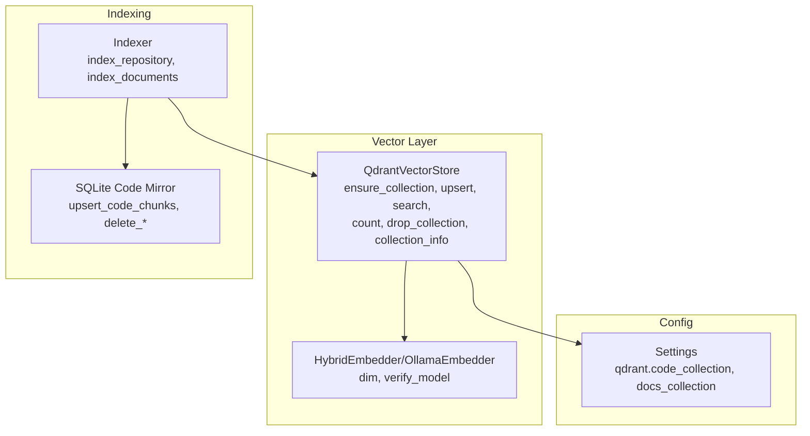
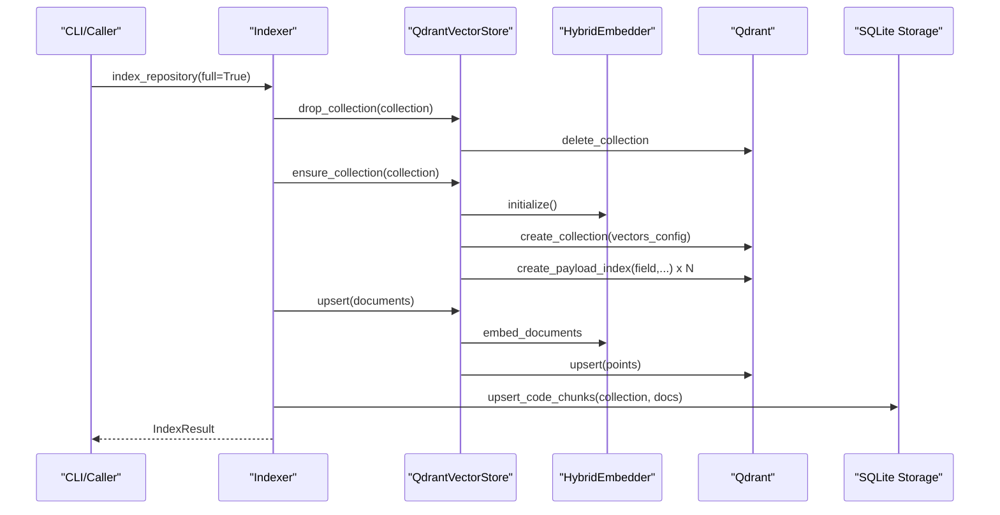
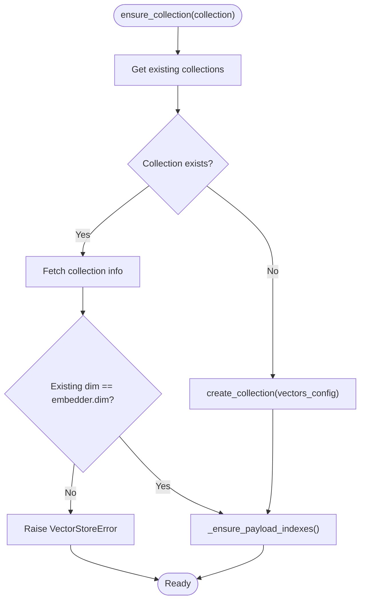
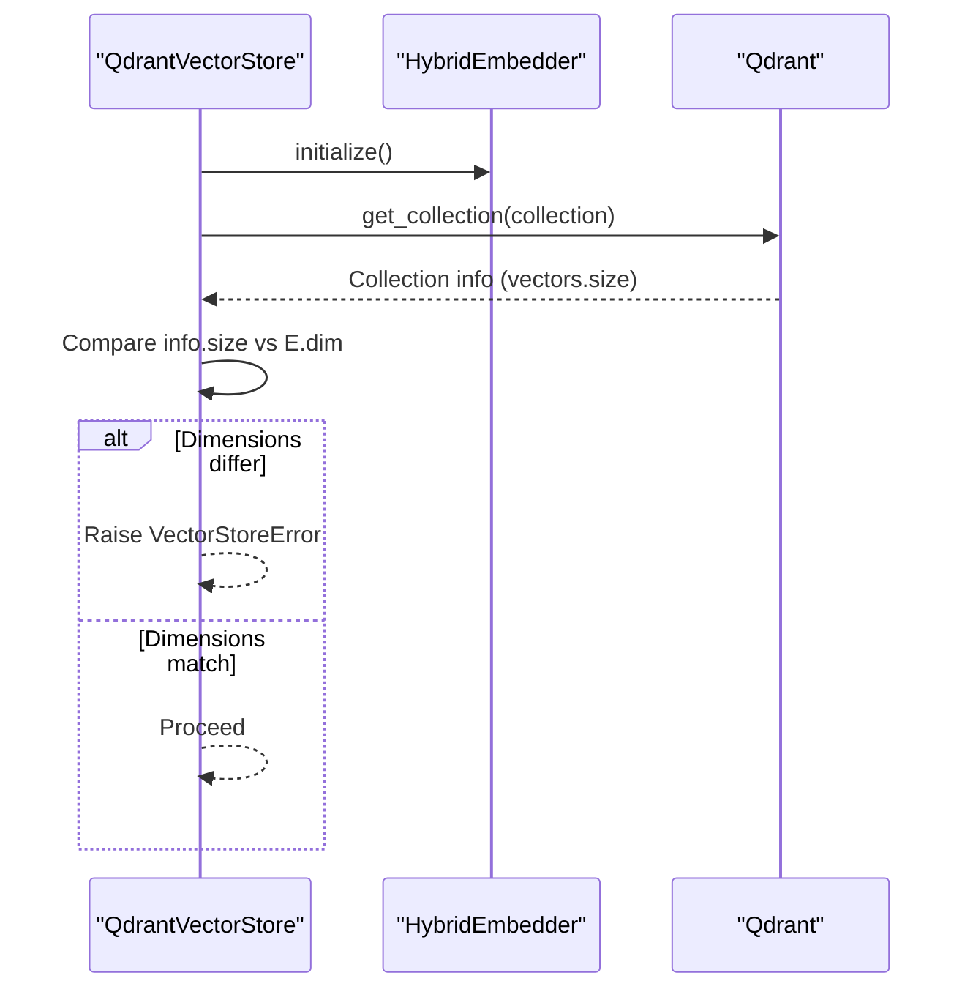
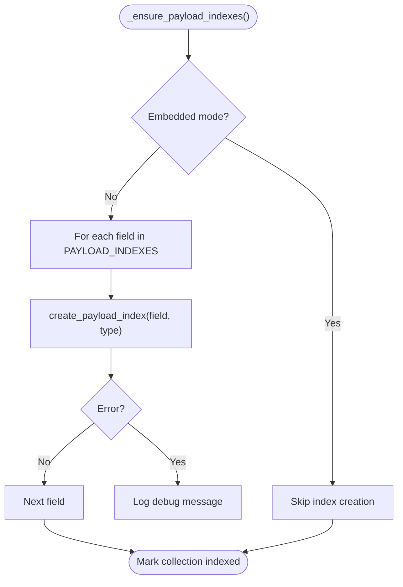
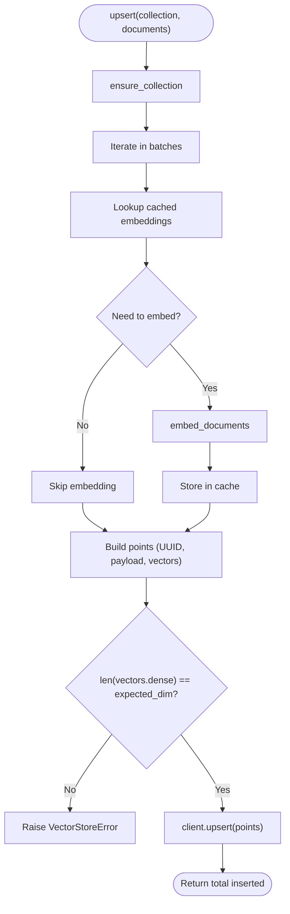
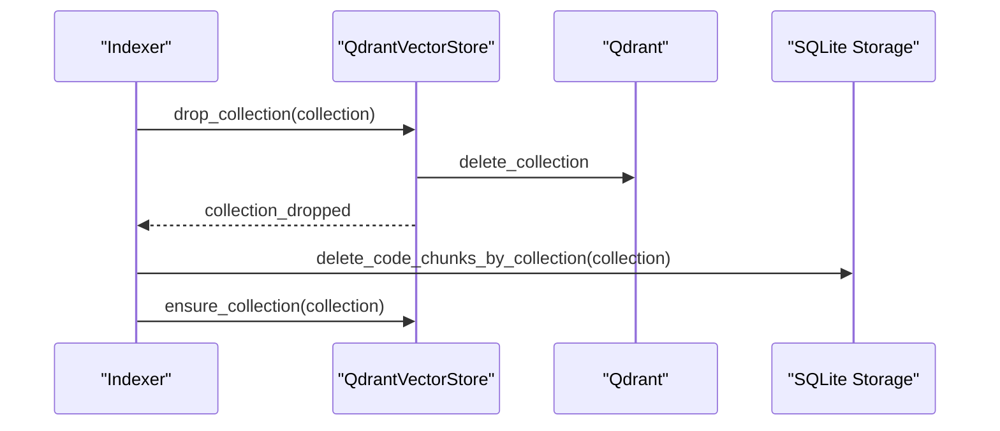
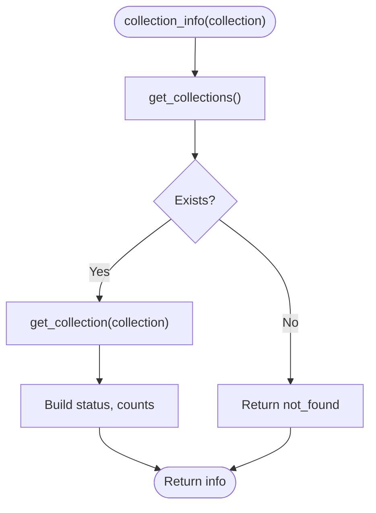
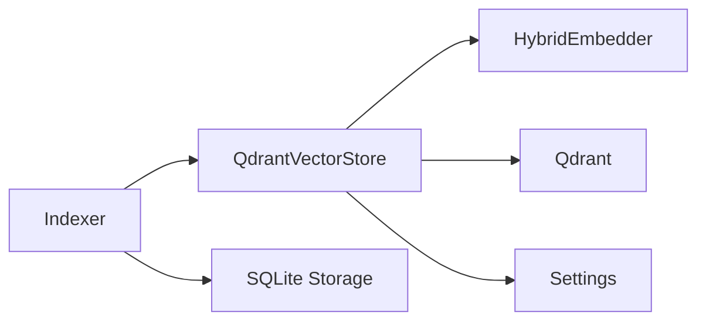

# Collection Management

<cite>
**Referenced Files in This Document**
- [vectorstore.py](file://src/rag/core/vectorstore.py)
- [embedder.py](file://src/rag/core/embedder.py)
- [indexer.py](file://src/rag/core/indexer.py)
- [db.py](file://src/rag/storage/db.py)
- [config.py](file://src/rag/config.py)
- [errors.py](file://src/rag/core/errors.py)
- [cli.py](file://src/rag/cli.py)
</cite>

## Table of Contents
1. [Introduction](#introduction)
2. [Project Structure](#project-structure)
3. [Core Components](#core-components)
4. [Architecture Overview](#architecture-overview)
5. [Detailed Component Analysis](#detailed-component-analysis)
6. [Dependency Analysis](#dependency-analysis)
7. [Performance Considerations](#performance-considerations)
8. [Troubleshooting Guide](#troubleshooting-guide)
9. [Conclusion](#conclusion)
10. [Appendices](#appendices)

## Introduction
This document explains collection management operations within the vector store system. It focuses on creating and maintaining Qdrant collections for vector search, validating vector dimensions, setting up payload indexes, checking collection existence, protecting against embedding model changes, deleting collections, retrieving collection statistics, and organizing multiple collections across repositories and tenants. Practical examples and troubleshooting guidance are included to help operators manage collections reliably.

## Project Structure
The collection lifecycle is implemented primarily in the vector store module and integrated with the indexing pipeline and storage layers:
- Vector store: collection creation, dimension validation, payload index setup, upsert, search, count, delete, and collection info.
- Embedder: dimension reporting and model verification to protect against mismatches.
- Indexer: orchestrates full and incremental indexing, including collection resets and deletions.
- Storage: SQLite mirror for exact/lexical retrieval and auxiliary counters; supports collection-scoped cleanup.
- Config: defines default collection names and Qdrant settings.

**Diagram sources**
- [vectorstore.py:199-530](file://src/rag/core/vectorstore.py#L199-L530)
- [embedder.py:189-245](file://src/rag/core/embedder.py#L189-L245)
- [indexer.py:242-740](file://src/rag/core/indexer.py#L242-L740)
- [db.py:151-251](file://src/rag/storage/db.py#L151-L251)
- [config.py:64-70](file://src/rag/config.py#L64-L70)

**Section sources**
- [vectorstore.py:199-530](file://src/rag/core/vectorstore.py#L199-L530)
- [embedder.py:189-245](file://src/rag/core/embedder.py#L189-L245)
- [indexer.py:242-740](file://src/rag/core/indexer.py#L242-L740)
- [db.py:151-251](file://src/rag/storage/db.py#L151-L251)
- [config.py:64-70](file://src/rag/config.py#L64-L70)

## Core Components
- QdrantVectorStore: central component for collection lifecycle and vector operations.
- HybridEmbedder/OllamaEmbedder: provides vector dimension and validates the configured model.
- Indexer: manages full and incremental indexing, including collection reset and deletion.
- SQLite storage: maintains a code mirror and counters; supports collection-scoped cleanup.
- Settings: defines default collection names and Qdrant configuration.

Key responsibilities:
- Collection creation with dense vector configuration and payload index setup.
- Dimension validation to prevent silent corruption when embedding models change.
- Upsert with caching and dimension checks.
- Search with payload filters.
- Count and delete operations.
- Collection info retrieval.

**Section sources**
- [vectorstore.py:199-530](file://src/rag/core/vectorstore.py#L199-L530)
- [embedder.py:189-245](file://src/rag/core/embedder.py#L189-L245)
- [indexer.py:242-740](file://src/rag/core/indexer.py#L242-L740)
- [db.py:151-251](file://src/rag/storage/db.py#L151-L251)
- [config.py:64-70](file://src/rag/config.py#L64-L70)

## Architecture Overview
The collection management flow integrates the vector store, embedder, and storage layers. The indexing pipeline coordinates collection resets and deletions, while the vector store enforces dimension safety and payload index setup.

**Diagram sources**
- [indexer.py:298-302](file://src/rag/core/indexer.py#L298-L302)
- [vectorstore.py:230-295](file://src/rag/core/vectorstore.py#L230-L295)
- [vectorstore.py:296-422](file://src/rag/core/vectorstore.py#L296-L422)
- [db.py:151-226](file://src/rag/storage/db.py#L151-L226)

## Detailed Component Analysis

### Collection Creation and Existence Checking
- Existence check: retrieves existing collections and compares against the requested collection name.
- Dimension guard: fetches the existing collection’s vector size and compares with the current embedder dimension; raises an error if mismatched.
- Automatic payload index setup: creates indexes for predefined payload fields, with safeguards for embedded mode and idempotency.

**Diagram sources**
- [vectorstore.py:230-295](file://src/rag/core/vectorstore.py#L230-L295)

**Section sources**
- [vectorstore.py:230-295](file://src/rag/core/vectorstore.py#L230-L295)

### Dimension Validation and Model Protection
- Embedder dimension: HybridEmbedder exposes the current dimension; OllamaEmbedder verifies the model and sets the dimension.
- Runtime protection: If the collection was created with a different dimension than the current embedder, creation is blocked to prevent silent corruption.

**Diagram sources**
- [vectorstore.py:260-280](file://src/rag/core/vectorstore.py#L260-L280)
- [embedder.py:217-228](file://src/rag/core/embedder.py#L217-L228)

**Section sources**
- [vectorstore.py:260-280](file://src/rag/core/vectorstore.py#L260-L280)
- [embedder.py:217-228](file://src/rag/core/embedder.py#L217-L228)

### Payload Index Setup
- Predefined indexes: A fixed list of payload fields is indexed to accelerate filtering.
- Mode handling: Index creation is skipped in embedded mode; indexes are memoized per collection to avoid redundant operations.

**Diagram sources**
- [vectorstore.py:238-259](file://src/rag/core/vectorstore.py#L238-L259)

**Section sources**
- [vectorstore.py:238-259](file://src/rag/core/vectorstore.py#L238-L259)

### Upsert with Dimension Checks and Caching
- Caching: EmbeddingCache stores dense vectors keyed by content hash to avoid re-embedding unchanged chunks.
- Dimension safety: Validates that produced vectors match the expected dimension before upserting.
- Point construction: Ensures valid UUIDs for point IDs; converts short hashes deterministically.

**Diagram sources**
- [vectorstore.py:296-422](file://src/rag/core/vectorstore.py#L296-L422)
- [cache.py:112-163](file://src/rag/core/cache.py#L112-L163)

**Section sources**
- [vectorstore.py:296-422](file://src/rag/core/vectorstore.py#L296-L422)
- [cache.py:112-163](file://src/rag/core/cache.py#L112-L163)

### Collection Deletion and Cleanup
- Drop collection: Deletes the named collection if it exists; removes it from the in-memory index tracking.
- Delete by filter: Removes points matching a payload filter; safe-guarded against missing collections.
- Indexer integration: Full re-index resets the SQLite code mirror and drops the collection before rebuilding.

**Diagram sources**
- [vectorstore.py:497-505](file://src/rag/core/vectorstore.py#L497-L505)
- [indexer.py:298-302](file://src/rag/core/indexer.py#L298-L302)
- [db.py:245-250](file://src/rag/storage/db.py#L245-L250)

**Section sources**
- [vectorstore.py:497-505](file://src/rag/core/vectorstore.py#L497-L505)
- [indexer.py:298-302](file://src/rag/core/indexer.py#L298-L302)
- [db.py:245-250](file://src/rag/storage/db.py#L245-L250)

### Collection Statistics Retrieval
- Count: Returns the number of points in a collection.
- Info: Returns collection status, points count, and vectors count; gracefully handles missing collections.

**Diagram sources**
- [vectorstore.py:507-525](file://src/rag/core/vectorstore.py#L507-L525)

**Section sources**
- [vectorstore.py:507-525](file://src/rag/core/vectorstore.py#L507-L525)

### Practical Examples

- Create or refresh a collection for a repository:
  - Call ensure_collection with the desired collection name.
  - Upsert documents; the system validates dimensions and caches embeddings.
  - Use collection_info to confirm points count.

- Manage multiple collections for different repositories:
  - Use distinct collection names per repository.
  - Full re-index drops the collection and rebuilds it to ensure clean state.

- Protect against embedding model changes:
  - If switching models, expect a dimension mismatch error; perform a full re-index to rebuild with the new model.

- Clean up stale collections:
  - Use drop_collection to remove unused collections.
  - Delete by filter to remove subsets (e.g., by file_path) before re-indexing.

**Section sources**
- [vectorstore.py:230-295](file://src/rag/core/vectorstore.py#L230-L295)
- [vectorstore.py:296-422](file://src/rag/core/vectorstore.py#L296-L422)
- [vectorstore.py:497-525](file://src/rag/core/vectorstore.py#L497-L525)
- [indexer.py:298-302](file://src/rag/core/indexer.py#L298-L302)

### Troubleshooting Collection Creation Failures
Common issues and resolutions:
- Dimension mismatch error:
  - Symptom: VectorStoreError indicating dimension mismatch.
  - Cause: Embedding model changed after collection creation.
  - Resolution: Perform a full re-index to rebuild the collection with the new model.

- Missing Qdrant server:
  - Symptom: Connection errors when creating or checking collections.
  - Resolution: Verify Qdrant URL/path and health; start the service if needed.

- Payload index creation failures:
  - Symptom: Some payload indexes not applied.
  - Resolution: Review logs for index creation errors; ensure write permissions and sufficient resources.

- Silent recall degradation:
  - Symptom: Slow or inconsistent filtering.
  - Resolution: Confirm payload indexes are created; embedded mode skips indexes by design.

**Section sources**
- [vectorstore.py:260-280](file://src/rag/core/vectorstore.py#L260-L280)
- [vectorstore.py:238-259](file://src/rag/core/vectorstore.py#L238-L259)
- [cli.py:282-300](file://src/rag/cli.py#L282-L300)

### Naming Conventions, Isolation, and Multi-Tenant Organization
- Naming conventions:
  - Use descriptive names for collections (e.g., repository-specific identifiers).
  - Default names are provided in settings for code and docs collections.

- Isolation strategies:
  - Separate collections per repository or tenant to avoid cross-contamination.
  - Use collection-scoped filters (e.g., file_path) to limit operations.

- Best practices:
  - Maintain separate collection names for different environments (dev/staging/prod).
  - Use full re-index when changing embedding models or vector parameters.
  - Monitor payload index coverage for frequently used filters.

**Section sources**
- [config.py:64-70](file://src/rag/config.py#L64-L70)
- [vectorstore.py:238-259](file://src/rag/core/vectorstore.py#L238-L259)
- [indexer.py:298-302](file://src/rag/core/indexer.py#L298-L302)

## Dependency Analysis
- QdrantVectorStore depends on HybridEmbedder for dimension and model verification.
- Indexer orchestrates collection resets and deletions and coordinates with SQLite storage for code mirroring.
- SQLite storage maintains auxiliary counters and exact/lexical indices; supports collection-scoped cleanup.

**Diagram sources**
- [vectorstore.py:199-530](file://src/rag/core/vectorstore.py#L199-L530)
- [embedder.py:189-245](file://src/rag/core/embedder.py#L189-L245)
- [indexer.py:242-740](file://src/rag/core/indexer.py#L242-L740)
- [db.py:151-251](file://src/rag/storage/db.py#L151-L251)
- [config.py:64-70](file://src/rag/config.py#L64-L70)

**Section sources**
- [vectorstore.py:199-530](file://src/rag/core/vectorstore.py#L199-L530)
- [embedder.py:189-245](file://src/rag/core/embedder.py#L189-L245)
- [indexer.py:242-740](file://src/rag/core/indexer.py#L242-L740)
- [db.py:151-251](file://src/rag/storage/db.py#L151-L251)
- [config.py:64-70](file://src/rag/config.py#L64-L70)

## Performance Considerations
- Payload indexes improve filter performance; they are created once per collection and skipped in embedded mode.
- Upsert batching and embedding caching reduce latency and resource usage.
- Dimension checks prevent costly silent corruption and rework later.

[No sources needed since this section provides general guidance]

## Troubleshooting Guide
- Dimension mismatch:
  - Error type: VectorStoreError.
  - Action: Re-index with full rebuild to recreate the collection with the current embedder.

- Missing collection:
  - Behavior: drop_collection and delete_by_filter are safe no-ops; collection_info reports not_found.

- Qdrant connectivity:
  - Use CLI commands to check Qdrant status and health.

- SQLite storage issues:
  - Errors in code mirror operations are logged and do not crash indexing; they are non-critical.

**Section sources**
- [errors.py:12-14](file://src/rag/core/errors.py#L12-L14)
- [vectorstore.py:497-525](file://src/rag/core/vectorstore.py#L497-L525)
- [cli.py:282-300](file://src/rag/cli.py#L282-L300)
- [db.py:228-250](file://src/rag/storage/db.py#L228-L250)

## Conclusion
Collection management in the vector store system centers on safe creation, dimension validation, and payload index setup. The indexing pipeline integrates collection resets and deletions, while the vector store enforces model consistency and provides robust statistics and cleanup operations. Following the naming and isolation strategies outlined here ensures reliable multi-repository and multi-tenant operation.

[No sources needed since this section summarizes without analyzing specific files]

## Appendices

### API Surface for Collection Operations
- ensure_collection(collection)
- upsert(collection, documents, batch_size, cache, timings_ms)
- search(collection, query, top_k, filters)
- count(collection)
- delete_by_filter(collection, field, value)
- drop_collection(collection)
- collection_info(collection)

**Section sources**
- [vectorstore.py:230-525](file://src/rag/core/vectorstore.py#L230-L525)