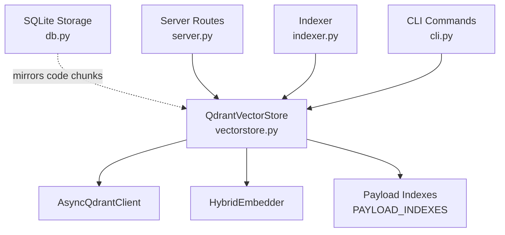
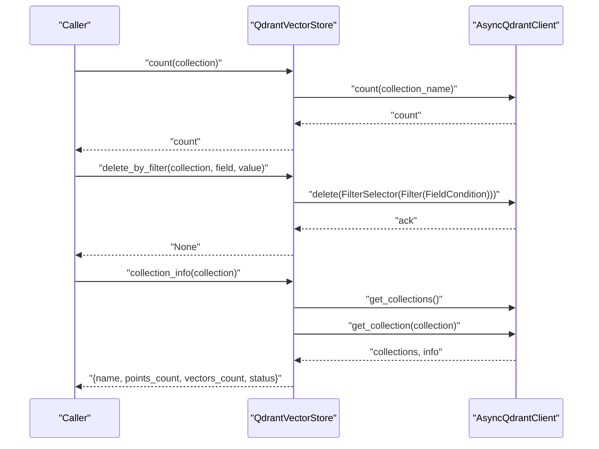
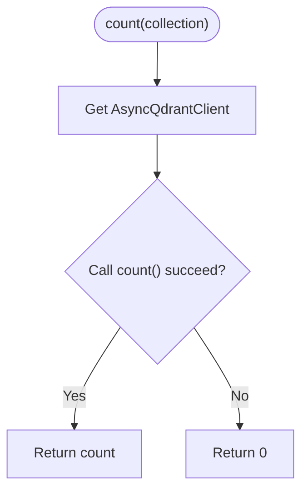
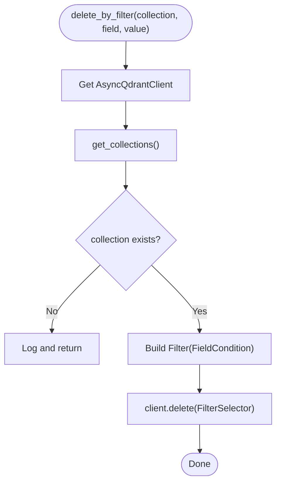
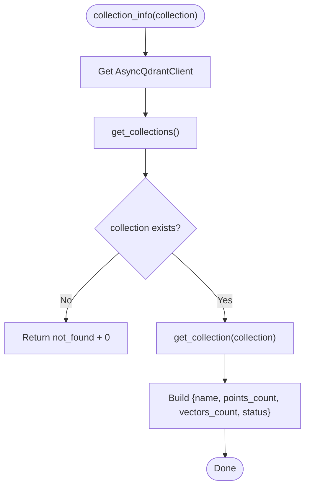
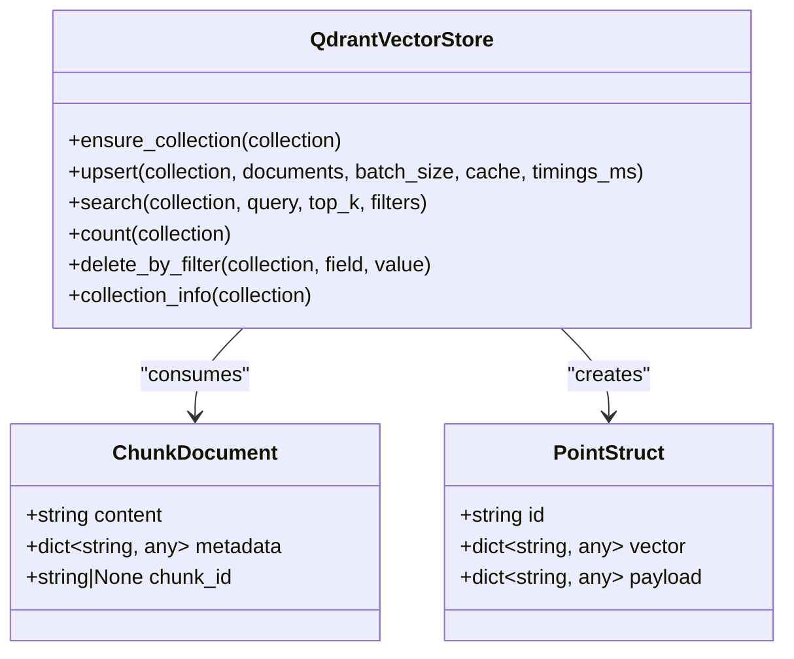
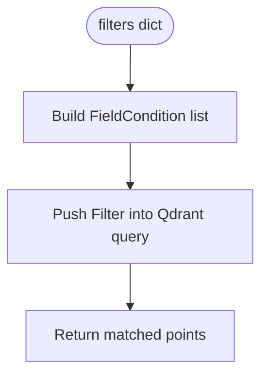
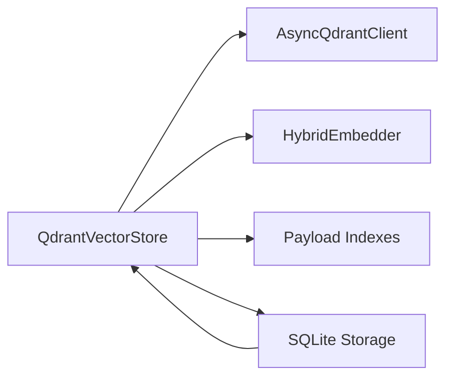

# Data Operations

<cite>
**Referenced Files in This Document**
- [vectorstore.py](file://src/rag/core/vectorstore.py)
- [db.py](file://src/rag/storage/db.py)
- [server.py](file://src/rag/server.py)
- [indexer.py](file://src/rag/core/indexer.py)
- [cli.py](file://src/rag/cli.py)
- [test_query.py](file://tests/test_query.py)
- [test_indexer_crash.py](file://tests/test_indexer_crash.py)
</cite>

## Table of Contents
1. [Introduction](#introduction)
2. [Project Structure](#project-structure)
3. [Core Components](#core-components)
4. [Architecture Overview](#architecture-overview)
5. [Detailed Component Analysis](#detailed-component-analysis)
6. [Dependency Analysis](#dependency-analysis)
7. [Performance Considerations](#performance-considerations)
8. [Troubleshooting Guide](#troubleshooting-guide)
9. [Conclusion](#conclusion)
10. [Appendices](#appendices)

## Introduction
This document explains vector store data operations with a focus on:
- Counting points in a collection
- Deleting points via filter-based selection
- Retrieving collection information for monitoring and diagnostics

It also covers the creation of PointStruct entries, vector and payload management, and metadata preservation during operations. Practical examples include data maintenance tasks, bulk deletion strategies, monitoring, and operational troubleshooting. Guidance is included on data integrity, batch operation limits, performance implications, and best practices for lifecycle and maintenance.

## Project Structure
The vector store operations live primarily in the vectorstore module, with supporting storage and server integrations:
- Vector store operations and data models
- SQLite-backed auxiliary storage for exact/lexical recall and operational metrics
- Server routes and CLI commands that expose monitoring and maintenance operations

**Diagram sources**
- [vectorstore.py:199-530](file://src/rag/core/vectorstore.py#L199-L530)
- [db.py:151-226](file://src/rag/storage/db.py#L151-L226)
- [server.py:887-1053](file://src/rag/server.py#L887-L1053)
- [indexer.py:394](file://src/rag/core/indexer.py#L394)
- [cli.py:2130](file://src/rag/cli.py#L2130)

**Section sources**
- [vectorstore.py:199-530](file://src/rag/core/vectorstore.py#L199-L530)
- [db.py:151-226](file://src/rag/storage/db.py#L151-L226)
- [server.py:887-1053](file://src/rag/server.py#L887-L1053)
- [indexer.py:394](file://src/rag/core/indexer.py#L394)
- [cli.py:2130](file://src/rag/cli.py#L2130)

## Core Components
- QdrantVectorStore: Implements upsert, search, count, delete_by_filter, collection_info, and collection lifecycle helpers.
- ChunkDocument: Lightweight data structure representing a chunk with content, metadata, and optional chunk_id.
- PAYLOAD_INDEXES: Declares payload fields and types to be indexed for efficient filtering.
- SQLite storage: Mirrors code chunks and supports exact/lexical search and operational metrics.

Key operations:
- count(collection): Returns the number of points in a collection.
- delete_by_filter(collection, field, value): Deletes points matching a field equality filter.
- collection_info(collection): Returns collection stats including points_count, vectors_count, and status.

**Section sources**
- [vectorstore.py:110-117](file://src/rag/core/vectorstore.py#L110-L117)
- [vectorstore.py:23-73](file://src/rag/core/vectorstore.py#L23-L73)
- [vectorstore.py:467-475](file://src/rag/core/vectorstore.py#L467-L475)
- [vectorstore.py:476-495](file://src/rag/core/vectorstore.py#L476-L495)
- [vectorstore.py:507-524](file://src/rag/core/vectorstore.py#L507-L524)
- [db.py:151-226](file://src/rag/storage/db.py#L151-L226)

## Architecture Overview
The vector store integrates with Qdrant for dense vector search and payload filtering. Payload indexes are created on-demand to accelerate filters. The server and CLI use these operations for monitoring and maintenance.

**Diagram sources**
- [vectorstore.py:467-475](file://src/rag/core/vectorstore.py#L467-L475)
- [vectorstore.py:476-495](file://src/rag/core/vectorstore.py#L476-L495)
- [vectorstore.py:507-524](file://src/rag/core/vectorstore.py#L507-L524)

## Detailed Component Analysis

### Count Operation
Purpose: Determine the number of points in a collection.

Behavior:
- Retrieves a count via the underlying client.
- Returns zero on exceptions.

Usage contexts:
- Server overview aggregation
- CLI diagnostics
- Operational checks

**Diagram sources**
- [vectorstore.py:467-475](file://src/rag/core/vectorstore.py#L467-L475)

**Section sources**
- [vectorstore.py:467-475](file://src/rag/core/vectorstore.py#L467-L475)
- [server.py:1386](file://src/rag/server.py#L1386)
- [cli.py:1983](file://src/rag/cli.py#L1983)

### Delete By Filter
Purpose: Targeted cleanup by deleting points matching a field equality condition.

Implementation highlights:
- Validates collection existence before deletion.
- Builds a FilterSelector with a FieldCondition for key=value.
- Executes deletion against the client.

Operational notes:
- Use with caution; consider batching and idempotency.
- Prefer filtering by stable identifiers (e.g., file_path) to avoid accidental deletions.

**Diagram sources**
- [vectorstore.py:476-495](file://src/rag/core/vectorstore.py#L476-L495)

**Section sources**
- [vectorstore.py:476-495](file://src/rag/core/vectorstore.py#L476-L495)
- [indexer.py:394](file://src/rag/core/indexer.py#L394)
- [cli.py:2130](file://src/rag/cli.py#L2130)

### Collection Info
Purpose: Retrieve collection statistics for monitoring and diagnostics.

Fields returned:
- name: Collection name
- points_count: Number of points
- vectors_count: Vector count (fallback to points_count if unavailable)
- status: Collection status string

Behavior:
- Checks collection existence.
- Fetches collection info and extracts fields.
- Returns a standardized dictionary, logging on error.

**Diagram sources**
- [vectorstore.py:507-524](file://src/rag/core/vectorstore.py#L507-L524)

**Section sources**
- [vectorstore.py:507-524](file://src/rag/core/vectorstore.py#L507-L524)
- [server.py:887-1053](file://src/rag/server.py#L887-L1053)

### PointStruct Creation and Payload Management
Creation process:
- Each upsert batch constructs PointStruct entries with:
  - id: Uses chunk_id if valid UUID; otherwise derives a deterministic UUID from a namespace-UUID of the chunk_id.
  - vector: Dense embedding mapped under the "dense" key.
  - payload: Merges content and metadata; content is preserved under the "content" key.

Metadata preservation:
- All metadata fields are preserved in the payload for downstream filtering and retrieval.
- Payload indexes are created for frequently queried fields to improve filter performance.

**Diagram sources**
- [vectorstore.py:110-117](file://src/rag/core/vectorstore.py#L110-L117)
- [vectorstore.py:392-406](file://src/rag/core/vectorstore.py#L392-L406)
- [vectorstore.py:199-530](file://src/rag/core/vectorstore.py#L199-L530)

**Section sources**
- [vectorstore.py:392-406](file://src/rag/core/vectorstore.py#L392-L406)
- [vectorstore.py:23-73](file://src/rag/core/vectorstore.py#L23-L73)

### Filter Construction and Query-Time Behavior
Filter translation:
- Translates a {field: value} dictionary into a Qdrant Filter with FieldCondition.
- Supports boolean, numeric (range gte), list (MatchAny), and exact-match values.
- Query-time filters are pushed into Qdrant to avoid post-filtering recall loss.

Validation and safety:
- Tests confirm that filtered search returns only matching results.

**Diagram sources**
- [vectorstore.py:119-156](file://src/rag/core/vectorstore.py#L119-L156)
- [test_query.py:88-124](file://tests/test_query.py#L88-L124)

**Section sources**
- [vectorstore.py:119-156](file://src/rag/core/vectorstore.py#L119-L156)
- [test_query.py:88-124](file://tests/test_query.py#L88-L124)

### Bulk Deletion Strategies
Recommended approaches:
- Use delete_by_filter with stable identifiers (e.g., file_path) to target entire files or sets of files.
- For large-scale deletions, iterate over known identifiers and issue multiple delete_by_filter calls.
- Combine with collection_info and count to monitor progress and verify completion.

Operational safeguards:
- Verify collection existence before deletion.
- Prefer idempotent operations and avoid broad filters that could unintentionally match many points.

**Section sources**
- [vectorstore.py:476-495](file://src/rag/core/vectorstore.py#L476-L495)
- [indexer.py:394](file://src/rag/core/indexer.py#L394)
- [cli.py:2130](file://src/rag/cli.py#L2130)

### Monitoring and Diagnostics
- Server routes call collection_info for each repository collection to build a dashboard overview.
- CLI commands expose collection_info and delete_by_filter for ad-hoc maintenance.
- SQLite storage maintains operational logs and counters to support diagnostics.

**Section sources**
- [server.py:887-1053](file://src/rag/server.py#L887-L1053)
- [cli.py:1983](file://src/rag/cli.py#L1983)
- [cli.py:2130](file://src/rag/cli.py#L2130)
- [db.py:528-553](file://src/rag/storage/db.py#L528-L553)

## Dependency Analysis
- QdrantVectorStore depends on AsyncQdrantClient and HybridEmbedder.
- Payload indexes are created per collection to optimize filter performance.
- SQLite storage mirrors code chunks and supports exact/lexical search and operational metrics.

**Diagram sources**
- [vectorstore.py:216-228](file://src/rag/core/vectorstore.py#L216-L228)
- [vectorstore.py:238-258](file://src/rag/core/vectorstore.py#L238-L258)
- [db.py:151-226](file://src/rag/storage/db.py#L151-L226)

**Section sources**
- [vectorstore.py:216-228](file://src/rag/core/vectorstore.py#L216-L228)
- [vectorstore.py:238-258](file://src/rag/core/vectorstore.py#L238-L258)
- [db.py:151-226](file://src/rag/storage/db.py#L151-L226)

## Performance Considerations
- Batch size: Upsert uses a configurable batch_size to balance throughput and memory usage.
- Payload indexing: Creating payload indexes improves filter performance; indexes are created on-demand and tracked per collection.
- Query-time filtering: Filters are pushed into Qdrant to avoid post-filtering and preserve recall.
- Counting: Count operations are lightweight but may require network overhead depending on deployment mode.
- Deletion: Filtered deletion is efficient server-side; ensure appropriate indexes exist for large-scale cleanup.

[No sources needed since this section provides general guidance]

## Troubleshooting Guide
Common issues and resolutions:
- Dimension mismatch: If the embedder dimension differs from the collection’s configured dimension, upsert raises an error to prevent silent corruption.
- Missing embeddings: Upsert skips chunks with missing embeddings and logs an error; investigate caching and embedding pipeline.
- Collection not found: delete_by_filter and collection_info handle missing collections gracefully; verify collection names and existence.
- Filter correctness: Ensure filters use supported types and keys; tests demonstrate that query-time filters are enforced server-side.

Operational tips:
- Use collection_info to verify status and counts before and after maintenance.
- Monitor logs for upsert warnings and errors.
- For large deletions, stage by file_path and verify with count and collection_info.

**Section sources**
- [vectorstore.py:265-278](file://src/rag/core/vectorstore.py#L265-L278)
- [vectorstore.py:376-383](file://src/rag/core/vectorstore.py#L376-L383)
- [vectorstore.py:476-495](file://src/rag/core/vectorstore.py#L476-L495)
- [vectorstore.py:507-524](file://src/rag/core/vectorstore.py#L507-L524)
- [test_query.py:88-124](file://tests/test_query.py#L88-L124)

## Conclusion
The vector store provides robust primitives for counting, targeted deletion, and collection monitoring. Proper use of payload indexes, careful filter construction, and staged bulk operations enable reliable maintenance and diagnostics. Adhering to best practices ensures data integrity and predictable performance.

[No sources needed since this section summarizes without analyzing specific files]

## Appendices

### Practical Examples and Procedures
- Count a collection: Use count(collection) to get the current size; useful for verifying indexing progress or cleanup completeness.
- Delete by filter:
  - Remove all chunks for a file: delete_by_filter(collection, "file_path", "<absolute file path>")
  - Remove chunks by language: delete_by_filter(collection, "language", "<lang>")
- Monitor collections:
  - Server overview: collection_info is called for each repository collection to build the dashboard.
  - CLI diagnostics: collection_info and delete_by_filter are exposed via CLI commands.

**Section sources**
- [vectorstore.py:467-475](file://src/rag/core/vectorstore.py#L467-L475)
- [vectorstore.py:476-495](file://src/rag/core/vectorstore.py#L476-L495)
- [vectorstore.py:507-524](file://src/rag/core/vectorstore.py#L507-L524)
- [server.py:887-1053](file://src/rag/server.py#L887-L1053)
- [cli.py:1983](file://src/rag/cli.py#L1983)
- [cli.py:2130](file://src/rag/cli.py#L2130)

### Best Practices for Data Lifecycle and Maintenance
- Always verify collection existence before deletion.
- Use stable identifiers (e.g., file_path) for targeted deletions.
- Create payload indexes for frequently filtered fields to improve performance.
- Monitor with collection_info and count before and after operations.
- Keep embedder dimensions aligned with collection configuration to avoid errors.
- Stage large deletions and verify progress iteratively.

**Section sources**
- [vectorstore.py:238-258](file://src/rag/core/vectorstore.py#L238-L258)
- [vectorstore.py:265-278](file://src/rag/core/vectorstore.py#L265-L278)
- [vectorstore.py:507-524](file://src/rag/core/vectorstore.py#L507-L524)