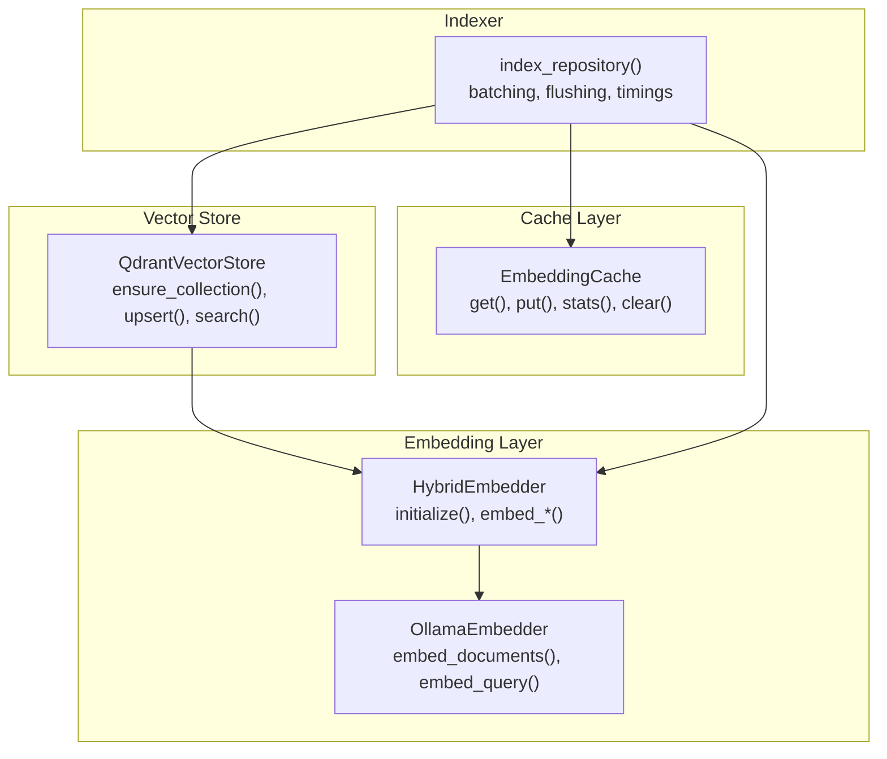
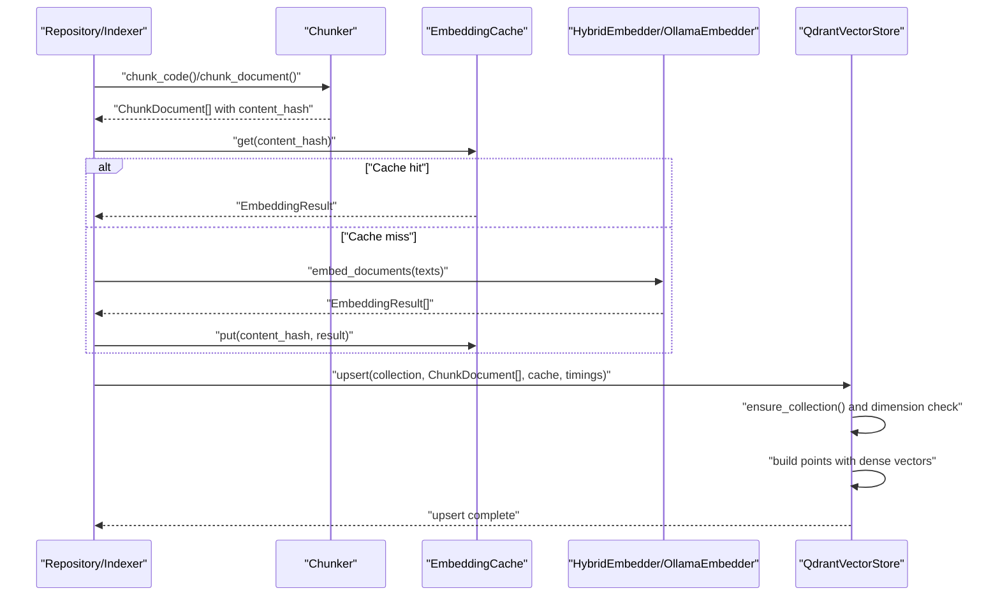
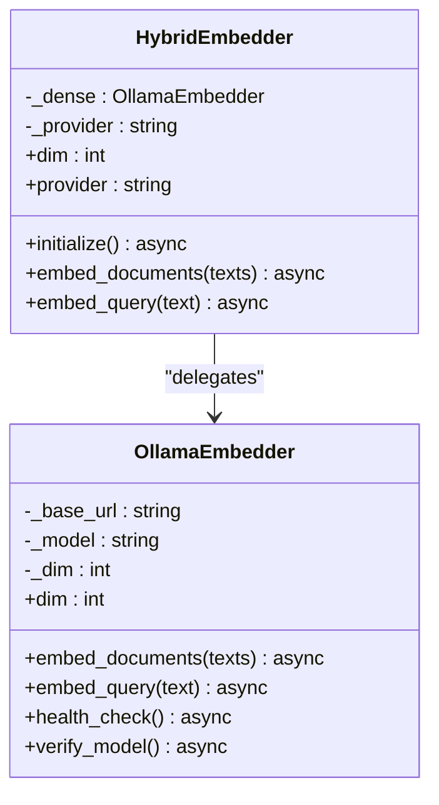
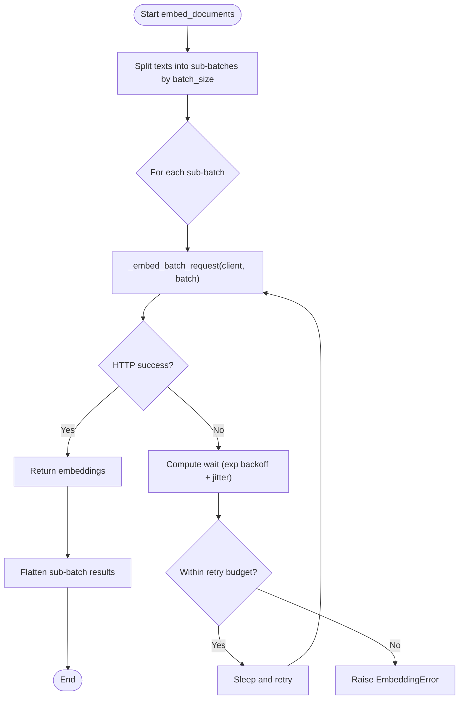
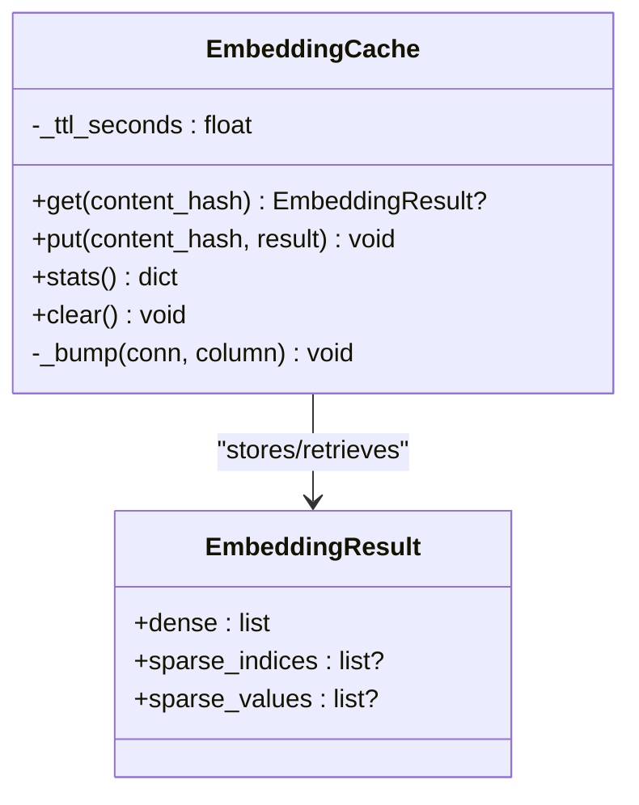
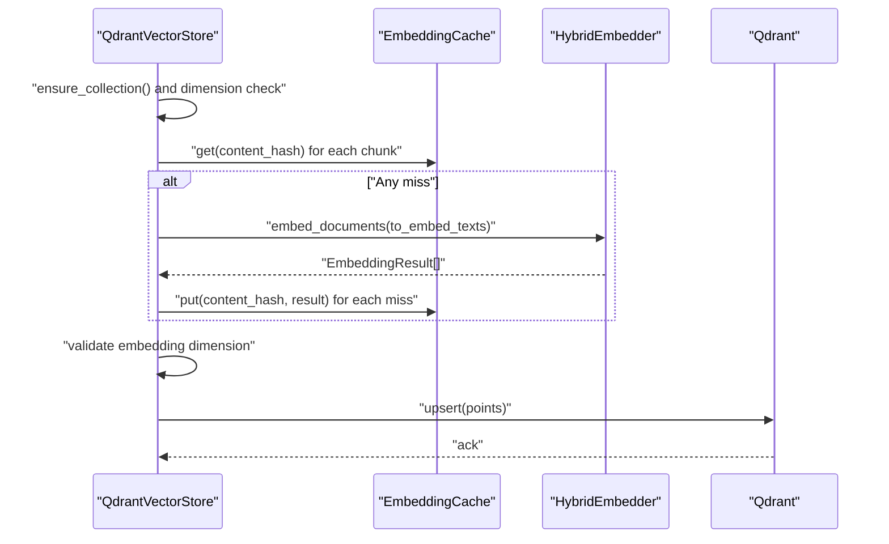
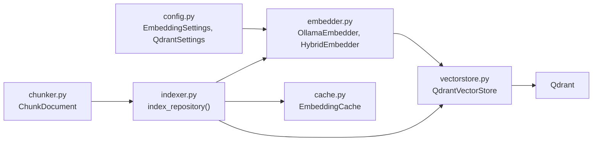

# Embedding Operations

<cite>
**Referenced Files in This Document**
- [embedder.py](file://src/rag/core/embedder.py)
- [cache.py](file://src/rag/core/cache.py)
- [vectorstore.py](file://src/rag/core/vectorstore.py)
- [indexer.py](file://src/rag/core/indexer.py)
- [chunker.py](file://src/rag/core/chunker.py)
- [config.py](file://src/rag/config.py)
- [default.toml](file://src/rag/default.toml)
- [errors.py](file://src/rag/core/errors.py)
- [test_embedder_retry.py](file://tests/test_embedder_retry.py)
- [test_cache.py](file://tests/test_cache.py)
- [cli.py](file://src/rag/cli.py)
- [server.py](file://src/rag/server.py)
</cite>

## Table of Contents
1. [Introduction](#introduction)
2. [Project Structure](#project-structure)
3. [Core Components](#core-components)
4. [Architecture Overview](#architecture-overview)
5. [Detailed Component Analysis](#detailed-component-analysis)
6. [Dependency Analysis](#dependency-analysis)
7. [Performance Considerations](#performance-considerations)
8. [Troubleshooting Guide](#troubleshooting-guide)
9. [Conclusion](#conclusion)
10. [Appendices](#appendices)

## Introduction
This document explains embedding operations in the system, focusing on the hybrid embedder integration, batch processing, and the embedding cache. It covers the upsert pipeline, including embedding generation, cache utilization, dimension validation, and error handling for missing embeddings. It also documents the embedding cache system with content hashing, cache hit/miss statistics, and persistence, along with batch processing strategies, performance timing, and memory optimization. Practical examples demonstrate configuration, cache management, troubleshooting, and performance tuning. Finally, it clarifies the relationship between embedding models, vector dimensions, and collection compatibility.

## Project Structure
The embedding stack spans several modules:
- Embedding generation and retry/backoff logic
- Dense-only hybrid embedder facade
- SQLite-backed embedding cache with binary storage and TTL
- Vector store integration for upsert and search
- Indexer pipeline orchestrating chunking, caching, batching, and upsert
- Configuration and defaults for model, dimension, and batch size
- Tests validating retry behavior and cache semantics

**Diagram sources**
- [embedder.py:48-244](file://src/rag/core/embedder.py#L48-L244)
- [cache.py:101-195](file://src/rag/core/cache.py#L101-L195)
- [vectorstore.py:199-530](file://src/rag/core/vectorstore.py#L199-L530)
- [indexer.py:242-550](file://src/rag/core/indexer.py#L242-L550)

**Section sources**
- [embedder.py:1-245](file://src/rag/core/embedder.py#L1-L245)
- [cache.py:1-195](file://src/rag/core/cache.py#L1-L195)
- [vectorstore.py:1-530](file://src/rag/core/vectorstore.py#L1-L530)
- [indexer.py:1-740](file://src/rag/core/indexer.py#L1-L740)
- [config.py:53-131](file://src/rag/config.py#L53-L131)
- [default.toml:5-13](file://src/rag/default.toml#L5-L13)

## Core Components
- OllamaEmbedder: Generates dense embeddings via the Ollama API, with instruction prefixes for documents and queries, and robust retry/backoff.
- HybridEmbedder: Facade that initializes and delegates to OllamaEmbedder; exposes dimension and provider metadata.
- EmbeddingCache: Thread-safe SQLite cache keyed by content hash, storing dense vectors in binary format with TTL and hit/miss stats.
- QdrantVectorStore: Manages collection creation/compatibility, upsert with batching and cache integration, and search.
- Indexer: Orchestrates chunking, batching, cache lookups, embedding generation, and upsert with performance timings.

**Section sources**
- [embedder.py:48-244](file://src/rag/core/embedder.py#L48-L244)
- [cache.py:101-195](file://src/rag/core/cache.py#L101-L195)
- [vectorstore.py:296-422](file://src/rag/core/vectorstore.py#L296-L422)
- [indexer.py:375-422](file://src/rag/core/indexer.py#L375-L422)

## Architecture Overview
The embedding pipeline integrates chunking, caching, batching, and upsert into Qdrant. The hybrid embedder ensures the correct model and dimension are used, and the vector store enforces collection dimension compatibility.

**Diagram sources**
- [indexer.py:424-422](file://src/rag/core/indexer.py#L424-L422)
- [chunker.py:50-81](file://src/rag/core/chunker.py#L50-L81)
- [cache.py:112-163](file://src/rag/core/cache.py#L112-L163)
- [embedder.py:230-244](file://src/rag/core/embedder.py#L230-L244)
- [vectorstore.py:296-422](file://src/rag/core/vectorstore.py#L296-L422)

## Detailed Component Analysis

### Hybrid Embedder Integration
- The hybrid embedder initializes an Ollama-backed dense embedder, verifies the model availability, and exposes dimension and provider metadata.
- It delegates document and query embedding to the underlying Ollama embedder, returning dense vectors wrapped in a result structure.

**Diagram sources**
- [embedder.py:189-244](file://src/rag/core/embedder.py#L189-L244)

**Section sources**
- [embedder.py:189-244](file://src/rag/core/embedder.py#L189-L244)
- [config.py:53-62](file://src/rag/config.py#L53-L62)

### Batch Processing and Retry Strategy
- Documents are embedded in sub-batches sized by configuration, with one HTTP request per sub-batch to Ollama.
- The embedder enforces a per-request timeout and a hard cap on total retry time per sub-batch, with exponential backoff and jitter.
- Tests confirm bounded retries and budget enforcement.

**Diagram sources**
- [embedder.py:74-153](file://src/rag/core/embedder.py#L74-L153)
- [test_embedder_retry.py:23-55](file://tests/test_embedder_retry.py#L23-L55)

**Section sources**
- [embedder.py:74-153](file://src/rag/core/embedder.py#L74-L153)
- [test_embedder_retry.py:1-80](file://tests/test_embedder_retry.py#L1-L80)

### Embedding Cache System
- Content hashing: Each chunk carries a content hash used as the cache key.
- Storage: Dense vectors stored as binary float32 arrays; sparse fields are maintained for back-compat but unused.
- TTL: Entries expire after a configurable number of days; invalid TTL values fall back to default.
- Statistics: Hit and miss counters track cache effectiveness; total entries count reflects live rows.
- Persistence: SQLite database file resides under the home directory; WAL mode and busy timeouts improve concurrency.

**Diagram sources**
- [cache.py:101-195](file://src/rag/core/cache.py#L101-L195)
- [embedder.py:39-46](file://src/rag/core/embedder.py#L39-L46)

**Section sources**
- [cache.py:101-195](file://src/rag/core/cache.py#L101-L195)
- [chunker.py:50-81](file://src/rag/core/chunker.py#L50-L81)
- [test_cache.py:1-94](file://tests/test_cache.py#L1-L94)

### Upsert Pipeline: Embedding Generation, Cache Utilization, and Validation
- Collection creation and dimension compatibility: The vector store ensures the collection exists and validates that the embedder’s dimension matches the collection’s dense vector size.
- Cache integration: For each batch, the pipeline checks the cache for each chunk’s content hash; uncached items are embedded and then cached.
- Dimension validation: If a cached or newly generated embedding has a mismatched dimension, the operation fails fast to prevent corrupting the index.
- Error handling: Missing embeddings are logged and skipped to avoid crashing the upsert; collection dimension mismatches raise a vector store error.
- Performance timing: The pipeline measures and aggregates timings for collection ensure, cache lookup, embedding, cache write, point building, and Qdrant upsert.

**Diagram sources**
- [vectorstore.py:296-422](file://src/rag/core/vectorstore.py#L296-L422)
- [cache.py:112-163](file://src/rag/core/cache.py#L112-L163)
- [embedder.py:230-244](file://src/rag/core/embedder.py#L230-L244)

**Section sources**
- [vectorstore.py:296-422](file://src/rag/core/vectorstore.py#L296-L422)

### Relationship Between Embedding Models, Dimensions, and Collections
- The embedder’s dimension is derived from configuration and exposed by the hybrid embedder.
- On collection creation, the vector store sets the dense vector size to the embedder’s dimension.
- If an existing collection’s dimension differs from the current embedder’s dimension, the operation fails with a clear message advising a full re-index.
- Model changes trigger cache clearing and embedder replacement in the running daemon to avoid mixing incompatible vectors.

**Section sources**
- [config.py:53-62](file://src/rag/config.py#L53-L62)
- [vectorstore.py:260-278](file://src/rag/core/vectorstore.py#L260-L278)
- [server.py:2490-2531](file://src/rag/server.py#L2490-L2531)

## Dependency Analysis
- Embedding generation depends on Ollama; the embedder verifies model availability and handles retries.
- The cache depends on SQLite and thread-local connections; it stores binary-packed vectors and maintains stats.
- The vector store depends on the embedder for embeddings and on Qdrant for persistence; it enforces dimension compatibility.
- The indexer orchestrates chunking, batching, cache lookups, embedding, and upsert, aggregating timings and managing state.

**Diagram sources**
- [config.py:53-131](file://src/rag/config.py#L53-L131)
- [embedder.py:48-244](file://src/rag/core/embedder.py#L48-L244)
- [vectorstore.py:199-530](file://src/rag/core/vectorstore.py#L199-L530)
- [indexer.py:242-550](file://src/rag/core/indexer.py#L242-L550)
- [cache.py:101-195](file://src/rag/core/cache.py#L101-L195)
- [chunker.py:35-81](file://src/rag/core/chunker.py#L35-L81)

**Section sources**
- [config.py:53-131](file://src/rag/config.py#L53-L131)
- [embedder.py:48-244](file://src/rag/core/embedder.py#L48-L244)
- [vectorstore.py:199-530](file://src/rag/core/vectorstore.py#L199-L530)
- [indexer.py:242-550](file://src/rag/core/indexer.py#L242-L550)
- [cache.py:101-195](file://src/rag/core/cache.py#L101-L195)
- [chunker.py:35-81](file://src/rag/core/chunker.py#L35-L81)

## Performance Considerations
- Batch sizing: The embedder uses a configurable batch size; the indexer’s chunking batch aligns with the embedder’s sub-batch to minimize HTTP overhead.
- Memory optimization: Embedding vectors are stored in binary format to reduce memory and I/O overhead; SQLite WAL mode improves concurrency.
- Timing measurements: The pipeline records timings for collection ensure, cache lookup, embedding, cache write, point building, and upsert to identify bottlenecks.
- Retry budget: A hard cap on retry time prevents long stalls and ensures responsiveness under transient failures.

**Section sources**
- [embedder.py:74-100](file://src/rag/core/embedder.py#L74-L100)
- [indexer.py:344-422](file://src/rag/core/indexer.py#L344-L422)
- [cache.py:30-49](file://src/rag/core/cache.py#L30-L49)

## Troubleshooting Guide
- Embedding failures:
  - Verify Ollama availability and model presence using the embedder’s health and verification routines.
  - Inspect retry logs and ensure the retry budget is not exhausted.
  - Confirm that the returned embedding count matches the batch size.
- Cache issues:
  - Check hit/miss statistics and total entries to assess cache effectiveness.
  - Clear the cache when changing embedding models or diagnosing anomalies.
  - Validate TTL configuration; invalid values fall back to default.
- Dimension mismatches:
  - If a collection’s dimension differs from the embedder’s dimension, re-index with a full rebuild.
  - When swapping models at runtime, the daemon clears the cache and replaces the embedder to avoid mixing incompatible vectors.
- Missing embeddings during upsert:
  - Logs indicate which chunks were skipped; investigate upstream embedding failures and retry.

**Section sources**
- [embedder.py:155-186](file://src/rag/core/embedder.py#L155-L186)
- [cache.py:175-195](file://src/rag/core/cache.py#L175-L195)
- [vectorstore.py:376-391](file://src/rag/core/vectorstore.py#L376-L391)
- [server.py:2490-2531](file://src/rag/server.py#L2490-L2531)
- [test_embedder_retry.py:23-55](file://tests/test_embedder_retry.py#L23-L55)
- [test_cache.py:57-78](file://tests/test_cache.py#L57-L78)

## Conclusion
The embedding subsystem is designed for reliability and performance: dense embeddings via Ollama, efficient caching with binary storage and TTL, robust batching with bounded retries, and strict dimension compatibility enforced at collection creation. The indexer coordinates these components, exposing timings and ensuring incremental, crash-consistent indexing. Proper configuration of model, dimension, and batch size, combined with cache management and monitoring, yields a scalable and maintainable embedding pipeline.

## Appendices

### Practical Examples

- Configure embedding model, dimension, and batch size:
  - Set the model and dimension in the configuration; the embedder and vector store will use these values.
  - Adjust batch size to balance throughput and latency.

  **Section sources**
  - [default.toml:5-13](file://src/rag/default.toml#L5-L13)
  - [config.py:53-62](file://src/rag/config.py#L53-L62)

- Manage the embedding cache:
  - Use cache statistics to monitor hit rates.
  - Clear the cache when switching models or investigating issues.
  - Validate TTL settings; invalid values are corrected to a safe default.

  **Section sources**
  - [cache.py:175-195](file://src/rag/core/cache.py#L175-L195)
  - [test_cache.py:88-94](file://tests/test_cache.py#L88-L94)

- Optimize embedding performance:
  - Align chunking batch size with the embedder’s sub-batch to minimize HTTP overhead.
  - Monitor timings to identify hotspots (embedding, cache write, upsert).
  - Keep retry budgets reasonable to avoid long stalls.

  **Section sources**
  - [indexer.py:344-422](file://src/rag/core/indexer.py#L344-L422)
  - [embedder.py:74-100](file://src/rag/core/embedder.py#L74-L100)

- Relationship between model, dimension, and collection:
  - Ensure the embedder’s dimension matches the collection’s dense vector size.
  - On mismatch, re-index with a full rebuild.
  - When changing models at runtime, the daemon clears the cache and updates the embedder.

  **Section sources**
  - [vectorstore.py:260-278](file://src/rag/core/vectorstore.py#L260-L278)
  - [server.py:2490-2531](file://src/rag/server.py#L2490-L2531)