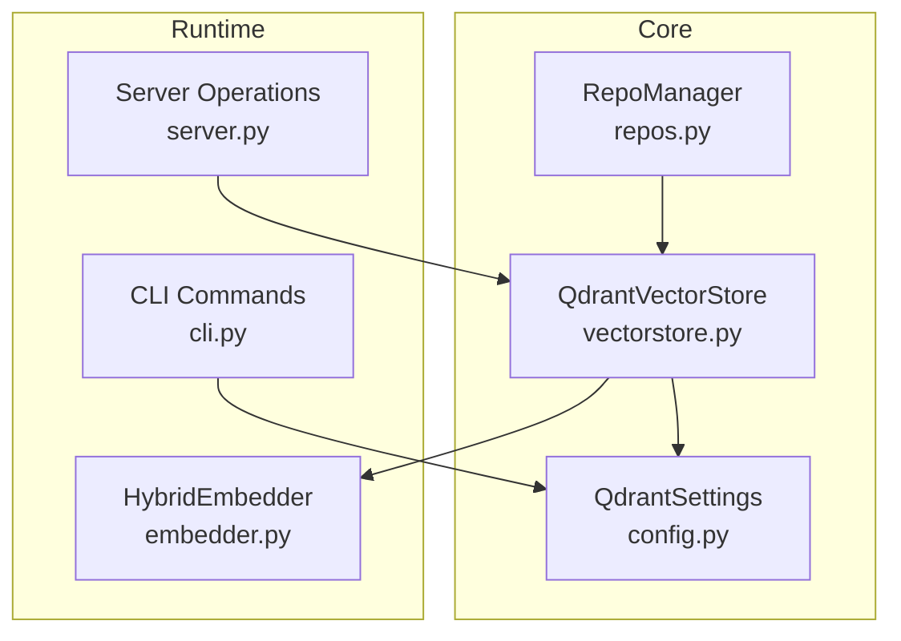
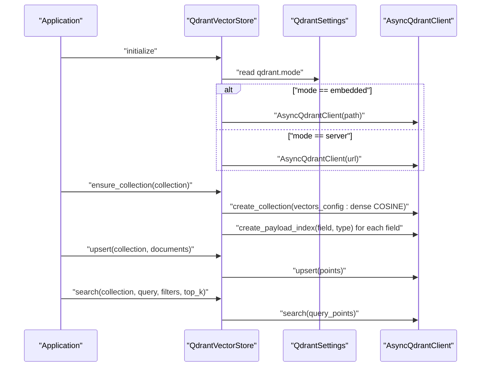
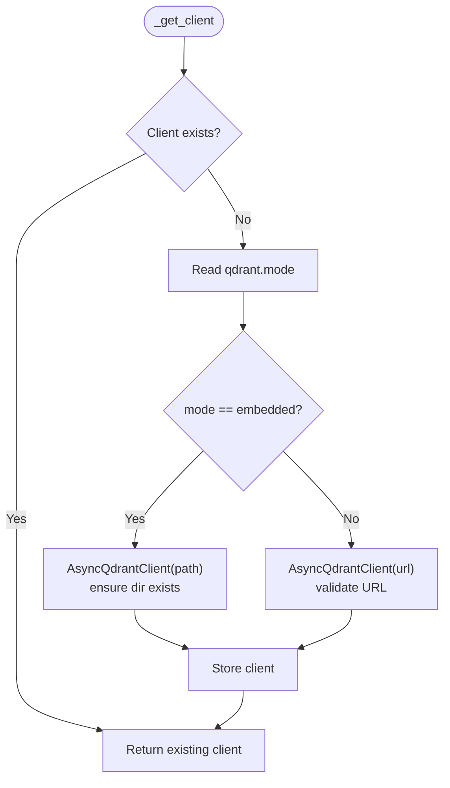
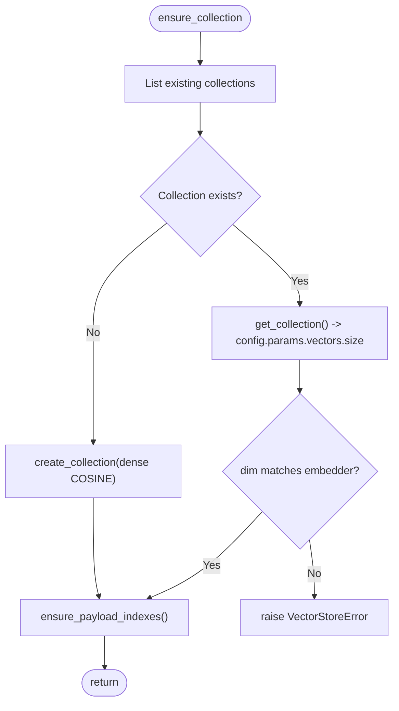
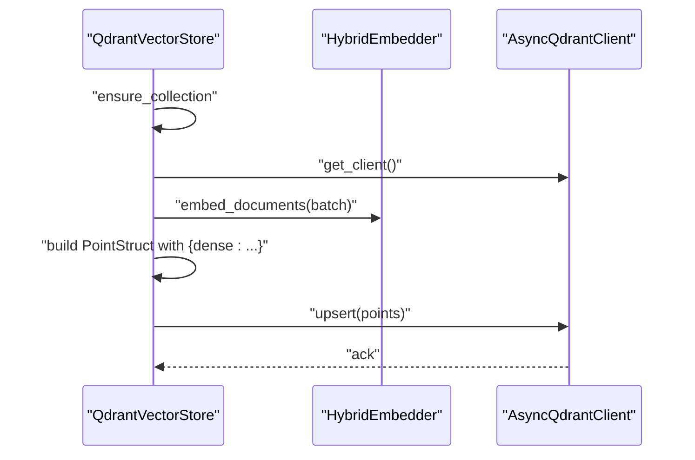
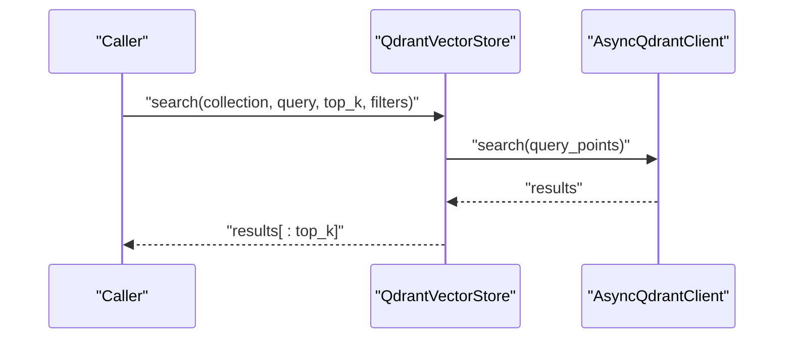
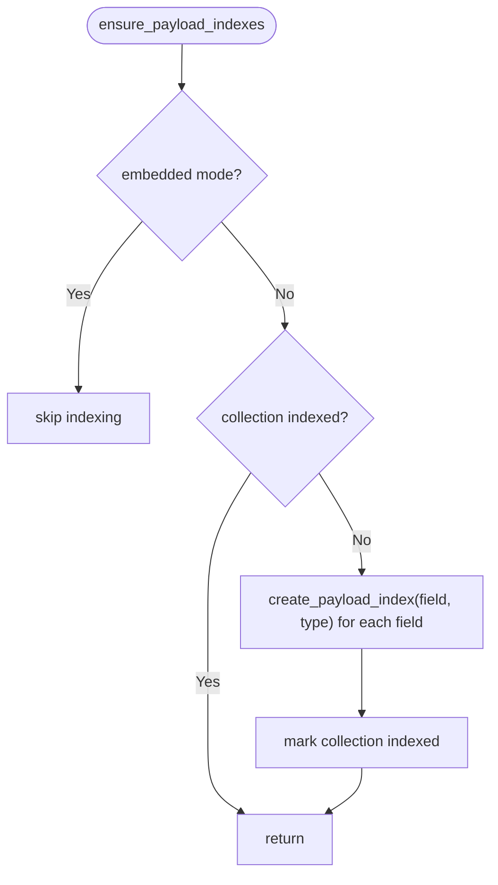
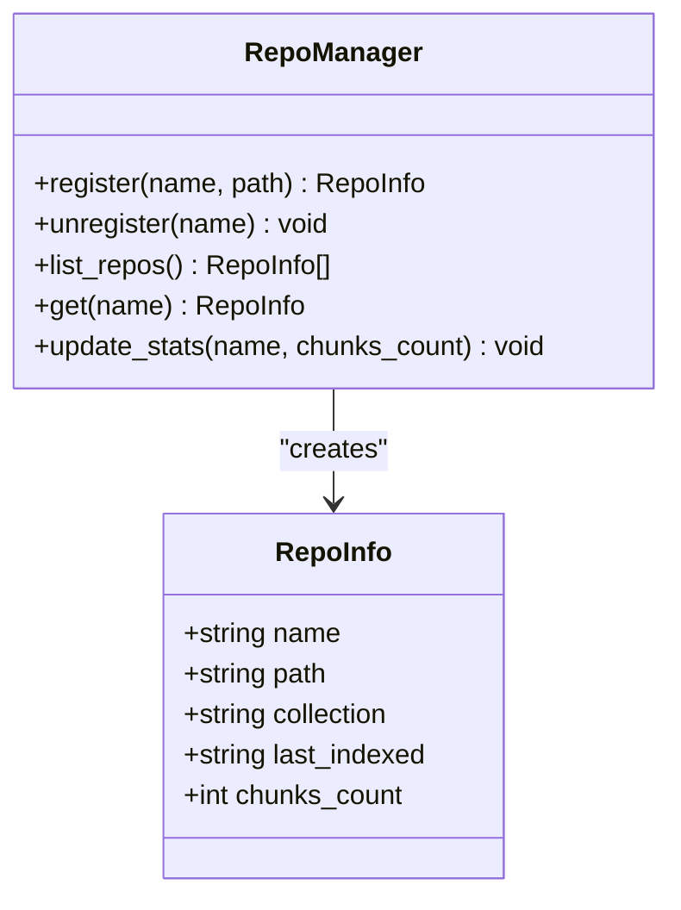
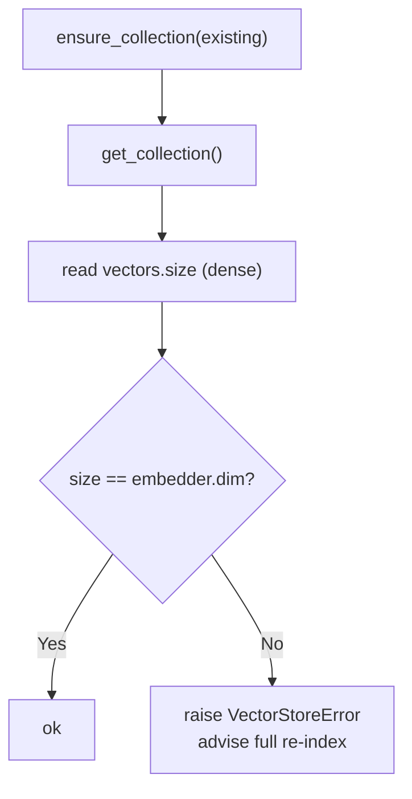
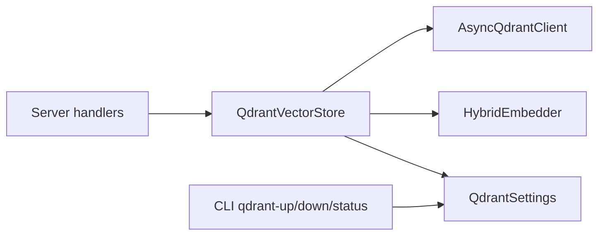

# Qdrant Integration

<cite>
**Referenced Files in This Document**
- [vectorstore.py](file://src/rag/core/vectorstore.py)
- [config.py](file://src/rag/config.py)
- [cli.py](file://src/rag/cli.py)
- [server.py](file://src/rag/server.py)
- [repos.py](file://src/rag/core/repos.py)
- [test_vectorstore_guard.py](file://tests/test_vectorstore_guard.py)
</cite>

## Table of Contents
1. [Introduction](#introduction)
2. [Project Structure](#project-structure)
3. [Core Components](#core-components)
4. [Architecture Overview](#architecture-overview)
5. [Detailed Component Analysis](#detailed-component-analysis)
6. [Dependency Analysis](#dependency-analysis)
7. [Performance Considerations](#performance-considerations)
8. [Troubleshooting Guide](#troubleshooting-guide)
9. [Conclusion](#conclusion)
10. [Appendices](#appendices)

## Introduction
This document explains the Qdrant integration centered on the QdrantVectorStore class and its client configuration. It covers:
- Dual-vector configuration with dense vectors using cosine distance
- Collection creation and management
- Embedded versus remote Qdrant modes
- AsyncQdrantClient initialization, connection handling, and lifecycle
- Collection isolation per repository via unique collection names
- Payload index creation and automatic indexing strategy
- Practical client configuration, connection troubleshooting, and performance considerations
- The relationship between vector dimensions, embedding models, and collection configuration validation

## Project Structure
The Qdrant integration spans several modules:
- QdrantVectorStore encapsulates vector operations and client lifecycle
- QdrantSettings defines configuration for embedded and server modes
- CLI commands manage a local Qdrant server via Docker Compose
- Server-side operations use the vector store for search and maintenance
- Multi-repo support ensures per-repository collection isolation

**Diagram sources**
- [vectorstore.py:199-228](file://src/rag/core/vectorstore.py#L199-L228)
- [config.py:64-81](file://src/rag/config.py#L64-L81)
- [cli.py:246-285](file://src/rag/cli.py#L246-L285)
- [server.py:2154-2187](file://src/rag/server.py#L2154-L2187)
- [repos.py:44-56](file://src/rag/core/repos.py#L44-L56)

**Section sources**
- [vectorstore.py:199-228](file://src/rag/core/vectorstore.py#L199-L228)
- [config.py:64-81](file://src/rag/config.py#L64-L81)
- [cli.py:246-285](file://src/rag/cli.py#L246-L285)
- [server.py:2154-2187](file://src/rag/server.py#L2154-L2187)
- [repos.py:44-56](file://src/rag/core/repos.py#L44-L56)

## Core Components
- QdrantVectorStore: Dense-only vector store with AsyncQdrantClient management, collection creation, upsert, search, and maintenance operations.
- QdrantSettings: Defines qdrant.mode, qdrant.url, qdrant.path, and collection names.
- HybridEmbedder: Provides dense embeddings and exposes dimensionality used for vector configuration.
- RepoManager: Ensures per-repository collection isolation by generating unique collection names.

Key responsibilities:
- Client initialization and mode selection (embedded vs server)
- Collection creation with dense vector configuration using cosine distance
- Payload index creation and caching to avoid repeated index operations
- Upsert batching, point ID normalization, and timing instrumentation
- Search with optional filters and top-k limiting
- Maintenance operations: count, delete_by_filter, drop_collection

**Section sources**
- [vectorstore.py:199-228](file://src/rag/core/vectorstore.py#L199-L228)
- [vectorstore.py:230-295](file://src/rag/core/vectorstore.py#L230-L295)
- [vectorstore.py:296-422](file://src/rag/core/vectorstore.py#L296-L422)
- [vectorstore.py:424-466](file://src/rag/core/vectorstore.py#L424-L466)
- [vectorstore.py:467-505](file://src/rag/core/vectorstore.py#L467-L505)
- [config.py:64-81](file://src/rag/config.py#L64-L81)
- [repos.py:44-56](file://src/rag/core/repos.py#L44-L56)

## Architecture Overview
The integration supports two operational modes:
- Embedded mode: Qdrant runs locally as a file-system backed database
- Remote mode: Qdrant runs as a server reachable via HTTP(S)

**Diagram sources**
- [vectorstore.py:216-228](file://src/rag/core/vectorstore.py#L216-L228)
- [vectorstore.py:282-295](file://src/rag/core/vectorstore.py#L282-L295)
- [vectorstore.py:238-259](file://src/rag/core/vectorstore.py#L238-L259)
- [vectorstore.py:412-418](file://src/rag/core/vectorstore.py#L412-L418)
- [vectorstore.py:424-466](file://src/rag/core/vectorstore.py#L424-L466)

## Detailed Component Analysis

### QdrantVectorStore: Client Initialization and Lifecycle
- Mode detection: Reads qdrant.mode to choose embedded or server
- Embedded mode: Creates AsyncQdrantClient with a local path; ensures directory exists
- Server mode: Creates AsyncQdrantClient with URL; validates URL format
- Client is lazily initialized and reused during the process lifetime

**Diagram sources**
- [vectorstore.py:216-228](file://src/rag/core/vectorstore.py#L216-L228)
- [config.py:64-81](file://src/rag/config.py#L64-L81)

**Section sources**
- [vectorstore.py:216-228](file://src/rag/core/vectorstore.py#L216-L228)
- [config.py:64-81](file://src/rag/config.py#L64-L81)

### Collection Creation and Management
- ensure_collection checks for existing collections and creates with dense vector configuration using cosine distance
- Validates dimension compatibility between the current embedder and the existing collection
- Automatically creates payload indexes for configured fields, skipping embedded mode or when already indexed

**Diagram sources**
- [vectorstore.py:230-295](file://src/rag/core/vectorstore.py#L230-L295)
- [vectorstore.py:238-259](file://src/rag/core/vectorstore.py#L238-L259)

**Section sources**
- [vectorstore.py:230-295](file://src/rag/core/vectorstore.py#L230-L295)
- [vectorstore.py:238-259](file://src/rag/core/vectorstore.py#L238-L259)

### Upsert Pipeline and Point Construction
- Batches documents and embeds them using HybridEmbedder
- Builds Qdrant PointStruct with:
  - id: normalized UUID or deterministic UUID from chunk_id
  - vector: {"dense": dense_embedding}
  - payload: content plus metadata
- Performs batched upsert and logs timing metrics

**Diagram sources**
- [vectorstore.py:296-422](file://src/rag/core/vectorstore.py#L296-L422)

**Section sources**
- [vectorstore.py:296-422](file://src/rag/core/vectorstore.py#L296-L422)

### Search Workflow
- Dense vector search using query embeddings
- Applies optional filters and limits results to top_k
- Returns SearchResult list

**Diagram sources**
- [vectorstore.py:424-466](file://src/rag/core/vectorstore.py#L424-L466)

**Section sources**
- [vectorstore.py:424-466](file://src/rag/core/vectorstore.py#L424-L466)

### Payload Indexing Strategy
- Payload indexes are created automatically for configured fields when in server mode
- Index creation is cached per collection to avoid redundant operations
- Embedded mode skips payload indexing

**Diagram sources**
- [vectorstore.py:238-259](file://src/rag/core/vectorstore.py#L238-L259)

**Section sources**
- [vectorstore.py:238-259](file://src/rag/core/vectorstore.py#L238-L259)

### Collection Isolation Per Repository
- RepoManager generates unique collection names per repository (e.g., repo_<name>)
- This ensures data isolation and avoids cross-repo collisions

**Diagram sources**
- [repos.py:13-101](file://src/rag/core/repos.py#L13-L101)

**Section sources**
- [repos.py:44-56](file://src/rag/core/repos.py#L44-L56)

### Relationship Between Dimensions, Embedding Models, and Collection Validation
- The vector dimension is derived from HybridEmbedder and enforced at collection creation
- On subsequent runs, the existing collection’s dimension is compared to the current embedder’s dimension
- Mismatch raises a clear error advising full re-indexing

**Diagram sources**
- [vectorstore.py:265-278](file://src/rag/core/vectorstore.py#L265-L278)

**Section sources**
- [vectorstore.py:265-278](file://src/rag/core/vectorstore.py#L265-L278)
- [test_vectorstore_guard.py:63-83](file://tests/test_vectorstore_guard.py#L63-L83)

## Dependency Analysis
- QdrantVectorStore depends on:
  - QdrantSettings for mode and endpoint/path configuration
  - HybridEmbedder for dimension and embeddings
  - AsyncQdrantClient for CRUD operations
- CLI commands manage a local Qdrant server via Docker Compose
- Server endpoints use the vector store for retrieval and maintenance

**Diagram sources**
- [vectorstore.py:199-228](file://src/rag/core/vectorstore.py#L199-L228)
- [config.py:64-81](file://src/rag/config.py#L64-L81)
- [cli.py:246-285](file://src/rag/cli.py#L246-L285)
- [server.py:2154-2187](file://src/rag/server.py#L2154-L2187)

**Section sources**
- [vectorstore.py:199-228](file://src/rag/core/vectorstore.py#L199-L228)
- [config.py:64-81](file://src/rag/config.py#L64-L81)
- [cli.py:246-285](file://src/rag/cli.py#L246-L285)
- [server.py:2154-2187](file://src/rag/server.py#L2154-L2187)

## Performance Considerations
- Batched upsert reduces network overhead; tune batch_size according to memory and latency needs
- Payload indexing improves filter performance in server mode; embedded mode intentionally skips payload indexes
- Dimension mismatch validation prevents costly silent failures and incorrect search results
- Timing instrumentation helps identify hotspots (point building, upsert, collection ensure)
- For large-scale deployments, prefer server mode with proper resource allocation and network isolation

[No sources needed since this section provides general guidance]

## Troubleshooting Guide
Common issues and resolutions:
- Connection failures
  - Verify qdrant.url format and reachability
  - For embedded mode, confirm the path exists and is writable
- Dimension mismatch errors
  - Indicates the embedding model changed; re-index the collection with full rebuild
- Payload index creation errors
  - Expected in embedded mode; ensure server mode if payload filtering is required
- Local server management
  - Use CLI commands to start, stop, and check status of the local Qdrant server

**Section sources**
- [config.py:71-76](file://src/rag/config.py#L71-L76)
- [vectorstore.py:238-259](file://src/rag/core/vectorstore.py#L238-L259)
- [vectorstore.py:265-278](file://src/rag/core/vectorstore.py#L265-L278)
- [cli.py:246-285](file://src/rag/cli.py#L246-L285)

## Conclusion
The Qdrant integration centers on QdrantVectorStore, which provides robust client lifecycle management, collection creation with dense cosine vectors, and automatic payload indexing in server mode. Multi-repo isolation is achieved via unique collection names, and strict dimension validation protects against model drift. The CLI and server integrations streamline local development and production operations.

[No sources needed since this section summarizes without analyzing specific files]

## Appendices

### Practical Examples

- Client configuration
  - Embedded mode: set qdrant.mode to embedded and configure qdrant.path
  - Server mode: set qdrant.mode to server and configure qdrant.url

- Connection troubleshooting
  - Use qdrant-status to verify connectivity and mode
  - For embedded mode, ensure the data directory exists and is writable

- Performance tuning
  - Adjust batch_size for upsert to balance throughput and latency
  - Monitor timing metrics to identify bottlenecks

**Section sources**
- [config.py:64-81](file://src/rag/config.py#L64-L81)
- [cli.py:282-285](file://src/rag/cli.py#L282-L285)
- [vectorstore.py:296-422](file://src/rag/core/vectorstore.py#L296-L422)