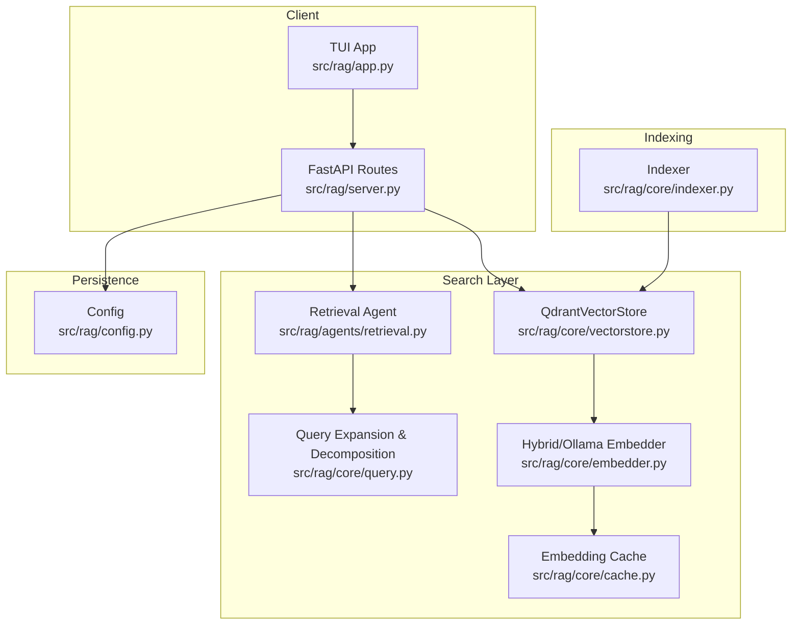
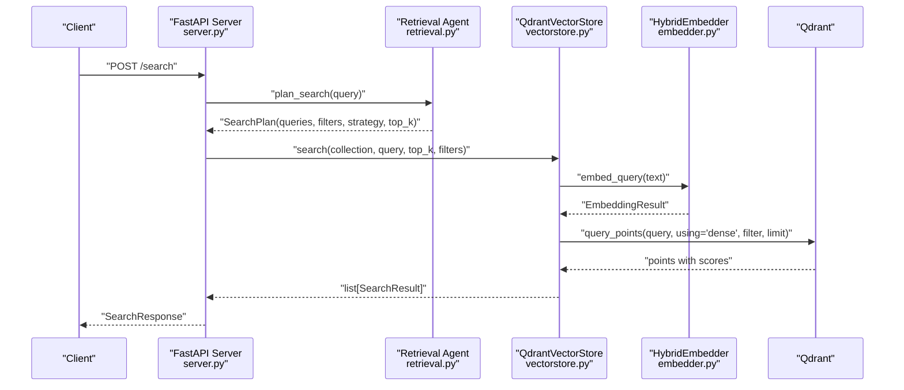
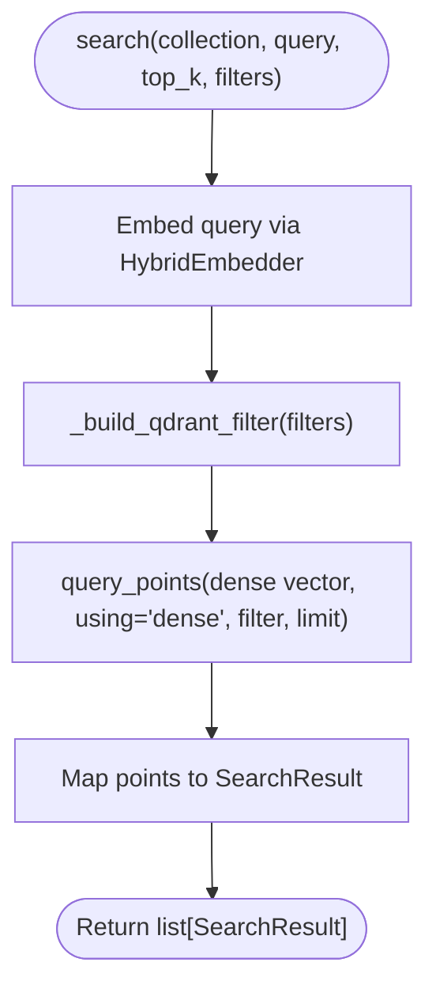
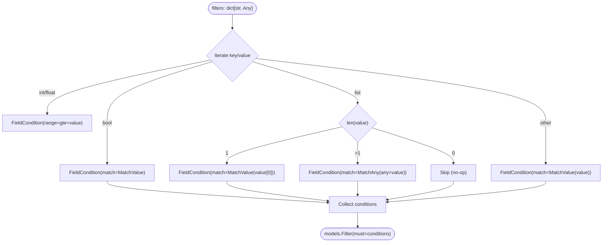
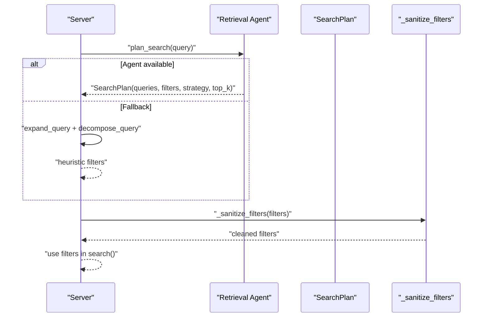
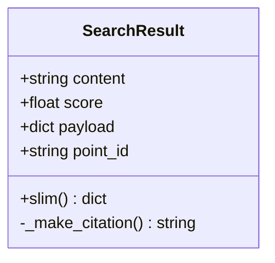
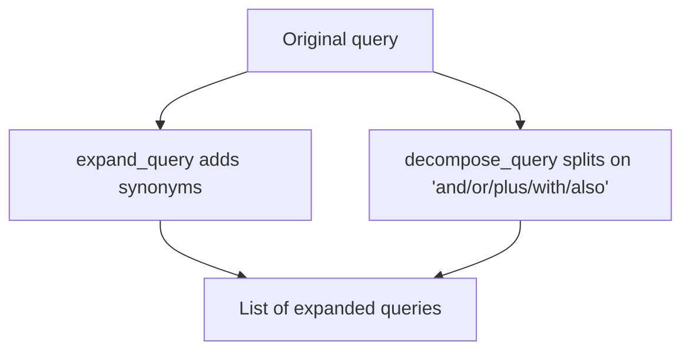
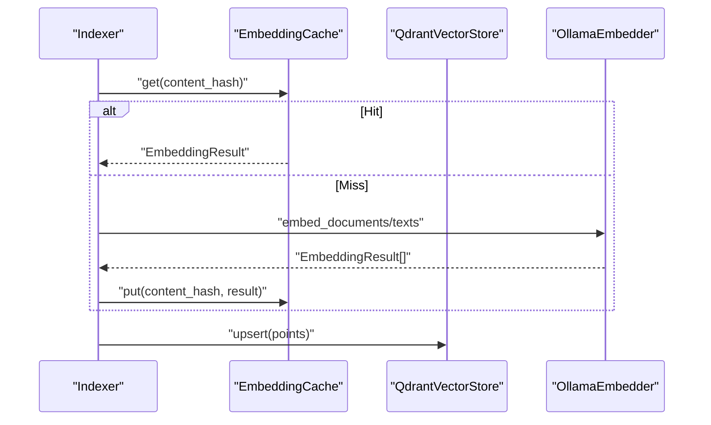
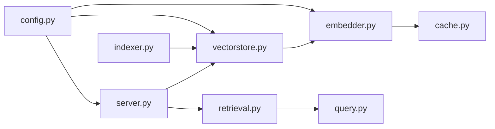

# Search and Querying

<cite>
**Referenced Files in This Document**
- [vectorstore.py](file://src/rag/core/vectorstore.py)
- [embedder.py](file://src/rag/core/embedder.py)
- [query.py](file://src/rag/core/query.py)
- [retrieval.py](file://src/rag/agents/retrieval.py)
- [indexer.py](file://src/rag/core/indexer.py)
- [server.py](file://src/rag/server.py)
- [config.py](file://src/rag/config.py)
- [cache.py](file://src/rag/core/cache.py)
</cite>

## Table of Contents
1. [Introduction](#introduction)
2. [Project Structure](#project-structure)
3. [Core Components](#core-components)
4. [Architecture Overview](#architecture-overview)
5. [Detailed Component Analysis](#detailed-component-analysis)
6. [Dependency Analysis](#dependency-analysis)
7. [Performance Considerations](#performance-considerations)
8. [Troubleshooting Guide](#troubleshooting-guide)
9. [Conclusion](#conclusion)
10. [Appendices](#appendices)

## Introduction
This document explains the dense vector similarity search and querying pipeline, including query embedding generation, top-k retrieval, filter construction, and result processing. It covers how filters are translated into Qdrant models, how search plans are derived (including fallback strategies), and how results are formatted for LLM consumption. Practical examples, performance tips, and troubleshooting advice are included to help operators and developers achieve reliable, efficient search outcomes.

## Project Structure
The search and querying system spans several modules:
- Embedding and query expansion: [embedder.py](file://src/rag/core/embedder.py), [query.py](file://src/rag/core/query.py)
- Vector store and filters: [vectorstore.py](file://src/rag/core/vectorstore.py)
- Retrieval planning and sanitization: [retrieval.py](file://src/rag/agents/retrieval.py)
- Indexing and caching: [indexer.py](file://src/rag/core/indexer.py), [cache.py](file://src/rag/core/cache.py)
- API surface and result formatting: [server.py](file://src/rag/server.py), [config.py](file://src/rag/config.py)

**Diagram sources**
- [server.py:721-722](file://src/rag/server.py#L721-L722)
- [retrieval.py:203-241](file://src/rag/agents/retrieval.py#L203-L241)
- [query.py:31-52](file://src/rag/core/query.py#L31-L52)
- [vectorstore.py:424-466](file://src/rag/core/vectorstore.py#L424-L466)
- [embedder.py:189-245](file://src/rag/core/embedder.py#L189-L245)
- [cache.py:101-195](file://src/rag/core/cache.py#L101-L195)
- [indexer.py:242-550](file://src/rag/core/indexer.py#L242-L550)
- [config.py:150-159](file://src/rag/config.py#L150-L159)

**Section sources**
- [server.py:721-722](file://src/rag/server.py#L721-L722)
- [vectorstore.py:424-466](file://src/rag/core/vectorstore.py#L424-L466)
- [embedder.py:189-245](file://src/rag/core/embedder.py#L189-L245)
- [retrieval.py:203-241](file://src/rag/agents/retrieval.py#L203-L241)
- [query.py:31-52](file://src/rag/core/query.py#L31-L52)
- [indexer.py:242-550](file://src/rag/core/indexer.py#L242-L550)
- [cache.py:101-195](file://src/rag/core/cache.py#L101-L195)
- [config.py:150-159](file://src/rag/config.py#L150-L159)

## Core Components
- Dense vector search: [QdrantVectorStore.search:424-466](file://src/rag/core/vectorstore.py#L424-L466)
- Query embedding generation: [HybridEmbedder.embed_query:238-245](file://src/rag/core/embedder.py#L238-L245)
- Filter translation to Qdrant: [_build_qdrant_filter:119-156](file://src/rag/core/vectorstore.py#L119-L156)
- Result representation and slim formatting: [SearchResult:76-108](file://src/rag/core/vectorstore.py#L76-L108)
- Retrieval planning and filter sanitization: [plan_search:203-241](file://src/rag/agents/retrieval.py#L203-L241), [_sanitize_filters:40-82](file://src/rag/agents/retrieval.py#L40-L82)
- Query expansion and decomposition: [expand_query:31-44](file://src/rag/core/query.py#L31-L44), [decompose_query:47-52](file://src/rag/core/query.py#L47-L52)
- Embedding caching: [EmbeddingCache:101-195](file://src/rag/core/cache.py#L101-L195)

**Section sources**
- [vectorstore.py:76-108](file://src/rag/core/vectorstore.py#L76-L108)
- [vectorstore.py:119-156](file://src/rag/core/vectorstore.py#L119-L156)
- [vectorstore.py:424-466](file://src/rag/core/vectorstore.py#L424-L466)
- [embedder.py:189-245](file://src/rag/core/embedder.py#L189-L245)
- [retrieval.py:40-82](file://src/rag/agents/retrieval.py#L40-L82)
- [retrieval.py:203-241](file://src/rag/agents/retrieval.py#L203-L241)
- [query.py:31-52](file://src/rag/core/query.py#L31-L52)
- [cache.py:101-195](file://src/rag/core/cache.py#L101-L195)

## Architecture Overview
End-to-end search flow:
1. Client sends a search request to the FastAPI server.
2. The server optionally consults the retrieval agent to derive a plan (queries and filters) or falls back to query expansion/decomposition.
3. The vector store embeds the query and performs dense vector search with Qdrant, applying filters server-side.
4. Results are returned as SearchResult objects and slimmed for LLM consumption.

**Diagram sources**
- [server.py:33-68](file://src/rag/server.py#L33-L68)
- [retrieval.py:203-241](file://src/rag/agents/retrieval.py#L203-L241)
- [vectorstore.py:424-466](file://src/rag/core/vectorstore.py#L424-L466)
- [embedder.py:238-245](file://src/rag/core/embedder.py#L238-L245)

## Detailed Component Analysis

### Dense Vector Similarity Search
- Embedding generation: The embedder prefixes queries appropriately and batches requests to Ollama for efficiency.
- Top-k retrieval: The vector store embeds the query and calls Qdrant’s query_points with a server-side filter and limit.
- Result shaping: Results are wrapped into SearchResult objects with payload and point ID.

**Diagram sources**
- [vectorstore.py:424-466](file://src/rag/core/vectorstore.py#L424-L466)
- [vectorstore.py:119-156](file://src/rag/core/vectorstore.py#L119-L156)
- [embedder.py:238-245](file://src/rag/core/embedder.py#L238-L245)

**Section sources**
- [vectorstore.py:424-466](file://src/rag/core/vectorstore.py#L424-L466)
- [embedder.py:69-100](file://src/rag/core/embedder.py#L69-L100)
- [embedder.py:238-245](file://src/rag/core/embedder.py#L238-L245)

### Filter Construction and Translation
- Supported types: boolean, numeric (range), list (including multi-value), and exact-match string values.
- Translation: Converts Python filter dicts into Qdrant Filter with FieldCondition clauses.
- Notes:
  - Qdrant supports list membership matching server-side for list-typed payload fields.
  - Payload indexes are created on demand for performance; server-side filtering is always applied.

**Diagram sources**
- [vectorstore.py:119-156](file://src/rag/core/vectorstore.py#L119-L156)

**Section sources**
- [vectorstore.py:119-156](file://src/rag/core/vectorstore.py#L119-L156)

### Retrieval Planning and Filter Sanitization
- The retrieval agent decides strategy and constructs filters from natural language using an LLM.
- Fallback plan: If the agent is unavailable, the system expands and decomposes queries and infers filters heuristically.
- Filter sanitization: Whitelists allowed values for enum-like fields and drops invalid entries with warnings.

**Diagram sources**
- [retrieval.py:203-241](file://src/rag/agents/retrieval.py#L203-L241)
- [retrieval.py:40-82](file://src/rag/agents/retrieval.py#L40-L82)
- [query.py:31-52](file://src/rag/core/query.py#L31-L52)

**Section sources**
- [retrieval.py:203-241](file://src/rag/agents/retrieval.py#L203-L241)
- [retrieval.py:40-82](file://src/rag/agents/retrieval.py#L40-L82)
- [query.py:31-52](file://src/rag/core/query.py#L31-L52)

### Result Processing and Slim Formatting
- SearchResult encapsulates content, score, payload, and point ID.
- slim(): Produces a compact dict optimized for LLM consumption, including citation generation.
- Citation: Human-readable source reference built from payload fields.

**Diagram sources**
- [vectorstore.py:76-108](file://src/rag/core/vectorstore.py#L76-L108)

**Section sources**
- [vectorstore.py:76-108](file://src/rag/core/vectorstore.py#L76-L108)

### Query Expansion and Decomposition
- expand_query: Adds semantically related terms to improve recall when keywords match predefined categories.
- decompose_query: Splits compound queries around logical connectors to produce multiple sub-queries.

**Diagram sources**
- [query.py:31-52](file://src/rag/core/query.py#L31-L52)

**Section sources**
- [query.py:31-52](file://src/rag/core/query.py#L31-L52)

### Embedding Caching and Indexing
- EmbeddingCache stores dense vectors keyed by content hash, packed as binary for performance and compactness.
- Indexer integrates caching during upsert to avoid re-embedding unchanged chunks and to maintain consistent vector dimensions.

**Diagram sources**
- [indexer.py:375-422](file://src/rag/core/indexer.py#L375-L422)
- [cache.py:101-195](file://src/rag/core/cache.py#L101-L195)
- [embedder.py:65-100](file://src/rag/core/embedder.py#L65-L100)

**Section sources**
- [indexer.py:375-422](file://src/rag/core/indexer.py#L375-L422)
- [cache.py:101-195](file://src/rag/core/cache.py#L101-L195)
- [embedder.py:65-100](file://src/rag/core/embedder.py#L65-L100)

## Dependency Analysis
Key dependencies and relationships:
- QdrantVectorStore depends on HybridEmbedder for dense embeddings.
- HybridEmbedder depends on OllamaEmbedder and verifies model availability.
- Retrieval agent depends on the LLM (via Agno) and sanitizes filters against allowed sets.
- Indexer coordinates embedding, caching, and upsert to Qdrant.
- Server validates request shapes and returns results using SearchResult slim format.

**Diagram sources**
- [server.py:33-68](file://src/rag/server.py#L33-L68)
- [vectorstore.py:424-466](file://src/rag/core/vectorstore.py#L424-L466)
- [embedder.py:189-245](file://src/rag/core/embedder.py#L189-L245)
- [cache.py:101-195](file://src/rag/core/cache.py#L101-L195)
- [retrieval.py:203-241](file://src/rag/agents/retrieval.py#L203-L241)
- [query.py:31-52](file://src/rag/core/query.py#L31-L52)
- [indexer.py:242-550](file://src/rag/core/indexer.py#L242-L550)
- [config.py:150-159](file://src/rag/config.py#L150-L159)

**Section sources**
- [server.py:33-68](file://src/rag/server.py#L33-L68)
- [vectorstore.py:424-466](file://src/rag/core/vectorstore.py#L424-L466)
- [embedder.py:189-245](file://src/rag/core/embedder.py#L189-L245)
- [cache.py:101-195](file://src/rag/core/cache.py#L101-L195)
- [retrieval.py:203-241](file://src/rag/agents/retrieval.py#L203-L241)
- [query.py:31-52](file://src/rag/core/query.py#L31-L52)
- [indexer.py:242-550](file://src/rag/core/indexer.py#L242-L550)
- [config.py:150-159](file://src/rag/config.py#L150-L159)

## Performance Considerations
- Prefer server-side filtering: The vector store pushes filters into Qdrant via query_filter to avoid post-filtering recall loss and to leverage payload indexes.
- Use payload indexes: The vector store creates payload indexes on demand for improved filter performance in server mode.
- Batch embeddings: Ollama embedding requests are batched per sub-batch to reduce overhead.
- Embedding cache: Reuse previously computed embeddings to avoid redundant calls to the LLM.
- Top-k tuning: Adjust retrieval_top_k in settings to balance recall and latency.
- Token budgeting: When preparing context for LLMs, trim code to token budgets to fit downstream generation limits.

[No sources needed since this section provides general guidance]

## Troubleshooting Guide
Common issues and resolutions:
- Collection dimension mismatch: If the embedding model dimension changes, the vector store raises an error to prevent garbage results. Re-index with full rebuild.
  - Reference: [vectorstore.py:265-278](file://src/rag/core/vectorstore.py#L265-L278)
- Missing embedding during upsert: If a cache miss is not backfilled, the system logs an error and skips insertion. Verify embedding service health and retry.
  - Reference: [vectorstore.py:376-383](file://src/rag/core/vectorstore.py#L376-L383)
- Dimension mismatch between produced vector and collection: The vector store enforces expected dimension to avoid silent corruption.
  - Reference: [vectorstore.py:386-391](file://src/rag/core/vectorstore.py#L386-L391)
- Ollama model not available: The embedder verifies model presence and raises descriptive errors if missing or unreachable.
  - Reference: [embedder.py:166-186](file://src/rag/core/embedder.py#L166-L186)
- Agent unavailability: If the retrieval agent LLM is unreachable, the system falls back to query expansion/decomposition and heuristic filters.
  - Reference: [retrieval.py:208-240](file://src/rag/agents/retrieval.py#L208-L240)
- Filter sanitization warnings: Invalid filter values for whitelisted fields are dropped with warnings; adjust filters to allowed sets.
  - Reference: [retrieval.py:63-82](file://src/rag/agents/retrieval.py#L63-L82)

**Section sources**
- [vectorstore.py:265-278](file://src/rag/core/vectorstore.py#L265-L278)
- [vectorstore.py:376-383](file://src/rag/core/vectorstore.py#L376-L383)
- [vectorstore.py:386-391](file://src/rag/core/vectorstore.py#L386-L391)
- [embedder.py:166-186](file://src/rag/core/embedder.py#L166-L186)
- [retrieval.py:208-240](file://src/rag/agents/retrieval.py#L208-L240)
- [retrieval.py:63-82](file://src/rag/agents/retrieval.py#L63-L82)

## Conclusion
The system implements a robust, dense-vector-only search pipeline with strong server-side filtering, efficient embedding generation via Ollama, and pragmatic fallbacks for planning and resilience. By leveraging payload indexes, embedding caching, and careful filter translation, it achieves both performance and reliability. Operators should tune top_k, monitor embedding dimensions, and sanitize filters to maximize search quality.

[No sources needed since this section summarizes without analyzing specific files]

## Appendices

### Practical Examples

- Example 1: Basic vector search with filters
  - Query: “REST API handlers”
  - Filters: {"language": "python", "chunk_type": "function"}
  - Strategy: filtered
  - Expected outcome: Function chunks in Python with high semantic relevance to REST API handlers.

- Example 2: Multi-term query with expansion
  - Query: “JWT authentication”
  - Expansion: Adds synonyms for authentication-related terms
  - Strategy: filtered or lod_drill depending on agent plan

- Example 3: Numeric filter for complexity
  - Query: “deeply nested logic”
  - Filters: {"complexity_cyclomatic": 10}
  - Strategy: filtered

- Example 4: List-type payload filter
  - Filters: {"patterns": ["repository", "factory"]}
  - Behavior: Match any of the listed values server-side

- Example 5: Result slim formatting for LLM
  - Use SearchResult.slim() to produce a compact dict containing file_path, name, parent_name, chunk_type, language, lines, code, score, and citation.

**Section sources**
- [vectorstore.py:76-108](file://src/rag/core/vectorstore.py#L76-L108)
- [vectorstore.py:119-156](file://src/rag/core/vectorstore.py#L119-L156)
- [retrieval.py:243-303](file://src/rag/agents/retrieval.py#L243-L303)
- [query.py:31-52](file://src/rag/core/query.py#L31-L52)

### Best Practices
- Always apply filters server-side via query_filter to preserve recall.
- Keep filter values within allowed sets for enum-like fields to avoid silent drops.
- Monitor restart_count and embedder warm-up latency for cold-start impacts.
- Use retrieval_top_k aligned with downstream needs; larger values increase latency.
- Leverage embedding cache to minimize repeated embeddings during indexing and search.

**Section sources**
- [server.py:603-716](file://src/rag/server.py#L603-L716)
- [config.py:150-159](file://src/rag/config.py#L150-L159)
- [cache.py:101-195](file://src/rag/core/cache.py#L101-L195)