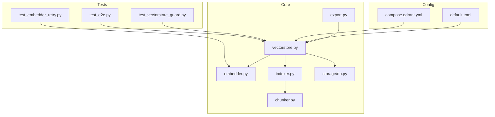
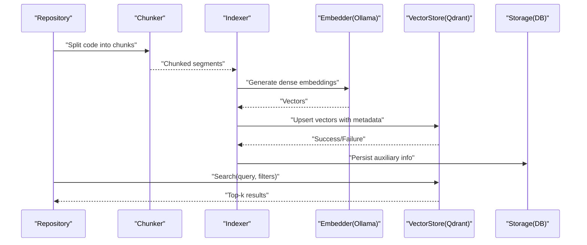
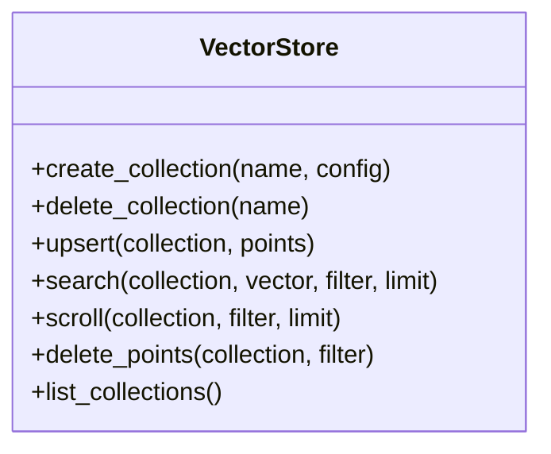
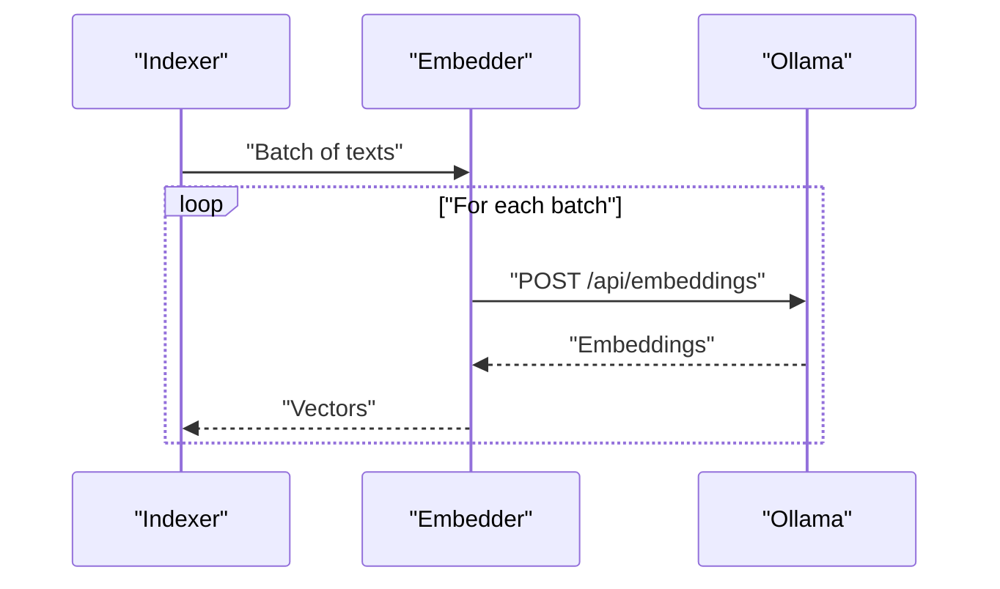
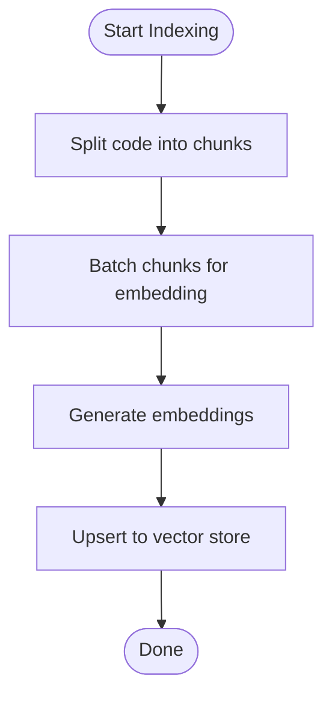
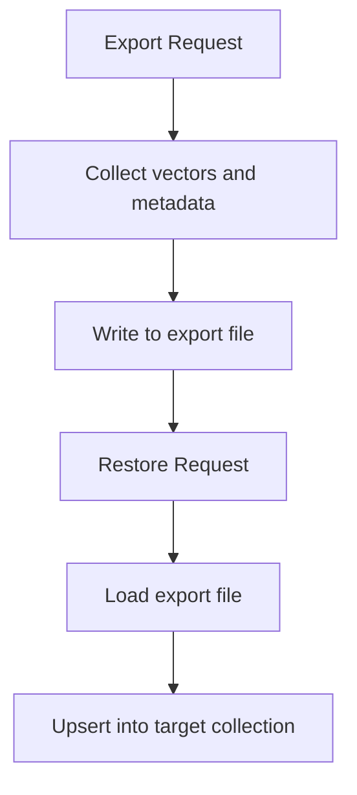
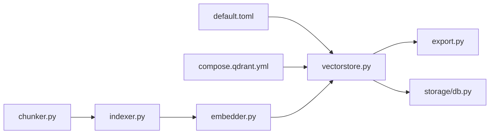

# Vector Store Operations

<cite>
**Referenced Files in This Document**
- [vectorstore.py](file://src/rag/core/vectorstore.py)
- [embedder.py](file://src/rag/core/embedder.py)
- [indexer.py](file://src/rag/core/indexer.py)
- [chunker.py](file://src/rag/core/chunker.py)
- [export.py](file://src/rag/core/export.py)
- [db.py](file://src/rag/storage/db.py)
- [default.toml](file://src/rag/default.toml)
- [compose.qdrant.yml](file://compose.qdrant.yml)
- [test_vectorstore_guard.py](file://tests/test_vectorstore_guard.py)
- [test_embedder_retry.py](file://tests/test_embedder_retry.py)
- [test_e2e.py](file://tests/test_e2e.py)
</cite>

## Table of Contents
1. [Introduction](#introduction)
2. [Project Structure](#project-structure)
3. [Core Components](#core-components)
4. [Architecture Overview](#architecture-overview)
5. [Detailed Component Analysis](#detailed-component-analysis)
6. [Dependency Analysis](#dependency-analysis)
7. [Performance Considerations](#performance-considerations)
8. [Troubleshooting Guide](#troubleshooting-guide)
9. [Conclusion](#conclusion)
10. [Appendices](#appendices)

## Introduction
This document explains vector store operations with a focus on Qdrant integration and vector database management. It covers collection lifecycle management, repository isolation, dense embedding generation via Ollama, vector similarity search, metadata filtering, configuration and optimization, backup and restore, data export/import, migration strategies, and operational maintenance. It also documents the relationship between code chunks and vector embeddings, batch processing, error handling, memory and disk optimization, and cluster deployment considerations.

## Project Structure
The vector store implementation centers around several core modules:
- Vector store abstraction and Qdrant integration
- Embedding pipeline using Ollama
- Indexing and chunking of source code
- Export facilities for backup and migration
- Storage and persistence layer
- Configuration and Docker Compose for Qdrant

**Diagram sources**
- [vectorstore.py](file://src/rag/core/vectorstore.py)
- [embedder.py](file://src/rag/core/embedder.py)
- [indexer.py](file://src/rag/core/indexer.py)
- [chunker.py](file://src/rag/core/chunker.py)
- [export.py](file://src/rag/core/export.py)
- [db.py](file://src/rag/storage/db.py)
- [default.toml](file://src/rag/default.toml)
- [compose.qdrant.yml](file://compose.qdrant.yml)
- [test_vectorstore_guard.py](file://tests/test_vectorstore_guard.py)
- [test_embedder_retry.py](file://tests/test_embedder_retry.py)
- [test_e2e.py](file://tests/test_e2e.py)

**Section sources**
- [vectorstore.py](file://src/rag/core/vectorstore.py)
- [embedder.py](file://src/rag/core/embedder.py)
- [indexer.py](file://src/rag/core/indexer.py)
- [chunker.py](file://src/rag/core/chunker.py)
- [export.py](file://src/rag/core/export.py)
- [db.py](file://src/rag/storage/db.py)
- [default.toml](file://src/rag/default.toml)
- [compose.qdrant.yml](file://compose.qdrant.yml)

## Core Components
- Vector store module: Provides collection management, upsert, search, scroll, filter, and delete operations against Qdrant. Implements repository-scoped collection isolation and supports dense vector indexing.
- Embedder module: Integrates with Ollama to produce dense embeddings for text chunks.
- Indexer and Chunker: Split source code into chunks and prepare them for embedding and indexing.
- Export module: Supports export/import and backup/restore workflows for vector data.
- Storage module: Handles persistence and retrieval of repository metadata and auxiliary data.
- Configuration and Compose: Defines Qdrant connection, collection defaults, and container orchestration.

Key responsibilities:
- Collection lifecycle: create, delete, update, list, and manage collections per repository.
- Dense embeddings: batch generation via Ollama with retry and error handling.
- Search and filtering: similarity search with metadata filters and pagination.
- Backup and migration: structured export/import of vectors and metadata.
- Operational tuning: configuration knobs for performance and reliability.

**Section sources**
- [vectorstore.py](file://src/rag/core/vectorstore.py)
- [embedder.py](file://src/rag/core/embedder.py)
- [indexer.py](file://src/rag/core/indexer.py)
- [chunker.py](file://src/rag/core/chunker.py)
- [export.py](file://src/rag/core/export.py)
- [db.py](file://src/rag/storage/db.py)
- [default.toml](file://src/rag/default.toml)
- [compose.qdrant.yml](file://compose.qdrant.yml)

## Architecture Overview
The system orchestrates code chunking, embedding, and indexing into Qdrant collections. Collections are isolated per repository. Search queries leverage dense vectors and metadata filters. Export facilities support backup and migration.

**Diagram sources**
- [chunker.py](file://src/rag/core/chunker.py)
- [indexer.py](file://src/rag/core/indexer.py)
- [embedder.py](file://src/rag/core/embedder.py)
- [vectorstore.py](file://src/rag/core/vectorstore.py)
- [db.py](file://src/rag/storage/db.py)

## Detailed Component Analysis

### Vector Store Module
Responsibilities:
- Create/delete collections with repository-scoped naming.
- Upsert vectors with metadata payloads.
- Perform similarity search with optional filters and pagination.
- Scroll large result sets.
- Delete points by filter.
- Manage collection configuration and optimization settings.

Implementation highlights:
- Repository isolation: collection names derived from repository identifiers to prevent cross-contamination.
- Dense vector indexing: expects fixed-size dense vectors aligned with configured vector size.
- Metadata filtering: supports filtering on stored payload fields during search.
- Batch operations: upsert supports batching for throughput.
- Error handling: wraps client exceptions and exposes meaningful failures.

**Diagram sources**
- [vectorstore.py](file://src/rag/core/vectorstore.py)

**Section sources**
- [vectorstore.py](file://src/rag/core/vectorstore.py)

### Embedder Module (Ollama)
Responsibilities:
- Generate dense embeddings for text chunks using Ollama.
- Batch processing with configurable batch sizes.
- Retry logic and error handling for transient failures.
- Respect rate limits and backoff policies.

**Diagram sources**
- [embedder.py](file://src/rag/core/embedder.py)

**Section sources**
- [embedder.py](file://src/rag/core/embedder.py)
- [test_embedder_retry.py](file://tests/test_embedder_retry.py)

### Indexer and Chunker
Responsibilities:
- Split source code into semantically coherent chunks.
- Prepare chunks for embedding and indexing.
- Coordinate with vector store for upsert.

**Diagram sources**
- [indexer.py](file://src/rag/core/indexer.py)
- [chunker.py](file://src/rag/core/chunker.py)

**Section sources**
- [indexer.py](file://src/rag/core/indexer.py)
- [chunker.py](file://src/rag/core/chunker.py)

### Export, Import, Backup, and Restore
Capabilities:
- Export vectors and metadata for a repository.
- Import previously exported data into a new or existing collection.
- Backup and restore for disaster recovery and migration.

**Diagram sources**
- [export.py](file://src/rag/core/export.py)

**Section sources**
- [export.py](file://src/rag/core/export.py)

### Storage Layer
Responsibilities:
- Persist auxiliary repository data and indices.
- Provide repository metadata for isolation and lifecycle management.

**Section sources**
- [db.py](file://src/rag/storage/db.py)

### Configuration and Qdrant Deployment
Configuration:
- Vector store endpoint and credentials.
- Collection defaults (vector size, distance metric).
- Batch sizes and timeouts.
- Ollama endpoint and model selection.

Qdrant deployment:
- Docker Compose defines Qdrant service and volumes.
- Network and port exposure for clients.

**Section sources**
- [default.toml](file://src/rag/default.toml)
- [compose.qdrant.yml](file://compose.qdrant.yml)

## Dependency Analysis
High-level dependencies:
- Vector store depends on Qdrant client and configuration.
- Embedder depends on Ollama HTTP API and retry/backoff logic.
- Indexer depends on Chunker and Embedder.
- Export depends on Vector store read and write operations.
- Storage provides repository metadata for isolation.

**Diagram sources**
- [default.toml](file://src/rag/default.toml)
- [compose.qdrant.yml](file://compose.qdrant.yml)
- [vectorstore.py](file://src/rag/core/vectorstore.py)
- [embedder.py](file://src/rag/core/embedder.py)
- [indexer.py](file://src/rag/core/indexer.py)
- [chunker.py](file://src/rag/core/chunker.py)
- [export.py](file://src/rag/core/export.py)
- [db.py](file://src/rag/storage/db.py)

**Section sources**
- [vectorstore.py](file://src/rag/core/vectorstore.py)
- [embedder.py](file://src/rag/core/embedder.py)
- [indexer.py](file://src/rag/core/indexer.py)
- [chunker.py](file://src/rag/core/chunker.py)
- [export.py](file://src/rag/core/export.py)
- [db.py](file://src/rag/storage/db.py)
- [default.toml](file://src/rag/default.toml)
- [compose.qdrant.yml](file://compose.qdrant.yml)

## Performance Considerations
- Vector size and distance metric: tune to balance recall and speed.
- Batch sizes: increase embedding batch size to improve throughput; monitor Ollama resource usage.
- Concurrency: control concurrent upsert/search threads to avoid overload.
- Index optimization: configure optimization parameters (write concurrency, flush intervals) via Qdrant configuration.
- Memory management: pre-allocate buffers for batches; avoid large in-memory payloads.
- Disk usage: monitor Qdrant storage; enable periodic compaction and optimize segment sizes.
- Network latency: colocate services near Qdrant; use local embedding models when feasible.
- Filtering cost: minimize complex filters; keep payload fields selective and indexed.

[No sources needed since this section provides general guidance]

## Troubleshooting Guide
Common issues and resolutions:
- Embedding failures: inspect retry logs and backoff behavior; verify Ollama availability and model readiness.
- Vector store errors: check collection existence and configuration; validate vector dimensions.
- Search performance degradation: review filters, limit sizes, and payload complexity.
- Memory pressure: reduce batch sizes and concurrent workers; profile memory usage.
- Disk pressure: schedule compaction and pruning; archive old repositories.
- Test coverage: use guard tests and retry tests to validate resilience.

Validation references:
- Vector store guard tests validate safe operations and error propagation.
- Embedder retry tests validate robustness under transient failures.
- End-to-end tests exercise the integrated pipeline.

**Section sources**
- [test_vectorstore_guard.py](file://tests/test_vectorstore_guard.py)
- [test_embedder_retry.py](file://tests/test_embedder_retry.py)
- [test_e2e.py](file://tests/test_e2e.py)

## Conclusion
The vector store implementation integrates chunking, embedding, and Qdrant-backed indexing with repository-scoped isolation. It supports dense embeddings via Ollama, efficient similarity search with metadata filtering, and robust export/import workflows. Proper configuration, monitoring, and operational practices ensure reliable performance and scalability.

[No sources needed since this section summarizes without analyzing specific files]

## Appendices

### Practical Examples
- Collection management: create a repository-scoped collection, upsert vectors, and delete upon repository removal.
- Similarity search: perform search with filters and pagination; adjust limit and vector size for performance.
- Batch embedding: process chunks in batches; handle retries and partial failures.
- Backup and restore: export vectors and metadata; restore into a new environment.
- Migration: re-index repositories after changing vector size or distance metric.

[No sources needed since this section provides general guidance]

### Scaling Considerations
- Horizontal scaling: deploy multiple Qdrant nodes behind a load balancer; use partitioning strategies.
- Vertical scaling: provision larger instances with sufficient CPU, memory, and disk IOPS.
- Sharding: distribute repositories across shards to balance load.
- Caching: cache frequent queries and embeddings where appropriate.
- Monitoring: track latency, throughput, memory, and disk metrics; alert on anomalies.

[No sources needed since this section provides general guidance]